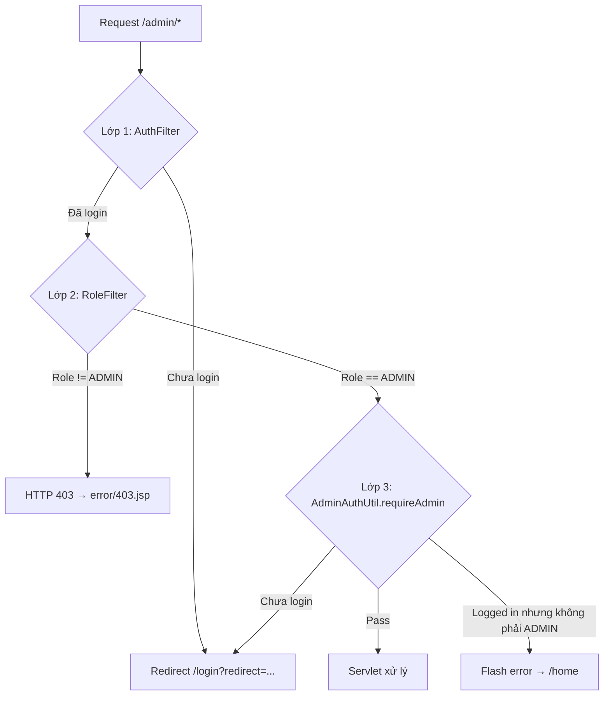

# Module Admin — Tài liệu chi tiết

> **Dự án:** ÉPCINE — Movie Ticket Booking System  
> **Phạm vi:** Toàn bộ source code liên quan đến quản trị viên (ADMIN)  
> **Tổng quan dự án:** [`SOURCE_CODE_OVERVIEW.md`](SOURCE_CODE_OVERVIEW.md)  
> **Spec nghiệp vụ:** [`project_summary_final.md`](project_summary_final.md)  
> **Module liên quan:** [`MANAGER_MODULE_DETAIL.md`](MANAGER_MODULE_DETAIL.md) — vận hành rạp (phim, phòng chiếu…)

---

## 1. Tổng quan module Admin

Module Admin cho phép người dùng có role **ADMIN** quản lý tài khoản trong hệ thống. Tính năng đã triển khai:

| Tính năng | Trạng thái |
|-----------|------------|
| Bảng điều khiển (dashboard) + thống kê user | ✅ |
| Danh sách người dùng (lọc, tìm kiếm, phân trang) | ✅ |
| Xem chi tiết người dùng | ✅ |
| Tạo tài khoản Staff / Manager | ✅ |
| Khóa / Mở khóa / Vô hiệu hóa tài khoản | ✅ |
| Đặt lại mật khẩu (admin reset) | ✅ |
| Cấu hình hệ thống | ❌ Placeholder |
| Báo cáo & thống kê | ❌ Placeholder |
| Sửa thông tin user / đổi role | ❌ Chưa có |
| Tạo tài khoản CUSTOMER / ADMIN qua UI | ❌ Chưa có |
| Audit log hành động admin | ❌ Chưa có |

---

## 2. Danh sách file source liên quan Admin

### 2.1 Controller (`controller.admin`)

```
src/main/java/controller/admin/
├── AdminDashboardServlet.java      # /admin/dashboard
├── UserListServlet.java            # /admin/users
├── UserDetailServlet.java          # /admin/users/detail
├── UserCreateServlet.java          # /admin/users/create
├── UserStatusServlet.java          # /admin/users/status (POST)
├── UserResetPasswordServlet.java   # /admin/users/reset-password (POST)
└── package-info.java
```

### 2.2 View (`WEB-INF/views/admin/`)

```
src/main/webapp/WEB-INF/views/admin/
├── dashboard.jsp       # Bảng điều khiển
├── user-list.jsp       # Danh sách user
├── user-detail.jsp     # Chi tiết user
├── user-create.jsp     # Form tạo user
└── .gitkeep
```

### 2.3 CSS

```
src/main/webapp/css/admin.css       # Style riêng trang admin
```

### 2.4 DAL & Model dùng bởi Admin

| File | Vai trò |
|------|---------|
| `dal/UserDAO.java` | CRUD + filter + count user |
| `dal/RoleDAO.java` | Lấy danh sách role, role assignable |
| `model/entity/User.java` | Entity user |
| `model/entity/Role.java` | Entity role |
| `model/dto/AdminUserForm.java` | Form binding tạo user |

### 2.5 Utils & Filter

| File | Vai trò |
|------|---------|
| `utils/AdminAuthUtil.java` | Gate ADMIN + flash messages |
| `utils/SessionUtil.java` | Đọc user/role từ session |
| `utils/AccessControl.java` | Rule `/admin/*` → ADMIN |
| `filter/AuthFilter.java` | Bắt buộc login |
| `filter/RoleFilter.java` | Chặn sai role → 403 |
| `utils/PasswordUtil.java` | BCrypt hash mật khẩu |

### 2.6 Navigation

| File | Vai trò |
|------|---------|
| `WEB-INF/views/common/header.jsp` | Menu dropdown ADMIN: Dashboard, Quản lý user; link Manager (xem mục 12.2) |

---

## 3. Kiến trúc bảo mật — 3 lớp kiểm soát

Module Admin được bảo vệ bởi **3 lớp** (defense in depth):



### 3.1 Lớp 1 — `AuthFilter` + `AccessControl`

- Mọi URL `/admin/*` **không** nằm trong danh sách public
- Chưa đăng nhập → redirect:
  - `/login?redirect={encoded URL}` — lần đầu
  - `/session-expired?redirect=...` — nếu cookie `hadLogin` tồn tại (đã từng login)

### 3.2 Lớp 2 — `RoleFilter` + `AccessControl`

```java
// AccessControl.java
ROLE_PREFIXES = {
    "/admin/" → Set.of("ADMIN")
}
```

- Path bắt đầu `/admin/` hoặc chính xác `/admin` → yêu cầu role **ADMIN**
- Role khác (MANAGER, STAFF, CUSTOMER) → HTTP 403, forward `error/403.jsp`
- Set attribute: `requestedPath`, `userRole`

### 3.3 Lớp 3 — `AdminAuthUtil.requireAdmin()`

Mỗi servlet admin gọi ở đầu `doGet`/`doPost`:

```java
if (!AdminAuthUtil.requireAdmin(req, resp)) {
    return;
}
```

| Tình huống | Hành vi |
|------------|---------|
| `userRole == "ADMIN"` | `return true` — tiếp tục xử lý |
| Chưa đăng nhập | Redirect `/login?redirect={full URL + query}` |
| Đã login nhưng không phải ADMIN | Flash error *"Bạn không có quyền truy cập trang quản trị."* → redirect `/home` |

> Lớp 3 là **phòng thủ dự phòng** — trường hợp filter bị bypass hoặc servlet được gọi trực tiếp.

---

## 4. Flash messaging

`AdminAuthUtil` quản lý thông báo một lần (read-once) qua session:

| Session key | Mục đích |
|-------------|----------|
| `flashSuccess` | Thông báo thành công (màu xanh) |
| `flashError` | Thông báo lỗi (màu đỏ) |

**Luồng:**
1. Servlet gọi `AdminAuthUtil.setFlash(req, key, message)` trước `sendRedirect`
2. Trang đích gọi `AdminAuthUtil.consumeFlash(req, key)` — đọc và xóa ngay

---

## 5. Bảng URL đầy đủ

| URL | Servlet | HTTP | View / Response |
|-----|---------|------|-----------------|
| `/admin/dashboard` | `AdminDashboardServlet` | GET | `admin/dashboard.jsp` |
| `/admin/users` | `UserListServlet` | GET | `admin/user-list.jsp` |
| `/admin/users/detail?id={uuid}` | `UserDetailServlet` | GET | `admin/user-detail.jsp` |
| `/admin/users/create` | `UserCreateServlet` | GET | `admin/user-create.jsp` (form trống) |
| `/admin/users/create` | `UserCreateServlet` | POST | Re-render form (lỗi) hoặc redirect list (OK) |
| `/admin/users/status` | `UserStatusServlet` | **POST only** | Redirect detail hoặc list |
| `/admin/users/reset-password` | `UserResetPasswordServlet` | **POST only** | Redirect detail |

> Không có endpoint PUT/DELETE — mọi thao tác ghi đều qua form POST.

---

## 6. Chi tiết từng endpoint

### 6.1 Dashboard — `GET /admin/dashboard`

**File:** `AdminDashboardServlet.java`  
**View:** `dashboard.jsp`

#### Luồng xử lý

```
requireAdmin()
    → UserDAO.countAll(null, null, null)      → totalUsers
    → UserDAO.countAll(null, null, "ACTIVE")  → activeUsers
    → UserDAO.countAll(null, "STAFF", null)   → staffCount
    → UserDAO.countAll(null, "MANAGER", null) → managerCount
    → adminName từ SessionUtil.getLoggedUser()
    → consumeFlash(success, error)
    → forward dashboard.jsp
```

#### Request attributes

| Attribute | Kiểu | Mô tả |
|-----------|------|-------|
| `adminName` | String | Họ tên admin đang login |
| `totalUsers` | int | Tổng số user mọi role/status |
| `activeUsers` | int | User có status ACTIVE |
| `staffCount` | int | User role STAFF |
| `managerCount` | int | User role MANAGER |
| `flashSuccess` | String | Thông báo thành công (nullable) |
| `flashError` | String | Thông báo lỗi (nullable) |

#### Giao diện (`dashboard.jsp`)

- **4 thẻ thống kê:** Tổng user, User active, Staff, Manager
- **Module grid:**
  - ✅ **Quản lý người dùng** → link `/admin/users`
  - 🔒 Cấu hình hệ thống — "Sắp ra mắt"
  - 🔒 Báo cáo & thống kê — "Sắp ra mắt"

---

### 6.2 Danh sách user — `GET /admin/users`

**File:** `UserListServlet.java`  
**View:** `user-list.jsp`  
**PAGE_SIZE:** 10 user/trang

#### Query parameters

| Param | Mô tả | Mặc định |
|-------|-------|----------|
| `q` | Tìm trong full_name, email, username, phone_number | null |
| `role` | Lọc theo `role_name` (ADMIN, MANAGER, STAFF, CUSTOMER) | null |
| `status` | ACTIVE / INACTIVE / BANNED | null |
| `page` | Số trang (1-based) | 1 |

#### Luồng xử lý

```
requireAdmin()
    → parse & trim filters
    → clamp page vào [1, totalPages]
    → UserDAO.countAll(keyword, role, status)
    → UserDAO.findAll(keyword, role, status, offset, 10)
    → RoleDAO.findAll() → dropdown lọc role
    → forward user-list.jsp
```

#### Request attributes

| Attribute | Mô tả |
|-----------|-------|
| `users` | `List<User>` trang hiện tại |
| `roles` | `List<Role>` cho dropdown |
| `filterQ`, `filterRole`, `filterStatus` | Giá trị filter đang áp dụng |
| `currentPage`, `totalPages`, `totalUsers` | Thông tin phân trang |

#### SQL filter (`UserDAO.appendFilters`)

```sql
-- Keyword (q):
(full_name LIKE %q% OR email LIKE %q% OR username LIKE %q% OR phone_number LIKE %q%)

-- Role:
r.role_name = ?

-- Status:
u.status = ?

ORDER BY u.created_at DESC
OFFSET ? ROWS FETCH NEXT ? ROWS ONLY
```

#### Giao diện (`user-list.jsp`)

- Form GET filter (q, role, status)
- Bảng: họ tên, email, username, role, status, ngày tạo
- Link "Chi tiết" → `/admin/users/detail?id=...`
- Nút "Tạo tài khoản" → `/admin/users/create`
- Phân trang prev/next

---

### 6.3 Chi tiết user — `GET /admin/users/detail`

**File:** `UserDetailServlet.java`  
**View:** `user-detail.jsp`

#### Query parameters

| Param | Bắt buộc | Mô tả |
|-------|----------|-------|
| `id` | ✅ | UUID của user |

#### Luồng xử lý

```
requireAdmin()
    → thiếu id → flash error → redirect /admin/users
    → UserDAO.findById(id)
        → không tìm thấy → flash error → redirect list
    → isSelf = (id == currentUserId)
    → forward user-detail.jsp
```

#### Request attributes

| Attribute | Mô tả |
|-----------|-------|
| `user` | `User` đầy đủ (có roleName) |
| `isSelf` | `true` nếu admin đang xem chính mình |

#### Hành động trên UI (`user-detail.jsp`)

Form hành động **ẩn** khi `isSelf == true` hoặc `user.roleName == 'ADMIN'`:

| Nút | Form action | Hidden fields |
|-----|-------------|---------------|
| Khóa tài khoản | POST `/admin/users/status` | `userId`, `action=lock` |
| Mở khóa | POST `/admin/users/status` | `userId`, `action=unlock` |
| Vô hiệu hóa | POST `/admin/users/status` | `userId`, `action=deactivate` |
| Đặt lại mật khẩu | POST `/admin/users/reset-password` | `userId`, `newPassword` |

**Hiển thị nút theo status:**

| Status hiện tại | Nút hiện |
|-----------------|----------|
| ACTIVE | Khóa, Vô hiệu hóa, Reset password |
| BANNED | Mở khóa, Reset password |
| INACTIVE | Mở khóa, Reset password |

---

### 6.4 Tạo user — `GET/POST /admin/users/create`

**File:** `UserCreateServlet.java`  
**View:** `user-create.jsp`  
**DTO:** `AdminUserForm`

#### GET — Hiển thị form trống

```
requireAdmin()
    → assignableRoles = RoleDAO.findAssignableByAdmin()  // STAFF, MANAGER
    → form = new AdminUserForm()
    → forward user-create.jsp
```

#### POST — Xử lý tạo

**Form fields:**

| Field | Param name | Bắt buộc | Ghi chú |
|-------|------------|----------|---------|
| Họ tên | `fullName` | ✅ | Không được trống |
| Ngày sinh | `dateOfBirth` | ✅ | Format `yyyy-MM-dd`, không được tương lai |
| Vai trò | `roleName` | ✅ | Chỉ `STAFF` hoặc `MANAGER` |
| Email | `email` | Một trong 3 | Unique |
| Tên đăng nhập | `username` | Một trong 3 | Unique |
| Số điện thoại | `phoneNumber` | Một trong 3 | Unique |
| Mật khẩu | `password` | ✅ | Tối thiểu 8 ký tự |

#### Validation (`validate()`)

| Rule | Thông báo lỗi |
|------|---------------|
| `fullName` blank | "Họ tên không được để trống." |
| `dateOfBirth` null | "Ngày sinh không được để trống." |
| DOB > hôm nay | "Ngày sinh không được là ngày trong tương lai." |
| Không có email/username/phone | "Cần nhập ít nhất một trong: email, tên đăng nhập hoặc số điện thoại." |
| Email trùng | "Email đã được sử dụng." |
| Username trùng | "Tên đăng nhập đã được sử dụng." |
| Phone trùng | "Số điện thoại đã được sử dụng." |
| Role không phải STAFF/MANAGER | "Chỉ được tạo tài khoản Staff hoặc Manager." |
| Password < 8 ký tự | "Mật khẩu phải có ít nhất 8 ký tự." |

#### Luồng thành công

```
validate() OK
    → RoleDAO.findByName(roleName) → roleId
    → User: passwordHash = PasswordUtil.hash(password)
    → User: status = "ACTIVE", loyalty_points = 0 (trong insert)
    → UserDAO.insert(user) → UUID
    → flashSuccess: "Đã tạo tài khoản {fullName} thành công."
    → redirect /admin/users
```

#### Luồng lỗi

- Validation fail → re-render `user-create.jsp` với `errors` list
- DB exception → "Không thể tạo tài khoản. Vui lòng kiểm tra lại thông tin."
- Role không tồn tại trong DB → "Vai trò không hợp lệ."

#### SQL insert (`UserDAO.insert`)

```sql
INSERT INTO Users (id, role_id, email, username, phone_number,
                   password_hash, full_name, date_of_birth, status, loyalty_points)
VALUES (?, ?, ?, ?, ?, ?, ?, ?, ?, 0)
-- id = UUID.randomUUID()
```

---

### 6.5 Thay đổi trạng thái — `POST /admin/users/status`

**File:** `UserStatusServlet.java`  
**Chỉ hỗ trợ POST**

#### Form parameters

| Param | Giá trị | Mô tả |
|-------|---------|-------|
| `userId` | UUID | User cần thay đổi |
| `action` | `lock` \| `unlock` \| `deactivate` | Hành động |
| `returnTo` | `list` (optional) | Redirect về list thay vì detail |

#### Mapping action → status

| action | Status mới | Ý nghĩa |
|--------|------------|---------|
| `lock` | `BANNED` | Khóa — không đăng nhập được |
| `deactivate` | `INACTIVE` | Vô hiệu hóa |
| `unlock` | `ACTIVE` | Kích hoạt lại |

#### Guards (kiểm tra bảo vệ)

| Guard | Thông báo | Redirect |
|-------|-----------|----------|
| Thiếu userId/action hoặc action không hợp lệ | "Yêu cầu không hợp lệ." | `/admin/users` |
| `userId == currentUserId` | "Không thể thay đổi trạng thái tài khoản của chính bạn." | detail |
| User không tồn tại | "Người dùng không tồn tại." | list |
| `user.roleName == ADMIN` | "Không thể thay đổi trạng thái tài khoản Admin." | detail |

#### Luồng thành công

```
guards pass
    → UserDAO.updateStatus(userId, newStatus)
    → flashSuccess (message theo action)
    → redirect detail hoặc list (theo returnTo)
```

#### SQL (`UserDAO.updateStatus`)

```sql
UPDATE Users SET status = ? WHERE id = ?
```

---

### 6.6 Đặt lại mật khẩu — `POST /admin/users/reset-password`

**File:** `UserResetPasswordServlet.java`  
**Chỉ hỗ trợ POST**

#### Form parameters

| Param | Mô tả |
|-------|-------|
| `userId` | UUID user cần reset |
| `newPassword` | Mật khẩu mới (plain text — hash trước khi lưu) |

#### Guards

| Guard | Thông báo |
|-------|-----------|
| Thiếu userId | "Yêu cầu không hợp lệ." → list |
| `userId == currentUserId` | "Không thể đặt lại mật khẩu của chính bạn tại đây." |
| `newPassword` < 8 ký tự | "Mật khẩu mới phải có ít nhất 8 ký tự." |
| User không tồn tại | "Người dùng không tồn tại." |
| `user.roleName == ADMIN` | "Không thể đặt lại mật khẩu tài khoản Admin." |

#### Luồng thành công

```
guards pass
    → hash = PasswordUtil.hash(newPassword)
    → UserDAO.updatePasswordHash(userId, hash)
    → flashSuccess: "Đã đặt lại mật khẩu cho {fullName}."
    → redirect /admin/users/detail?id={userId}
```

#### SQL (`UserDAO.updatePasswordHash`)

```sql
UPDATE Users SET password_hash = ? WHERE id = ?
```

---

## 7. `UserDAO` — Methods dùng bởi Admin

| Method | SQL | Dùng bởi |
|--------|-----|----------|
| `findById(userId)` | `SELECT u.*, r.role_name FROM Users u JOIN Roles r ...` | Detail, Status, ResetPassword |
| `findAll(keyword, role, status, offset, limit)` | SELECT + filters + OFFSET/FETCH | UserList |
| `countAll(keyword, role, status)` | SELECT COUNT(*) + filters | UserList, Dashboard |
| `existsByEmail(email)` | `SELECT 1 ... WHERE email = ?` | UserCreate validate |
| `existsByUsername(username)` | `SELECT 1 ... WHERE username = ?` | UserCreate validate |
| `existsByPhone(phone)` | `SELECT 1 ... WHERE phone_number = ?` | UserCreate validate |
| `insert(user)` | INSERT Users | UserCreate |
| `updateStatus(userId, status)` | UPDATE status | UserStatus |
| `updatePasswordHash(userId, hash)` | UPDATE password_hash | UserResetPassword |

---

## 8. `RoleDAO` — Methods dùng bởi Admin

| Method | Trả về | Dùng bởi |
|--------|--------|----------|
| `findAll()` | Tất cả roles | UserList — dropdown filter |
| `findByName(roleName)` | `Optional<Role>` | UserCreate — resolve roleId |
| `findAssignableByAdmin()` | Chỉ STAFF, MANAGER | UserCreate — dropdown tạo user |

```sql
-- findAssignableByAdmin
SELECT id, role_name, description, created_at
FROM Roles
WHERE role_name IN ('STAFF', 'MANAGER')
ORDER BY role_name
```

---

## 9. Model `AdminUserForm`

**File:** `model/dto/AdminUserForm.java`

| Field | Type | Mô tả |
|-------|------|-------|
| `email` | String | Email (optional nếu có username/phone) |
| `username` | String | Tên đăng nhập |
| `phoneNumber` | String | Số điện thoại |
| `fullName` | String | Họ tên |
| `dateOfBirth` | `java.sql.Date` | Ngày sinh |
| `roleName` | String | STAFF hoặc MANAGER |
| `password` | String | Mật khẩu plain (chỉ dùng lúc submit, không lưu DB) |

---

## 10. Quy tắc nghiệp vụ (Business Rules)

| # | Quy tắc | Nơi enforce |
|---|---------|-------------|
| 1 | Chỉ ADMIN truy cập `/admin/*` | RoleFilter + AdminAuthUtil |
| 2 | Admin chỉ **tạo** STAFF hoặc MANAGER | UserCreateServlet + RoleDAO.findAssignableByAdmin |
| 3 | Không lock/deactivate/reset **chính mình** | UserStatusServlet, UserResetPasswordServlet |
| 4 | Không thay đổi tài khoản **ADMIN** khác | UserStatusServlet, UserResetPasswordServlet, JSP ẩn form |
| 5 | User mới tạo bởi admin = **ACTIVE** ngay | UserCreateServlet |
| 6 | Mật khẩu lưu **BCrypt** | PasswordUtil |
| 7 | Status hợp lệ: ACTIVE, INACTIVE, BANNED | Khớp DB CHECK constraint |
| 8 | Cần ít nhất 1 identifier: email/username/phone | UserCreateServlet + DB constraint |
| 9 | Phân trang 10 user/trang | UserListServlet PAGE_SIZE=10 |

---

## 11. Sơ đồ luồng tổng hợp Admin

```mermaid
flowchart LR
    subgraph nav [Navigation]
        H[header.jsp] --> D[/admin/dashboard]
        H --> L[/admin/users]
        L --> C[/admin/users/create]
        L --> DT[/admin/users/detail]
    end

    subgraph actions [POST Actions]
        DT -->|lock/unlock/deactivate| ST[/admin/users/status]
        DT -->|reset password| RP[/admin/users/reset-password]
        C -->|submit form| CR[UserCreateServlet POST]
    end

    subgraph dal [Database]
        ST --> UDAO[UserDAO.updateStatus]
        RP --> UDAO2[UserDAO.updatePasswordHash]
        CR --> UDAO3[UserDAO.insert]
        D --> UDAO4[UserDAO.countAll]
        L --> UDAO5[UserDAO.findAll]
        DT --> UDAO6[UserDAO.findById]
    end
```

---

## 12. Giao diện Admin

### 12.1 Layout chung

Mọi trang admin set:

```jsp
<c:set var="pageTitle" value="..." scope="request"/>
<c:set var="extraCss" value="admin" scope="request"/>
<%@ include file="/WEB-INF/views/common/header.jsp" %>
<!-- nội dung -->
<%@ include file="/WEB-INF/views/common/footer.jsp" %>
```

- CSS: `admin.css` (load qua `extraCss=admin` trong header)
- Header hiện menu ADMIN khi `sessionScope.userRole == 'ADMIN'`

### 12.2 Menu trong `header.jsp`

**Khi `userRole == 'ADMIN'`** — dropdown user:

| Link | URL |
|------|-----|
| Bảng điều khiển | `/admin/dashboard` |
| Quản lý người dùng | `/admin/users` |
| Quản lý phim | `/manager/movies` |
| Quản lý thể loại | `/manager/genres` |

**Khi `userRole == 'MANAGER'`** — dropdown user (không có menu Admin):

| Link | URL |
|------|-----|
| Quản lý phim | `/manager/movies` |
| Quản lý thể loại | `/manager/genres` |
| Quản lý phòng chiếu | `/manager/rooms` |

> **Lưu ý quan trọng:** Link `/manager/*` trên header **chỉ hoạt động với MANAGER**. ADMIN click các link manager → HTTP **403** (`RoleFilter` chỉ map `/manager/` → MANAGER). Chi tiết module Manager → [`MANAGER_MODULE_DETAIL.md`](MANAGER_MODULE_DETAIL.md).

### 12.3 Quan hệ Admin ↔ Manager (tính đến 08/06/2026)

| Khía cạnh | Admin | Manager |
|-----------|-------|---------|
| Tạo tài khoản MANAGER | ✅ `UserCreateServlet` | — |
| Truy cập `/manager/*` | ❌ 403 (filter) | ✅ |
| Quản lý phim / thể loại | ❌ (chỉ link header) | ✅ CRUD |
| Quản lý phòng chiếu (FR-26) | ❌ | 🟡 UI list + detail + editor ghế (frontend); backend CRUD/lưu ghế chưa có |

Admin **tạo** user MANAGER; Manager **vận hành** nội dung rạp. Không có luồng Admin cấu hình phòng/ghế trực tiếp — thuộc phạm vi Manager.

---

## 13. Đăng nhập Admin

### Tài khoản seed

| Field | Giá trị |
|-------|---------|
| Email | `admin@movieticket.vn` |
| Username | `admin` |
| Password | `Password@123` |
| Role | ADMIN |
| Status | ACTIVE |

### Redirect sau login

`LoginServlet` redirect theo role:

| Role | Redirect mặc định |
|------|-------------------|
| ADMIN | `/admin/dashboard` |
| MANAGER | `/manager/movies` |
| STAFF | `/staff/counter` |
| CUSTOMER | `/home` |

Nếu có `?redirect=` hợp lệ (qua `AuthRedirectUtil`), ưu tiên redirect đó.

---

## 14. Hạn chế & vấn đề đã biết

| # | Vấn đề | Mô tả |
|---|--------|-------|
| 1 | ADMIN bị 403 vào `/manager/*` | `RoleFilter` chỉ cho MANAGER; header vẫn hiện link manager (phim, thể loại) cho ADMIN — **không** hiện「Quản lý phòng chiếu」cho ADMIN |
| 2 | Không có CSRF token | Form POST admin không có bảo vệ CSRF |
| 3 | Không sửa user | Detail view chỉ đọc — không edit fullName, email, role |
| 4 | Không tạo CUSTOMER/ADMIN | Chỉ STAFF/MANAGER qua UI |
| 5 | Không audit log | Hành động lock/reset không ghi log |
| 6 | Reset password plain | Admin nhập mật khẩu mới trực tiếp — không gửi email cho user |
| 7 | Session timeout 1 phút | `web.xml` — admin dễ bị hết phiên khi dev |

---

## 15. Roadmap gợi ý (chưa triển khai)

Dựa trên placeholder trên `dashboard.jsp` và gap hiện tại:

| Tính năng | Mô tả gợi ý |
|-----------|-------------|
| System Config UI | CRUD `SystemConfig` — loyalty rates, v.v. |
| Báo cáo | Thống kê booking, doanh thu, user activity |
| Edit user | Form sửa thông tin + đổi role (có guard) |
| Audit log | Bảng `AdminAuditLog` ghi action, actor, timestamp |
| CSRF protection | Token trên mọi form POST |
| Cho ADMIN vào `/manager/*` | Sửa `RoleFilter` hoặc `AccessControl` — hoặc bỏ link manager khỏi menu ADMIN |
| Dashboard Admin — thống kê phòng/ghế | Placeholder; có thể aggregate từ `CinemaRooms` / `Seats` khi manager backend hoàn thiện |

---

## 16. Checklist test thủ công

- [ ] Login `admin@movieticket.vn` / `Password@123` → redirect `/admin/dashboard`
- [ ] Dashboard hiển thị đúng số liệu user
- [ ] `/admin/users` — filter theo role, status, keyword
- [ ] Phân trang hoạt động (>10 users)
- [ ] Tạo Staff mới — validate lỗi + thành công
- [ ] Tạo Manager mới
- [ ] Không tạo được user trùng email/username/phone
- [ ] Detail user — hiện đúng thông tin
- [ ] Lock user STAFF → status BANNED, không login được
- [ ] Unlock user → status ACTIVE
- [ ] Deactivate → status INACTIVE
- [ ] Reset password → login bằng mật khẩu mới
- [ ] Không lock/reset chính mình
- [ ] Không lock/reset tài khoản ADMIN khác
- [ ] MANAGER login → `/admin/dashboard` → 403
- [ ] Chưa login → `/admin/users` → redirect login
- [ ] Flash message hiện đúng sau redirect

---

*Tài liệu chi tiết module Admin — cập nhật 08/06/2026 (bổ sung liên kết Manager / FR-26 UI).*
