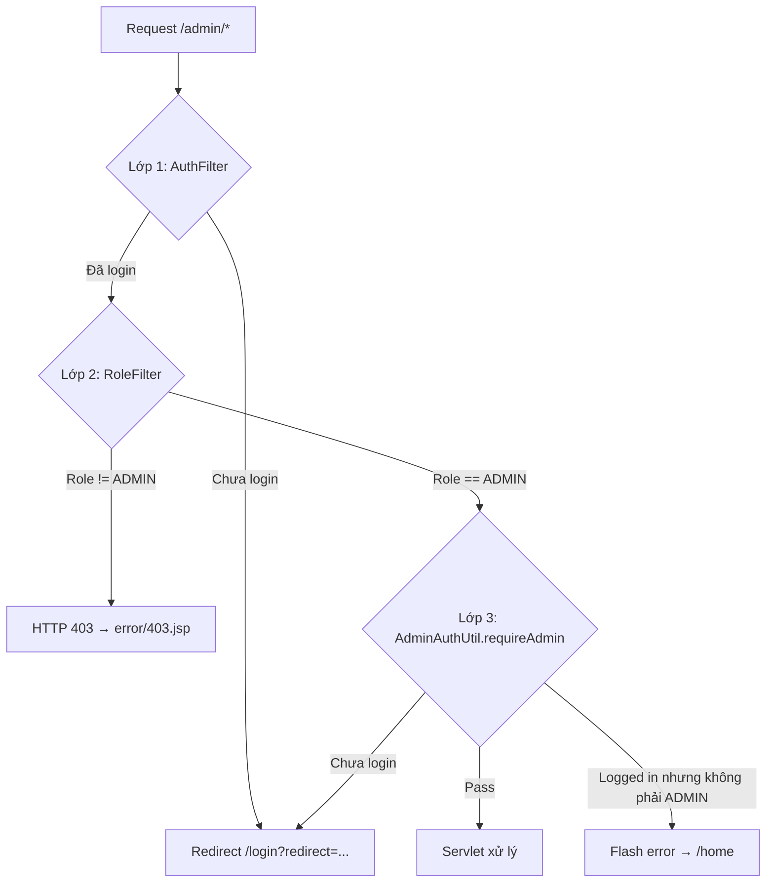

# Module Admin — Tài liệu chi tiết

> **Dự án:** ÉPCINE — Movie Ticket Booking System  
> **Phạm vi:** Toàn bộ source code liên quan đến quản trị viên (ADMIN)  
> **Tổng quan dự án:** [`SOURCE_CODE_OVERVIEW.md`](SOURCE_CODE_OVERVIEW.md)  
> **Spec nghiệp vụ:** [`project_summary_final.md`](project_summary_final.md)  
> **Database & migration:** [`Database/README.md`](Database/README.md)

---

## 1. Tổng quan module Admin

Module Admin cho phép người dùng có role **ADMIN** quản lý tài khoản và cấu hình hệ thống. Tính năng đã triển khai:

| Tính năng | Trạng thái |
|-----------|------------|
| Bảng điều khiển (dashboard) + thống kê user | ✅ |
| Danh sách người dùng (lọc, tìm kiếm, phân trang) | ✅ |
| Xem chi tiết người dùng | ✅ |
| Tạo tài khoản Staff / Manager | ✅ |
| Khóa / Mở khóa / Vô hiệu hóa tài khoản (+ lý do, email, `UserStatusLog`) | ✅ |
| Đặt lại mật khẩu (admin reset) | ✅ |
| Cấu hình tích điểm loyalty (4 tham số SystemConfig) | ✅ |
| Lịch sử chỉnh sửa tích điểm (`SystemConfigLog`) | ✅ |
| Cấu hình VAT (`VatRules` — `/admin/vat`) | ✅ |
| Sửa / hủy quy tắc VAT đã lên lịch | ✅ |
| Báo cáo & thống kê (`/admin/reports`) | ✅ |
| Xuất CSV doanh thu theo ngày/tháng/năm | ✅ |
| Thống kê vé bán theo phim / suất chiếu + xuất CSV | ✅ |
| Phân trang admin (user, config log, VAT history, báo cáo) | ✅ |
| Sửa thông tin user / đổi role | ❌ Chưa có |
| Tạo tài khoản CUSTOMER / ADMIN qua UI | ❌ Chưa có |
| Audit log đầy đủ (reset password, deactivate) | 🟡 Một phần — lock có `UserStatusLog` |

---

## 2. Danh sách file source liên quan Admin

### 2.1 Controller (`controller.admin`)

```
src/main/java/controller/admin/
├── AdminDashboardServlet.java      # /admin/dashboard
├── UserListServlet.java            # /admin/users
├── UserDetailServlet.java          # /admin/users/detail
├── UserCreateServlet.java          # /admin/users/create
├── UserStatusServlet.java          # /admin/users/status (POST)
├── UserResetPasswordServlet.java   # /admin/users/reset-password (POST)
├── SystemConfigListServlet.java    # /admin/config
├── SystemConfigUpdateServlet.java  # /admin/config/update (POST)
├── VatRuleListServlet.java         # /admin/vat
├── VatRuleCreateServlet.java       # /admin/vat/create (POST)
├── VatRuleUpdateServlet.java       # /admin/vat/update (POST)
├── VatRuleCancelServlet.java       # /admin/vat/cancel (POST)
├── AdminReportServlet.java         # /admin/reports (GET)
├── AdminReportExportServlet.java   # /admin/reports/export (GET) — CSV doanh thu
├── AdminReportExportTicketsServlet.java  # /admin/reports/export-tickets (GET) — CSV vé bán
└── package-info.java
```

### 2.2 View (`WEB-INF/views/admin/`)

```
src/main/webapp/WEB-INF/views/admin/
├── dashboard.jsp       # Bảng điều khiển
├── user-list.jsp       # Danh sách user
├── user-detail.jsp     # Chi tiết user
├── user-create.jsp     # Form tạo user
├── config-list.jsp     # Cấu hình loyalty + lịch sử
├── vat-list.jsp        # Quản lý thuế VAT
├── promotion-list.jsp  # Quản lý khuyến mãi (ADMIN + MANAGER)
├── reports.jsp         # Báo cáo doanh thu + vé bán
├── pagination.jspf     # Fragment phân trang dùng chung
└── .gitkeep
```

### 2.3 CSS

```
src/main/webapp/css/admin.css       # Style riêng trang admin
```

### 2.4 DAL & Model dùng bởi Admin

| File | Vai trò |
|------|---------|
| `dal/UserDAO.java` | CRUD + filter + count user |
| `dal/RoleDAO.java` | Lấy danh sách role, role assignable |
| `dal/SystemConfigDAO.java` | Đọc/cập nhật `SystemConfig` (loyalty keys) |
| `dal/SystemConfigLogDAO.java` | Ghi/đọc lịch sử loyalty (`SystemConfigLog`) |
| `dal/VatRuleDAO.java` | CRUD logic `VatRules` (tạo, sửa, hủy scheduled) |
| `dal/BookingStatsDAO.java` | Aggregate báo cáo: overview, doanh thu theo kỳ, top phim, vé theo suất |
| `dal/UserStatusLogDAO.java` | Ghi/đọc lịch sử khóa tài khoản (`UserStatusLog`) |
| `model/entity/User.java` | Entity user |
| `model/entity/Role.java` | Entity role |
| `model/entity/SystemConfig.java` | Entity cấu hình hệ thống |
| `model/entity/SystemConfigLog.java` | Entity lịch sử loyalty |
| `model/entity/VatRule.java` | Entity quy tắc VAT |
| `model/entity/UserStatusLog.java` | Entity audit khóa/mở khóa user |
| `model/dto/AdminUserForm.java` | Form binding tạo user |
| `model/dto/VatRuleForm.java` | Form binding VAT |
| `model/dto/BookingOverviewStatsDTO.java` | Tổng quan báo cáo (revenue, vé, đơn) |
| `model/dto/RevenuePeriodStatsDTO.java` | Doanh thu theo kỳ (ngày/tháng/năm) |
| `model/dto/TopMovieStatsDTO.java` | Thống kê vé theo phim |
| `model/dto/TopShowtimeStatsDTO.java` | Thống kê vé theo suất chiếu |

### 2.5 Utils & Filter

| File | Vai trò |
|------|---------|
| `utils/AdminAuthUtil.java` | Gate ADMIN + flash messages |
| `utils/SessionUtil.java` | Đọc user/role từ session |
| `utils/AccessControl.java` | Rule `/admin/*` → ADMIN |
| `filter/AuthFilter.java` | Bắt buộc login |
| `filter/RoleFilter.java` | Chặn sai role → 403 |
| `utils/PasswordUtil.java` | BCrypt hash mật khẩu |
| `utils/ConfigKeys.java` | Hằng số 4 key loyalty |
| `utils/SystemConfigValidator.java` | Validate/normalize giá trị loyalty |
| `utils/ConfigUtil.java` | Đọc config runtime (booking/loyalty) |
| `utils/VatRuleValidator.java` | Validate form VAT |
| `utils/AdminPaginationUtil.java` | Phân trang admin (`PAGE_SIZE = 10`) |
| `utils/ReportDateUtil.java` | Resolve khoảng ngày báo cáo (7d/30d/month/all/custom) |
| `utils/ReportExportUtil.java` | Build CSV doanh thu + vé bán (UTF-8 BOM) |
| `utils/TicketStatsViewUtil.java` | Chuẩn hóa `viewBy` (movie/showtime) |
| `utils/UserLockValidator.java` | Validate lý do khóa (10–500 ký tự) |
| `utils/AccountLockUtil.java` | Hiển thị lý do khóa trên trang login |
| `utils/EmailUtil.sendAccountLockedEmail()` | Gửi email thông báo khóa (tùy chọn) |

### 2.6 Navigation

| File | Vai trò |
|------|---------|
| `WEB-INF/views/common/header.jsp` | Menu dropdown ADMIN: Dashboard, Quản lý user, Cấu hình, **Báo cáo & thống kê** |

---

## 3. Kiến trúc bảo mật — 3 lớp kiểm soát

Module Admin được bảo vệ bởi **3 lớp** (defense in depth):



### 3.1 Lớp 1 — `AuthFilter` + `AccessControl`

- Mọi URL `/admin/*` **không** nằm trong danh sách public
- Chưa đăng nhập → redirect:
  - `/login?redirect={encoded URL}` — lần đầu
  - `/session-expired?redirect=...` — nếu cookie `hadLogin` tồn tại (đã từng login)

### 3.2 Lớp 2 — `RoleFilter` + `AccessControl`

```java
// AccessControl.java
ROLE_PREFIXES = {
    "/admin/" → Set.of("ADMIN")
}
```

- Path bắt đầu `/admin/` hoặc chính xác `/admin` → yêu cầu role **ADMIN**
- Role khác (MANAGER, STAFF, CUSTOMER) → HTTP 403, forward `error/403.jsp`
- Set attribute: `requestedPath`, `userRole`

### 3.3 Lớp 3 — `AdminAuthUtil.requireAdmin()`

Mỗi servlet admin gọi ở đầu `doGet`/`doPost`:

```java
if (!AdminAuthUtil.requireAdmin(req, resp)) {
    return;
}
```

| Tình huống | Hành vi |
|------------|---------|
| `userRole == "ADMIN"` | `return true` — tiếp tục xử lý |
| Chưa đăng nhập | Redirect `/login?redirect={full URL + query}` |
| Đã login nhưng không phải ADMIN | Flash error *"Bạn không có quyền truy cập trang quản trị."* → redirect `/home` |

> Lớp 3 là **phòng thủ dự phòng** — trường hợp filter bị bypass hoặc servlet được gọi trực tiếp.

---

## 4. Flash messaging

`AdminAuthUtil` quản lý thông báo một lần (read-once) qua session:

| Session key | Mục đích |
|-------------|----------|
| `flashSuccess` | Thông báo thành công (màu xanh) |
| `flashError` | Thông báo lỗi (màu đỏ) |

**Luồng:**
1. Servlet gọi `AdminAuthUtil.setFlash(req, key, message)` trước `sendRedirect`
2. Trang đích gọi `AdminAuthUtil.consumeFlash(req, key)` — đọc và xóa ngay

---

## 5. Bảng URL đầy đủ

| URL | Servlet | HTTP | View / Response |
|-----|---------|------|-----------------|
| `/admin/dashboard` | `AdminDashboardServlet` | GET | `admin/dashboard.jsp` |
| `/admin/users` | `UserListServlet` | GET | `admin/user-list.jsp` |
| `/admin/users/detail?id={uuid}` | `UserDetailServlet` | GET | `admin/user-detail.jsp` |
| `/admin/users/create` | `UserCreateServlet` | GET | `admin/user-create.jsp` (form trống) |
| `/admin/users/create` | `UserCreateServlet` | POST | Re-render form (lỗi) hoặc redirect list (OK) |
| `/admin/users/status` | `UserStatusServlet` | **POST only** | Redirect detail hoặc list |
| `/admin/users/reset-password` | `UserResetPasswordServlet` | **POST only** | Redirect detail |
| `/admin/config` | `SystemConfigListServlet` | GET | `admin/config-list.jsp` |
| `/admin/config/update` | `SystemConfigUpdateServlet` | **POST only** | Redirect `/admin/config` |
| `/admin/vat` | `VatRuleListServlet` | GET | `admin/vat-list.jsp` |
| `/admin/vat?edit={id}` | `VatRuleListServlet` | GET | Form sửa rule đã lên lịch |
| `/admin/vat/create` | `VatRuleCreateServlet` | **POST only** | Redirect `/admin/vat` |
| `/admin/vat/update` | `VatRuleUpdateServlet` | **POST only** | Redirect `/admin/vat?edit={id}` |
| `/admin/vat/cancel` | `VatRuleCancelServlet` | **POST only** | Redirect `/admin/vat` |
| `/admin/reports` | `AdminReportServlet` | GET | `admin/reports.jsp` |
| `/admin/reports/export` | `AdminReportExportServlet` | GET | Download CSV doanh thu theo kỳ |
| `/admin/reports/export-tickets` | `AdminReportExportTicketsServlet` | GET | Download CSV vé bán (phim/suất) |

> Không có endpoint PUT/DELETE — mọi thao tác ghi đều qua form POST (trừ export GET tải file).

---

## 6. Chi tiết từng endpoint

### 6.1 Dashboard — `GET /admin/dashboard`

**File:** `AdminDashboardServlet.java`  
**View:** `dashboard.jsp`

#### Luồng xử lý

```
requireAdmin()
    → UserDAO.countAll(null, null, null)      → totalUsers
    → UserDAO.countAll(null, null, "ACTIVE")  → activeUsers
    → UserDAO.countAll(null, "STAFF", null)   → staffCount
    → UserDAO.countAll(null, "MANAGER", null) → managerCount
    → BookingStatsDAO.getCurrentMonthOverview() → monthStats (doanh thu, vé, đơn tháng hiện tại)
    → adminName từ SessionUtil.getLoggedUser()
    → consumeFlash(success, error)
    → forward dashboard.jsp
```

#### Request attributes

| Attribute | Kiểu | Mô tả |
|-----------|------|-------|
| `adminName` | String | Họ tên admin đang login |
| `totalUsers` | int | Tổng số user mọi role/status |
| `activeUsers` | int | User có status ACTIVE |
| `staffCount` | int | User role STAFF |
| `managerCount` | int | User role MANAGER |
| `monthStats` | `BookingOverviewStatsDTO` | Thống kê đặt vé tháng hiện tại (CONFIRMED + PAID) |
| `flashSuccess` | String | Thông báo thành công (nullable) |
| `flashError` | String | Thông báo lỗi (nullable) |

#### Giao diện (`dashboard.jsp`)

- **4 thẻ thống kê tài khoản:** Tổng user, User active, Staff, Manager
- **3 thẻ thống kê đặt vé (tháng hiện tại):** Doanh thu, Vé đã bán, Đơn đã thanh toán + link **Xem báo cáo chi tiết**
- **Module grid:**
  - ✅ **Quản lý người dùng** → link `/admin/users`
  - ✅ **Cấu hình hệ thống** → link `/admin/config` (loyalty earn/redeem, min/max)
  - ✅ **Báo cáo & thống kê** → link `/admin/reports`

---

### 6.2 Danh sách user — `GET /admin/users`

**File:** `UserListServlet.java`  
**View:** `user-list.jsp`  
**PAGE_SIZE:** 10 user/trang

#### Query parameters

| Param | Mô tả | Mặc định |
|-------|-------|----------|
| `q` | Tìm trong full_name, email, username, phone_number | null |
| `role` | Lọc theo `role_name` (ADMIN, MANAGER, STAFF, CUSTOMER) | null |
| `status` | ACTIVE / INACTIVE / BANNED | null |
| `page` | Số trang (1-based) | 1 |

#### Luồng xử lý

```
requireAdmin()
    → parse & trim filters
    → clamp page vào [1, totalPages]
    → UserDAO.countAll(keyword, role, status)
    → UserDAO.findAll(keyword, role, status, offset, 10)
    → RoleDAO.findAll() → dropdown lọc role
    → forward user-list.jsp
```

#### Request attributes

| Attribute | Mô tả |
|-----------|-------|
| `users` | `List<User>` trang hiện tại |
| `roles` | `List<Role>` cho dropdown |
| `filterQ`, `filterRole`, `filterStatus` | Giá trị filter đang áp dụng |
| `currentPage`, `totalPages`, `totalUsers` | Thông tin phân trang |

#### SQL filter (`UserDAO.appendFilters`)

```sql
-- Keyword (q):
(full_name LIKE %q% OR email LIKE %q% OR username LIKE %q% OR phone_number LIKE %q%)

-- Role:
r.role_name = ?

-- Status:
u.status = ?

ORDER BY u.created_at DESC
OFFSET ? ROWS FETCH NEXT ? ROWS ONLY
```

#### Giao diện (`user-list.jsp`)

- Form GET filter (q, role, status)
- Bảng: họ tên, email, username, role, status, ngày tạo
- Link "Chi tiết" → `/admin/users/detail?id=...`
- Nút "Tạo tài khoản" → `/admin/users/create`
- Phân trang prev/next

---

### 6.3 Chi tiết user — `GET /admin/users/detail`

**File:** `UserDetailServlet.java`  
**View:** `user-detail.jsp`

#### Query parameters

| Param | Bắt buộc | Mô tả |
|-------|----------|-------|
| `id` | ✅ | UUID của user |

#### Luồng xử lý

```
requireAdmin()
    → thiếu id → flash error → redirect /admin/users
    → UserDAO.findById(id)
        → không tìm thấy → flash error → redirect list
    → isSelf = (id == currentUserId)
    → forward user-detail.jsp
```

#### Request attributes

| Attribute | Mô tả |
|-----------|-------|
| `user` | `User` đầy đủ (có roleName) |
| `isSelf` | `true` nếu admin đang xem chính mình |
| `userHasEmail` | User có email để gửi thông báo khóa |
| `emailConfigured` | `email.properties` đã cấu hình SMTP |
| `canSendLockEmail` | Có thể gửi email khi khóa |
| `latestLock` | `UserStatusLog` — lý do khóa gần nhất (khi BANNED) |

#### Hành động trên UI (`user-detail.jsp`)

Form hành động **ẩn** khi `isSelf == true` hoặc `user.roleName == 'ADMIN'`:

| Nút | Form action | Hidden fields / ghi chú |
|-----|-------------|-------------------------|
| Khóa tài khoản | POST `/admin/users/status` | `userId`, `action=lock`, **`reason`** (bắt buộc 10–500 ký tự), **`sendEmail`** (checkbox) |
| Mở khóa | POST `/admin/users/status` | `userId`, `action=unlock` |
| Vô hiệu hóa | POST `/admin/users/status` | `userId`, `action=deactivate` |
| Đặt lại mật khẩu | POST `/admin/users/reset-password` | `userId`, `newPassword` |

Khi user **BANNED**, hiển thị block **Lý do khóa gần nhất** (từ `UserStatusLog`).

**Hiển thị nút theo status:**

| Status hiện tại | Nút hiện |
|-----------------|----------|
| ACTIVE | Khóa, Vô hiệu hóa, Reset password |
| BANNED | Mở khóa, Reset password |
| INACTIVE | Mở khóa, Reset password |

---

### 6.4 Tạo user — `GET/POST /admin/users/create`

**File:** `UserCreateServlet.java`  
**View:** `user-create.jsp`  
**DTO:** `AdminUserForm`

#### GET — Hiển thị form trống

```
requireAdmin()
    → assignableRoles = RoleDAO.findAssignableByAdmin()  // STAFF, MANAGER
    → form = new AdminUserForm()
    → forward user-create.jsp
```

#### POST — Xử lý tạo

**Form fields:**

| Field | Param name | Bắt buộc | Ghi chú |
|-------|------------|----------|---------|
| Họ tên | `fullName` | ✅ | Không được trống |
| Ngày sinh | `dateOfBirth` | ✅ | Format `yyyy-MM-dd`, không được tương lai |
| Vai trò | `roleName` | ✅ | Chỉ `STAFF` hoặc `MANAGER` |
| Email | `email` | Một trong 3 | Unique |
| Tên đăng nhập | `username` | Một trong 3 | Unique |
| Số điện thoại | `phoneNumber` | Một trong 3 | Unique |
| Mật khẩu | `password` | ✅ | Tối thiểu 8 ký tự |

#### Validation (`validate()`)

| Rule | Thông báo lỗi |
|------|---------------|
| `fullName` blank | "Họ tên không được để trống." |
| `dateOfBirth` null | "Ngày sinh không được để trống." |
| DOB > hôm nay | "Ngày sinh không được là ngày trong tương lai." |
| Không có email/username/phone | "Cần nhập ít nhất một trong: email, tên đăng nhập hoặc số điện thoại." |
| Email trùng | "Email đã được sử dụng." |
| Username trùng | "Tên đăng nhập đã được sử dụng." |
| Phone trùng | "Số điện thoại đã được sử dụng." |
| Role không phải STAFF/MANAGER | "Chỉ được tạo tài khoản Staff hoặc Manager." |
| Password < 8 ký tự | "Mật khẩu phải có ít nhất 8 ký tự." |

#### Luồng thành công

```
validate() OK
    → RoleDAO.findByName(roleName) → roleId
    → User: passwordHash = PasswordUtil.hash(password)
    → User: status = "ACTIVE", loyalty_points = 0 (trong insert)
    → UserDAO.insert(user) → UUID
    → flashSuccess: "Đã tạo tài khoản {fullName} thành công."
    → redirect /admin/users
```

#### Luồng lỗi

- Validation fail → re-render `user-create.jsp` với `errors` list
- DB exception → "Không thể tạo tài khoản. Vui lòng kiểm tra lại thông tin."
- Role không tồn tại trong DB → "Vai trò không hợp lệ."

#### SQL insert (`UserDAO.insert`)

```sql
INSERT INTO Users (id, role_id, email, username, phone_number,
                   password_hash, full_name, date_of_birth, status, loyalty_points)
VALUES (?, ?, ?, ?, ?, ?, ?, ?, ?, 0)
-- id = UUID.randomUUID()
```

---

### 6.5 Thay đổi trạng thái — `POST /admin/users/status`

**File:** `UserStatusServlet.java`  
**Chỉ hỗ trợ POST**

#### Form parameters

| Param | Giá trị | Mô tả |
|-------|---------|-------|
| `userId` | UUID | User cần thay đổi |
| `action` | `lock` \| `unlock` \| `deactivate` | Hành động |
| `reason` | string | **Bắt buộc khi `action=lock`** — 10–500 ký tự (`UserLockValidator`) |
| `sendEmail` | `on` (optional) | Gửi email thông báo lý do khóa (cần SMTP + user có email) |
| `returnTo` | `list` (optional) | Redirect về list thay vì detail |

#### Mapping action → status

| action | Status mới | Ý nghĩa |
|--------|------------|---------|
| `lock` | `BANNED` | Khóa — không đăng nhập; lưu `UserStatusLog`; email tùy chọn |
| `deactivate` | `INACTIVE` | Vô hiệu hóa — ghi log (không lý do) |
| `unlock` | `ACTIVE` | Kích hoạt lại — ghi log (không lý do) |

#### Guards (kiểm tra bảo vệ)

| Guard | Thông báo | Redirect |
|-------|-----------|----------|
| Thiếu userId/action hoặc action không hợp lệ | "Yêu cầu không hợp lệ." | `/admin/users` |
| `userId == currentUserId` | "Không thể thay đổi trạng thái tài khoản của chính bạn." | detail |
| User không tồn tại | "Người dùng không tồn tại." | list |
| `user.roleName == ADMIN` | "Không thể thay đổi trạng thái tài khoản Admin." | detail |

#### Luồng thành công (`lock`)

```
guards pass
    → validate reason (lock) / bỏ qua (unlock, deactivate)
    → (lock) gửi email nếu checkbox + SMTP — lỗi email không rollback khóa
    → UserDAO.updateStatus(userId, newStatus)
    → UserStatusLogDAO.insert (LOCK/UNLOCK/DEACTIVATE)
    → flashSuccess
    → redirect detail hoặc list
```

#### Luồng thành công (unlock / deactivate)

```
guards pass
    → UserDAO.updateStatus(userId, newStatus)
    → UserStatusLogDAO.insert (không lý do)
    → flashSuccess → redirect
```

#### SQL (`UserDAO.updateStatus`)

```sql
UPDATE Users SET status = ? WHERE id = ?
```

---

### 6.6 Đặt lại mật khẩu — `POST /admin/users/reset-password`

**File:** `UserResetPasswordServlet.java`  
**Chỉ hỗ trợ POST**

#### Form parameters

| Param | Mô tả |
|-------|-------|
| `userId` | UUID user cần reset |
| `newPassword` | Mật khẩu mới (plain text — hash trước khi lưu) |

#### Guards

| Guard | Thông báo |
|-------|-----------|
| Thiếu userId | "Yêu cầu không hợp lệ." → list |
| `userId == currentUserId` | "Không thể đặt lại mật khẩu của chính bạn tại đây." |
| `newPassword` < 8 ký tự | "Mật khẩu mới phải có ít nhất 8 ký tự." |
| User không tồn tại | "Người dùng không tồn tại." |
| `user.roleName == ADMIN` | "Không thể đặt lại mật khẩu tài khoản Admin." |

#### Luồng thành công

```
guards pass
    → hash = PasswordUtil.hash(newPassword)
    → UserDAO.updatePasswordHash(userId, hash)
    → flashSuccess: "Đã đặt lại mật khẩu cho {fullName}."
    → redirect /admin/users/detail?id={userId}
```

#### SQL (`UserDAO.updatePasswordHash`)

```sql
UPDATE Users SET password_hash = ? WHERE id = ?
```

---

### 6.7 Cấu hình hệ thống — `GET /admin/config` & `POST /admin/config/update`

**File:** `SystemConfigListServlet.java`, `SystemConfigUpdateServlet.java`  
**View:** `config-list.jsp`  
**DAO:** `SystemConfigDAO`  
**Validator:** `SystemConfigValidator`  
**Keys:** `ConfigKeys.LOYALTY_KEYS`

#### GET — Hiển thị form cấu hình loyalty

```
requireAdmin()
    → SystemConfigDAO.findByKeys(LOYALTY_KEYS)
    → orderByKeys() — giữ thứ tự cố định 4 key
    → lastUpdated = config có updated_at mới nhất
    → SystemConfigLogDAO.findLoyaltyHistory(30)
    → VatRuleDAO.findEffectiveNow() → currentVatRule
    → consumeFlash(success, error)
    → forward config-list.jsp
```

#### 4 tham số loyalty (`ConfigKeys`)

| Key | Mô tả UI |
|-----|----------|
| `loyalty_earn_rate` | Tỷ lệ tích điểm (điểm / 1.000đ chi tiêu) |
| `loyalty_redeem_rate` | Số điểm đổi 10.000đ giảm giá |
| `loyalty_min_redeem` | Điểm tối thiểu mỗi đơn |
| `loyalty_max_redeem_per_order` | Điểm tối đa mỗi đơn |

#### POST — Lưu cấu hình

**Form fields:** 4 input `number` — tên param trùng `config_key`.

```
requireAdmin()
    → submitted = req params theo LOYALTY_KEYS
    → values = SystemConfigValidator.normalizeLoyaltyValues()
    → errors = SystemConfigValidator.validateLoyaltyConfig()
        → fail → flashError → redirect /admin/config
    → so sánh values với giá trị hiện tại — không đổi → flash error
    → SystemConfigLogDAO.insert(snapshot giá trị mới + previous)
    → adminId = SessionUtil.getLoggedUser().getId()
    → foreach key: SystemConfigDAO.updateValue(key, value, adminId)
    → flashSuccess: "Đã lưu cấu hình tích điểm thành công."
    → redirect /admin/config
```

#### Validation (`SystemConfigValidator`)

| Rule | Thông báo lỗi |
|------|---------------|
| Trống | "{label} không được để trống." |
| Không phải số nguyên | "{label} phải là số nguyên hợp lệ." |
| `earn_rate` < 0 | "Tỷ lệ tích điểm phải là số nguyên ≥ 0." |
| Các key khác ≤ 0 | "{label} phải là số nguyên > 0." |
| `min_redeem` > `max_redeem` | "Điểm tối thiểu không được lớn hơn điểm tối đa mỗi đơn." |

#### Request attributes (`config-list.jsp`)

| Attribute | Mô tả |
|-----------|-------|
| `configs` | `List<SystemConfig>` — 4 key loyalty |
| `lastUpdated` | `SystemConfig` có `updated_at` mới nhất (nullable) |
| `loyaltyHistory` | `List<SystemConfigLog>` — tối đa 30 bản ghi |
| `historyTableMissing` | `true` nếu chưa chạy migration `SystemConfigLog` |
| `currentVatRule` | Rule VAT đang hiệu lực (nullable) |
| `flashSuccess`, `flashError` | Thông báo một lần |

#### Giao diện (`config-list.jsp`)

- Breadcrumb: Dashboard → Cấu hình hệ thống
- Form POST 4 trường số nguyên + nút "Lưu thay đổi"
- Meta: thời gian cập nhật cuối + tên admin (`updated_by_name`)
- Bảng **Lịch sử chỉnh sửa tích điểm** — thời gian, người sửa, 4 tham số + giá trị trước đó
- Card **Thuế VAT** — tóm tắt rate hiện tại + link `/admin/vat`

#### Database — `SystemConfigLog`

Bảng lưu lịch sử mỗi lần admin lưu thay đổi loyalty. Có trong `create_database.sql` (setup mới). DB cũ chạy:

```text
Database/migrations/add_system_config_log.sql
```

#### SQL (`SystemConfigDAO.updateValue`)

```sql
UPDATE SystemConfig
SET config_value = ?, updated_by = ?, updated_at = GETDATE()
WHERE config_key = ?
```

#### Đọc runtime

Module booking/loyalty đọc giá trị qua `ConfigUtil.getInt()` / `getString()` — thay đổi admin có hiệu lực ngay sau khi lưu.

---

### 6.8 Quản lý VAT — `/admin/vat` và các POST

**File:** `VatRuleListServlet`, `VatRuleCreateServlet`, `VatRuleUpdateServlet`, `VatRuleCancelServlet`  
**View:** `vat-list.jsp`  
**DAO:** `VatRuleDAO`  
**Validator:** `VatRuleValidator`

| URL | Chức năng |
|-----|-----------|
| `GET /admin/vat` | Đang áp dụng (theo khoảng ngày), form tạo mới, bảng lịch sử + rule đã lên lịch |
| `GET /admin/vat?edit={id}` | Mở form sửa rule chưa đến ngày áp dụng |
| `POST /admin/vat/create` | Tạo rule mới — deactivate rule ACTIVE cũ, insert ACTIVE mới |
| `POST /admin/vat/update` | Sửa rule scheduled (`start_date > hôm nay`) |
| `POST /admin/vat/cancel` | Hủy rule scheduled, khôi phục `end_date` rule trước |

**Nghiệp vụ quan trọng:**

- `findEffectiveNow()` — rule hiệu lực theo **khoảng ngày** (kể cả `INACTIVE` còn trong range)
- `findScheduledList()` — rule `ACTIVE` + `start_date > GETDATE()` — có nút **Sửa** trong bảng
- `BookingDAO.getCurrentVatRate()` → `VatRuleDAO.findCurrentActiveRate()` (fallback 8%)

---

### 6.9 Báo cáo & thống kê — `GET /admin/reports`

**File:** `AdminReportServlet`, `AdminReportExportServlet`, `AdminReportExportTicketsServlet`  
**View:** `reports.jsp`  
**DAO:** `BookingStatsDAO`  
**Utils:** `ReportDateUtil`, `ReportExportUtil`, `TicketStatsViewUtil`, `AdminPaginationUtil`

| URL | Chức năng |
|-----|-----------|
| `GET /admin/reports` | Trang báo cáo: overview, nhóm doanh thu, top phim / vé theo suất |
| `GET /admin/reports/export` | Tải CSV doanh thu theo kỳ (`groupBy=day\|month\|year`) |
| `GET /admin/reports/export-tickets` | Tải CSV vé bán (`viewBy=movie\|showtime`) |

#### Query params (`/admin/reports`)

| Param | Giá trị | Mô tả |
|-------|---------|-------|
| `range` | `7d`, `30d`, `month`, `all`, `custom` | Preset khoảng ngày (`ReportDateUtil`) |
| `from`, `to` | `yyyy-MM-dd` | Dùng khi `range=custom` |
| `groupBy` | `day`, `month`, `year` | Nhóm bảng doanh thu theo kỳ |
| `viewBy` | `movie`, `showtime` | Thống kê vé: theo phim hoặc suất chiếu |
| `page` | int | Phân trang top phim / suất (`PAGE_SIZE = 10`) |

#### Dữ liệu hiển thị

| Block | Nguồn | Ghi chú |
|-------|-------|---------|
| 3 thẻ tổng quan | `getOverview(from, to)` | Chỉ đơn `payment_status = PAID` |
| Bảng doanh thu theo kỳ | `findRevenueByPeriod` | Ngày: `CAST(booked_at AS DATE)` thống nhất GROUP BY |
| Bảng vé theo phim | `findTopMoviesByTickets` | Lọc theo `Bookings.booked_at` |
| Bảng vé theo suất | `findTicketStatsByShowtime` | Lọc theo `Showtimes.start_time` |

#### Xuất CSV

- **Doanh thu:** UTF-8 BOM; cột kỳ, số đơn, số vé, doanh thu (`ReportExportUtil.buildRevenueCsvBytes`)
- **Vé bán:** theo phim hoặc suất (`buildMovieTicketCsvBytes` / `buildShowtimeTicketCsvBytes`)
- Tên file có timestamp; query params giữ nguyên bộ lọc trên trang báo cáo

#### Seed test (tháng 6/2026)

4 đơn PAID, 9 vé, doanh thu ~1.166.000đ — xem `Database/README.md` (`SEED-STATS-*`).

---

## 7. `UserDAO` — Methods dùng bởi Admin

| Method | SQL | Dùng bởi |
|--------|-----|----------|
| `findById(userId)` | `SELECT u.*, r.role_name FROM Users u JOIN Roles r ...` | Detail, Status, ResetPassword |
| `findAll(keyword, role, status, offset, limit)` | SELECT + filters + OFFSET/FETCH | UserList |
| `countAll(keyword, role, status)` | SELECT COUNT(*) + filters | UserList, Dashboard |
| `existsByEmail(email)` | `SELECT 1 ... WHERE email = ?` | UserCreate validate |
| `existsByUsername(username)` | `SELECT 1 ... WHERE username = ?` | UserCreate validate |
| `existsByPhone(phone)` | `SELECT 1 ... WHERE phone_number = ?` | UserCreate validate |
| `insert(user)` | INSERT Users | UserCreate |
| `updateStatus(userId, status)` | UPDATE status | UserStatus |
| `updatePasswordHash(userId, hash)` | UPDATE password_hash | UserResetPassword |

---

## 8. `SystemConfigDAO` — Methods dùng bởi Admin

| Method | SQL | Dùng bởi |
|--------|-----|----------|
| `findByKeys(keys)` | SELECT + JOIN Users (updated_by) + `WHERE config_key IN (...)` | SystemConfigList |
| `updateValue(key, value, updatedByUserId)` | UPDATE config_value, updated_by, updated_at | SystemConfigUpdate |

> `findAll()`, `findByKey()` tồn tại trong DAO nhưng admin UI chỉ dùng `findByKeys()` với `ConfigKeys.LOYALTY_KEYS`.

---

## 8b. `SystemConfigLogDAO` — Methods dùng bởi Admin

| Method | Mô tả | Dùng bởi |
|--------|-------|----------|
| `insert(log)` | Ghi snapshot loyalty mới + previous | SystemConfigUpdate |
| `findLoyaltyHistory(limit)` | Đọc lịch sử, JOIN `Users` lấy tên admin | SystemConfigList |

---

## 8c. `VatRuleDAO` — Methods dùng bởi Admin

| Method | Mô tả |
|--------|-------|
| `findEffectiveNow()` | Rule đang hiệu lực theo ngày |
| `findScheduledList()` | Rule ACTIVE chưa đến ngày áp dụng |
| `findHistory()` | Rule INACTIVE đã hết hiệu lực |
| `createAndActivate()` | Tạo rule mới (transaction) |
| `updateScheduled()` | Sửa rule đã lên lịch |
| `cancelScheduled()` | Hủy rule đã lên lịch |
| `findCurrentActiveRate()` | Rate cho booking (fallback 8%) |

---

## 9. `RoleDAO` — Methods dùng bởi Admin

| Method | Trả về | Dùng bởi |
|--------|--------|----------|
| `findAll()` | Tất cả roles | UserList — dropdown filter |
| `findByName(roleName)` | `Optional<Role>` | UserCreate — resolve roleId |
| `findAssignableByAdmin()` | Chỉ STAFF, MANAGER | UserCreate — dropdown tạo user |

```sql
-- findAssignableByAdmin
SELECT id, role_name, description, created_at
FROM Roles
WHERE role_name IN ('STAFF', 'MANAGER')
ORDER BY role_name
```

---

## 10. Model `AdminUserForm`

**File:** `model/dto/AdminUserForm.java`

| Field | Type | Mô tả |
|-------|------|-------|
| `email` | String | Email (optional nếu có username/phone) |
| `username` | String | Tên đăng nhập |
| `phoneNumber` | String | Số điện thoại |
| `fullName` | String | Họ tên |
| `dateOfBirth` | `java.sql.Date` | Ngày sinh |
| `roleName` | String | STAFF hoặc MANAGER |
| `password` | String | Mật khẩu plain (chỉ dùng lúc submit, không lưu DB) |

---

## 11. Quy tắc nghiệp vụ (Business Rules)

| # | Quy tắc | Nơi enforce |
|---|---------|-------------|
| 1 | Chỉ ADMIN truy cập `/admin/*` | RoleFilter + AdminAuthUtil |
| 2 | Admin chỉ **tạo** STAFF hoặc MANAGER | UserCreateServlet + RoleDAO.findAssignableByAdmin |
| 3 | Không lock/deactivate/reset **chính mình** | UserStatusServlet, UserResetPasswordServlet |
| 4 | Không thay đổi tài khoản **ADMIN** khác | UserStatusServlet, UserResetPasswordServlet, JSP ẩn form |
| 5 | User mới tạo bởi admin = **ACTIVE** ngay | UserCreateServlet |
| 6 | Mật khẩu lưu **BCrypt** | PasswordUtil |
| 7 | Status hợp lệ: ACTIVE, INACTIVE, BANNED | Khớp DB CHECK constraint |
| 8 | Cần ít nhất 1 identifier: email/username/phone | UserCreateServlet + DB constraint |
| 9 | Phân trang 10 user/trang | UserListServlet PAGE_SIZE=10 |
| 10 | Admin chỉ sửa 4 key loyalty qua UI | SystemConfigUpdateServlet + ConfigKeys |
| 11 | Config loyalty: min ≤ max | SystemConfigValidator |
| 12 | Ghi `updated_by` + `updated_at` khi đổi config | SystemConfigDAO.updateValue |
| 13 | Ghi lịch sử loyalty vào `SystemConfigLog` khi có thay đổi | SystemConfigUpdateServlet |
| 14 | Chỉ sửa/hủy VAT rule chưa đến `start_date` | VatRuleDAO.isScheduledEditable |
| 15 | Booking snapshot VAT từ rule hiệu lực theo ngày | VatRuleDAO.findCurrentActiveRate |
| 16 | Khóa user bắt buộc lý do 10–500 ký tự | UserLockValidator + UserStatusServlet |
| 17 | Mọi thay đổi status user ghi `UserStatusLog` | UserStatusLogDAO.insert |
| 18 | Báo cáo chỉ tính đơn `payment_status = PAID` | BookingStatsDAO |
| 19 | Doanh thu nhóm ngày: `CAST(booked_at AS DATE)` thống nhất SELECT/GROUP BY | BookingStatsDAO.findRevenueByPeriod |

---

## 11b. `BookingStatsDAO` — Methods dùng bởi Admin

| Method | Mô tả |
|--------|-------|
| `getCurrentMonthOverview()` | Tổng quan tháng hiện tại (dashboard) |
| `getOverview(from, to)` | Doanh thu, số đơn, số vé trong khoảng ngày |
| `findTopMoviesByTickets(from, to, offset, limit)` | Top phim theo vé (`booked_at`) |
| `countTopMovies(from, to)` | Đếm phim có vé trong kỳ |
| `findRevenueByPeriod(from, to, groupBy)` | Doanh thu theo `day` / `month` / `year` |
| `findTicketStatsByShowtime(from, to, offset, limit)` | Vé theo suất (`Showtimes.start_time`) |
| `countShowtimesWithTickets(from, to)` | Đếm suất có vé trong kỳ |

---

## 11c. `UserStatusLogDAO` — Methods dùng bởi Admin

| Method | Mô tả |
|--------|-------|
| `insert(log)` | Ghi LOCK/UNLOCK/DEACTIVATE |
| `findLatestLockByUserId(userId)` | Lý do khóa gần nhất (login + user detail) |

---

## 12. Sơ đồ luồng tổng hợp Admin

```mermaid
flowchart LR
    subgraph nav [Navigation]
        H[header.jsp] --> D[/admin/dashboard]
        H --> L[/admin/users]
        H --> CF[/admin/config]
        H --> R[/admin/reports]
        L --> C[/admin/users/create]
        L --> DT[/admin/users/detail]
        D --> CF
        D --> R
    end

    subgraph actions [POST Actions]
        DT -->|lock/unlock/deactivate| ST[/admin/users/status]
        DT -->|reset password| RP[/admin/users/reset-password]
        C -->|submit form| CR[UserCreateServlet POST]
        CF -->|save config| CU[SystemConfigUpdateServlet POST]
    end

    subgraph dal [Database]
        ST --> UDAO[UserDAO.updateStatus]
        RP --> UDAO2[UserDAO.updatePasswordHash]
        CR --> UDAO3[UserDAO.insert]
        D --> UDAO4[UserDAO.countAll]
        L --> UDAO5[UserDAO.findAll]
        DT --> UDAO6[UserDAO.findById]
        CF --> SDAO[SystemConfigDAO.findByKeys]
        CU --> SDAO2[SystemConfigDAO.updateValue]
    end
```

---

## 13. Giao diện Admin

### 13.1 Layout chung

Mọi trang admin set:

```jsp
<c:set var="pageTitle" value="..." scope="request"/>
<c:set var="extraCss" value="admin" scope="request"/>
<%@ include file="/WEB-INF/views/common/header.jsp" %>
<!-- nội dung -->
<%@ include file="/WEB-INF/views/common/footer.jsp" %>
```

- CSS: `admin.css` (load qua `extraCss=admin` trong header)
- Header hiện menu ADMIN khi `sessionScope.userRole == 'ADMIN'`

### 13.2 Menu Admin trong `header.jsp`

Khi role = ADMIN, dropdown user hiển thị:

| Link | URL |
|------|-----|
| Bảng điều khiển | `/admin/dashboard` |
| Quản lý người dùng | `/admin/users` |
| Cấu hình hệ thống | `/admin/config` |
| Báo cáo & thống kê | `/admin/reports` |

> Header cũng hiện link Manager (phim, thể loại) cho ADMIN — nhưng `RoleFilter` chặn ADMIN vào `/manager/*` (xem mục 15).

---

## 14. Đăng nhập Admin

### Tài khoản seed

| Field | Giá trị |
|-------|---------|
| Email | `admin@movieticket.vn` |
| Username | `admin` |
| Password | `Password@123` |
| Role | ADMIN |
| Status | ACTIVE |

### Redirect sau login

`LoginServlet` redirect theo role:

| Role | Redirect mặc định |
|------|-------------------|
| ADMIN | `/admin/dashboard` |
| MANAGER | `/manager/movies` |
| STAFF | `/staff/counter` |
| CUSTOMER | `/home` |

Nếu có `?redirect=` hợp lệ (qua `AuthRedirectUtil`), ưu tiên redirect đó.

---

## 15. Hạn chế & vấn đề đã biết

| # | Vấn đề | Mô tả |
|---|--------|-------|
| 1 | ADMIN bị 403 vào `/manager/*` | `RoleFilter` chỉ cho MANAGER; header vẫn hiện link manager cho ADMIN |
| 2 | Không có CSRF token | Form POST admin không có bảo vệ CSRF |
| 3 | Không sửa user | Detail view chỉ đọc — không edit fullName, email, role |
| 4 | Không tạo CUSTOMER/ADMIN | Chỉ STAFF/MANAGER qua UI |
| 5 | Audit log một phần | Loyalty → `SystemConfigLog`; lock/unlock/deactivate → `UserStatusLog`; reset password chưa ghi log |
| 6 | Reset password plain | Admin nhập mật khẩu mới trực tiếp — không gửi email cho user |
| 7 | Session timeout 1 phút | `web.xml` — admin dễ bị hết phiên khi dev |
| 8 | SystemConfig chỉ loyalty | Chưa UI cho key SystemConfig khác ngoài 4 key loyalty |
| 9 | Không tạo/xóa config key | Admin chỉ update 4 key có sẵn trong DB |
| 10 | Lịch sử loyalty / `SystemConfigLog` | DB cũ cần sync schema từ `create_database.sql` |

---

## 16. Roadmap gợi ý (chưa triển khai)

Dựa trên gap hiện tại:

| Tính năng | Mô tả gợi ý |
|-----------|-------------|
| Báo cáo Phase 2 | Tách VAT trong báo cáo, biểu đồ, thống kê theo loại ghế |
| Edit user | Form sửa thông tin + đổi role (có guard) |
| Audit log đầy đủ | Ghi reset password, deactivate reason (nếu cần) |
| CSRF protection | Token trên mọi form POST |
| Cho ADMIN vào `/manager/*` | Sửa `RoleFilter` hoặc `AccessControl` |

---

## 17. Checklist test thủ công

- [ ] Login `admin@movieticket.vn` / `Password@123` → redirect `/admin/dashboard`
- [ ] Dashboard hiển thị đúng số liệu user
- [ ] `/admin/users` — filter theo role, status, keyword
- [ ] Phân trang hoạt động (>10 users)
- [ ] Tạo Staff mới — validate lỗi + thành công
- [ ] Tạo Manager mới
- [ ] Không tạo được user trùng email/username/phone
- [ ] Detail user — hiện đúng thông tin
- [ ] Lock user STAFF → nhập lý do 10–500 ký tự → status BANNED, `UserStatusLog` có bản ghi
- [ ] User BANNED login → hiện lý do khóa trên `login.jsp`
- [ ] Lock + checkbox email (SMTP đã cấu hình) → nhận email thông báo
- [ ] Unlock user → status ACTIVE, log UNLOCK
- [ ] Deactivate → status INACTIVE
- [ ] Reset password → login bằng mật khẩu mới
- [ ] Không lock/reset chính mình
- [ ] Không lock/reset tài khoản ADMIN khác
- [ ] MANAGER login → `/admin/dashboard` → 403
- [ ] Chưa login → `/admin/users` → redirect login
- [ ] Flash message hiện đúng sau redirect
- [ ] `/admin/config` — hiển thị đúng 4 tham số loyalty từ DB
- [ ] Lưu config hợp lệ → flash success, `updated_at` / `updated_by` cập nhật
- [ ] Validate: min > max → flash error, giá trị không đổi
- [ ] Validate: số ≤ 0 (trừ earn_rate) → flash error
- [ ] `ConfigUtil` đọc giá trị mới sau khi admin lưu
- [ ] Lưu loyalty → dòng mới trong bảng lịch sử `SystemConfigLog`
- [ ] `/admin/vat` — tạo/sửa/hủy rule VAT; đặt vé quầy dùng `vat_rate_snapshot` đúng
- [ ] `/admin/reports` — overview + lọc 7d/30d/tháng/custom; nhóm doanh thu ngày/tháng/năm
- [ ] `/admin/reports` — `viewBy=movie` và `viewBy=showtime`; phân trang hoạt động
- [ ] Xuất CSV doanh thu và CSV vé — file mở được Excel (UTF-8 BOM)
- [ ] Dashboard — 3 thẻ thống kê tháng + link báo cáo
- [ ] Đã chạy migration `add_user_status_log.sql` nếu DB cũ chưa có `UserStatusLog`
- [ ] DB cũ thiếu `SystemConfigLog` → chạy lại `create_database.sql` hoặc tự `ALTER`/tạo bảng theo schema trong file

---

*Tài liệu chi tiết module Admin — cập nhật 09/06/2026.*
