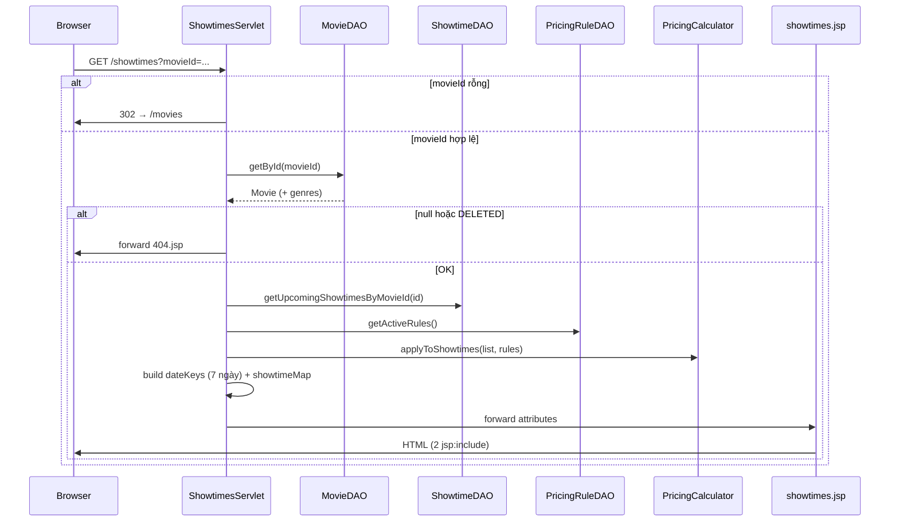
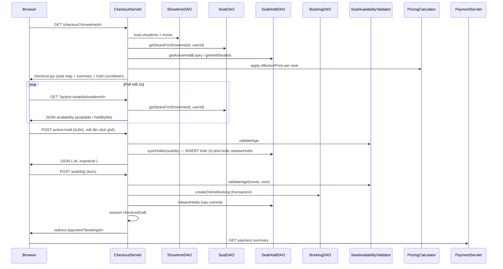

# Module Customer — Tài liệu chi tiết

> **Dự án:** ÉPCINE — Movie Ticket Booking System  
> **Phạm vi:** Source code dành cho khách hàng (CUSTOMER) và luồng đặt vé online  
> **Tổng quan dự án:** [`SOURCE_CODE_OVERVIEW.md`](SOURCE_CODE_OVERVIEW.md)  
> **Spec nghiệp vụ:** [`project_summary_final.md`](project_summary_final.md)  
> **Kế hoạch FR-11:** [`implementation_plan_fr-11.md`](implementation_plan_fr-11.md)  
> **Kế hoạch FR-12:** [`fr-12_seat_selection_2f514b7b.plan.md`](fr-12_seat_selection_2f514b7b.plan.md)  
> **Kế hoạch FR-14:** [`fr-14_online_booking_ab14e307.plan.md`](fr-14_online_booking_ab14e307.plan.md)  
> **Kế hoạch FR-22 + FR-50:** [`implementation_plan_fr-22_fr-50.md`](implementation_plan_fr-22_fr-50.md)  
> **Module liên quan:** [`MANAGER_MODULE_DETAIL.md`](MANAGER_MODULE_DETAIL.md) (phim, suất chiếu, pricing rules)

---

## 1. Tổng quan module Customer

Module Customer phục vụ người dùng có role **CUSTOMER** (và khách chưa đăng nhập cho các màn public). Theo spec (`project_summary_final.md`), nhóm FR Customer gồm FR-06 – FR-20, FR-43, FR-44.

**Trạng thái hiện tại (16/06/2026):** Đã triển khai **FR-11**, **FR-50**, **FR-12**, **FR-13**, **FR-14**, **FR-22**, **FR-16–17** (VietQR). Chưa có VNPay, loyalty, reviews.

### 1.1 Tính năng đã triển khai

| Tính năng | FR | Trạng thái | Ghi chú |
|-----------|-----|------------|---------|
| Xem lịch chiếu theo phim | FR-11 | ✅ | URL public `/showtimes?movieId=` |
| Hiển thị giá hiệu quả sau pricing rules | FR-50 | ✅ | `PricingCalculator` + `PricingRuleDAO` |
| Tab chọn 7 ngày (zero reload) | FR-11 | ✅ | `showtimes-selector.js` |
| Nhóm suất theo phòng chiếu | FR-11 | ✅ | Chip link `/checkout?showtimeId=` |
| Chọn ghế trên sơ đồ phòng | FR-12 | ✅ | `/checkout` — CUSTOMER + login |
| Giữ ghế ngay khi click (AJAX) | FR-13 | ✅ | POST `action=hold` → `SeatHolds` 10 phút; countdown trên checkout |
| Validate tuổi + ghế trống | FR-13 | ✅ | `SeatAvailabilityValidator` + `SeatHoldDAO.findBlockingSeatCodes` |
| Poll sơ đồ ghế hai chiều | — | ✅ | JSON 2s — ghế giải phóng hiện lại available |
| Tạo đơn đặt vé online | FR-14 | ✅ | Form POST → `Bookings` PENDING/UNPAID + redirect `/payment` |
| Hủy đơn PENDING (giải phóng ghế) | FR-14 | ✅ | POST `/payment?action=cancel` → `booking_status=CANCELLED` |
| Trang thanh toán VietQR + countdown | FR-14 / FR-16 | ✅ | `/payment?bookingId=` — QR chuyển khoản |
| Phát hành vé điện tử sau thanh toán | FR-17 | ✅ | `TicketDAO.issueTicketsForBooking` — bảng `Tickets` |
| Trang xác nhận thanh toán thành công | FR-17 | ✅ | `/payment/success?bookingId=` |
| Áp mã giảm giá / voucher | FR-22 | ✅ | POST `/payment?action=applyPromo` / `removePromo` |
| Hiển thị giá gốc vs giá hiệu quả (UI) | FR-50 | ✅ | Chip showtimes + checkout header khi có pricing rule |
| Placeholder thông tin phim (phần trên) | — | 🟡 | `movie-info-placeholder.jsp` — đồng nghiệp mở rộng |
| Duyệt phim / trang chủ | — | ✅ | Thuộc `common/` (`HomeServlet`, `MovieListServlet`) |

### 1.2 Tính năng chưa triển khai

| Tính năng | FR | URL reserve | Ghi chú |
|-----------|-----|-------------|---------|
| Thanh toán VNPay | FR-16–18 | — | Chưa triển khai |
| Đối soát VietQR tự động (webhook) | FR-16 | — | Hiện xác nhận thủ công; chưa Casso/Sepay |
| Hủy / hoàn vé sau thanh toán | FR-08 – FR-10 | — | Chỉ hủy đơn **PENDING** (chưa thanh toán) |
| Lịch sử đặt vé | FR-07 | `/booking-history` | |
| Điểm tích lũy (xem / đổi) | FR-43, FR-44 | `/loyalty` | Config loyalty có ở Admin |
| Đánh giá phim | FR-20 | `/reviews/mine` | Schema `MovieReviews` có |
| Email xác nhận vé | FR-19 | — | `EmailUtil` có sẵn |
| Profile khách hàng | — | `/profile` | AccessControl: mọi role đã login |

> `ShowtimesServlet` ở `controller` (public). Package `controller.customer`: `CheckoutServlet`, `PaymentServlet`, `PaymentSuccessServlet`, `PaymentStatusServlet` (CUSTOMER-only qua `RoleFilter`).

**Tài khoản test (seed):**

| Email | Role | Ghi chú |
|-------|------|---------|
| `customer.adult@email.com` | CUSTOMER | Người lớn — mọi suất T13+ |
| `customer.teen@email.com` | CUSTOMER | 14 tuổi — T13 OK, T16/T18 bị chặn |
| Mật khẩu | `Password@123` | |

---

## 2. Danh sách file source liên quan Customer

### 2.1 Controller

```
src/main/java/controller/
├── ShowtimesServlet.java          # /showtimes — FR-11 (public)
└── customer/
    ├── CheckoutServlet.java       # /checkout — FR-12 / FR-13 / FR-14 (CUSTOMER)
    ├── PaymentServlet.java        # /payment — FR-14 / FR-22 / FR-16 VietQR (CUSTOMER)
    ├── PaymentSuccessServlet.java # /payment/success — FR-17 (CUSTOMER)
    ├── PaymentStatusServlet.java  # /payment/status — JSON poll (dự phòng)
    └── package-info.java
```

**Servlet dùng chung (public, phục vụ customer journey):**

| Servlet | URL | Vai trò trong hành trình khách |
|---------|-----|--------------------------------|
| `HomeServlet` | `/home` | Khám phá phim, CTA "Đặt vé" → `/showtimes` |
| `MovieListServlet` | `/movies` | Danh sách phim + filter |
| `ShowtimesServlet` | `/showtimes` | Chọn ngày & suất → link checkout |
| `CheckoutServlet` | `/checkout` | Chọn ghế, tạo đơn ONLINE, panel tóm tắt |
| `PaymentServlet` | `/payment` | VietQR + voucher (FR-22) + countdown |
| `PaymentSuccessServlet` | `/payment/success` | Trang thành công sau thanh toán (FR-17) |
| `PaymentStatusServlet` | `/payment/status` | JSON poll `{ paid, pending }` (dự phòng) |

**Endpoint checkout & payment:**

| URL | Method | Mô tả |
|-----|--------|-------|
| `/checkout?showtimeId=` | GET | Trang chọn ghế |
| `/checkout?action=seats&showtimeId=` | GET | JSON availability (poll client 2s, hai chiều) |
| `/checkout` | POST `action=hold` | AJAX đồng bộ `SeatHolds` ngay khi chọn/bỏ ghế (FR-13) |
| `/checkout` | POST (form) | Validate + `createOnlineBooking` → redirect `/payment` |
| `/payment?bookingId=` | GET | Tóm tắt đơn + countdown 10 phút; khôi phục QR từ session |
| `/payment` | POST `action=payVietQR` | Tạo QR + `Payments` PENDING (`VIETQR`) |
| `/payment` | POST `action=confirmVietQR` | Hoàn tất thanh toán + phát vé → redirect success |
| `/payment/success?bookingId=` | GET | Trang xác nhận thành công (guard PAID) |
| `/payment/status?bookingId=` | GET | JSON trạng thái đơn (chưa dùng trên UI) |
| `/payment` | POST `action=removePromo` | Gỡ mã voucher, hoàn `used_count` |
| `/payment` | POST `action=applyPromo` | Áp mã voucher (FR-22) |
| `/payment` | POST `action=cancel` | Hủy đơn PENDING → `CANCELLED` + xóa `SeatHolds` + hoàn voucher |

### 2.2 View (`WEB-INF/views/customer/`)

```
src/main/webapp/WEB-INF/views/customer/
├── showtimes.jsp                              # Wrapper lịch chiếu (FR-11)
├── checkout.jsp                               # Wrapper chọn ghế (FR-12)
├── payment.jsp                                # Thanh toán VietQR (FR-14 / FR-16 / FR-22)
├── payment-success.jsp                        # Xác nhận thành công (FR-17)
├── components/
│   ├── movie-info-placeholder.jsp           # PHẦN TRÊN showtimes
│   ├── showtimes-selector.jsp               # PHẦN DƯỚI — lịch chiếu (FR-11)
│   ├── checkout-header.jsp                  # Header checkout — back, meta suất
│   ├── seat-map.jsp                         # Sơ đồ ghế + legend (FR-12)
│   └── booking-summary.jsp                  # Summary + countdown + POST (FR-12/13)
└── .gitkeep
```

**Design reference:**

```
Screen Design/
├── Movie-detail/           # FR-11 — code.html, DESIGN.md, screen.png
├── Seat selection/         # FR-12 — code.html, DESIGN.md, screen.png
├── Ticket booking/         # FR-14 — code.html, DESIGN.md, screen.png
└── Online payment/         # FR-16 — layout QR 2 cột (tham chiếu payment.jsp)
```

### 2.3 CSS & JS

| File | Mục đích |
|------|----------|
| `css/main.css` | Layout chung, header/footer (kế thừa từ mọi trang) |
| `css/customer-showtimes.css` | Lịch chiếu — `.mi-*`, `.st-*`, `.st-price-original` (gạch giá gốc) |
| `css/customer-checkout.css` | Chọn ghế — `.ck-*`; payment — `.pay-*`, `.pay-promo-*`, `.pay-vqr-*` |
| `js/showtimes-selector.js` | Tab ngày (FR-11) |
| `js/customer-checkout.js` | Toggle ghế, **AJAX hold** (`action=hold`), countdown giữ ghế, poll JSON 2s **hai chiều** (FR-12/13/14) |
| `js/customer-payment.js` | Countdown hết hạn đơn; uppercase mã voucher; **copy STK / nội dung CK** (FR-14/16/22) |
| `js/seat-type-colors.js` | Màu legend loại ghế (dùng chung staff + customer) |

Trang load CSS qua `extraCss` trong JSP → `header.jsp` (`customer-showtimes` / `customer-checkout`).

### 2.4 DAL & Model

| File | Vai trò với Customer |
|------|----------------------|
| `dal/MovieDAO.java` | `getById()` + `loadGenres()` — chi tiết phim trên trang lịch chiếu |
| `dal/ShowtimeDAO.java` | `getUpcomingShowtimesByMovieId()` — suất từ `GETDATE()`, loại `CANCELLED` |
| `dal/PricingRuleDAO.java` | `getActiveRules()` — rule `status = ACTIVE` cho FR-50 |
| `model/entity/Movie.java` | Entity phim (+ list `genres`) |
| `model/entity/Showtime.java` | Entity suất; field transient `effectivePrice` |
| `model/entity/PricingRule.java` | Entity quy tắc giá động |
| `dal/SeatDAO.java` | `getSeatsForShowtime(id)` / `(id, userId)` — availability + hold; giá base×multiplier (staff) |
| `dal/SeatHoldDAO.java` | FR-13: `findBlockingSeatCodes`, **`syncHolds`**, **`releaseHolds`**, `getActiveHoldExpiry`, `getHeldSeatIds`, `deleteExpiredHolds` |
| `dal/BookingDAO.java` | FR-14/16/17/22: `createOnlineBooking`, **`completeOnlinePayment`**, **`applyPromotionToBooking`**, **`removePromotionFromBooking`**, **`cancelOnlinePendingBooking`**, `getDetailById`, `findActiveOnlinePendingBookingId` |
| `dal/PaymentDAO.java` | FR-16: **`insertPendingOnlineVietQR`**, **`findLatestPendingVietQR`**, **`findByTransferCode`**, `markSuccess`, `markFailed` |
| `dal/TicketDAO.java` | FR-17: **`issueTicketsForBooking`**, `findBookingSeats` |
| `dal/BookingPromotionDAO.java` | FR-22: junction `BookingPromotions` |
| `dal/PromotionDAO.java` | FR-22: **`findByCode`**, **`validateForApply`**, `findByCodeForApply`, `incrementUsedCountIfAvailable`, `decrementUsedCount` (CRUD admin tại `/admin/promotions`) |
| `utils/VietQRConfig.java` | Đọc `vietqr.properties` — BIN, STK, tên chủ TK, template |
| `utils/VietQRUtil.java` | `transferContent(bookingCode)`, `qrImageUrl(amount, content)` → img.vietqr.io |
| `utils/SeatAvailabilityValidator.java` | FR-13: tuổi T13/T16/T18 |
| `utils/SeatHoldException.java` | Conflict giữ ghế (race / UK) |
| `utils/PromotionCalculator.java` | FR-22: `calculateDiscount`, `recalculateFinalAmount`, `calculateVatAmount`, `validateMinOrder` |
| `model/dto/BookingDetailDTO.java` | Chi tiết đơn cho `/payment` — `userId`, `showtimeId`, `expiredAt`, `bookingSource`, `discountAmount`, `vatAmount`, `appliedPromoCode`, `appliedPromoTitle`, `SeatItem` |

**Bảng DB liên quan (đã dùng / sẽ dùng):**

| Bảng | Trạng thái DAO | Dùng cho |
|------|----------------|----------|
| `Movies`, `MovieGenres`, `Genres` | ✅ `MovieDAO` | Thông tin phim |
| `Showtimes`, `CinemaRooms` | ✅ `ShowtimeDAO` | Lịch chiếu |
| `PricingRules` | ✅ read-only | Giá động (FR-50) |
| `Seats`, `SeatTypes` | ✅ `SeatDAO` | Sơ đồ ghế checkout + staff counter |
| `SeatHolds` | ✅ `SeatHoldDAO` | Giữ ghế 10 phút (FR-13) |
| `Bookings`, `BookingSeats` | ✅ `BookingDAO` | Online + offline booking; **`completeOnlinePayment`** |
| `Payments` | ✅ `PaymentDAO` | FR-16: `payment_method=VIETQR`, `transaction_code`=mã đơn |
| `Tickets` | ✅ `TicketDAO` | FR-17: phát vé sau thanh toán online |
| `BookingPromotions` | ✅ `BookingPromotionDAO` | FR-22: áp mã vào đơn PENDING |
| `Promotions` | ✅ `PromotionDAO` | CRUD admin; FR-22: `findByCode` + `validateForApply` trên `/payment` |
| `MovieReviews` | ❌ | Đánh giá phim |
| `LoyaltyPointsLog` | ❌ | Tích / đổi điểm |

### 2.5 Filter & Access Control

| Path | Yêu cầu | Ghi chú |
|------|---------|---------|
| `/showtimes`, `/showtimes/*` | **Public** | `AccessControl.PUBLIC_PREFIXES` |
| `/movies` | **Public** | |
| `/checkout`, `/checkout/*` | **CUSTOMER** + đăng nhập | `CheckoutServlet`, JSON poll |
| `/payment`, `/payment/*` | **CUSTOMER** + đăng nhập | `PaymentServlet`, `PaymentSuccessServlet`, `PaymentStatusServlet` |
| `/profile`, `/profile/*` | Đăng nhập (mọi role) | Servlet chưa có |
| `/booking-history`, `/loyalty`, `/reviews/mine` | **CUSTOMER** + đăng nhập | Servlet chưa có |

### 2.6 Cấu hình VietQR (`vietqr.properties`)

| Key | Bắt buộc | Mô tả |
|-----|----------|-------|
| `vietqr.bank.bin` | ✅ | Mã BIN Napas (VD: `970422` MB, `970436` VCB) — tra tại [vietqr.io](https://vietqr.io/) |
| `vietqr.account.number` | ✅ | Số tài khoản nhận tiền (chỉ số) |
| `vietqr.account.name` | ✅ | Tên chủ TK (HOA, không dấu) |
| `vietqr.bank.name` | ❌ | Tên hiển thị trên UI (mặc định "Ngân hàng") |
| `vietqr.template` | ❌ | `compact2` (mặc định), `compact`, `qr_only`, `print` |
| `vietqr.image.base.url` | ❌ | Mặc định `https://img.vietqr.io/image` |

- File mẫu: `src/main/resources/vietqr.properties.example` (committed)
- File thật: `vietqr.properties` (gitignored) — copy từ example, rebuild Tomcat
- DB cũ: chạy `Database/migrations/add_vietqr_payment_method.sql` nếu chưa có `VIETQR` trong `CK_Payments_Method`

---

## 3. Kiến trúc màn hình 2 người (tránh merge conflict)

Màn **chi tiết phim + lịch chiếu** được chia cho **2 developer** làm song song:

```
showtimes.jsp                         ← Wrapper (ít đụng — chỉ layout khung)
    │
    ├─► components/movie-info-placeholder.jsp   ← Developer A: poster, trailer, cast, mô tả
    │
    └─► components/showtimes-selector.jsp         ← Developer B: tab ngày, phòng, chip suất
```

| Quy tắc | Chi tiết |
|---------|----------|
| Dữ liệu chia sẻ | Servlet set `movie` — cả 2 component đọc `${movie.*}` |
| Servlet | Chỉ `ShowtimesServlet` — không cần sửa khi A làm UI phần trên |
| CSS class prefix | `.mi-*` = movie info; `.st-*` = showtimes — tránh đè selector |
| JS | Chỉ `showtimes-selector.js` — không đụng `main.js` |

**Đồng nghiệp (phần trên)** chỉnh `movie-info-placeholder.jsp`.  
**Phần lịch chiếu** nằm trong `showtimes-selector.jsp` + `customer-showtimes.css` (phần `.st-*`).

---

## 4. `ShowtimesServlet` — Luồng xử lý

**File:** `src/main/java/controller/ShowtimesServlet.java`  
**URL:** `GET /showtimes?movieId={uuid}`  
**View:** `/WEB-INF/views/customer/showtimes.jsp`

### 4.1 Sơ đồ luồng



### 4.2 Request attributes

| Attribute | Kiểu | Mô tả |
|-----------|------|-------|
| `movie` | `Movie` | Phim đầy đủ + `genres` (List&lt;String&gt;) |
| `dateKeys` | `List<String>` | 7 key `yyyy-MM-dd` từ hôm nay |
| `dateLabels` | `List<String>` | Nhãn tab: "Hôm nay", "Ngày mai", "Thứ …" |
| `showtimeMap` | `Map<String, Map<String, List<Showtime>>>` | Ngày → tên phòng → danh sách suất |
| `genreList` | `List<Genre>` | Cho dropdown thể loại trên `header.jsp` |

### 4.3 Query suất chiếu

`ShowtimeDAO.getUpcomingShowtimesByMovieId()`:

- `start_time >= GETDATE()`
- `status <> 'CANCELLED'` (gồm SCHEDULED, OPEN, SOLD_OUT, FINISHED)
- JOIN `Movies`, `CinemaRooms` — có `roomName` denormalized trên `Showtime`

### 4.4 Nhóm theo ngày & phòng

- Chỉ gán suất vào **7 ngày tab** (suất sau ngày thứ 7 không hiện trên UI — có thể mở rộng sau).
- Trong mỗi ngày: `LinkedHashMap` theo `roomName` — thứ tự phòng theo suất xuất hiện đầu tiên.
- Suất trong phòng giữ thứ tự `ORDER BY start_time` từ SQL.

### 4.5 Điểm vào từ UI hiện có

| Nguồn | Link |
|-------|------|
| `common/home.jsp` | `/showtimes?movieId=${movie.id}` (hero, tab phim) |
| `common/movies.jsp` | Nút "Đặt vé" / "Đặt vé sớm" |

---

## 5. Dynamic Pricing (FR-50)

### 5.1 `PricingRuleDAO`

```java
List<PricingRule> getActiveRules()
// WHERE status = 'ACTIVE' ORDER BY priority DESC, created_at ASC
```

Chỉ **đọc** — CRUD pricing rules cho Manager (FR-49) chưa có UI.

### 5.2 `PricingCalculator`

**Công thức** (theo `project_summary_final.md`):

```
effectivePrice = base_price × (1 + Σ% / 100) + Σfixed
```

- Duyệt **tất cả** rule ACTIVE khớp điều kiện — **cộng dồn** (priority chỉ ảnh hưởng thứ tự load, không chọn 1 rule).
- Kết quả gán vào `Showtime.effectivePrice` (transient, không persist DB).
- Làm tròn `setScale(0, HALF_UP)` — đơn vị VND.

### 5.3 Điều kiện rule (`condition_type`)

| Loại | Kiểm tra |
|------|----------|
| `DAY_OF_WEEK` | `day_of_week` CSV `"6,7"` — Thứ 2=1 … Chủ nhật=7 (Java `DayOfWeek`) |
| `TIME_RANGE` | Giờ bắt đầu suất ∈ [`time_from`, `time_to`] |
| `DATE_RANGE` | Ngày chiếu ∈ [`date_from`, `date_to`] |
| `SPECIFIC_DATE` | Ngày chiếu = `date_from` |

### 5.4 Kiểu điều chỉnh (`adjustment_type`)

| Loại | `adjustment_value` |
|------|-------------------|
| `PERCENTAGE` | Cộng vào Σ% (VD: `10` = +10%, `-5` = −5%) |
| `FIXED_AMOUNT` | Cộng vào Σfixed VND (VD: `10000` = +10.000đ) |

### 5.5 Ví dụ kiểm tra

| base_price | Rule | Kết quả |
|------------|------|---------|
| 80.000đ | T7/CN `FIXED_AMOUNT +10.000` | 90.000đ cuối tuần |
| 80.000đ | Khung 21h–23h `PERCENTAGE +10` | 88.000đ |

> Giá hiển thị trên chip là **giá gốc suất** sau pricing rules. Trên checkout, giá vé = `effectivePrice × seat_multiplier` (theo loại ghế).

---

## 6. `CheckoutServlet` — Chọn ghế & tạo đơn (FR-12 / FR-13 / FR-14)

**File:** `src/main/java/controller/customer/CheckoutServlet.java`  
**URL:** `/checkout`  
**View:** `/WEB-INF/views/customer/checkout.jsp`

### 6.1 Sơ đồ luồng



### 6.2 Guard & trạng thái suất

| Điều kiện | Hành vi |
|-----------|---------|
| Thiếu / sai `showtimeId` | Redirect `/movies` hoặc 404 |
| Suất `SOLD_OUT` | Hiển thị sơ đồ read-only, không chọn ghế |
| Suất đã qua / `CANCELLED` | 404 hoặc thông báo lỗi |
| Có đơn PENDING cùng suất | Khóa chọn ghế mới; hiện link tiếp tục/hủy đơn trên summary |
| Chưa login / không phải CUSTOMER | `RoleFilter` → login |

### 6.3 Giá vé trên checkout

```
ticketPrice = effectivePrice × seat_multiplier
```

- `effectivePrice` tính từ `PricingCalculator` (FR-50) trên `Showtime.basePrice`
- `seat_multiplier` lấy từ `SeatTypes` qua JOIN `SeatDAO`

### 6.4 FR-13 — Giữ ghế ngay khi click (2 giai đoạn chặn ghế)

**Giai đoạn 1 — chọn ghế (trước khi tạo đơn):**

| Bước | Logic |
|------|-------|
| Trigger | Mỗi lần click chọn/bỏ ghế → POST AJAX `action=hold` |
| Validate tuổi | `SeatAvailabilityValidator` trên servlet |
| Đồng bộ hold | `SeatHoldDAO.syncHolds(showtimeId, userId, seatIds)` — INSERT `SeatHolds` 10 phút; danh sách rỗng → `releaseHolds` |
| Response | JSON `{ ok: true, expiresAt }` hoặc `{ ok: false, message }` |
| UI | Countdown `#ckHoldCountdown`; revert selection nếu hold fail |
| Chặn | Có đơn PENDING cùng suất → không cho hold/chọn ghế mới |

**Giai đoạn 2 — tạo đơn ONLINE (FR-14):**

| Bước | Logic |
|------|-------|
| Tuổi | `SeatAvailabilityValidator` trên servlet POST form |
| Availability | `SeatHoldDAO.findBlockingSeatCodes` trong `BookingDAO.createOnlineBooking` |
| Giá | Server-side: `PricingCalculator` × `SeatTypes.price_multiplier` |
| INSERT | `Bookings` ONLINE, PENDING, UNPAID, `expired_at = NOW + 10 phút`, mã `BK-yyyyMMdd-xxxx` |
| BookingSeats | Snapshot `ticket_price` từng ghế |
| Idempotency | Double-click → trả về cùng `bookingId` nếu đã có PENDING cùng suất (`findActiveOnlinePendingBookingId`) |
| Sau commit | `SeatHoldDAO.releaseHolds` — booking PENDING thay thế hold |
| Session | `checkoutDraft` — `bookingId`, `showtimeId`, `seatIds`, `expiredAt` |
| Sau POST | Redirect `/payment?bookingId=` |

**Race condition:** validate lại trong transaction; UK → `SeatHoldException` message thân thiện.

> Ghế bị chặn bởi **cả hai**: `SeatHolds` (10 phút) và `Bookings` với `booking_status IN ('PENDING','CONFIRMED')` — `SeatDAO.getSeatsForShowtime` JOIN cả hai nguồn.

### 6.5 Poll cập nhật sơ đồ (client)

- `customer-checkout.js`: `SEAT_REFRESH_MS = 2000` — gọi JSON `?action=seats`
- **Hai chiều:** ghế unavailable → `markSold`; ghế trở lại available → `markAvailable` (sau hủy đơn / hết hold)
- Ghế hold bởi **chính user** vẫn hiển thị selectable (`heldByMe` / `heldByCurrentUser`)
- Text empty state **"Chưa chọn ghế nào"** render từ JSP (`#ckEmptyMsg`) — JS chỉ toggle `hidden`, tránh lỗi encoding
- **Không** dùng SSE/WebSocket — chỉ polling HTTP

### 6.6 View checkout (modular)

```jsp
<c:set var="extraCss" value="customer-checkout"/>
<%@ include file="common/header.jsp" %>
<div class="ck-layout">
    <jsp:include page="components/checkout-header.jsp"/>
    <jsp:include page="components/seat-map.jsp"/>
    <jsp:include page="components/booking-summary.jsp"/>
</div>
<%@ include file="common/footer.jsp" %>
```

| Component | Vai trò |
|-----------|---------|
| `checkout-header.jsp` | Back → showtimes, meta suất, badge tuổi phim |
| `seat-map.jsp` | Màn hình + lưới ghế + legend (available / selected / booked / held) |
| `booking-summary.jsp` | Danh sách ghế, countdown giữ ghế, nút hủy/tiếp tục đơn PENDING, POST "Tiếp tục thanh toán" |

**Design:** `Screen Design/Seat selection/` — prefix CSS `.ck-*`. Payment: `Screen Design/Ticket booking/`.

---

## 6b. `PaymentServlet` — Thanh toán VietQR & voucher (FR-14 / FR-22 / FR-16)

**File:** `src/main/java/controller/customer/PaymentServlet.java`  
**URL:** `/payment`  
**View:** `/WEB-INF/views/customer/payment.jsp`

### GET `?bookingId=`

| Guard | Hành vi |
|-------|---------|
| Không thuộc user hiện tại | 404 |
| Không phải ONLINE / PENDING | Redirect checkout + error |
| `expired_at` đã qua | Redirect checkout + error |

UI: poster phim, ghế, breakdown, countdown 10 phút, khối voucher, nút **Thanh toán VietQR** → hiển thị QR + thông tin STK; nút **Tôi đã chuyển khoản** sau khi CK.

### POST `action=payVietQR` / `action=confirmVietQR` (FR-16 / FR-17)

| Bước | Logic |
|------|-------|
| Guard cấu hình | `VietQRConfig.isConfigured()` — thiếu → nút disabled + message |
| Tạo QR | `VietQRUtil.qrImageUrl(finalAmount, transferContent)` → URL img.vietqr.io |
| Nội dung CK | `transferContent(booking_code)` — viết hoa, tối đa 25 ký tự |
| DB pending | `PaymentDAO.insertPendingOnlineVietQR` — `payment_method=VIETQR`, `PENDING`; bỏ qua insert nếu pending cùng amount + mã đã tồn tại |
| Session | `vietqrQrUrl`, `vietqrTransferContent`, `vietqrBookingId` — khôi phục QR khi reload GET |
| Xác nhận | POST `confirmVietQR` → `BookingDAO.completeOnlinePayment` (transaction: Payment SUCCESS, Booking CONFIRMED/PAID, `TicketDAO.issueTicketsForBooking`, xóa `SeatHolds`) |
| Redirect | `/payment/success?bookingId=` |

**Luồng transaction `completeOnlinePayment` (idempotent nếu đã PAID):**

```
Payments.payment_status  → SUCCESS
Bookings                 → booking_status=CONFIRMED, payment_status=PAID
Tickets                  → 1 row / ghế (ticket_code từ booking_code + seat)
SeatHolds                → DELETE user/showtime
```

> **Hạn chế hiện tại:** Không có webhook ngân hàng — khách tự bấm "Tôi đã chuyển khoản". Production có thể tích hợp Casso/Sepay + `PaymentStatusServlet` poll.

### `PaymentSuccessServlet` — GET `/payment/success` (FR-17)

| Guard | Hành vi |
|-------|---------|
| Chưa login | Redirect `/login` |
| Không phải owner / không ONLINE / chưa PAID | 404 |
| OK | Forward `payment-success.jsp`; xóa `checkoutDraft`, session `vietqr*` |

### POST `action=cancel`

| Bước | Logic |
|------|-------|
| Guard | Cùng ownership + ONLINE + PENDING |
| DB | `BookingDAO.cancelOnlinePendingBooking` → `booking_status = CANCELLED` |
| Holds | Xóa `SeatHolds` của user/showtime trong transaction |
| Voucher | Xóa `BookingPromotions` + `PromotionDAO.decrementUsedCount` nếu đã áp mã |
| Session | Xóa `checkoutDraft` |
| Redirect | Checkout cùng suất + flash info |

Nút hủy có trên **`payment.jsp`** và **`booking-summary.jsp`** (khi `pendingBookingId` tồn tại).

### POST `action=applyPromo` / `action=removePromo` (FR-22)

| Bước | Logic |
|------|-------|
| Tìm mã | `PromotionDAO.findByCode(promoCode)` — không tìm thấy → message cụ thể |
| Validate | `PromotionDAO.validateForApply(promotion)` — lỗi rõ: INACTIVE, **chưa đến start_date**, hết hạn, hết lượt |
| Min order | `PromotionCalculator.validateMinOrder` trên `total_amount` (subtotal vé) |
| Tính tiền | `PromotionCalculator.calculateDiscount` → `discount_amount`; `recalculateFinalAmount` + `calculateVatAmount` |
| DB | `BookingDAO.applyPromotionToBooking` — `BookingPromotions` + `incrementUsedCountIfAvailable`; thay mã cũ nếu có |
| Gỡ mã | `BookingDAO.removePromotionFromBooking` + `decrementUsedCount`, reset discount |
| Hủy đơn | `cancelOnlinePendingBooking` cũng hoàn lượt voucher |

**Công thức:**

```
discount_amount = PERCENTAGE(subtotal × %, cap max_discount) hoặc FIXED_AMOUNT
final_amount    = (total_amount - discount_amount) × (1 + vat_rate/100)
```

UI: input mã + breakdown giảm giá trên [`payment.jsp`](src/main/webapp/WEB-INF/views/customer/payment.jsp); JS copy STK/nội dung CK (`customer-payment.js`).

> **Lưu ý vận hành:** Admin list hiển thị **SCHEDULED** khi `start_date > now` dù `status = ACTIVE`. Mã tạo trên `/admin/promotions` cần **start_date ≤ hôm nay** mới áp được trên `/payment`. Sau khi áp/gỡ voucher cần tạo lại mã QR.

---

## 7. View Layer — Chi tiết JSP (showtimes)

### 7.1 `showtimes.jsp` (wrapper)

```jsp
<c:set var="extraCss" value="customer-showtimes"/>
<%@ include file="common/header.jsp" %>
<div class="movie-detail-wrapper">
    <jsp:include page="components/movie-info-placeholder.jsp"/>
    <jsp:include page="components/showtimes-selector.jsp"/>
</div>
<%@ include file="common/footer.jsp" %>
```

### 7.2 `movie-info-placeholder.jsp` (phần trên)

**Hiện có (placeholder):**

- Banner `backdropUrl` / fallback `posterUrl`
- Poster 2:3 + badge rating
- Title, age rating, thời lượng, ngày công chiếu, thể loại
- Đạo diễn, mô tả (hoặc text placeholder)

**Đồng nghiệp có thể thêm** (theo `Screen Design/Movie-detail/`):

- Nút Play trailer (`movie.trailerUrl`)
- Cast horizontal scroll
- Rating IMDb / Rotten Tomatoes (nếu có field)
- Section "You May Also Like"

**Biến JSP sẵn có:** `${movie.title}`, `${movie.description}`, `${movie.director}`, `${movie.posterUrl}`, `${movie.backdropUrl}`, `${movie.genres}`, `${movie.averageRating}`, …

### 7.3 `showtimes-selector.jsp` (phần dưới)

- Tiêu đề "Chọn suất chiếu"
- 7 nút tab ngày (`.st-date-tab`)
- Panel theo ngày (`.st-day-panel`) — ẩn/hiện bằng JS
- Mỗi phòng: tiêu đề + danh sách chip
- Chip: `HH:mm | {effectivePrice} đ`
  - Nếu `effectivePrice ≠ basePrice`: hiện thêm `.st-price-original` gạch giá gốc
  - Link: `/checkout?showtimeId={id}` (yêu cầu login CUSTOMER)
  - `SOLD_OUT`: chip disabled, trang checkout read-only
- Empty state: "Không có suất chiếu trong ngày này"

---

## 8. CSS — Showtimes & Checkout

### 8.1 `customer-showtimes.css`

| Prefix | Vùng | Tham chiếu design |
|--------|------|-------------------|
| `.mi-*` | Movie info — banner, poster, meta | Movie-detail hero + grid |
| `.st-*` | Showtimes — glass panel, tabs, chips | Date & Time Selectors |

Đặc điểm chính:

- Nền glass: `rgba(18,18,18,0.6)` + `backdrop-filter: blur(24px)`
- Tab ngày active: `#e50914` (Cinematic Red)
- Chip suất: viền trắng mờ, hover sáng hơn
- Responsive: mobile stack poster + căn giữa meta

### 8.2 `customer-checkout.css`

| Prefix | Vùng | Ghi chú |
|--------|------|---------|
| `.ck-*` | Layout 2 cột, seat grid, summary glass, hold timer, badge `.ck-price-badge`, cancel pending | Cinematic Premium — đỏ `#e50914`, VIP gold |
| `.pay-*` | Trang payment — breakdown VAT, countdown, QR VietQR, nút hủy | `Screen Design/Online payment/` |
| `.pay-promo-*` | Khối nhập / hiển thị voucher đã áp | FR-22 |
| `.pay-vqr-*` | Thông tin STK, nút copy nội dung CK | FR-16 |

---

## 9. JavaScript

### 9.1 `showtimes-selector.js`

- IIFE, không pollute global
- Click `.st-date-tab` → toggle `.st-date-tab--active` + `.st-day-panel--active`
- Cập nhật `aria-selected`, attribute `hidden` cho a11y
- **Không** gọi API — toàn bộ dữ liệu render server-side lần đầu

### 9.2 `customer-checkout.js`

- Toggle chọn ghế (`.ck-seat--available` / `--held` / `--selected`), cập nhật summary + tổng tiền
- **AJAX hold:** sau mỗi toggle → POST `action=hold` với `seatIds[]`; revert selection nếu `{ ok: false }`
- Countdown giữ ghế trên checkout (`#ckHoldCountdown`, `data-hold-expires` từ servlet)
- Poll JSON `?action=seats` mỗi **2 giây** — đồng bộ booked / held / **available** (hai chiều)
- Khóa tương tác khi `data-read-only="true"` hoặc `data-pending-booking="true"`
- Form POST gửi `seatIds[]` + hidden `showtimeId` (chỉ khi không pending/read-only)

### 9.3 `customer-payment.js`

- Countdown `#payCountdown` từ `data-expires` — hết giờ redirect checkout cùng suất
- Input `#payPromoCode`: tự uppercase khi gõ (đồng bộ với validate server `UPPER(code)`)
- Nút `.pay-vqr-copy-btn`: copy STK / nội dung CK vào clipboard (fallback `execCommand`)
- **Không poll** `/payment/status` — VietQR xác nhận qua form POST `confirmVietQR`
- Trang reload sau apply/remove voucher; sau confirm → redirect success

---

## 10. Entity bổ sung

### 10.1 `PricingRule`

| Field Java | Cột DB | Ghi chú |
|------------|--------|---------|
| `ruleName` | `rule_name` | |
| `conditionType` | `condition_type` | DAY_OF_WEEK, TIME_RANGE, … |
| `dayOfWeek` | `day_of_week` | CSV, VD `"6,7"` |
| `timeFrom` / `timeTo` | `time_from` / `time_to` | `java.sql.Time` |
| `dateFrom` / `dateTo` | `date_from` / `date_to` | |
| `adjustmentType` | `adjustment_type` | PERCENTAGE, FIXED_AMOUNT |
| `adjustmentValue` | `adjustment_value` | `BigDecimal` |
| `priority` | `priority` | |
| `status` | `status` | ACTIVE / INACTIVE |

### 10.2 `Showtime.effectivePrice`

- Kiểu `BigDecimal`, **không** map từ DB
- Set bởi `PricingCalculator.applyToShowtimes()` trước khi forward JSP
- JSP fallback: `${st.effectivePrice != null ? st.effectivePrice : st.basePrice}`

### 10.3 `Seat` (checkout)

| Field | Ghi chú |
|-------|---------|
| `ticketPrice` | Set runtime = `effectivePrice × multiplier` |
| `heldByCurrentUser` | Transient — ghế đang hold bởi user hiện tại vẫn chọn được |
| `status` | `AVAILABLE`, `BOOKED`, `HELD`, … — từ JOIN `SeatHolds` / `BookingSeats` |

---

## 11. Lộ trình triển khai tiếp theo

```
FR-11 ✅  →  FR-50 ✅  →  FR-12 ✅  →  FR-13 ✅  →  FR-14 ✅  →  FR-22 ✅  →  FR-16–17 ✅ (VietQR)
                                                              ↓
                                                       FR-07 (lịch sử) · FR-19 (email) · FR-43 (loyalty)
```

| Bước | FR | Việc cần làm |
|------|-----|--------------|
| 1 | FR-16 webhook | Casso/Sepay — tự động đối soát, bỏ xác nhận thủ công |
| 2 | FR-18 / email vé | Email xác nhận sau thanh toán |
| 3 | FR-19 | Email e-ticket qua `EmailUtil` |
| 4 | FR-07 | `BookingHistoryServlet` → `/booking-history` |
| 5 | FR-20 | `MovieReviewDAO` + servlet reviews |
| 6 | FR-43–44 | `LoyaltyServlet` → `/loyalty` |

**Tùy chọn kỹ thuật:** SSE/WebSocket thay poll 2s nếu cần near-realtime (chưa có trong repo).

---

## 12. Kiểm tra thủ công

### 12.1 Truy cập trang showtimes

1. Chạy Tomcat + DB có seed showtimes.
2. Mở `/home` → chọn phim → "Đặt vé" hoặc trực tiếp `/showtimes?movieId=<uuid>`.
3. Thiếu `movieId` → redirect `/movies`.
4. `movieId` sai → `404.jsp`.

### 12.2 Lịch chiếu & phòng

1. Chọn từng tab ngày — không reload trang.
2. Cùng ngày, suất cùng `room_name` nằm dưới một tiêu đề phòng.
3. Ngày không có suất → empty state.

### 12.3 Giá động

1. Seed `create_database.sql` có 2 `PricingRules` demo (cuối tuần +10k, khung tối +10%).
2. So sánh chip T2–T6 vs T7/CN cùng `base_price` — chip cuối tuần cao hơn, có gạch giá gốc.
3. Checkout header / summary hiện badge **Giá động** / **Giá suất** khi `effectivePrice ≠ basePrice`.

### 12.4 Checkout — giữ ghế & tạo đơn (FR-12 / FR-13 / FR-14)

1. Login `customer.adult@email.com` / `Password@123`.
2. `/showtimes?movieId=` → click chip suất → `/checkout?showtimeId=`.
3. Chọn 1–8 ghế — summary cập nhật; **mỗi click** gọi AJAX hold; countdown giữ ghế hiện trên summary.
4. DB sau click: row `SeatHolds` với `expires_at` ~10 phút.
5. Tab ẩn danh / user khác: ghế đang hold unavailable trên checkout (poll ≤2s).
6. Bỏ hết ghế → holds xóa; tab khác thấy ghế available lại (poll hai chiều).
7. **Tiếp tục thanh toán** → redirect `/payment?bookingId=`, countdown ~10 phút; `SeatHolds` đã xóa.
8. DB: 1 row `Bookings` (ONLINE, PENDING, UNPAID) + N rows `BookingSeats`.
9. Staff counter đặt cùng ghế trước → customer POST fail hoặc hold fail.
10. Double-click nút tạo đơn → idempotency, cùng `bookingId`.
11. `customer.teen@email.com` + suất T18 → POST/hold bị chặn (validate tuổi).

### 12.5 Hủy đơn PENDING

1. Tạo đơn PENDING → vào `/payment?bookingId=`.
2. Click **Hủy đơn** → confirm → redirect checkout; DB `booking_status = CANCELLED`.
3. Tab khác poll checkout → ghế hiện lại available (không còn icon X).
4. Từ checkout (khi có `pendingBookingId`): nút **Hủy đơn đang chờ** hoạt động tương tự.

### 12.6 Tích hợp 2 người (showtimes UI)

1. Sửa nội dung `movie-info-placeholder.jsp` (thêm HTML tùy ý).
2. Xác nhận `showtimes-selector.jsp` vẫn hoạt động, không vỡ layout.

### 12.7 Sold out

- Suất `status = SOLD_OUT` → chip disabled, không click được.

### 12.8 Áp mã voucher (FR-22)

1. Tạo đơn PENDING → `/payment`.
2. Nhập `WEEKEND10` (đơn ≥ 100.000đ) → dòng giảm giá, DB có `BookingPromotions`.
3. Nhập `FLAT20K` (đơn ≥ 150.000đ) → giảm cố định 20.000đ.
4. **Gỡ mã** → tiền về ban đầu, `used_count` giảm.
5. Hủy đơn có mã → lượt voucher được hoàn.
6. Mã tự tạo trên `/admin/promotions`: kiểm tra **start_date ≤ hôm nay**, còn lượt, `status = ACTIVE`. Nếu admin hiện **SCHEDULED** → chỉnh ngày bắt đầu hoặc đợi đến ngày.

Seed mã test: `WEEKEND10`, `FLAT20K` (xem `create_database.sql` § SEED FR-50 / FR-22).

### 12.9 Thanh toán VietQR (FR-16 / FR-17)

1. Cấu hình `vietqr.properties` (BIN, STK, tên chủ TK); rebuild Tomcat.
2. DB: đã chạy migration `add_vietqr_payment_method.sql` nếu DB tạo trước VietQR.
3. Tạo đơn PENDING → `/payment?bookingId=` → **Thanh toán bằng VietQR**.
4. Kiểm tra: hiện ảnh QR, STK, nội dung CK = mã đơn; số tiền khớp `final_amount`.
5. (Demo) Bấm **Tôi đã chuyển khoản** → redirect `/payment/success`.
6. DB: `Payments` SUCCESS (`VIETQR`), `Bookings` CONFIRMED/PAID, N rows `Tickets`.
7. Reload `/payment` với đơn đã PAID → redirect success.
8. Áp voucher → message yêu cầu tạo lại QR; session QR bị xóa.

---

## 13. Hạn chế & ghi chú kỹ thuật

1. **FR-18 / FR-19 email vé** — vé lưu DB sau thanh toán; chưa gửi email (`payment-success.jsp` ghi chú FR-19).
2. **VietQR chưa đối soát tự động** — xác nhận thủ công; chưa webhook Casso/Sepay.
3. **Chặn ghế 2 giai đoạn** — click → `SeatHolds` 10 phút; form POST → `Bookings` PENDING (xóa holds).
4. **Poll 2s hai chiều** — không realtime; race xử lý bằng validate DB + unique constraint.
5. **SQL Server booking ID** — `createOnlineBooking` dùng `OUTPUT INSERTED.id` (không `getGeneratedKeys` với `UNIQUEIDENTIFIER`).
6. **Pricing rules** — chỉ đọc ACTIVE; Manager chưa có UI CRUD (FR-49). Seed demo có sẵn trong `create_database.sql`.
7. **Voucher validate** — `validateForApply` kiểm tra ACTIVE + date range + usage limit; admin badge **SCHEDULED** ≠ áp được trên customer.
8. **Suất sau ngày thứ 7** không hiển thị — chỉ 7 tab cố định.
9. **`ShowtimesServlet` ở `controller`** (public); checkout/payment authenticated ở `controller.customer`.
10. **Không CSRF** — form POST checkout/payment cần cân nhắc token khi harden bảo mật.

---

## 14. Liên kết tài liệu

| Tài liệu | Nội dung |
|----------|----------|
| [`SOURCE_CODE_OVERVIEW.md`](SOURCE_CODE_OVERVIEW.md) | Tổng quan toàn repo |
| [`implementation_plan_fr-11.md`](implementation_plan_fr-11.md) | Spec triển khai FR-11 |
| [`MANAGER_MODULE_DETAIL.md`](MANAGER_MODULE_DETAIL.md) | Nguồn dữ liệu phim, suất, phòng |
| [`fr-12_seat_selection_2f514b7b.plan.md`](fr-12_seat_selection_2f514b7b.plan.md) | Spec triển khai FR-12/13 |
| [`fr-14_online_booking_ab14e307.plan.md`](fr-14_online_booking_ab14e307.plan.md) | Spec triển khai FR-14 |
| [`implementation_plan_fr-22_fr-50.md`](implementation_plan_fr-22_fr-50.md) | Spec triển khai FR-22 + FR-50 UI |
| [`Screen Design/Movie-detail/DESIGN.md`](Screen%20Design/Movie-detail/DESIGN.md) | Design lịch chiếu / movie detail |
| [`Screen Design/Seat selection/DESIGN.md`](Screen%20Design/Seat%20selection/DESIGN.md) | Design chọn ghế |
| [`Screen Design/Online payment/`](Screen%20Design/Online%20payment/) | Design trang QR VietQR |
| [`Screen Design/Ticket booking/DESIGN.md`](Screen%20Design/Ticket%20booking/DESIGN.md) | Design tóm tắt đơn payment |
| [`Database/migrations/add_vietqr_payment_method.sql`](Database/migrations/add_vietqr_payment_method.sql) | Migration `VIETQR` payment method |
| [`project_summary_final.md`](project_summary_final.md) | FR đầy đủ + luồng đặt vé online |

---

*Tài liệu được tổng hợp từ source code thực tế trong repo, cập nhật 16/06/2026.*
