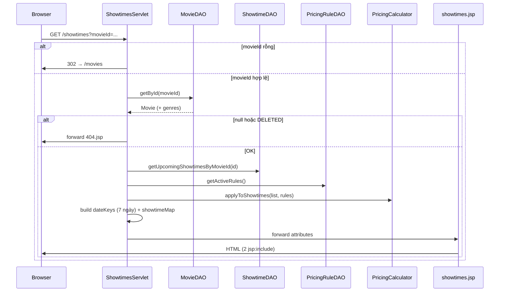

# Module Customer — Tài liệu chi tiết

> **Dự án:** ÉPCINE — Movie Ticket Booking System  
> **Phạm vi:** Source code dành cho khách hàng (CUSTOMER) và luồng đặt vé online  
> **Tổng quan dự án:** [`SOURCE_CODE_OVERVIEW.md`](SOURCE_CODE_OVERVIEW.md)  
> **Spec nghiệp vụ:** [`project_summary_final.md`](project_summary_final.md)  
> **Kế hoạch FR-11:** [`implementation_plan_fr-11.md`](implementation_plan_fr-11.md)  
> **Module liên quan:** [`MANAGER_MODULE_DETAIL.md`](MANAGER_MODULE_DETAIL.md) (phim, suất chiếu, pricing rules)

---

## 1. Tổng quan module Customer

Module Customer phục vụ người dùng có role **CUSTOMER** (và khách chưa đăng nhập cho các màn public). Theo spec (`project_summary_final.md`), nhóm FR Customer gồm FR-06 – FR-20, FR-43, FR-44.

**Trạng thái hiện tại (15/06/2026):** Mới triển khai **FR-11 (View Showtimes)** và **FR-50 (Dynamic Price Display)** ở mức đọc — chưa có checkout, chọn ghế online, thanh toán cổng, loyalty, reviews.

### 1.1 Tính năng đã triển khai

| Tính năng | FR | Trạng thái | Ghi chú |
|-----------|-----|------------|---------|
| Xem lịch chiếu theo phim | FR-11 | ✅ | URL public `/showtimes?movieId=` |
| Hiển thị giá hiệu quả sau pricing rules | FR-50 | ✅ | `PricingCalculator` + `PricingRuleDAO` |
| Tab chọn 7 ngày (zero reload) | FR-11 | ✅ | `showtimes-selector.js` |
| Nhóm suất theo phòng chiếu | FR-11 | ✅ | `Map<ngày, Map<phòng, suất>>` |
| Placeholder thông tin phim (phần trên) | — | 🟡 | `movie-info-placeholder.jsp` — đồng nghiệp mở rộng |
| Duyệt phim / trang chủ | — | ✅ | Thuộc `common/` (`HomeServlet`, `MovieListServlet`) — dùng chung |

### 1.2 Tính năng chưa triển khai

| Tính năng | FR | URL reserve | Ghi chú |
|-----------|-----|-------------|---------|
| Chọn ghế & checkout online | FR-12 – FR-18 | `/checkout` | Chip suất đã link `?showtimeId=` |
| Thanh toán VNPay / MoMo | FR-17 | — | Schema `Payments` có, chưa DAO |
| Lịch sử đặt vé | FR-07 | `/booking-history` | |
| Điểm tích lũy (xem / đổi) | FR-43, FR-44 | `/loyalty` | Config loyalty có ở Admin |
| Đánh giá phim | FR-20 | `/reviews/mine` | Schema `MovieReviews` có |
| Email xác nhận vé | FR-19 | — | `EmailUtil` có sẵn |
| Hủy / hoàn vé online | FR-08 – FR-10 | — | |
| Profile khách hàng | — | `/profile` | AccessControl: mọi role đã login |

> `package-info.java` trong `controller.customer` ghi phạm vi FR-06 – FR-20, FR-43, FR-44 — **chưa có servlet** trong package này; `ShowtimesServlet` đặt ở `controller` vì là public URL.

---

## 2. Danh sách file source liên quan Customer

### 2.1 Controller

```
src/main/java/controller/
├── ShowtimesServlet.java          # /showtimes — FR-11 (public, không cần login)
└── customer/
    └── package-info.java          # Placeholder package — servlet customer-authenticated sẽ thêm sau
```

**Servlet dùng chung (public, phục vụ customer journey):**

| Servlet | URL | Vai trò trong hành trình khách |
|---------|-----|--------------------------------|
| `HomeServlet` | `/home` | Khám phá phim, CTA "Đặt vé" → `/showtimes` |
| `MovieListServlet` | `/movies` | Danh sách phim + filter |
| `ShowtimesServlet` | `/showtimes` | Chọn ngày & suất chiếu |

### 2.2 View (`WEB-INF/views/customer/`)

```
src/main/webapp/WEB-INF/views/customer/
├── showtimes.jsp                              # Wrapper: header + 2 component + footer
├── components/
│   ├── movie-info-placeholder.jsp           # PHẦN TRÊN — thông tin phim (đồng nghiệp)
│   └── showtimes-selector.jsp                 # PHẦN DƯỚI — lịch chiếu (FR-11)
└── .gitkeep
```

**Design reference:**

```
Screen Design/
└── Movie-detail/           # code.html, DESIGN.md, screen.png — Cinematic Premium theme
```

### 2.3 CSS & JS

| File | Mục đích |
|------|----------|
| `css/main.css` | Layout chung, header/footer (kế thừa từ mọi trang) |
| `css/customer-showtimes.css` | Trang lịch chiếu — `.mi-*` (movie info), `.st-*` (showtimes selector), glass panel |
| `js/showtimes-selector.js` | Chuyển tab ngày không reload trang |

Trang load CSS qua `extraCss=customer-showtimes` trong `showtimes.jsp` → `header.jsp`.

### 2.4 DAL & Model

| File | Vai trò với Customer |
|------|----------------------|
| `dal/MovieDAO.java` | `getById()` + `loadGenres()` — chi tiết phim trên trang lịch chiếu |
| `dal/ShowtimeDAO.java` | `getUpcomingShowtimesByMovieId()` — suất từ `GETDATE()`, loại `CANCELLED` |
| `dal/PricingRuleDAO.java` | `getActiveRules()` — rule `status = ACTIVE` cho FR-50 |
| `model/entity/Movie.java` | Entity phim (+ list `genres`) |
| `model/entity/Showtime.java` | Entity suất; field transient `effectivePrice` |
| `model/entity/PricingRule.java` | Entity quy tắc giá động |
| `utils/PricingCalculator.java` | Tính `effectivePrice` runtime |

**Bảng DB liên quan (đã dùng / sẽ dùng):**

| Bảng | Trạng thái DAO | Dùng cho |
|------|----------------|----------|
| `Movies`, `MovieGenres`, `Genres` | ✅ `MovieDAO` | Thông tin phim |
| `Showtimes`, `CinemaRooms` | ✅ `ShowtimeDAO` | Lịch chiếu |
| `PricingRules` | ✅ read-only | Giá động (FR-50) |
| `Seats`, `SeatTypes` | ✅ `SeatDAO` | Chưa gọi từ customer — dùng khi checkout |
| `SeatHolds`, `Bookings`, `BookingSeats` | ✅ `BookingDAO` (staff) | Chưa có luồng online |
| `Payments`, `Tickets` | ❌ | Thanh toán & vé điện tử |
| `Promotions`, `BookingPromotions` | ❌ | Mã giảm giá |
| `MovieReviews` | ❌ | Đánh giá phim |
| `LoyaltyPointsLog` | ❌ | Tích / đổi điểm |

### 2.5 Filter & Access Control

| Path | Yêu cầu | Ghi chú |
|------|---------|---------|
| `/showtimes`, `/showtimes/*` | **Public** | `AccessControl.PUBLIC_PREFIXES` |
| `/movies` | **Public** | |
| `/checkout`, `/booking-history`, `/loyalty`, `/reviews/mine` | **CUSTOMER** + đăng nhập | Servlet chưa có |
| `/profile`, `/profile/*` | Đăng nhập (mọi role) | Servlet chưa có |

---

## 3. Kiến trúc màn hình 2 người (tránh merge conflict)

Màn **chi tiết phim + lịch chiếu** được chia cho **2 developer** làm song song:

```
showtimes.jsp                         ← Wrapper (ít đụng — chỉ layout khung)
    │
    ├─► components/movie-info-placeholder.jsp   ← Developer A: poster, trailer, cast, mô tả
    │
    └─► components/showtimes-selector.jsp         ← Developer B: tab ngày, phòng, chip suất
```

| Quy tắc | Chi tiết |
|---------|----------|
| Dữ liệu chia sẻ | Servlet set `movie` — cả 2 component đọc `${movie.*}` |
| Servlet | Chỉ `ShowtimesServlet` — không cần sửa khi A làm UI phần trên |
| CSS class prefix | `.mi-*` = movie info; `.st-*` = showtimes — tránh đè selector |
| JS | Chỉ `showtimes-selector.js` — không đụng `main.js` |

**Đồng nghiệp (phần trên)** chỉnh `movie-info-placeholder.jsp`.  
**Phần lịch chiếu** nằm trong `showtimes-selector.jsp` + `customer-showtimes.css` (phần `.st-*`).

---

## 4. `ShowtimesServlet` — Luồng xử lý

**File:** `src/main/java/controller/ShowtimesServlet.java`  
**URL:** `GET /showtimes?movieId={uuid}`  
**View:** `/WEB-INF/views/customer/showtimes.jsp`

### 4.1 Sơ đồ luồng



### 4.2 Request attributes

| Attribute | Kiểu | Mô tả |
|-----------|------|-------|
| `movie` | `Movie` | Phim đầy đủ + `genres` (List&lt;String&gt;) |
| `dateKeys` | `List<String>` | 7 key `yyyy-MM-dd` từ hôm nay |
| `dateLabels` | `List<String>` | Nhãn tab: "Hôm nay", "Ngày mai", "Thứ …" |
| `showtimeMap` | `Map<String, Map<String, List<Showtime>>>` | Ngày → tên phòng → danh sách suất |
| `genreList` | `List<Genre>` | Cho dropdown thể loại trên `header.jsp` |

### 4.3 Query suất chiếu

`ShowtimeDAO.getUpcomingShowtimesByMovieId()`:

- `start_time >= GETDATE()`
- `status <> 'CANCELLED'` (gồm SCHEDULED, OPEN, SOLD_OUT, FINISHED)
- JOIN `Movies`, `CinemaRooms` — có `roomName` denormalized trên `Showtime`

### 4.4 Nhóm theo ngày & phòng

- Chỉ gán suất vào **7 ngày tab** (suất sau ngày thứ 7 không hiện trên UI — có thể mở rộng sau).
- Trong mỗi ngày: `LinkedHashMap` theo `roomName` — thứ tự phòng theo suất xuất hiện đầu tiên.
- Suất trong phòng giữ thứ tự `ORDER BY start_time` từ SQL.

### 4.5 Điểm vào từ UI hiện có

| Nguồn | Link |
|-------|------|
| `common/home.jsp` | `/showtimes?movieId=${movie.id}` (hero, tab phim) |
| `common/movies.jsp` | Nút "Đặt vé" / "Đặt vé sớm" |

---

## 5. Dynamic Pricing (FR-50)

### 5.1 `PricingRuleDAO`

```java
List<PricingRule> getActiveRules()
// WHERE status = 'ACTIVE' ORDER BY priority DESC, created_at ASC
```

Chỉ **đọc** — CRUD pricing rules cho Manager (FR-49) chưa có UI.

### 5.2 `PricingCalculator`

**Công thức** (theo `project_summary_final.md`):

```
effectivePrice = base_price × (1 + Σ% / 100) + Σfixed
```

- Duyệt **tất cả** rule ACTIVE khớp điều kiện — **cộng dồn** (priority chỉ ảnh hưởng thứ tự load, không chọn 1 rule).
- Kết quả gán vào `Showtime.effectivePrice` (transient, không persist DB).
- Làm tròn `setScale(0, HALF_UP)` — đơn vị VND.

### 5.3 Điều kiện rule (`condition_type`)

| Loại | Kiểm tra |
|------|----------|
| `DAY_OF_WEEK` | `day_of_week` CSV `"6,7"` — Thứ 2=1 … Chủ nhật=7 (Java `DayOfWeek`) |
| `TIME_RANGE` | Giờ bắt đầu suất ∈ [`time_from`, `time_to`] |
| `DATE_RANGE` | Ngày chiếu ∈ [`date_from`, `date_to`] |
| `SPECIFIC_DATE` | Ngày chiếu = `date_from` |

### 5.4 Kiểu điều chỉnh (`adjustment_type`)

| Loại | `adjustment_value` |
|------|-------------------|
| `PERCENTAGE` | Cộng vào Σ% (VD: `10` = +10%, `-5` = −5%) |
| `FIXED_AMOUNT` | Cộng vào Σfixed VND (VD: `10000` = +10.000đ) |

### 5.5 Ví dụ kiểm tra

| base_price | Rule | Kết quả |
|------------|------|---------|
| 80.000đ | T7/CN `FIXED_AMOUNT +10.000` | 90.000đ cuối tuần |
| 80.000đ | Khung 21h–23h `PERCENTAGE +10` | 88.000đ |

> Giá hiển thị trên chip là **giá gốc suất** sau pricing rules, **chưa** nhân `seat_multiplier` — nhân hệ số loại ghế sẽ áp ở bước chọn ghế (checkout).

---

## 6. View Layer — Chi tiết JSP

### 6.1 `showtimes.jsp` (wrapper)

```jsp
<c:set var="extraCss" value="customer-showtimes"/>
<%@ include file="common/header.jsp" %>
<div class="movie-detail-wrapper">
    <jsp:include page="components/movie-info-placeholder.jsp"/>
    <jsp:include page="components/showtimes-selector.jsp"/>
</div>
<%@ include file="common/footer.jsp" %>
```

### 6.2 `movie-info-placeholder.jsp` (phần trên)

**Hiện có (placeholder):**

- Banner `backdropUrl` / fallback `posterUrl`
- Poster 2:3 + badge rating
- Title, age rating, thời lượng, ngày công chiếu, thể loại
- Đạo diễn, mô tả (hoặc text placeholder)

**Đồng nghiệp có thể thêm** (theo `Screen Design/Movie-detail/`):

- Nút Play trailer (`movie.trailerUrl`)
- Cast horizontal scroll
- Rating IMDb / Rotten Tomatoes (nếu có field)
- Section "You May Also Like"

**Biến JSP sẵn có:** `${movie.title}`, `${movie.description}`, `${movie.director}`, `${movie.posterUrl}`, `${movie.backdropUrl}`, `${movie.genres}`, `${movie.averageRating}`, …

### 6.3 `showtimes-selector.jsp` (phần dưới)

- Tiêu đề "Chọn suất chiếu"
- 7 nút tab ngày (`.st-date-tab`)
- Panel theo ngày (`.st-day-panel`) — ẩn/hiện bằng JS
- Mỗi phòng: tiêu đề + danh sách chip
- Chip: `HH:mm | {giá} đ`
  - Link: `/checkout?showtimeId={id}` (checkout chưa implement)
  - `SOLD_OUT`: chip disabled, gạch ngang
- Empty state: "Không có suất chiếu trong ngày này"

---

## 7. CSS — `customer-showtimes.css`

| Prefix | Vùng | Tham chiếu design |
|--------|------|-------------------|
| `.mi-*` | Movie info — banner, poster, meta | Movie-detail hero + grid |
| `.st-*` | Showtimes — glass panel, tabs, chips | Date & Time Selectors |

Đặc điểm chính:

- Nền glass: `rgba(18,18,18,0.6)` + `backdrop-filter: blur(24px)`
- Tab ngày active: `#e50914` (Cinematic Red)
- Chip suất: viền trắng mờ, hover sáng hơn
- Responsive: mobile stack poster + căn giữa meta

---

## 8. JavaScript — `showtimes-selector.js`

- IIFE, không pollute global
- Click `.st-date-tab` → toggle `.st-date-tab--active` + `.st-day-panel--active`
- Cập nhật `aria-selected`, attribute `hidden` cho a11y
- **Không** gọi API — toàn bộ dữ liệu render server-side lần đầu

---

## 9. Entity bổ sung

### 9.1 `PricingRule`

| Field Java | Cột DB | Ghi chú |
|------------|--------|---------|
| `ruleName` | `rule_name` | |
| `conditionType` | `condition_type` | DAY_OF_WEEK, TIME_RANGE, … |
| `dayOfWeek` | `day_of_week` | CSV, VD `"6,7"` |
| `timeFrom` / `timeTo` | `time_from` / `time_to` | `java.sql.Time` |
| `dateFrom` / `dateTo` | `date_from` / `date_to` | |
| `adjustmentType` | `adjustment_type` | PERCENTAGE, FIXED_AMOUNT |
| `adjustmentValue` | `adjustment_value` | `BigDecimal` |
| `priority` | `priority` | |
| `status` | `status` | ACTIVE / INACTIVE |

### 9.2 `Showtime.effectivePrice`

- Kiểu `BigDecimal`, **không** map từ DB
- Set bởi `PricingCalculator.applyToShowtimes()` trước khi forward JSP
- JSP fallback: `${st.effectivePrice != null ? st.effectivePrice : st.basePrice}`

---

## 10. Lộ trình triển khai tiếp theo (gợi ý thứ tự)

```
FR-11 ✅  →  FR-12 (chọn ghế)  →  FR-16–18 (checkout + payment)  →  FR-07 (lịch sử)
                ↓
         SeatHolds + BookingDAO (ONLINE)
                ↓
         FR-19 (email) · FR-22 (promo) · FR-43 (loyalty redeem)
```

| Bước | FR | File / package gợi ý |
|------|-----|----------------------|
| 1 | FR-12 | `controller.customer.CheckoutServlet` → `/checkout` |
| 2 | FR-12 | `views/customer/checkout.jsp` + tái dùng logic ghế từ `SeatDAO` |
| 3 | FR-16–18 | `PaymentDAO`, callback VNPay/MoMo |
| 4 | FR-07 | `BookingHistoryServlet` → `/booking-history` |
| 5 | FR-20 | `MovieReviewDAO` + servlet reviews |
| 6 | FR-43–44 | `LoyaltyServlet` → `/loyalty` |

**Gợi ý giữ modular:** Checkout có thể tách `seat-map.jsp` component tương tự FR-11.

---

## 11. Kiểm tra thủ công

### 11.1 Truy cập trang

1. Chạy Tomcat + DB có seed showtimes.
2. Mở `/home` → chọn phim → "Đặt vé" hoặc trực tiếp `/showtimes?movieId=<uuid>`.
3. Thiếu `movieId` → redirect `/movies`.
4. `movieId` sai → `404.jsp`.

### 11.2 Lịch chiếu & phòng

1. Chọn từng tab ngày — không reload trang.
2. Cùng ngày, suất cùng `room_name` nằm dưới một tiêu đề phòng.
3. Ngày không có suất → empty state.

### 11.3 Giá động

1. INSERT `PricingRules` ACTIVE (VD: phụ thu cuối tuần +10.000đ).
2. So sánh chip T2–T6 vs T7/CN cùng `base_price`.

### 11.4 Tích hợp 2 người

1. Sửa nội dung `movie-info-placeholder.jsp` (thêm HTML tùy ý).
2. Xác nhận `showtimes-selector.jsp` vẫn hoạt động, không vỡ layout.

### 11.5 Sold out

- Suất `status = SOLD_OUT` → chip disabled, không click được.

---

## 12. Hạn chế & ghi chú kỹ thuật

1. **`/checkout` chưa có servlet** — click chip sẽ 404 hoặc bị `RoleFilter` redirect login (CUSTOMER-only path).
2. **Pricing rules** — chỉ đọc ACTIVE; Manager chưa có UI CRUD (FR-49).
3. **Không seed `PricingRules`** trong `create_database.sql` — cần INSERT thủ công để test FR-50.
4. **Giá chip** = `base_price` ± rules; chưa có `seat_multiplier` (hiển thị khi chọn ghế).
5. **Suất sau ngày thứ 7** không hiển thị — chỉ 7 tab cố định.
6. **`ShowtimesServlet` ở `controller`**, không `controller.customer` — servlet authenticated sẽ vào package customer sau.
7. **Không CSRF** — các form customer POST tương lai cần cân nhắc thêm token.

---

## 13. Liên kết tài liệu

| Tài liệu | Nội dung |
|----------|----------|
| [`SOURCE_CODE_OVERVIEW.md`](SOURCE_CODE_OVERVIEW.md) | Tổng quan toàn repo |
| [`implementation_plan_fr-11.md`](implementation_plan_fr-11.md) | Spec triển khai FR-11 |
| [`MANAGER_MODULE_DETAIL.md`](MANAGER_MODULE_DETAIL.md) | Nguồn dữ liệu phim, suất, phòng |
| [`Screen Design/Movie-detail/DESIGN.md`](Screen%20Design/Movie-detail/DESIGN.md) | Design system Cinematic Premium |
| [`project_summary_final.md`](project_summary_final.md) | FR đầy đủ + luồng đặt vé online |

---

*Tài liệu được tổng hợp từ source code thực tế trong repo, cập nhật 15/06/2026.*
