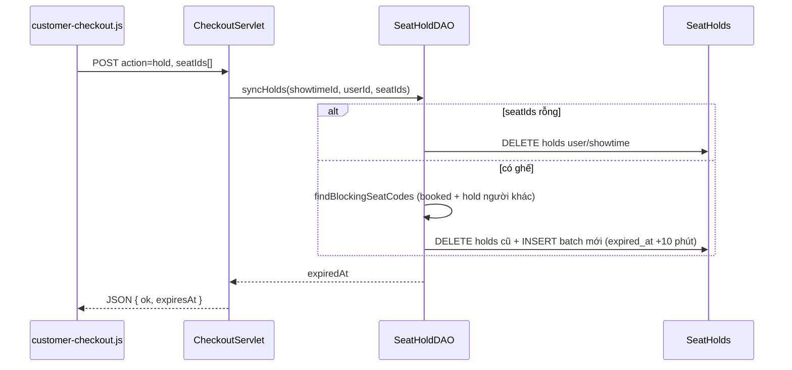

# Manager — Phòng chiếu · Loại ghế · Suất chiếu

> **Dự án:** ÉPCINE — Movie Ticket Booking System  
> **Phạm vi:** Ba module vận hành rạp do Manager quản lý (FR-25, FR-26, FR-27)  
> **Tổng quan:** [`SOURCE_CODE_OVERVIEW.md`](SOURCE_CODE_OVERVIEW.md) · [`MANAGER_MODULE_DETAIL.md`](MANAGER_MODULE_DETAIL.md)  
> **Cập nhật:** 23/06/2026 — tổng hợp từ source code thực tế

---

## 1. Tổng quan

Ba tính năng này tạo thành **chuỗi phụ thuộc** khi vận hành rạp:

```
Loại ghế (SeatTypes)  →  Layout ghế trong phòng (Seats)  →  Suất chiếu (Showtimes)
         FR-27                    FR-26                           FR-25
```

| Module | FR | URL chính | Trạng thái |
|--------|-----|-----------|------------|
| Quản lý loại ghế | FR-27 | `/manager/seat-types` | ✅ CRUD + guard xóa |
| Quản lý phòng chiếu | FR-26 | `/manager/rooms`, `/manager/rooms/detail` | ✅ Tạo / đổi tên / toggle / layout; ❌ xóa phòng |
| Quản lý suất chiếu | FR-25 | `/manager/showtimes` | ✅ CRUD + overlap + booking lock |

**Role:** `MANAGER` và `ADMIN` (servlet `isAuthorized()` + `AccessControl` cho prefix `/manager/*`).

**Downstream:** Layout ghế và suất chiếu được dùng bởi Customer (`/checkout`, `/showtimes`) và Staff (`/staff/counter`).

---

## 2. Kiến trúc chung

### 2.1 Mô hình MVC

```
Browser (JSP + JS client-side)
        │
        ▼
┌───────────────────────────────────────┐
│  Filter: Encoding → Auth → Role        │
│  (MANAGER / ADMIN cho /manager/*)     │
└───────────────────────────────────────┘
        │
        ▼
┌───────────────────────────────────────┐
│  Servlet (controller.manager)         │
│  validate → DAO → redirect / forward  │
└───────────────────────────────────────┘
        │
        ▼
┌───────────────────────────────────────┐
│  DAL: CinemaRoomDAO, SeatTypeDAO,     │
│       SeatDAO, ShowtimeDAO, MovieDAO   │
└───────────────────────────────────────┘
        │
        ▼
   SQL Server: CinemaRooms, SeatTypes, Seats, Showtimes
```

### 2.2 Phương pháp code lặp lại trong 3 module

| Pattern | Mô tả |
|---------|--------|
| **Một servlet — nhiều URL** | `ManageCinemaRoomServlet` map 4 path qua `@WebServlet(urlPatterns = {...})`; routing theo `getServletPath()` |
| **PRG (Post-Redirect-Get)** | POST xong → `sendRedirect` + query `?success=` / `?error=` — tránh submit lại |
| **Form + bảng 2 cột** | JSP `mgr-grid`: card trái = form create/edit; card phải = danh sách (seat-types, showtimes) |
| **Guard trong servlet** | Validate tham số, duplicate check, FK/usage guard trước khi gọi DAO |
| **Guard trong DAO** | `SeatTypeDAO.delete` ném `IllegalStateException` nếu `countUsedIn > 0` |
| **Auth kép** | `RoleFilter` (prefix) + `isAuthorized()` trong servlet (`MANAGER` hoặc `ADMIN`) |
| **Lỗi validation** | Redirect + flash query **hoặc** `forwardWithError` giữ input (`inputTypeName`, `inputMovieId`, …) |
| **Client filter** | Showtimes: lọc bảng bằng `data-*` + JS; Phòng chiếu: lọc card theo status |
| **Rich client editor** | Layout ghế: state trong `manager-seat-layout.js`, persist qua JSON POST |

### 2.3 Luồng phụ thuộc dữ liệu

```mermaid
erDiagram
    SeatTypes ||--o{ Seats : "seat_type_id"
    CinemaRooms ||--o{ Seats : "room_id"
    CinemaRooms ||--o{ Showtimes : "room_id"
    Movies ||--o{ Showtimes : "movie_id"
    Showtimes ||--o{ Bookings : "showtime_id"

    SeatTypes {
        uuid id PK
        string type_name UK
        decimal price_multiplier
    }
    CinemaRooms {
        uuid id PK
        string room_name UK
        int capacity
        string status
    }
    Seats {
        uuid id PK
        string seat_code UK_per_room
        string seat_row
        int seat_column
    }
    Showtimes {
        uuid id PK
        datetime start_time
        datetime end_time
        decimal base_price
        string status
    }
```

---

## 3. Danh sách file liên quan

### 3.1 Controller

| File | URL |
|------|-----|
| `controller/manager/ManageCinemaRoomServlet.java` | `/manager/rooms`, `/detail`, `/update`, `/save-layout` |
| `controller/manager/ManageSeatTypeServlet.java` | `/manager/seat-types` |
| `controller/manager/ManageShowtimeServlet.java` | `/manager/showtimes` |

### 3.2 DAL & Model

| File | Bảng / vai trò |
|------|----------------|
| `dal/CinemaRoomDAO.java` | `CinemaRooms` |
| `dal/SeatTypeDAO.java` | `SeatTypes` |
| `dal/SeatDAO.java` | `Seats` — `getSeatsByRoom`, `saveLayout`, **`getSeatsForShowtime`** (availability + hold) |
| `dal/SeatHoldDAO.java` | `SeatHolds` — FR-13: **`syncHolds`**, `holdSeats`, `releaseHolds`, `findBlockingSeatCodes` |
| `dal/ShowtimeDAO.java` | `Showtimes` |
| `dal/MovieDAO.java` | `getSchedulableMovies()` — dropdown suất chiếu |
| `model/entity/CinemaRoom.java` | Entity phòng |
| `model/entity/SeatType.java` | Entity loại ghế |
| `model/entity/Seat.java` | Entity ghế (+ field runtime cho checkout) |
| `model/entity/Showtime.java` | Entity suất (+ denormalized movie/room) |

### 3.3 Utils dùng chung

| File | Vai trò |
|------|---------|
| `utils/SeatLayoutJsonUtil.java` | JSON layout ↔ `List<Seat>`; gap qua `seat_column` nhảy số |
| `utils/SessionUtil.java` | `created_by` khi tạo suất chiếu |
| `js/seat-type-colors.js` | Màu preset + HSL động cho loại ghế (manager + customer + staff) |

### 3.4 View, CSS, JS

| Màn hình | JSP | CSS | JS |
|----------|-----|-----|-----|
| Danh sách phòng | `cinema-room-list.jsp` | `manager-auditoriums.css` | `manager-auditoriums.js` |
| Layout ghế | `cinema-room-detail.jsp` | `manager-auditoriums.css`, `manager-seat-layout.css` | `manager-seat-layout.js`, `seat-type-colors.js` |
| Loại ghế | `seat-type-list.jsp` | `manager-movies.css` (class `.mgr-*`) | `seat-type-colors.js` |
| Suất chiếu | `showtime-list.jsp` | `manager-showtimes.css` | `manager-showtimes.js` |

**Runtime chọn ghế (dùng layout manager đã lưu):**

| Màn hình | JSP / JS | Ghi chú |
|----------|----------|---------|
| Customer checkout | `customer/components/seat-map.jsp`, `customer-checkout.js` | SSR gap + poll hold |
| Staff counter | `counter-booking.js` | AJAX render gap từ `seatColumn` |

**Design reference:** `Screen Design/Cinema Auditoriums/`, `Seat Layout/`, `Showtime Management/`

---

## 4. Quản lý loại ghế (FR-27)

### 4.1 URL & hành động

| URL | Method | Hành vi |
|-----|--------|---------|
| `/manager/seat-types` | GET | Danh sách + form thêm (hoặc form sửa nếu `?action=edit&id=`) |
| `/manager/seat-types` | POST | Tạo mới (mặc định) |
| `/manager/seat-types` | POST `action=update` | Cập nhật |
| `/manager/seat-types` | POST `action=delete` | Xóa (guard usage) |

### 4.2 Logic servlet

- **Validate:** `typeName` bắt buộc, ≤50 ký tự; `priceMultiplier` > 0 (`BigDecimal`)
- **Duplicate:** `isDuplicate` / `isDuplicateExcluding` — so sánh `LOWER(type_name)`
- **Persist:** `create` / `update` lưu `type_name` dạng **UPPERCASE**
- **Delete:** `countUsedIn(id)` — nếu ghế trong `Seats` đang dùng → redirect `?error=in_use`
- **Usage map:** mỗi GET build `usageMap` (id → số ghế) cho cột "Ghế đang dùng"

### 4.3 Màn hình (`seat-type-list.jsp`)

| Vùng | Nội dung |
|------|----------|
| Breadcrumb | Trang chủ › Quản lý Loại ghế |
| Alert | `success=created/updated/deleted`, `error=in_use` |
| **Cột trái — Form** | Thêm loại ghế **hoặc** Sửa (toggle qua `editSeatType`): tên, hệ số giá, mô tả |
| **Cột phải — Bảng** | STT, tên (+ color swatch), hệ số `×1.50`, ghế đang dùng, Sửa / Xóa |

Swatch màu: class `slt-type-swatch--{typeKey}` + `seat-type-colors.js` (preset REGULAR/VIP/COUPLE/SWEETBOX, custom → HSL).

### 4.4 Seed mặc định

`REGULAR` (×1.0), `VIP` (×1.5), `COUPLE` (×2.0), `SWEETBOX` (×2.5) — trong `create_database.sql`.

---

## 5. Quản lý phòng chiếu (FR-26)

### 5.1 URL & hành động

| URL | Method | View / kết quả |
|-----|--------|----------------|
| `/manager/rooms` | GET | `cinema-room-list.jsp` — grid + panel preview |
| `/manager/rooms` | POST `roomName` | Tạo phòng → redirect `/detail?id=&success=created` |
| `/manager/rooms/detail?id=` | GET | `cinema-room-detail.jsp` — editor layout |
| `/manager/rooms/update` | POST `action=rename` | Đổi tên phòng |
| `/manager/rooms/update` | POST `action=toggle` + `status` | ACTIVE / MAINTENANCE / INACTIVE |
| `/manager/rooms/save-layout` | POST `layoutJson` | Parse JSON → `SeatDAO.saveLayout` |

### 5.2 Logic servlet (`ManageCinemaRoomServlet`)

**Tạo phòng**

- Validate tên (không rỗng, ≤100 ký tự, unique `existsByName`)
- `CinemaRoomDAO.create` → `capacity=0`, `status=ACTIVE`, `OUTPUT INSERTED.id`

**Đổi tên / toggle**

- `rename`: `existsByNameExcluding`
- `toggle` → MAINTENANCE hoặc INACTIVE: guard `countUpcomingShowtimes(roomId) > 0` (suất SCHEDULED/OPEN/SOLD_OUT trong tương lai)
- Param `from=detail` quyết định redirect về detail hay list

**Lưu layout**

1. `SeatTypeDAO.getTypeKeyToIdMap()` — map `regular` → UUID
2. `SeatLayoutJsonUtil.parseSeats(roomId, layoutJson, typeMap)`
3. `SeatDAO.saveLayout(roomId, seats)` trong transaction

**Meta hiển thị (UI only)**

- `deriveDisplayMeta(room)` — suy ra tag IMAX/4DX từ tên phòng; projection/audio chip **không lưu DB**

### 5.3 `SeatDAO.saveLayout` — chiến lược persist

```
BEGIN TRANSACTION
  DELETE Seats WHERE room_id = ? AND status <> 'BROKEN'
  FOR EACH seat in layout:
    TRY UPDATE Seats SET ... WHERE seat_code = ? AND status = 'BROKEN'  -- khôi phục ghế hỏng
    ELSE INSERT new seat (ACTIVE)
  UPDATE CinemaRooms SET capacity = COUNT(ACTIVE seats)
COMMIT
```

- Ghế `BROKEN` **không bị xóa** khi save layout — có thể tái kích hoạt nếu cùng `seat_code`
- `capacity` trên `CinemaRooms` đồng bộ sau mỗi lần lưu

### 5.4 JSON layout (`SeatLayoutJsonUtil`)

**Cấu trúc:**

```json
{
  "rows": [
    {
      "label": "A",
      "cells": [
        { "kind": "seat", "type": "vip", "code": "A1", "col": 1 },
        { "kind": "gap" },
        { "kind": "seat", "type": "regular", "code": "A3", "col": 3 }
      ]
    }
  ]
}
```

- `gap` → tăng `seat_column` nhưng không tạo row `Seats` (lối đi)
- `type` lowercase khớp `SeatTypes.type_name`
- Mã ghế trùng trong layout → `IllegalArgumentException`

### 5.5 Màn hình danh sách (`cinema-room-list.jsp`)

| Vùng | Class prefix | Chức năng |
|------|--------------|-----------|
| Header | `.aud-*` | Tiêu đề, form nhanh "Thêm phòng chiếu" |
| Filter bar | `.aud-filter` | Tab: Tất cả / Hoạt động / Bảo trì / Ngưng (JS client) |
| **Grid trái** | `.aud-room-card` | Card từng phòng: tên, tag IMAX, capacity, status select, chip projection/audio, occupancy (placeholder), nút Chi tiết |
| Card thêm | `.aud-room-card--add` | Form inline tạo phòng |
| **Panel phải** | `.aud-detail` | Preview phòng đang chọn: specs, link sang detail (JS `manager-auditoriums.js`) |

**JS (`manager-auditoriums.js`):** click card → highlight + cập nhật panel phải; filter ẩn card theo `data-status`; không gọi API.

### 5.6 Màn hình layout (`cinema-room-detail.jsp`)

| Vùng | Mô tả |
|------|--------|
| Breadcrumb | Home › Quản lý Phòng chiếu › `{roomName}` |
| Summary bar | Tên, badge trạng thái, capacity DB, form đổi tên, select trạng thái |
| **Sidebar trái** | Danh sách loại ghế (từ `seatTypeList`); cấu hình Snap grid / Tự đánh số; nút Hủy thay đổi |
| **Workspace** | Màn hình "MÀN HÌNH", lưới ghế `#sltGrid`, toolbar công cụ |
| **Toolbar** | Chọn · Thêm ghế · Lối đi · Xóa; đếm hàng/ghế |
| Header editor | Undo / Redo / Clear; tổng ghế; **Lưu layout** |

**Công cụ editor (`manager-seat-layout.js`):**

| Tool | Hành vi |
|------|---------|
| `select` | Chọn ô để đổi loại / xóa |
| `add` | Click ô trống → đặt ghế loại đang chọn |
| `gap` | Đặt lối đi (cell `kind: gap`) |
| `delete` | Xóa ghế hoặc gap |

- State: mảng `rows[]` trong memory; undo/redo stack
- Load ban đầu: `window.SLT_CONFIG.initialLayout` từ `${layoutJson}` (server build từ DB)
- Save: serialize JSON → hidden input `#sltLayoutJsonInput` → submit `#sltSaveForm`

### 5.7 Phương pháp render hàng ghế

Layout ghế manager tạo ra được **dùng chung** cho Customer checkout, Staff counter và poll JSON — khác nhau ở **cách vẽ UI**, nhưng cùng dựa trên `seat_row` + `seat_column` trong bảng `Seats`.

#### 5.7.1 Ba tầng render

```
┌─────────────────────────────────────────────────────────────────┐
│ Tầng 1 — Editor (manager-seat-layout.js)                        │
│ state.rows[] → render() → DOM .slt-row (imperative, full rebuild)│
└────────────────────────────┬────────────────────────────────────┘
                             │ POST layoutJson
                             ▼
┌─────────────────────────────────────────────────────────────────┐
│ Tầng 2 — Persist (SeatLayoutJsonUtil + SeatDAO.saveLayout)      │
│ cells[] + gap → seat_column nhảy số; gap không có row Seats     │
└────────────────────────────┬────────────────────────────────────┘
                             │ getSeatsByRoom / getSeatsForShowtime
                             ▼
┌─────────────────────────────────────────────────────────────────┐
│ Tầng 3 — Runtime (JSP server-side hoặc JS client-side)          │
│ Nhóm theo seat_row; chèn gap khi seat_column > expectedCol      │
└─────────────────────────────────────────────────────────────────┘
```

| Tầng | File | Input | Output DOM |
|------|------|-------|------------|
| Editor | `manager-seat-layout.js` | `state.rows[{label, cells[]}]` | `.slt-row` > `.slt-row-label` + `.slt-row-cells` |
| Checkout (SSR) | `seat-map.jsp` | `seatsByRow` (LinkedHashMap) | `.ck-seat-row` + `.ck-seat-gap` |
| Checkout (poll) | `customer-checkout.js` | JSON rows (chỉ cập nhật trạng thái) | Giữ DOM ban đầu, toggle class |
| Staff counter | `counter-booking.js` | JSON `rows[]` từ servlet | `.pos-seat-row` + `.pos-seat-gap` |

#### 5.7.2 Editor — `render()` trong `manager-seat-layout.js`

**State in-memory:**

```javascript
state.rows = [
  { label: "A", cells: [
      { kind: "seat", id, type: "vip", code: "A1" },
      { kind: "gap", id },
      { kind: "seat", id, type: "regular", code: "A3" }
  ]}
]
```

**Thuật toán `render()`** (mỗi lần thay đổi → `gridEl.innerHTML = ''` rồi build lại):

1. Với mỗi `row` trong `state.rows`:
   - Tạo `.slt-row`
   - Nhãn hàng `.slt-row-label` = `row.label` (A–K, tối đa 11 hàng qua `nextRowLabel()`)
   - Vòng `row.cells.forEach`:
     - `kind === 'gap'` → `<div class="slt-gap">` (lối đi, không phải ghế)
     - `kind === 'seat'` → `<button class="slt-seat slt-seat--{type}">` + icon (couple/sweetbox) hoặc số ghế nếu bật **Tự đánh số**
   - Hàng rỗng → nút `.slt-row-empty` (hint theo tool đang chọn)
   - Có cell + tool `add`/`gap` → nút `.slt-row-append` (+) cuối hàng
   - Nếu >1 hàng → nút `.slt-row-remove` xóa cả hàng

**Đánh số ghế tự động:** `nextSeatCode(rowIdx)` — lấy prefix hàng + `(max số trong code hiện tại) + 1`, VD hàng A đã có A1,A2 → ghế mới là A3.

**Load ban đầu:**

| Điều kiện | Layout khởi tạo |
|-----------|-----------------|
| Có `layoutJson` từ DB | `prepareRows(cfg.layoutJson.rows)` |
| Phòng mới (`dbSeatCount === 0`) | Thử `localStorage` draft → không có thì `demoLayout()` (3 hàng mẫu) |
| Phòng cũ nhưng chưa có ghế DB | `emptyLayout()` (A,B,C rỗng) |

**Round-trip DB ↔ editor:** `SeatLayoutJsonUtil.buildLayoutJson(seats)` khi GET detail — duyệt `seat_column`, chèn `{kind:gap}` khi cột nhảy số (VD cột 1,3 → gap ở giữa).

#### 5.7.3 Persist — `seat_column` mã hóa lối đi

`SeatLayoutJsonUtil.parseSeats()` duyệt `cells` theo thứ tự trái→phải, biến `col` tăng dần:

| Cell | Hành vi |
|------|---------|
| `gap` | `col++` only — **không** INSERT `Seats` |
| `seat` | INSERT với `seat_row = label`, `seat_column = col`, rồi `col++` |

Ví dụ hàng A: ghế · gap · ghế → DB lưu A1 (`col=1`), A3 (`col=3`) — khoảng trống cột 2 thể hiện lối đi.

#### 5.7.4 Runtime — tái tạo gap từ `seat_column`

Sau khi manager lưu layout, mọi màn chọn ghế **không** đọc JSON layout — chỉ đọc flat list `Seats` đã ORDER BY `seat_row, seat_column`.

**Nhóm hàng** (`CheckoutServlet.groupByRow`):

```java
Map<String, List<Seat>> map = new LinkedHashMap<>();
for (Seat s : seats) {
    map.computeIfAbsent(s.getSeatRow(), k -> new ArrayList<>()).add(s);
}
```

**Chèn gap (JSP `seat-map.jsp` và JS `counter-booking.js` — cùng logic):**

```
expectedCol = 1
for each seat in row (đã sort theo seat_column):
    while expectedCol < seat.seatColumn:
        append <span class="*-seat-gap">
        expectedCol++
    append seat button
    expectedCol = seat.seatColumn + 1
```

Customer hiển thị **số cột** trên ghế (`seat.seatColumn`); Staff hiển thị **mã ghế** (`seatCode`).

**Poll JSON checkout** (`GET ?action=seats`) trả cấu trúc:

```json
[
  { "rowName": "A", "seats": [
      { "id", "seatCode", "seatColumn", "available", "heldByMe" }
  ]}
]
```

`customer-checkout.js` **không re-render hàng** — chỉ cập nhật class `available` / `held` / `sold` trên nút có sẵn (poll 2 giây).

#### 5.7.5 So sánh nhanh

| Khía cạnh | Manager editor | Customer checkout | Staff counter |
|-----------|----------------|-------------------|---------------|
| Gap trong UI | Object `kind:gap` trong mảng | `<span class="ck-seat-gap">` từ `seat_column` | `<span class="pos-seat-gap">` |
| Re-render | Full mỗi thao tác | SSR lần đầu; poll chỉ đổi trạng thái | Full khi đổi suất (AJAX) |
| Màu loại ghế | `slt-seat--{type}` + `SeatTypeColors` | `ck-seat--{typeKey}` | `pos-seat--{type}` |
| Ghế rộng (couple) | class `slt-seat--wide` | CSS theo type | — |

---

### 5.8 Giữ ghế tạm thời (FR-13) — sau layout & suất chiếu

Manager **không có màn giữ ghế** — nhưng layout phòng + suất chiếu manager tạo là **điều kiện tiên quyết** cho cơ chế giữ ghế khi khách đặt vé online.

#### 5.8.1 Hai giai đoạn chặn ghế

```
Giai đoạn 1 — Click chọn ghế (checkout)
    POST /checkout  action=hold
    → SeatHolds (10 phút, theo showtime_id + seat_id + user_id)

Giai đoạn 2 — "Tiếp tục thanh toán"
    POST /checkout (form)
    → Bookings PENDING + BookingSeats
    → releaseHolds (hold nhường cho booking)
```

| Nguồn chặn | Bảng | Phạm vi |
|------------|------|---------|
| Đã đặt / đang thanh toán | `Bookings` + `BookingSeats` | `PENDING`, `CONFIRMED` cùng `showtime_id` |
| Đang giữ tạm | `SeatHolds` | `expired_at > GETDATE()`, cùng `showtime_id` + `seat_id` |

`SeatDAO.getSeatsForShowtime(showtimeId, userId)` — ghế bị hold bởi **user khác** → `available = 0`; hold của **chính user** → `heldByMe = 1`, vẫn chọn được trên sơ đồ.

#### 5.8.2 Luồng `syncHolds` (mỗi lần toggle ghế)



**`SeatHoldDAO` chi tiết:**

| Method | Mô tả |
|--------|--------|
| `HOLD_MINUTES` | **10** phút |
| `syncHolds` | Danh sách rỗng → `releaseHolds`; có ghế → `holdSeats` |
| `holdSeats` | Transaction: xóa hold cũ user → batch INSERT; UK violation → `SeatHoldException` |
| `findBlockingSeatCodes` | JOIN `Seats` + `Showtimes` (cùng `room_id`) — kiểm tra booking + hold người khác |
| `getActiveHoldExpiry` | `MAX(expired_at)` — countdown trên checkout |
| `getHeldSeatIds` | Khôi phục selection khi reload trang checkout |
| `deleteExpiredHolds` | Dọn row hết hạn (gọi trước khi hold mới) |

#### 5.8.3 UI giữ ghế trên checkout

| Thành phần | Hành vi |
|------------|---------|
| `customer-checkout.js` | Mỗi toggle ghế → POST `action=hold` với `seatIds[]` |
| `#ckHoldCountdown` | Countdown từ `data-hold-expires` (server trả `expiresAt`) |
| `seat-map.jsp` | Ghế `heldByCurrentUser` → class `ck-seat--held ck-seat--selected` |
| Poll 2s | `heldByMe` true → `markHeld`; false + unavailable → `markSold`; available lại → `markAvailable` |

**Ràng buộc liên quan manager:**

- Ghế phải `status = ACTIVE` trong phòng manager đã layout
- Suất chiếu phải trỏ `room_id` có layout; phòng `INACTIVE`/`MAINTENANCE` không xuất hiện khi tạo suất
- Có đơn `PENDING` cùng suất → checkout khóa chọn ghế mới (`pendingBookingId`)

#### 5.8.4 Staff counter — không dùng SeatHolds

`/staff/counter` gọi `SeatDAO.getSeatsForShowtime(showtimeId)` **không truyền userId** — mọi hold đều hiện unavailable. Staff chọn ghế trực tiếp → `createOfflineBooking` (không qua hold AJAX).

> Chi tiết đầy đủ luồng customer: [`CUSTOMER_MODULE_DETAIL.md`](CUSTOMER_MODULE_DETAIL.md) §6.4, §12.4.

### 5.9 Hạn chế

- ❌ **Không có xóa phòng** (hard/soft delete)
- Meta IMAX/4DX, occupancy % trên list — **chỉ UI**, chưa nối DB thật
- Phòng `MAINTENANCE` / `INACTIVE` không xuất hiện trong dropdown suất chiếu (`getActiveRooms`)

---

## 6. Quản lý suất chiếu (FR-25)

### 6.1 URL & hành động

| URL | Method | Hành vi |
|-----|--------|---------|
| `/manager/showtimes` | GET | Form + bảng; `?action=edit&id=` mở form sửa |
| `/manager/showtimes` | POST | Tạo suất mới (`status=SCHEDULED`) |
| `/manager/showtimes` | POST `action=update` | Sửa suất |
| `/manager/showtimes` | POST `action=delete` | Hard delete (chỉ khi không có booking) |

### 6.2 Logic servlet (`ManageShowtimeServlet`)

**Tạo suất**

1. Parse `movieId`, `roomId`, `startTime` (`yyyy-MM-dd'T'HH:mm`), `basePrice`
2. Validate phim `NOW_SHOWING` hoặc `COMING_SOON` (`getSchedulableMovies`)
3. Validate phòng `ACTIVE`
4. `end_time = start_time + movie.duration_minutes`
5. `isOverlapping(roomId, start, end, null)` — bỏ qua suất `CANCELLED`
6. `start_time` phải ở tương lai (create only)
7. `ShowtimeDAO.create(showtime, userId)` — ghi `created_by`

**Sửa suất**

- `bookingCount = countBookingsByShowtimeId` (PENDING + CONFIRMED)
- Nếu `bookingCount > 0` (**locked**): chỉ cho sửa `basePrice` và `status`; server **bỏ qua** thay đổi phim/phòng/giờ dù client gửi
- Luôn validate overlap (exclude id hiện tại)

**Xóa suất**

- Có booking → redirect `?error=has_bookings`
- Không booking → `ShowtimeDAO.delete` (hard delete)

**Trạng thái hợp lệ:** `SCHEDULED`, `OPEN`, `SOLD_OUT`, `CANCELLED`, `FINISHED`

### 6.3 Kiểm tra trùng lịch (`ShowtimeDAO.isOverlapping`)

```sql
WHERE room_id = ?
  AND status <> 'CANCELLED'
  AND start_time < @newEnd
  AND end_time > @newStart
```

> Chưa trừ buffer dọn phòng giữa các suất (ghi chú trên form JSP).

### 6.4 Màn hình (`showtime-list.jsp`)

| Vùng | Class | Nội dung |
|------|-------|----------|
| Header | `.st-page-header` | Tiêu đề + mô tả |
| Alert | `.mgr-alert` | created / updated / deleted / has_bookings |
| **Cột trái — Form** | `.mgr-form` | Phim (dropdown + `data-duration`), Phòng ACTIVE, `datetime-local`, giá cơ bản, trạng thái (khi sửa) |
| Lock note | `.st-lock-note` | Khi suất có booking — khóa 3 field phim/phòng/giờ |
| Duration hint | `#stDurationHint` | JS hiện "Thời lượng phim: X phút — giờ kết thúc tự tính" |
| **Cột phải — Bảng** | `.st-table` | Poster thumb, phim, phòng, giờ bắt đầu—kết thúc, giá, badge trạng thái, Sửa/Xóa |
| Filter bar | `.st-filters` | Lọc client: phim, phòng, ngày, trạng thái (`data-movie-id`, `data-room-id`, …) |

**JS (`manager-showtimes.js`):**

- `change` trên `#movieId` → cập nhật hint thời lượng
- Filter 4 select/input → toggle class `st-row--hidden` trên từng `<tr>`

### 6.5 Liên kết downstream

| Consumer | Dùng gì từ Showtimes |
|----------|------------------------|
| Customer `/showtimes` | `getUpcomingShowtimesByMovieId` — loại CANCELLED, `start >= GETDATE()` |
| Customer `/checkout` | `getShowtimeById` + ghế từ `SeatDAO` |
| Staff counter | `getShowtimesByMovieId`, `getShowtimeById` |
| Pricing FR-50 | `base_price` + `PricingRules` → `effectivePrice` (không sửa ở manager) |

Giá vé checkout = `effectivePrice × SeatTypes.price_multiplier`.

---

## 7. Quan hệ chéo giữa 3 module

```
┌─────────────────┐     getTypeKeyToIdMap()      ┌──────────────────────┐
│  SeatTypes      │ ───────────────────────────► │  Layout editor       │
│  /seat-types    │     seatTypeList on detail   │  /rooms/detail       │
└─────────────────┘                              └──────────┬───────────┘
                                                              │ saveLayout
                                                              ▼
                                                   ┌──────────────────────┐
                                                   │  Seats (per room)    │
                                                   └──────────┬───────────┘
                                                              │ capacity
┌─────────────────┐     getActiveRooms()         ┌──────────▼───────────┐
│  CinemaRooms    │ ───────────────────────────► │  Showtime form       │
│  /rooms         │     room dropdown            │  /showtimes          │
└─────────────────┘                              └──────────────────────┘
        │ countUpcomingShowtimes
        └──► chặn MAINTENANCE/INACTIVE khi còn suất sắp tới
```

**Thứ tự thiết lập khuyến nghị (manual test):**

1. Tạo loại ghế (`/manager/seat-types`)
2. Tạo phòng → vào detail → vẽ layout → Lưu
3. Tạo suất chiếu chọn phòng ACTIVE + phim schedulable

---

## 8. Database (tóm tắt)

| Bảng | Cột quan trọng | Ràng buộc |
|------|----------------|-----------|
| `SeatTypes` | `type_name` UK, `price_multiplier` > 0 | CRUD manager |
| `CinemaRooms` | `room_name` UK, `capacity`, `status` | ACTIVE/MAINTENANCE/INACTIVE |
| `Seats` | `seat_row`, `seat_column`, `seat_code` UK/room | ACTIVE/BROKEN/BLOCKED |
| `Showtimes` | `start_time`, `end_time`, `base_price`, `status`, `created_by` | `end > start`; FK Movies, CinemaRooms, Users |

---

## 9. Kiểm tra thủ công nhanh

### Loại ghế

1. `/manager/seat-types` → thêm `PREMIUM` ×1.8
2. Sửa hệ số → bảng cập nhật
3. Xóa loại đang có ghế trong layout → `error=in_use`

### Phòng chiếu

1. Tạo "Phòng Test" → redirect detail
2. Chọn VIP → thêm ghế hàng A → Lưu layout → `capacity` tăng
3. Thêm gap giữa ghế → reload → gap giữ nguyên (column nhảy)
4. Đặt phòng MAINTENANCE khi còn suất tương lai → báo lỗi

### Suất chiếu

1. Tạo suất phim NOW_SHOWING + phòng ACTIVE + giờ tương lai
2. Tạo suất trùng phòng → lỗi overlap
3. Tạo booking (customer) → sửa suất: không đổi được phim/phòng/giờ
4. Xóa suất có booking → `has_bookings`; đổi status `CANCELLED` thay thế

---

## 10. Hạn chế & việc chưa làm

| Hạng mục | Ghi chú |
|----------|---------|
| Xóa phòng chiếu | Chưa có API/UI |
| Buffer dọn phòng | Overlap chỉ tính theo `end_time` phim |
| Pricing rules UI (FR-49) | Manager chưa CRUD `PricingRules` — seed trong DB |
| Occupancy / suất hiện tại trên card phòng | Placeholder trong `deriveDisplayMeta` |
| CSRF token | Form POST manager chưa có token |
| Connection pool | Mỗi DAO mở connection riêng |

---

## 11. Liên kết tài liệu

| Tài liệu | Nội dung |
|----------|----------|
| [`MANAGER_MODULE_DETAIL.md`](MANAGER_MODULE_DETAIL.md) | Toàn module Manager (phim, thể loại, …) |
| [`SEAT_LAYOUT_DESIGN.md`](SEAT_LAYOUT_DESIGN.md) | Thiết kế layout ghế |
| [`CUSTOMER_MODULE_DETAIL.md`](CUSTOMER_MODULE_DETAIL.md) | Checkout dùng Seats + Showtimes |
| [`STAFF_MODULE_DETAIL.md`](STAFF_MODULE_DETAIL.md) | Counter POS dùng Showtimes |
| [`Database/create_database.sql`](Database/create_database.sql) | Schema + seed phòng/loại ghế |

---

*Tài liệu tổng hợp từ source code trong repo, cập nhật 23/06/2026.*
