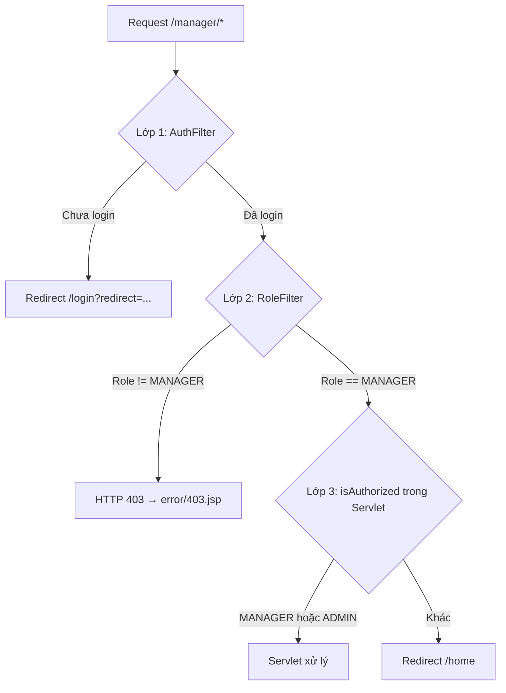
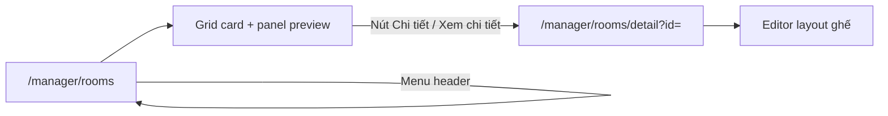
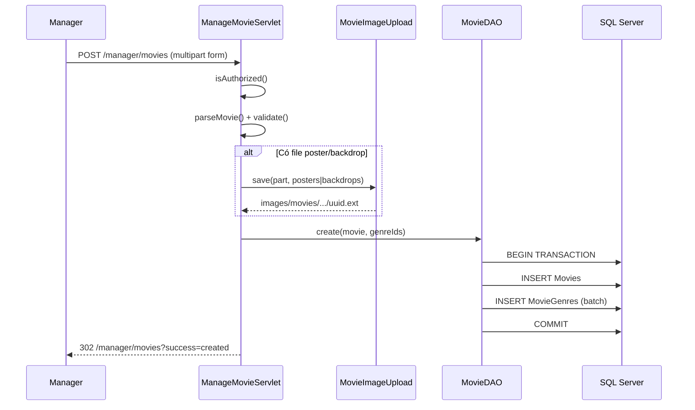

# Module Manager — Tài liệu chi tiết

> **Dự án:** ÉPCINE — Movie Ticket Booking System  
> **Phạm vi:** Toàn bộ source code liên quan đến quản lý rạp (MANAGER)  
> **Tổng quan dự án:** [`SOURCE_CODE_OVERVIEW.md`](SOURCE_CODE_OVERVIEW.md)  
> **Spec nghiệp vụ:** [`project_summary_final.md`](project_summary_final.md)  
> **Module liên quan:** [`ADMIN_MODULE_DETAIL.md`](ADMIN_MODULE_DETAIL.md)

---

## 1. Tổng quan module Manager

Module Manager dành cho người dùng có role **MANAGER** — người vận hành rạp, quản lý nội dung phim và (theo spec) các cấu hình vận hành khác.

### 1.1 Tính năng đã triển khai

| Tính năng | FR | Trạng thái |
|-----------|-----|------------|
| Quản lý phim — thêm / sửa | FR-23 | ✅ |
| Upload poster & backdrop (file hoặc URL) | FR-23 | ✅ |
| Gán thể loại cho phim | FR-23, FR-24 | ✅ |
| Đổi trạng thái phim (COMING_SOON / NOW_SHOWING / ENDED) | FR-23 | ✅ |
| Quản lý thể loại — thêm / sửa | FR-24 | ✅ |
| Quản lý phòng chiếu — danh sách + preview | FR-26 | 🟡 UI (read DB) |
| Quản lý phòng chiếu — layout ghế (editor) | FR-26 | 🟡 UI frontend only |
| CRUD phòng chiếu (tạo/sửa/xóa, toggle trạng thái) | FR-26 | ❌ Chưa có |
| Lưu layout ghế vào `Seats` | FR-26 | ❌ Chưa có (draft `localStorage`) |
| Xóa phim | FR-23 | ❌ Chưa có |
| Xóa thể loại | FR-24 | ❌ Chưa có |
| Quản lý khuyến mãi (voucher) | FR-21 | ❌ Chưa có |
| Quản lý suất chiếu | FR-25 | ❌ Chưa có |
| Quản lý loại ghế & hệ số giá | FR-27 | ❌ Chưa có (chỉ đọc `SeatTypes` cho UI editor) |
| Dashboard thống kê | FR-30 | ❌ Chưa có |
| Báo cáo doanh thu | FR-31 | ❌ Chưa có |
| Báo cáo bán vé | FR-32 | ❌ Chưa có |
| Quản lý điểm tích lũy | FR-45 | ❌ Chưa có |
| Quản lý sự cố suất chiếu | FR-46 | ❌ Chưa có |
| Quản lý quy tắc giá (pricing rules) | FR-49 | ❌ Chưa có |
| Cấu hình hệ thống / thông tin rạp | — | ❌ Chưa có |

> **Ghi chú:** `package-info.java` ghi phạm vi FR-21 – FR-32, FR-45 – FR-49; đã có code cho FR-23, FR-24 và **FR-26 (giai đoạn UI)** — danh sách phòng + editor layout ghế.

---

## 2. Danh sách file source liên quan Manager

### 2.1 Controller (`controller.manager`)

```
src/main/java/controller/manager/
├── ManageMovieServlet.java       # /manager/movies — thêm/sửa phim + upload ảnh
├── ManageGenreServlet.java       # /manager/genres — thêm/sửa thể loại
├── ManageCinemaRoomServlet.java  # /manager/rooms, /manager/rooms/detail — phòng chiếu (GET)
└── package-info.java
```

### 2.2 View (`WEB-INF/views/manager/`)

```
src/main/webapp/WEB-INF/views/manager/
├── movie-list.jsp          # Form + bảng danh sách phim
├── genre-list.jsp          # Form + bảng danh sách thể loại
├── cinema-room-list.jsp    # Grid phòng chiếu + panel preview (design Cinema Auditoriums)
├── cinema-room-detail.jsp  # Chi tiết phòng + editor layout ghế (design Seat Layout)
└── .gitkeep
```

**Design reference (repo root):**

```
Screen Design/
├── Cinema Auditoriums/     # code.html, DESIGN.md, screen.png
└── Seat Layout/            # code.html, DESIGN.md, screen.png
```

### 2.3 CSS & JS

| File | Mục đích |
|------|----------|
| `css/main.css` | Class `.mgr-*` — layout phim & thể loại (~dòng 876–1213) |
| `css/manager-auditoriums.css` | UI phòng chiếu — `.aud-*`, glass panel, Material Symbols |
| `css/manager-seat-layout.css` | Editor layout ghế — `.slt-*` |
| `js/manager-auditoriums.js` | Lọc trạng thái, chọn card, sync panel preview |
| `js/manager-seat-layout.js` | Editor ghế client-side (tools, draft localStorage) |

Trang list/detail load CSS qua `extraCss` / `extraCss2` trong `header.jsp`.

### 2.4 DAL & Model dùng bởi Manager

| File | Vai trò |
|------|---------|
| `dal/MovieDAO.java` | CRUD phim (create/update), danh sách manager, kiểm tra trùng title/slug, gán thể loại |
| `dal/GenreDAO.java` | List, get, create, update, kiểm tra trùng tên |
| `dal/CinemaRoomDAO.java` | getAll, getById, countActiveSeats, countAccessibleSeats |
| `dal/SeatTypeDAO.java` | getAll — sidebar editor layout ghế |
| `model/entity/Movie.java` | Entity phim |
| `model/entity/Genre.java` | Entity thể loại |
| `model/entity/CinemaRoom.java` | Entity phòng chiếu |
| `model/entity/SeatType.java` | Entity loại ghế |
| `util/MovieImageUpload.java` | Lưu file upload poster/backdrop |

### 2.5 Utils & Filter

| File | Vai trò |
|------|---------|
| `utils/AccessControl.java` | Rule `/manager/*` → MANAGER |
| `utils/SessionUtil.java` | Đọc `userRole` từ session |
| `filter/AuthFilter.java` | Bắt buộc đăng nhập |
| `filter/RoleFilter.java` | Chặn sai role → HTTP 403 |

> **Không có** `ManagerAuthUtil` tương tự `AdminAuthUtil`. Servlet tự kiểm tra role trong method `isAuthorized()`.

### 2.6 Navigation

| File | Vai trò |
|------|---------|
| `WEB-INF/views/common/header.jsp` | Menu dropdown MANAGER: Quản lý phim, Quản lý thể loại, **Quản lý phòng chiếu** |

### 2.7 Thư mục upload ảnh

```
src/main/webapp/images/movies/posters/     # Poster upload từ manager
src/main/webapp/images/movies/backdrops/   # Backdrop upload từ manager
```

---

## 3. Kiến trúc bảo mật — 2 lớp + kiểm tra servlet

Module Manager được bảo vệ bởi **2 lớp filter** và **1 kiểm tra trong servlet**:



### 3.1 Lớp 1 — `AuthFilter` + `AccessControl`

- Mọi URL `/manager/*` **không** nằm trong danh sách public
- Chưa đăng nhập → redirect:
  - `/login?redirect={encoded URL}` — lần đầu
  - `/session-expired?redirect=...` — nếu cookie `hadLogin` tồn tại

### 3.2 Lớp 2 — `RoleFilter` + `AccessControl`

```java
// AccessControl.java
ROLE_PREFIXES = {
    "/manager/" → Set.of("MANAGER")
}
```

- Path bắt đầu `/manager/` hoặc chính xác `/manager` → yêu cầu role **MANAGER**
- Role khác (ADMIN, STAFF, CUSTOMER) → HTTP 403, forward `error/403.jsp`
- Set attribute: `requestedPath`, `userRole`

### 3.3 Lớp 3 — `isAuthorized()` trong servlet

Mỗi servlet manager gọi ở đầu `doGet`/`doPost`:

```java
private boolean isAuthorized(HttpServletRequest req) {
    Object role = req.getSession().getAttribute("userRole");
    return "MANAGER".equals(role) || "ADMIN".equals(role);
}
```

| Tình huống | Hành vi |
|------------|---------|
| `userRole == "MANAGER"` | Tiếp tục xử lý |
| `userRole == "ADMIN"` | Servlet cho phép — **nhưng RoleFilter đã chặn ở lớp 2** |
| Chưa đăng nhập / role khác | `sendRedirect("/home")` — **không** dùng flash message |

> Khác với Admin: Manager servlet redirect về `/home` thay vì flash error hoặc 403 khi `isAuthorized()` fail.

---

## 4. Bảng URL đầy đủ

| URL | Servlet | HTTP | View / Response |
|-----|---------|------|-----------------|
| `/manager/movies` | `ManageMovieServlet` | GET | `manager/movie-list.jsp` — danh sách + form tạo |
| `/manager/movies?action=edit&id={uuid}` | `ManageMovieServlet` | GET | `movie-list.jsp` — chế độ sửa |
| `/manager/movies` | `ManageMovieServlet` | POST `action=create` | Redirect `?success=created` hoặc re-render (lỗi) |
| `/manager/movies` | `ManageMovieServlet` | POST `action=update` | Redirect `?success=updated` hoặc re-render (lỗi) |
| `/manager/genres` | `ManageGenreServlet` | GET | `manager/genre-list.jsp` — danh sách + form tạo |
| `/manager/genres?action=edit&id={uuid}` | `ManageGenreServlet` | GET | `genre-list.jsp` — chế độ sửa |
| `/manager/genres` | `ManageGenreServlet` | POST (không action / action khác update) | Redirect `?success=created` hoặc re-render (lỗi) |
| `/manager/genres` | `ManageGenreServlet` | POST `action=update` | Redirect `?success=updated` hoặc re-render (lỗi) |
| `/manager/rooms` | `ManageCinemaRoomServlet` | GET | `cinema-room-list.jsp` — grid + panel preview |
| `/manager/rooms?room={uuid}` | `ManageCinemaRoomServlet` | GET | List — pre-select phòng cho panel |
| `/manager/rooms/detail?id={uuid}` | `ManageCinemaRoomServlet` | GET | `cinema-room-detail.jsp` — editor layout ghế |

> `/manager/rooms` **chưa có POST** — thêm phòng, toggle trạng thái, lưu layout ghế sẽ triển khai sau.

---

## 5. Chi tiết từng endpoint

### 5.1 Quản lý phim — `ManageMovieServlet`

**URL:** `/manager/movies`  
**View:** `movie-list.jsp`  
**Multipart:** `@MultipartConfig` — max file 5 MB, max request 12 MB

#### GET — Hiển thị danh sách / form sửa

```
isAuthorized()
    → action=edit & id → MovieDAO.getById(id) → editMovie
                       → MovieDAO.getGenreIds(id) → selectedGenreIds
    → MovieDAO.getAllForManager() → movieList
    → GenreDAO.getAll() → genreList
    → forward movie-list.jsp
```

#### POST — Tạo phim (`action=create` hoặc không có action)

**Form fields:**

| Field | Bắt buộc | Mô tả |
|-------|----------|-------|
| `title` | ✅ | Tên phim, max 255 |
| `slug` | ✅ | URL slug — tự normalize: lowercase, space → `-` |
| `description` | | Mô tả, max 4000 |
| `durationMinutes` | ✅ | Số phút, > 0 |
| `releaseDate` | | `yyyy-MM-dd` |
| `status` | ✅ | `COMING_SOON` · `NOW_SHOWING` · `ENDED` |
| `ageRating` | | `P` · `K` · `T13` · `T16` · `T18` · `C` hoặc để trống |
| `director` | | Đạo diễn |
| `language` | | Ngôn ngữ |
| `subtitle` | | Phụ đề |
| `trailerUrl` | | Link trailer |
| `posterFile` | | File upload (JPG/PNG/WEBP, ≤ 5 MB) |
| `posterUrl` | | URL poster (nếu không upload file) |
| `backdropFile` | | File upload backdrop |
| `backdropUrl` | | URL backdrop |
| `genreIds` | | Checkbox — danh sách genre UUID |

**Luồng thành công:**

```
parseMovie() → validate() → MovieDAO.create(movie, genreIds)
    → redirect /manager/movies?success=created
```

**Validation (`validate()`):**

| Rule | Thông báo lỗi |
|------|---------------|
| `title` trống | "Tên phim không được để trống." |
| `slug` trống | "Slug không được để trống." |
| `durationMinutes <= 0` | "Thời lượng phim phải lớn hơn 0 phút." |
| `status` không hợp lệ | "Trạng thái phim không hợp lệ." |
| `ageRating` không hợp lệ | "Độ tuổi xem không hợp lệ." |
| Trùng `title` | "Phim \"...\" đã tồn tại." |
| Trùng `slug` | "Slug \"...\" đã được sử dụng." |

**Upload ảnh (`resolveImage()` — ưu tiên theo thứ tự):**

1. File upload mới (`posterFile` / `backdropFile`) → `MovieImageUpload.save()`
2. URL nhập trong form (`posterUrl` / `backdropUrl`)
3. Hidden field giữ ảnh cũ (`existingPosterUrl` / `existingBackdropUrl`) — khi sửa
4. URL hiện có trong DB (`existing`)

#### POST — Sửa phim (`action=update`)

**Thêm hidden fields:**

| Field | Mô tả |
|-------|-------|
| `id` | UUID phim |
| `existingPosterUrl` | Giữ poster cũ nếu không đổi |
| `existingBackdropUrl` | Giữ backdrop cũ nếu không đổi |

```
getById(id) → không tồn tại → redirect /manager/movies
parseMovie(req, existing) → validate(movie, id) → MovieDAO.update(movie, genreIds)
    → redirect ?success=updated
```

#### Request attributes (`movie-list.jsp`)

| Attribute | Mô tả |
|-----------|-------|
| `movieList` | `List<Movie>` — tất cả phim, sắp `created_at DESC` |
| `genreList` | `List<Genre>` — cho checkbox thể loại |
| `editMovie` | Phim đang sửa (GET `action=edit`) |
| `formMovie` | Dữ liệu form khi có lỗi validation |
| `selectedGenreIds` | `List<String>` genre đã chọn |
| `error` | Thông báo lỗi |
| `posterUrlInput`, `backdropUrlInput` | Giữ URL người dùng nhập khi lỗi |

#### Giao diện (`movie-list.jsp`)

- Layout 2 cột: **form trái** (tạo/sửa) + **bảng phải** (danh sách)
- Badge trạng thái: Đang chiếu / Sắp chiếu / Đã kết thúc
- Nút ✏️ → `?action=edit&id=...`
- JavaScript preview ảnh khi chọn file hoặc nhập URL
- Thông báo thành công qua query param `?success=created|updated`

---

### 5.2 Quản lý thể loại — `ManageGenreServlet`

**URL:** `/manager/genres`  
**View:** `genre-list.jsp`

#### GET — Hiển thị danh sách / form sửa

```
isAuthorized()
    → action=edit & id → GenreDAO.getById(id) → editGenre
    → GenreDAO.getAll() → genreList
    → forward genre-list.jsp
```

#### POST — Tạo thể loại (không có `action` hoặc `action != update`)

**Form fields:**

| Field | Bắt buộc | Mô tả |
|-------|----------|-------|
| `genreName` | ✅ | Tên thể loại, max 100 |

```
validate tên trống / trùng → GenreDAO.create(name)
    → redirect ?success=created
```

#### POST — Sửa thể loại (`action=update`)

| Field | Mô tả |
|-------|-------|
| `id` | UUID thể loại |
| `genreName` | Tên mới |

```
getById(id) → validate → GenreDAO.update(id, name)
    → redirect ?success=updated
```

#### Request attributes (`genre-list.jsp`)

| Attribute | Mô tả |
|-----------|-------|
| `genreList` | `List<Genre>` — sắp `genre_name` |
| `editGenre` | Thể loại đang sửa |
| `inputValue` | Giữ giá trị input khi lỗi |
| `error` | Thông báo lỗi |

#### Giao diện (`genre-list.jsp`)

- Layout 2 cột: form trái + bảng phải
- Cột ngày tạo (`dd/MM/yyyy`)
- Badge "đang sửa" trên dòng đang edit
- Không có nút xóa

---

### 5.3 Quản lý phòng chiếu — `ManageCinemaRoomServlet`

**URL:** `/manager/rooms` (list) · `/manager/rooms/detail?id=` (chi tiết + layout)  
**View:** `cinema-room-list.jsp` · `cinema-room-detail.jsp`  
**HTTP:** chỉ **GET** (chưa POST)

#### Luồng UI



- **List:** đọc `CinemaRoomDAO.getAll()`, metadata hiển thị derive trong servlet (`deriveDisplayMeta`)
- **Panel phải:** preview nhanh (stats, thông số kỹ thuật tạm) — **không** có sơ đồ ghế
- **Detail:** load phòng + `SeatTypeDAO.getAll()`; editor ghế chỉ trên trang này

#### GET — Danh sách (`/manager/rooms`)

```
isAuthorized()
    → CinemaRoomDAO.getAll() → roomList
    → ?room= → pre-select selectedRoom (mặc định phòng đầu)
    → buildRoomMeta() → roomMetaMap
    → forward cinema-room-list.jsp
```

#### GET — Chi tiết (`/manager/rooms/detail?id=`)

```
isAuthorized()
    → getById(id) — null → redirect /manager/rooms
    → seatTypeList, activeSeatCount, accessibleSeatCount, roomMeta
    → forward cinema-room-detail.jsp
```

#### Request attributes

| Attribute | View | Mô tả |
|-----------|------|-------|
| `roomList` | list | `List<CinemaRoom>` |
| `selectedRoom` | list | Phòng highlight panel |
| `roomMetaMap` | list | Map id → chip/projection/occupancy (mock UI) |
| `accessibleSeatCount` | list, detail | Đếm ghế WHEELCHAIR/ACCESSIBLE (thường = 0) |
| `room` | detail | `CinemaRoom` |
| `roomMeta` | detail | Metadata 1 phòng |
| `seatTypeList` | detail | `List<SeatType>` cho sidebar editor |
| `activeSeatCount` | detail | `COUNT` ghế ACTIVE trong `Seats` |

#### Giao diện list (`cinema-room-list.jsp`)

- Design: `Screen Design/Cinema Auditoriums/`
- Lọc: Tất cả / Hoạt động / Bảo trì (client-side)
- Card: toggle trạng thái (visual, chưa POST), nút **Chi tiết →**
- Panel: **Xem chi tiết** (primary), lịch chiếu / bảo trì (disabled)
- Nút **Thêm phòng chiếu** (disabled — chờ backend)

#### Giao diện detail + editor (`cinema-room-detail.jsp`)

- Design: `Screen Design/Seat Layout/`
- Sidebar: loại ghế từ DB, cấu hình layout title, toggles
- Workspace: màn hình cong + lưới ghế; toolbar Chọn / Thêm ghế / Lối đi
- **Lưu layout:** bật sau chỉnh sửa → ghi `localStorage` key `epcine_slt_draft_{roomId}` (không ghi DB)
- Phòng chưa có ghế DB + chưa có draft → layout mẫu 3 hàng (A/B/C) như mockup

#### Chưa triển khai (backend FR-26)

| Hạng mục | Ghi chú |
|----------|---------|
| POST tạo/sửa/xóa phòng | `CinemaRoomDAO.create/update` |
| Toggle ACTIVE / MAINTENANCE | Cập nhật `CinemaRooms.status` |
| POST lưu layout | INSERT/UPDATE `Seats`, sync `capacity` |
| Load layout từ DB | Thay demo / localStorage |
| Undo/Redo editor | Disabled trên UI |

---

## 6. `MovieDAO` — Methods dùng bởi Manager

| Method | SQL / Logic | Dùng bởi |
|--------|-------------|----------|
| `getAllForManager()` | `SELECT ... FROM Movies ORDER BY created_at DESC` | GET movies |
| `getById(id)` | `SELECT ... WHERE id = ?` | Edit, update |
| `getGenreIds(movieId)` | `SELECT genre_id FROM MovieGenres WHERE movie_id = ?` | Form edit |
| `isDuplicateTitle(title)` | `COUNT WHERE title = ?` | Validate create |
| `isDuplicateSlug(slug)` | `COUNT WHERE slug = ?` | Validate create |
| `isDuplicateTitleExcluding(title, id)` | `COUNT WHERE title = ? AND id <> ?` | Validate update |
| `isDuplicateSlugExcluding(slug, id)` | `COUNT WHERE slug = ? AND id <> ?` | Validate update |
| `create(movie, genreIds)` | INSERT Movies + INSERT MovieGenres (transaction) | POST create |
| `update(movie, genreIds)` | UPDATE Movies + DELETE/INSERT MovieGenres (transaction) | POST update |

**Transaction trong `create` / `update`:**

```sql
-- create: INSERT Movies → replaceGenres (DELETE cũ nếu có + INSERT batch)
-- update: UPDATE Movies → DELETE MovieGenres WHERE movie_id = ? → INSERT batch
```

**Các method public khác** (`getFeaturedMovies`, `searchPublicMovies`, …) phục vụ trang public, không gọi trực tiếp từ servlet manager.

---

## 7. `GenreDAO` — Methods dùng bởi Manager

| Method | SQL | Dùng bởi |
|--------|-----|----------|
| `getAll()` | `SELECT ... ORDER BY genre_name` | Cả 2 servlet |
| `getById(id)` | `SELECT ... WHERE id = ?` | Edit genre |
| `isDuplicate(name)` | `COUNT WHERE genre_name = ?` | Validate create |
| `isDuplicateExcluding(name, excludeId)` | `COUNT WHERE genre_name = ? AND id <> ?` | Validate update |
| `create(genreName)` | `INSERT Genres (id, genre_name) VALUES (NEWID(), ?)` | POST create |
| `update(id, genreName)` | `UPDATE Genres SET genre_name = ? WHERE id = ?` | POST update |

> **Không có** `delete()` — spec FR-24 ghi "xoá" nhưng UI/DAO chưa hỗ trợ.

---

## 6b. `CinemaRoomDAO` — Methods dùng bởi Manager (FR-26)

| Method | SQL / Logic | Dùng bởi |
|--------|-------------|----------|
| `getAll()` | `SELECT ... FROM CinemaRooms ORDER BY room_name` | GET list |
| `getById(id)` | `SELECT ... WHERE id = ?` | GET detail; redirect nếu null |
| `countActiveSeats(roomId)` | `COUNT` ghế ACTIVE trong `Seats` | Detail — badge số ghế layout |
| `countAccessibleSeats(roomId)` | `COUNT` ghế loại WHEELCHAIR/ACCESSIBLE | Panel / detail stats |

> **Chưa có** `create`, `update`, `delete`, `updateStatus`.

---

## 6c. `SeatTypeDAO` — Methods dùng bởi Manager

| Method | SQL | Dùng bởi |
|--------|-----|----------|
| `getAll()` | `SELECT ... FROM SeatTypes ORDER BY price_multiplier` | Sidebar editor layout ghế |

Seed: REGULAR (×1.0), VIP (×1.5), COUPLE (×2.0), SWEETBOX (×2.5).

---

## 8. `MovieImageUpload` — Upload ảnh phim

**File:** `util/MovieImageUpload.java`

| Hằng số | Giá trị |
|---------|---------|
| `ALLOWED_TYPES` | `image/jpeg`, `image/jpg`, `image/png`, `image/webp` |
| `MAX_BYTES` | 5 × 1024 × 1024 (5 MB) |

**Luồng `save()`:**

```
Part null hoặc size=0 → return null (bỏ qua)
Kiểm tra content-type & size
Tạo filename UUID + extension
Lưu vào webapp/images/movies/{posters|backdrops}/
Return đường dẫn tương đối: images/movies/posters/uuid.jpg
```

**Helper `toPublicUrl()`:** Chuyển path nội bộ hoặc URL ngoài thành URL hiển thị trên browser.

---

## 9. Model entities

### 9.1 `Movie`

| Field | Type | Manager form |
|-------|------|--------------|
| `id` | String (UUID) | Hidden khi update |
| `title` | String | ✅ |
| `slug` | String | ✅ |
| `description` | String | ✅ |
| `durationMinutes` | int | ✅ |
| `releaseDate` | `java.sql.Date` | ✅ |
| `trailerUrl` | String | ✅ |
| `posterUrl` | String | ✅ upload/URL |
| `backdropUrl` | String | ✅ upload/URL |
| `director` | String | ✅ |
| `language` | String | ✅ |
| `subtitle` | String | ✅ |
| `ageRating` | String | ✅ |
| `status` | String | ✅ |
| `averageRating` | BigDecimal | ❌ Chỉ đọc từ review — không chỉnh qua manager |
| `createdAt` | Timestamp | ❌ Tự động DB |
| `genres` | `List<String>` | Qua `genreIds` checkbox |

> DB có cột `cast_members` (NVARCHAR MAX) nhưng **form manager chưa có** trường diễn viên.

### 9.2 `Genre`

| Field | Type | Manager form |
|-------|------|--------------|
| `id` | String (UUID) | Hidden khi update |
| `genreName` | String | ✅ `genreName` |
### 9.3 `CinemaRoom`

| Field | Type | Manager UI |
|-------|------|------------|
| `id` | String (UUID) | URL `?id=` detail |
| `roomName` | String | Hiển thị list/detail |
| `capacity` | int | Hiển thị (DB); editor đếm ghế riêng (client) |
| `status` | String | ACTIVE / MAINTENANCE / INACTIVE — hiển thị + toggle visual |
| `createdAt` | Timestamp | Detail summary |

### 9.4 `SeatType`

| Field | Type | Manager UI |
|-------|------|------------|
| `typeName` | String | Sidebar editor (REGULAR, VIP, …) |
| `priceMultiplier` | BigDecimal | Hiển thị × hệ số trên sidebar |
| `description` | String | Chưa hiển thị |

---

## 10. Schema database liên quan

### 10.1 Bảng `Movies`

```sql
CREATE TABLE Movies (
    id               UNIQUEIDENTIFIER NOT NULL DEFAULT NEWID(),
    title            NVARCHAR(255)    NOT NULL,
    slug             NVARCHAR(255)    NOT NULL,        -- UK_Movies_Slug
    description      NVARCHAR(MAX)    NULL,
    duration_minutes INT              NOT NULL,        -- CHECK > 0
    release_date     DATE             NULL,
    trailer_url      NVARCHAR(MAX)    NULL,
    poster_url       NVARCHAR(MAX)    NULL,
    backdrop_url     NVARCHAR(MAX)    NULL,
    director         NVARCHAR(255)    NULL,
    cast_members     NVARCHAR(MAX)    NULL,            -- chưa dùng trong form
    language         NVARCHAR(50)     NULL,
    subtitle         NVARCHAR(50)     NULL,
    age_rating       NVARCHAR(10)     NULL,            -- P/K/T13/T16/T18/C
    status           NVARCHAR(20)     NOT NULL,        -- COMING_SOON/NOW_SHOWING/ENDED
    average_rating   DECIMAL(3,2)     NULL DEFAULT 0,
    created_at       DATETIME2        NOT NULL DEFAULT GETDATE()
);
```

### 10.2 Bảng `Genres`

```sql
CREATE TABLE Genres (
    id         UNIQUEIDENTIFIER NOT NULL DEFAULT NEWID(),
    genre_name NVARCHAR(100)    NOT NULL,              -- UK_Genres_Name
    created_at DATETIME2        NOT NULL DEFAULT GETDATE()
);
```

### 10.3 Bảng `MovieGenres` (M-N)

```sql
CREATE TABLE MovieGenres (
    movie_id UNIQUEIDENTIFIER NOT NULL,
    genre_id UNIQUEIDENTIFIER NOT NULL,
    PRIMARY KEY (movie_id, genre_id),
    FK → Movies, FK → Genres
);
```

### 10.4 Bảng `CinemaRooms` & `Seats` (FR-26)

```sql
CREATE TABLE CinemaRooms (
    id         UNIQUEIDENTIFIER NOT NULL DEFAULT NEWID(),
    room_name  NVARCHAR(100)    NOT NULL,
    capacity   INT              NOT NULL DEFAULT 0,
    status     NVARCHAR(20)     NOT NULL DEFAULT 'ACTIVE',  -- ACTIVE | MAINTENANCE | INACTIVE
    created_at DATETIME2        NOT NULL DEFAULT GETDATE()
);

CREATE TABLE Seats (
    id           UNIQUEIDENTIFIER NOT NULL,
    room_id      UNIQUEIDENTIFIER NOT NULL,
    seat_type_id UNIQUEIDENTIFIER NOT NULL,
    seat_row     NVARCHAR(10)     NOT NULL,
    seat_column  INT              NOT NULL,
    seat_code    NVARCHAR(20)     NOT NULL,
    status       NVARCHAR(10)     NOT NULL DEFAULT 'ACTIVE'
);
```

**Seed:** 3 phòng (`Phòng 1`, `Phòng IMAX`, `Phòng 3`) — **chưa seed** bản ghi `Seats`.

---

## 11. Quy tắc nghiệp vụ (Business Rules)

| # | Quy tắc | Nơi enforce |
|---|---------|-------------|
| 1 | Chỉ **MANAGER** truy cập `/manager/*` qua filter | `RoleFilter` + `AccessControl` |
| 2 | Servlet chấp nhận MANAGER **hoặc** ADMIN | `isAuthorized()` — ADMIN bị filter chặn trước |
| 3 | `slug` phải **duy nhất** toàn hệ thống | DB `UK_Movies_Slug` + `MovieDAO.isDuplicateSlug*` |
| 4 | `title` không được trùng (app-level) | `MovieDAO.isDuplicateTitle*` |
| 5 | `genre_name` phải **duy nhất** | DB `UK_Genres_Name` + `GenreDAO.isDuplicate*` |
| 6 | Ảnh upload: JPG/PNG/WEBP, tối đa 5 MB | `MovieImageUpload` |
| 7 | File upload **ưu tiên hơn** URL text | `resolveImage()` trong servlet |
| 8 | Gán thể loại: xóa hết cũ rồi insert mới | `MovieDAO.replaceGenres()` |
| 9 | Không xóa phim / thể loại qua UI | — |
| 10 | `average_rating` không chỉnh từ manager | Chỉ cập nhật qua review (chưa triển khai đầy đủ) |

---

## 12. Giao diện & CSS

### 12.1 Class naming

**Phim / thể loại (`.mgr-*` trong `main.css`)** — xem bảng cũ mục 12.1.

**Phòng chiếu (`.aud-*` trong `manager-auditoriums.css`):**

| Nhóm | Mục đích |
|------|----------|
| `.aud-page`, `.aud-title`, `.aud-layout` | Layout list 2 cột |
| `.aud-room-card`, `.aud-room-card--selected` | Card phòng |
| `.aud-detail`, `.glass-panel`, `.glass-panel-heavy` | Panel preview |
| `.aud-btn--detail`, `.aud-btn--primary` | Nút Chi tiết / Xem chi tiết |

**Layout ghế (`.slt-*` trong `manager-seat-layout.css`):**

| Nhóm | Mục đích |
|------|----------|
| `.slt-editor`, `.slt-sidebar`, `.slt-workspace` | Shell editor |
| `.slt-seat--regular/vip/couple/sweetbox` | Ô ghế |
| `.slt-toolbar`, `.slt-tool--active` | Chọn / Thêm / Lối đi |

### 12.2 Responsive

- List: panel phải sticky trên desktop; 1 cột trên mobile
- Editor: sidebar stack trên tablet; toolbar wrap trên mobile

### 12.3 Menu Manager trong `header.jsp`

Khi `sessionScope.userRole == 'MANAGER'`:

| Link | URL |
|------|-----|
| Quản lý phim | `/manager/movies` |
| Quản lý thể loại | `/manager/genres` |
| Quản lý phòng chiếu | `/manager/rooms` |

> Link **Quản lý phòng chiếu** **không** hiện cho ADMIN (chỉ MANAGER). ADMIN vẫn thấy phim/thể loại nhưng bị 403 khi vào `/manager/*`.

---

## 13. Đăng nhập Manager

### Tài khoản seed

| Field | Giá trị |
|-------|---------|
| Email | `manager@movieticket.vn` |
| Username | `manager` |
| Password | `Password@123` |
| Role | MANAGER |
| Status | ACTIVE |

### Redirect sau login

`AuthRedirectUtil.defaultRedirectForRole()` hiện trả về **`/home`** cho mọi role (kể cả MANAGER).

Manager truy cập module qua menu dropdown hoặc URL trực tiếp `/manager/movies`.

| Cách vào | URL |
|----------|-----|
| Menu user dropdown | Quản lý phim / thể loại / **phòng chiếu** |
| Trực tiếp | `/manager/movies`, `/manager/genres`, `/manager/rooms`, `/manager/rooms/detail?id=...` |

Nếu có `?redirect=` hợp lệ (qua `AuthRedirectUtil.isSafeRedirect`), login sẽ ưu tiên redirect đó.

---

## 14. Hạn chế & vấn đề đã biết

| # | Vấn đề | Mô tả |
|---|--------|-------|
| 1 | ADMIN bị 403 vào `/manager/*` | `RoleFilter` chỉ cho MANAGER; servlet `isAuthorized()` lại cho ADMIN — mâu thuẫn |
| 2 | Header hiện link manager cho ADMIN | ADMIN click → 403 |
| 3 | Không có CSRF token | Form POST manager không có bảo vệ CSRF |
| 4 | Không xóa phim / thể loại | Spec FR-23/24 có "xoá" nhưng chưa implement |
| 5 | Không có `ManagerAuthUtil` | Không flash message; auth fail → redirect `/home` im lặng |
| 6 | `cast_members` chưa có trên form | Cột DB tồn tại nhưng manager không nhập được |
| 7 | Login không redirect về manager | `AuthRedirectUtil` luôn về `/home` — khác mô tả cũ trong tài liệu admin |
| 8 | Session timeout 1 phút | `web.xml` — dễ hết phiên khi dev |
| 9 | Không connection pool | Mỗi DAO gọi `DBContext.getConnection()` trực tiếp |
| 10 | Phạm vi manager còn lớn chưa làm | Suất chiếu, CRUD phòng, lưu ghế DB, báo cáo, khuyến mãi… |
| 11 | FR-26 metadata giả trên list | Chip IMAX, occupancy, suất hiện tại derive từ tên phòng — không phải DB |
| 12 | Layout ghế chỉ localStorage | `manager-seat-layout.js` — chưa API POST persist `Seats` |
| 13 | Toggle trạng thái phòng | UI only — chưa cập nhật `CinemaRooms.status` |

---

## 15. Roadmap — FR Manager chưa triển khai

Dựa trên `project_summary_final.md` (Nhóm Manager):

| FR | Tên | Bảng chính | Gợi ý triển khai |
|----|-----|------------|------------------|
| FR-21 | Promotion Management | `Promotions` | Servlet `/manager/promotions` + `PromotionDAO` |
| FR-25 | Showtime Management | `Showtimes` | CRUD suất, kiểm tra trùng giờ/phòng |
| FR-26 | Cinema Room Management | `CinemaRooms`, `Seats` | 🟡 UI list/detail + editor; tiếp: POST CRUD phòng + persist layout |
| FR-27 | Seat Type & Pricing | `SeatTypes` | CRUD loại ghế + multiplier |
| FR-30 | Dashboard Statistics | aggregate | Trang `/manager/dashboard` |
| FR-31 | Revenue Report | `Payments`, `Bookings` | Báo cáo + tách VAT |
| FR-32 | Ticket Sales Report | `Bookings`, `BookingSeats` | Báo cáo theo phim/suất/ghế |
| FR-45 | Loyalty Points Management | `LoyaltyPointsLog`, `SystemConfig` | Điều chỉnh điểm + cấu hình tỷ lệ |
| FR-46 | Showtime Incident | `ShowtimeIncidents` | Khai báo sự cố + hoàn điểm/voucher |
| FR-49 | Pricing Rule Management | `PricingRules` | CRUD rule điều chỉnh giá |

**Cải thiện module hiện tại:**

| Tính năng | Mô tả |
|-----------|-------|
| Xóa phim / thể loại | Soft delete hoặc guard FK trước khi xóa |
| Trường `cast_members` | Thêm vào form phim |
| `ManagerAuthUtil` | Flash message + redirect nhất quán |
| Cho ADMIN vào `/manager/*` | Thêm ADMIN vào `AccessControl.ROLE_PREFIXES` |
| CSRF protection | Token trên form POST |
| Redirect sau login theo role | MANAGER → `/manager/movies` |

---

## 16. Checklist test thủ công

### Phim (`/manager/movies`)

- [ ] Login `manager@movieticket.vn` / `Password@123`
- [ ] Truy cập `/manager/movies` — hiển thị danh sách phim seed
- [ ] Tạo phim mới — đủ field bắt buộc → `?success=created`
- [ ] Validate: title trống, slug trống, duration = 0 → hiện lỗi, giữ form
- [ ] Validate: trùng title / slug → hiện lỗi
- [ ] Upload poster JPG ≤ 5 MB → lưu `images/movies/posters/`
- [ ] Upload backdrop → lưu `images/movies/backdrops/`
- [ ] Nhập URL poster/backdrop thay vì upload
- [ ] Chọn nhiều thể loại → lưu vào `MovieGenres`
- [ ] Sửa phim (`?action=edit&id=...`) — form pre-fill đúng
- [ ] Sửa phim — giữ ảnh cũ khi không upload/URL mới
- [ ] Đổi trạng thái COMING_SOON / NOW_SHOWING / ENDED
- [ ] Phim mới hiển thị trên trang public `/movies` đúng tab status

### Thể loại (`/manager/genres`)

- [ ] Truy cập `/manager/genres` — hiển thị danh sách seed
- [ ] Tạo thể loại mới → `?success=created`
- [ ] Validate: tên trống → lỗi
- [ ] Validate: trùng tên → lỗi
- [ ] Sửa thể loại → `?success=updated`
- [ ] Thể loại mới xuất hiện trong checkbox form phim

### Phòng chiếu (`/manager/rooms`, `/manager/rooms/detail`)

- [ ] Menu MANAGER có「Quản lý phòng chiếu」; ADMIN **không** thấy link này
- [ ] `/manager/rooms` — hiển thị 3 phòng seed
- [ ] Lọc Hoạt động / Bảo trì hoạt động (client-side)
- [ ] Click card → panel preview cập nhật; nút **Xem chi tiết** đúng `id`
- [ ] Nút **Chi tiết** trên card → `/manager/rooms/detail?id=...`
- [ ] Detail — sidebar loại ghế từ DB (4 loại seed)
- [ ] Editor — đặt ghế, lối đi, xóa ghế (Delete), **Lưu layout** → localStorage
- [ ] Reload trang detail — khôi phục draft localStorage
- [ ] **Hủy thay đổi** — xóa draft, về layout mặc định

### Bảo mật

- [ ] Chưa login → `/manager/movies` → redirect login
- [ ] CUSTOMER login → `/manager/movies` → 403
- [ ] STAFF login → `/manager/movies` → 403
- [ ] ADMIN login → `/manager/movies` → 403 (dù header có link)
- [ ] MANAGER login → `/admin/dashboard` → 403

### Upload & edge cases

- [ ] Upload file > 5 MB → lỗi "Ảnh không được vượt quá 5 MB."
- [ ] Upload file sai định dạng → lỗi "Ảnh phải là JPG, PNG hoặc WEBP."
- [ ] Slug tự normalize: `"Avengers Doomsday"` → `avengers-doomsday`

---

## 17. Sơ đồ luồng tạo phim



---

## 18. Liên kết với module khác

| Module | Quan hệ với Manager |
|--------|---------------------|
| **Public** (`/movies`, `/home`) | Hiển thị phim/thể loại do manager tạo |
| **Staff** (`/staff/counter`) | Chọn phim/suất khi đặt vé — phim từ `Movies` |
| **Admin** | Tạo tài khoản MANAGER qua `/admin/users/create` |
| **Customer** | Xem phim public — chưa có flow đặt vé online |

---

*Tài liệu chi tiết module Manager — cập nhật 08/06/2026 (FR-26 UI: phòng chiếu + editor layout ghế).*
