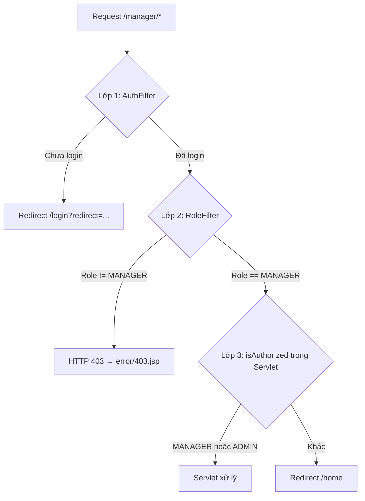
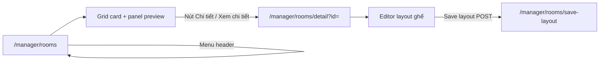
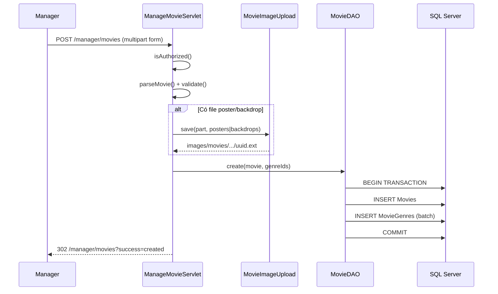

# Module Manager — Tài liệu chi tiết

> **Dự án:** ÉPCINE — Movie Ticket Booking System  
> **Phạm vi:** Toàn bộ source code liên quan đến quản lý rạp (MANAGER)  
> **Tổng quan dự án:** [`SOURCE_CODE_OVERVIEW.md`](SOURCE_CODE_OVERVIEW.md)  
> **Spec nghiệp vụ:** [`project_summary_final.md`](project_summary_final.md)  
> **Database & migration:** [`Database/README.md`](Database/README.md)  
> **Module liên quan:** [`ADMIN_MODULE_DETAIL.md`](ADMIN_MODULE_DETAIL.md)

---

## 1. Tổng quan module Manager

Module Manager dành cho người dùng có role **MANAGER** — người vận hành rạp, quản lý nội dung phim và (theo spec) các cấu hình vận hành khác.

### 1.1 Tính năng đã triển khai

| Tính năng | FR | Trạng thái |
|-----------|-----|------------|
| Quản lý phim — thêm / sửa | FR-23 | ✅ |
| Upload poster & backdrop (file hoặc URL) | FR-23 | ✅ |
| Gán thể loại cho phim | FR-23, FR-24 | ✅ |
| Đổi trạng thái phim (COMING_SOON / NOW_SHOWING / ENDED) | FR-23 | ✅ |
| Xóa phim (soft delete) | FR-23 | ✅ |
| Quản lý thể loại — thêm / sửa | FR-24 | ✅ |
| Xóa thể loại (FK guard) | FR-24 | ✅ |
| Toggle trạng thái thể loại (active/inactive) | FR-24 | ✅ |
| Quản lý phòng chiếu — danh sách + preview | FR-26 | ✅ |
| Quản lý phòng chiếu — tạo phòng mới | FR-26 | ✅ |
| Quản lý phòng chiếu — đổi tên phòng | FR-26 | ✅ |
| Quản lý phòng chiếu — toggle trạng thái (ACTIVE ↔ MAINTENANCE) | FR-26 | ✅ |
| Quản lý phòng chiếu — layout ghế (editor) | FR-26 | ✅ |
| Lưu layout ghế vào `Seats` (persist DB) | FR-26 | ✅ |
| Quản lý loại ghế & hệ số giá (CRUD) | FR-27 | ✅ |
| Quản lý suất chiếu — tạo / sửa / xóa | FR-25 | ✅ |
| Kiểm tra trùng lịch cùng phòng | FR-25 | ✅ |
| Khóa phim/phòng/giờ khi suất đã có booking | FR-25 | ✅ |
| Xóa phòng chiếu | FR-26 | ❌ Chưa có |
| Quản lý khuyến mãi (voucher) | FR-21 | ❌ Chưa có |
| Dashboard thống kê | FR-30 | 🟡 Một phần — Admin dashboard có thống kê tháng |
| Báo cáo doanh thu | FR-31 | 🟡 Phase 1 tại Admin `/admin/reports` (chưa UI Manager; chưa tách VAT) |
| Báo cáo bán vé | FR-32 | 🟡 Phase 1 tại Admin `/admin/reports` — theo phim/suất + CSV (chưa theo loại ghế) |
| Quản lý điểm tích lũy | FR-45 | ❌ Chưa có |
| Quản lý sự cố suất chiếu | FR-46 | ❌ Chưa có |
| Quản lý quy tắc giá (pricing rules) | FR-49 | ❌ Chưa có |
| Cấu hình hệ thống / thông tin rạp | — | ❌ Chưa có |

> **Ghi chú:** `package-info.java` ghi phạm vi FR-21 – FR-32, FR-45 – FR-49; đã có code cho FR-23, FR-24, **FR-25 (CRUD suất chiếu)**, **FR-26 (CRUD phòng + layout ghế)**, và **FR-27 (CRUD loại ghế)**. FR-30/31/32 (báo cáo) triển khai **Phase 1 ở module Admin** (`/admin/reports`), không có màn hình riêng dưới `/manager/*`.

---

## 2. Danh sách file source liên quan Manager

### 2.1 Controller (`controller.manager`)

```
src/main/java/controller/manager/
├── ManageMovieServlet.java       # /manager/movies — CRUD phim + upload ảnh + soft delete
├── ManageGenreServlet.java       # /manager/genres — CRUD thể loại + delete + toggle status
├── ManageCinemaRoomServlet.java  # /manager/rooms, /manager/rooms/detail, /update, /save-layout
├── ManageShowtimeServlet.java    # /manager/showtimes — CRUD suất chiếu + kiểm tra trùng lịch
├── ManageSeatTypeServlet.java    # /manager/seat-types — CRUD loại ghế
└── package-info.java
```

### 2.2 View (`WEB-INF/views/manager/`)

```
src/main/webapp/WEB-INF/views/manager/
├── movie-list.jsp          # Form + bảng danh sách phim + soft delete
├── genre-list.jsp          # Form + bảng danh sách thể loại + delete + toggle
├── cinema-room-list.jsp    # Grid phòng chiếu + panel preview + tạo phòng
├── cinema-room-detail.jsp  # Chi tiết phòng + editor layout ghế (lưu DB)
├── showtime-list.jsp       # Form + bảng suất chiếu + filter client-side
├── seat-type-list.jsp      # Form + bảng danh sách loại ghế + usage count
└── .gitkeep
```

**Design reference (repo root):**

```
Screen Design/
├── Cinema Auditoriums/     # code.html, DESIGN.md, screen.png
├── Seat Layout/            # code.html, DESIGN.md, screen.png
└── Showtime Management/    # code.html, DESIGN.md, screen.png
```

### 2.3 CSS & JS

| File | Mục đích |
|------|----------|
| `css/main.css` | Class layout chung |
| `css/manager-movies.css` | UI quản lý phim — dark theme, modal, poster thumbnails (~1085 dòng) |
| `css/manager-genres.css` | UI quản lý thể loại — dark cinematic red theme (~616 dòng) |
| `css/manager-auditoriums.css` | UI phòng chiếu — `.aud-*`, glass panel, Material Symbols |
| `css/manager-seat-layout.css` | Editor layout ghế — `.slt-*` |
| `css/manager-showtimes.css` | UI suất chiếu — `.st-*`, form 2 cột, status badges, filter bar |
| `js/manager-auditoriums.js` | Lọc trạng thái, chọn card, sync panel preview |
| `js/manager-seat-layout.js` | Editor ghế client-side; đọc `window.SLT_CONFIG` (layout JSON + i18n); POST save-layout |
| `js/manager-showtimes.js` | Lọc bảng suất (phim/phòng/trạng thái); xác nhận xóa |
| `js/seat-type-colors.js` | Preset + dynamic HSL color cho loại ghế (IIFE `window.SeatTypeColors`) |

Trang list/detail load CSS qua `extraCss` / `extraCss2` trong `header.jsp`.

### 2.4 DAL & Model dùng bởi Manager

| File | Vai trò |
|------|---------|
| `dal/MovieDAO.java` | CRUD phim; `getSchedulableMovies()` (NOW_SHOWING/COMING_SOON); `hasActiveShowtimes()` |
| `dal/GenreDAO.java` | Full CRUD: getAll, getAllActive, getById, create, update, delete, updateStatus; isDuplicate*; hasLinkedMovies, hasActiveOrUpcomingMovies; getMovieCountPerGenre, getGenreIdsInUse, getGenreIdsWithActiveMovies |
| `dal/CinemaRoomDAO.java` | Full: getAll, getById, getActiveRooms, create, updateName, updateStatus; existsByName*; countUpcomingShowtimes (guard), countActiveSeats, countAccessibleSeats |
| `dal/ShowtimeDAO.java` | Manager CRUD: getAllForManager, create, update, delete; isOverlapping; countBookingsByShowtimeId; getShowtimeById |
| `dal/SeatTypeDAO.java` | Full CRUD: getAll, getById, create, update, delete; isDuplicate*; getTypeKeyToIdMap, countUsedIn (guard) |
| `dal/SeatDAO.java` | Ghế theo suất + availability; `saveLayout()` cho editor |
| `model/entity/Movie.java` | Entity phim |
| `model/entity/Genre.java` | Entity thể loại |
| `model/entity/CinemaRoom.java` | Entity phòng chiếu |
| `model/entity/Showtime.java` | Entity suất chiếu (denormalized movie/room cho UI) |
| `model/entity/SeatType.java` | Entity loại ghế |
| `utils/MovieImageUpload.java` | Lưu file upload poster/backdrop (JPG/PNG/WEBP, max 5MB) |
| `utils/SeatLayoutJsonUtil.java` | Serialize/deserialize layout ghế JSON ↔ Seat entities (`buildLayoutJson`, `parseSeats`) |

### 2.5 Utils & Filter

| File | Vai trò |
|------|---------|
| `utils/AccessControl.java` | Rule `/manager/*` → MANAGER |
| `utils/SessionUtil.java` | Đọc `userRole` từ session |
| `filter/AuthFilter.java` | Bắt buộc đăng nhập |
| `filter/RoleFilter.java` | Chặn sai role → HTTP 403 |
| `filter/EncodingFilter.java` | UTF-8 request/response; `Content-Type` charset cho file `.js` / `.css` tĩnh |

> **Không có** `ManagerAuthUtil` tương tự `AdminAuthUtil`. Servlet tự kiểm tra role trong method `isAuthorized()`.

### 2.6 Navigation

| File | Vai trò |
|------|---------|
| `WEB-INF/views/common/header.jsp` | Menu dropdown MANAGER: Quản lý phim, thể loại, **suất chiếu**, phòng chiếu, loại ghế |

> ADMIN cũng thấy link phim/thể loại (dùng chung `/manager/movies` và `/manager/genres`) nhưng **không thấy** link phòng chiếu và loại ghế. ADMIN bị 403 khi vào `/manager/*` do `RoleFilter`.

### 2.7 Thư mục upload ảnh

```
src/main/webapp/images/movies/posters/     # Poster upload từ manager
src/main/webapp/images/movies/backdrops/   # Backdrop upload từ manager
```

---

## 3. Kiến trúc bảo mật — 2 lớp + kiểm tra servlet

Module Manager được bảo vệ bởi **2 lớp filter** và **1 kiểm tra trong servlet**:



### 3.1 Lớp 1 — `AuthFilter` + `AccessControl`

- Mọi URL `/manager/*` **không** nằm trong danh sách public
- Chưa đăng nhập → redirect:
  - `/login?redirect={encoded URL}` — lần đầu
  - `/session-expired?redirect=...` — nếu cookie `hadLogin` tồn tại

### 3.2 Lớp 2 — `RoleFilter` + `AccessControl`

```java
// AccessControl.java
ROLE_PREFIXES = {
    "/manager/" → Set.of("MANAGER")
}
```

- Path bắt đầu `/manager/` hoặc chính xác `/manager` → yêu cầu role **MANAGER**
- Role khác (ADMIN, STAFF, CUSTOMER) → HTTP 403, forward `error/403.jsp`
- Set attribute: `requestedPath`, `userRole`

### 3.3 Lớp 3 — `isAuthorized()` trong servlet

Mỗi servlet manager gọi ở đầu `doGet`/`doPost`:

```java
private boolean isAuthorized(HttpServletRequest req) {
    Object role = req.getSession().getAttribute("userRole");
    return "MANAGER".equals(role) || "ADMIN".equals(role);
}
```

| Tình huống | Hành vi |
|------------|---------|
| `userRole == "MANAGER"` | Tiếp tục xử lý |
| `userRole == "ADMIN"` | Servlet cho phép — **nhưng RoleFilter đã chặn ở lớp 2** |
| Chưa đăng nhập / role khác | `sendRedirect("/home")` — **không** dùng flash message |

> Khác với Admin: Manager servlet redirect về `/home` thay vì flash error hoặc 403 khi `isAuthorized()` fail.

---

## 4. Bảng URL đầy đủ

| URL | Servlet | HTTP | View / Response |
|-----|---------|------|-----------------|
| `/manager/movies` | `ManageMovieServlet` | GET | `manager/movie-list.jsp` — danh sách + form tạo |
| `/manager/movies?action=edit&id={uuid}` | `ManageMovieServlet` | GET | `movie-list.jsp` — chế độ sửa |
| `/manager/movies` | `ManageMovieServlet` | POST `action=create` | Redirect `?success=created` hoặc re-render (lỗi) |
| `/manager/movies` | `ManageMovieServlet` | POST `action=update` | Redirect `?success=updated` hoặc re-render (lỗi) |
| `/manager/movies` | `ManageMovieServlet` | POST `action=delete` | Soft delete → redirect `?success=deleted` |
| `/manager/genres` | `ManageGenreServlet` | GET | `manager/genre-list.jsp` — danh sách + form tạo |
| `/manager/genres?action=edit&id={uuid}` | `ManageGenreServlet` | GET | `genre-list.jsp` — chế độ sửa |
| `/manager/genres` | `ManageGenreServlet` | POST (default) | Tạo mới → redirect `?success=created` |
| `/manager/genres` | `ManageGenreServlet` | POST `action=update` | Cập nhật → redirect `?success=updated` |
| `/manager/genres` | `ManageGenreServlet` | POST `action=delete` | Xóa (FK guard) → redirect `?success=deleted` |
| `/manager/genres` | `ManageGenreServlet` | POST `action=toggle-status` | Toggle active/inactive |
| `/manager/rooms` | `ManageCinemaRoomServlet` | GET | `cinema-room-list.jsp` — grid + panel preview |
| `/manager/rooms?room={uuid}` | `ManageCinemaRoomServlet` | GET | List — pre-select phòng cho panel |
| `/manager/rooms` | `ManageCinemaRoomServlet` | POST | Tạo phòng mới (validate tên, check trùng) |
| `/manager/rooms/detail?id={uuid}` | `ManageCinemaRoomServlet` | GET | `cinema-room-detail.jsp` — editor layout ghế |
| `/manager/rooms/update` | `ManageCinemaRoomServlet` | POST `action=rename` | Đổi tên phòng |
| `/manager/rooms/update` | `ManageCinemaRoomServlet` | POST `action=toggle` | Toggle ACTIVE ↔ MAINTENANCE (guard countUpcomingShowtimes) |
| `/manager/rooms/save-layout` | `ManageCinemaRoomServlet` | POST | Lưu layout ghế JSON → DB (`SeatLayoutJsonUtil.parseSeats`) |
| `/manager/showtimes` | `ManageShowtimeServlet` | GET | `showtime-list.jsp` — danh sách + form tạo |
| `/manager/showtimes?action=edit&id={uuid}` | `ManageShowtimeServlet` | GET | `showtime-list.jsp` — chế độ sửa |
| `/manager/showtimes` | `ManageShowtimeServlet` | POST (default) | Tạo suất → redirect `?success=created` hoặc re-render (lỗi) |
| `/manager/showtimes` | `ManageShowtimeServlet` | POST `action=update` | Cập nhật → redirect `?success=updated` hoặc re-render (lỗi) |
| `/manager/showtimes` | `ManageShowtimeServlet` | POST `action=delete` | Xóa (guard booking) → redirect `?success=deleted` hoặc `?error=has_bookings` |
| `/manager/seat-types` | `ManageSeatTypeServlet` | GET | `manager/seat-type-list.jsp` — danh sách + form tạo |
| `/manager/seat-types?action=edit&id={uuid}` | `ManageSeatTypeServlet` | GET | `seat-type-list.jsp` — chế độ sửa |
| `/manager/seat-types` | `ManageSeatTypeServlet` | POST `action=create` | Redirect `?success=created` |
| `/manager/seat-types` | `ManageSeatTypeServlet` | POST `action=update` | Redirect `?success=updated` |
| `/manager/seat-types` | `ManageSeatTypeServlet` | POST `action=delete` | Xóa (usage guard) → redirect `?success=deleted` |

---

## 5. Chi tiết từng endpoint

### 5.1 Quản lý phim — `ManageMovieServlet`

**URL:** `/manager/movies`  
**View:** `movie-list.jsp`  
**Multipart:** `@MultipartConfig` — max file 5 MB, max request 12 MB

#### GET — Hiển thị danh sách / form sửa

```
isAuthorized()
    → action=edit & id → MovieDAO.getById(id) → editMovie
                       → MovieDAO.getGenreIds(id) → selectedGenreIds
    → MovieDAO.getAllForManager() → movieList
    → GenreDAO.getAll() → genreList
    → forward movie-list.jsp
```

#### POST — Tạo phim (`action=create` hoặc không có action)

**Form fields:**

| Field | Bắt buộc | Mô tả |
|-------|----------|-------|
| `title` | ✅ | Tên phim, max 255 |
| `slug` | ✅ | URL slug — tự normalize: lowercase, space → `-` |
| `description` | | Mô tả, max 4000 |
| `durationMinutes` | ✅ | Số phút, > 0 |
| `releaseDate` | | `yyyy-MM-dd` |
| `status` | ✅ | `COMING_SOON` · `NOW_SHOWING` · `ENDED` |
| `ageRating` | | `P` · `K` · `T13` · `T16` · `T18` · `C` hoặc để trống |
| `director` | | Đạo diễn |
| `language` | | Ngôn ngữ |
| `subtitle` | | Phụ đề |
| `trailerUrl` | | Link trailer |
| `posterFile` | | File upload (JPG/PNG/WEBP, ≤ 5 MB) |
| `posterUrl` | | URL poster (nếu không upload file) |
| `backdropFile` | | File upload backdrop |
| `backdropUrl` | | URL backdrop |
| `genreIds` | | Checkbox — danh sách genre UUID |

**Luồng thành công:**

```
parseMovie() → validate() → MovieDAO.create(movie, genreIds)
    → redirect /manager/movies?success=created
```

**Validation (`validate()`):**

| Rule | Thông báo lỗi |
|------|---------------|
| `title` trống | "Tên phim không được để trống." |
| `slug` trống | "Slug không được để trống." |
| `durationMinutes <= 0` | "Thời lượng phim phải lớn hơn 0 phút." |
| `status` không hợp lệ | "Trạng thái phim không hợp lệ." |
| `ageRating` không hợp lệ | "Độ tuổi xem không hợp lệ." |
| Trùng `title` | "Phim \"...\" đã tồn tại." |
| Trùng `slug` | "Slug \"...\" đã được sử dụng." |

**Upload ảnh (`resolveImage()` — ưu tiên theo thứ tự):**

1. File upload mới (`posterFile` / `backdropFile`) → `MovieImageUpload.save()`
2. URL nhập trong form (`posterUrl` / `backdropUrl`)
3. Hidden field giữ ảnh cũ (`existingPosterUrl` / `existingBackdropUrl`) — khi sửa
4. URL hiện có trong DB (`existing`)

#### POST — Sửa phim (`action=update`)

**Thêm hidden fields:**

| Field | Mô tả |
|-------|-------|
| `id` | UUID phim |
| `existingPosterUrl` | Giữ poster cũ nếu không đổi |
| `existingBackdropUrl` | Giữ backdrop cũ nếu không đổi |

```
getById(id) → không tồn tại → redirect /manager/movies
parseMovie(req, existing) → validate(movie, id) → MovieDAO.update(movie, genreIds)
    → redirect ?success=updated
```

#### POST — Xóa phim (`action=delete`)

```
getById(id) → MovieDAO.hasActiveShowtimes(id) → nếu có → error
MovieDAO.delete(id) — soft delete (status → 'DELETED')
    → redirect ?success=deleted
```

> Phim bị soft delete sẽ không hiển thị trên trang public.

#### Request attributes (`movie-list.jsp`)

| Attribute | Mô tả |
|-----------|-------|
| `movieList` | `List<Movie>` — tất cả phim, sắp `created_at DESC` |
| `genreList` | `List<Genre>` — cho checkbox thể loại |
| `editMovie` | Phim đang sửa (GET `action=edit`) |
| `formMovie` | Dữ liệu form khi có lỗi validation |
| `selectedGenreIds` | `List<String>` genre đã chọn |
| `error` | Thông báo lỗi |
| `posterUrlInput`, `backdropUrlInput` | Giữ URL người dùng nhập khi lỗi |

#### Giao diện (`movie-list.jsp`)

- Layout 2 cột: **form trái** (tạo/sửa) + **bảng phải** (danh sách)
- Badge trạng thái: Đang chiếu / Sắp chiếu / Đã kết thúc
- Nút ✏️ → `?action=edit&id=...`
- Nút xóa với confirm dialog
- JavaScript preview ảnh khi chọn file hoặc nhập URL
- Thông báo thành công qua query param `?success=created|updated|deleted`
- CSS: `manager-movies.css` — dark theme, modal, poster thumbnails

---

### 5.2 Quản lý thể loại — `ManageGenreServlet`

**URL:** `/manager/genres`  
**View:** `genre-list.jsp`

#### GET — Hiển thị danh sách / form sửa

```
isAuthorized()
    → action=edit & id → GenreDAO.getById(id) → editGenre
                       → (block nếu genre có linked movies)
    → loadAndForward() → genreList, genreIdsInUse, genreIdsWithActiveMovies, movieCountMap
    → forward genre-list.jsp
```

#### POST — Tạo thể loại (không có `action` / default)

**Form fields:**

| Field | Bắt buộc | Mô tả |
|-------|----------|-------|
| `genreName` | ✅ | Tên thể loại, max 100 |
| `description` | | Mô tả |
| `isActive` | | Trạng thái active (boolean) |

```
validate tên trống / trùng → GenreDAO.create(name, description, isActive)
    → redirect ?success=created
```

#### POST — Sửa thể loại (`action=update`)

| Field | Mô tả |
|-------|-------|
| `id` | UUID thể loại |
| `genreName` | Tên mới |
| `description` | Mô tả mới |

```
getById(id) → validate → GenreDAO.update(id, name, description)
    → redirect ?success=updated
```

#### POST — Xóa thể loại (`action=delete`)

```
GenreDAO.hasLinkedMovies(id)
    → nếu có phim gán → error "Không thể xóa..."
    → else → GenreDAO.delete(id)
    → redirect ?success=deleted
```

#### POST — Toggle trạng thái (`action=toggle-status`)

```
GenreDAO.hasActiveOrUpcomingMovies(id)
    → nếu có phim đang/sắp chiếu → error
    → else → GenreDAO.updateStatus(id, !isActive)
    → redirect
```

#### Request attributes (`genre-list.jsp`)

| Attribute | Mô tả |
|-----------|-------|
| `genreList` | `List<Genre>` — sắp `genre_name` |
| `editGenre` | Thể loại đang sửa |
| `genreIdsInUse` | `Set<String>` — genre ID đang gán bất kỳ phim |
| `genreIdsWithActiveMovies` | `Set<String>` — genre ID có phim đang/sắp chiếu |
| `movieCountMap` | `Map<String,Integer>` — genre ID → số phim |
| `inputValue` | Giữ giá trị input khi lỗi |
| `error` | Thông báo lỗi |

#### Giao diện (`genre-list.jsp`)

- Layout 2 cột: form trái + bảng phải
- Cột ngày tạo (`dd/MM/yyyy`)
- Badge trạng thái active/inactive
- Nút sửa, xóa, toggle status trên mỗi dòng
- Guard visual: xóa/deactivate disabled nếu genre đang dùng
- CSS: `manager-genres.css` — dark cinematic red theme

---

### 5.3 Quản lý phòng chiếu — `ManageCinemaRoomServlet`

**URL:** `/manager/rooms` (list) · `/manager/rooms/detail?id=` (chi tiết + layout) · `/manager/rooms/update` (rename/toggle) · `/manager/rooms/save-layout` (persist ghế)  
**View:** `cinema-room-list.jsp` · `cinema-room-detail.jsp`

#### Luồng UI



#### GET — Danh sách (`/manager/rooms`)

```
isAuthorized()
    → CinemaRoomDAO.getAll() → roomList
    → ?room= → pre-select selectedRoom (mặc định phòng đầu)
    → buildRoomMeta() → roomMetaMap
    → forward cinema-room-list.jsp
```

#### GET — Chi tiết (`/manager/rooms/detail?id=`)

```
isAuthorized()
    → getById(id) — null → redirect /manager/rooms
    → seatTypeList, activeSeatCount, accessibleSeatCount, roomMeta
    → buildLayoutJson() — load seats từ DB, serialize JSON cho editor
    → forward cinema-room-detail.jsp
```

#### POST — Tạo phòng (`/manager/rooms`)

```
isAuthorized()
    → validate roomName (trống / trùng)
    → CinemaRoomDAO.create(roomName) → returns UUID
    → redirect /manager/rooms?room={newId}&success=created
```

#### POST — Đổi tên / Toggle trạng thái (`/manager/rooms/update`)

```
action=rename:
    → validate → CinemaRoomDAO.updateName(id, newName)
    → redirect

action=toggle:
    → CinemaRoomDAO.countUpcomingShowtimes(id) → guard (có suất sắp tới → error)
    → CinemaRoomDAO.updateStatus(id, newStatus)
    → redirect
```

#### POST — Lưu layout ghế (`/manager/rooms/save-layout`)

```
isAuthorized()
    → Đọc JSON body từ request
    → SeatLayoutJsonUtil.parseSeats(roomId, json, typeKeyToIdMap) → List<Seat>
    → SeatDAO.saveLayout(roomId, seats) — transaction: DELETE old + INSERT new
    → Cập nhật CinemaRooms.capacity
    → redirect /manager/rooms/detail?id=...&success=saved
```

#### Request attributes

| Attribute | View | Mô tả |
|-----------|------|-------|
| `roomList` | list | `List<CinemaRoom>` |
| `selectedRoom` | list | Phòng highlight panel |
| `roomMetaMap` | list | Map id → chip/projection/occupancy |
| `accessibleSeatCount` | list, detail | Đếm ghế WHEELCHAIR/ACCESSIBLE |
| `room` | detail | `CinemaRoom` |
| `roomMeta` | detail | Metadata 1 phòng |
| `seatTypeList` | detail | `List<SeatType>` cho sidebar editor |
| `activeSeatCount` | detail | `COUNT` ghế ACTIVE trong `Seats` |
| `layoutJson` | detail | JSON layout cho editor (từ DB) |

#### Giao diện list (`cinema-room-list.jsp`)

- Design: `Screen Design/Cinema Auditoriums/`
- Lọc: Tất cả / Hoạt động / Bảo trì (client-side)
- Card: toggle trạng thái (POST), nút **Chi tiết →**
- Panel: **Xem chi tiết** (primary), lịch chiếu / bảo trì (disabled)
- Nút **Thêm phòng chiếu** → POST tạo phòng

#### Giao diện detail + editor (`cinema-room-detail.jsp`)

- Design: `Screen Design/Seat Layout/`
- Sidebar: loại ghế từ DB, cấu hình layout title, toggles
- `#sltActiveTypeHint`: hint động qua `data-hint-add` / `data-hint-delete` (UTF-8 từ JSP — tránh lỗi font trong file `.js`)
- `window.SLT_CONFIG`: `layoutJson`, `dbSeatCount`, `roomId`, block `i18n` (Unicode escape) cho tooltip/hộp thoại editor
- Workspace: màn hình cong + lưới ghế; toolbar **Chọn / Thêm ghế / Lối đi / Xóa**
- **Lưu layout:** POST `/manager/rooms/save-layout` → persist vào bảng `Seats`
- Load layout từ DB qua `SeatLayoutJsonUtil.buildLayoutJson()` (khôi phục lối đi từ `seat_column`)
- Phòng chưa có ghế → layout mẫu 3 hàng (A/B/C) hoặc draft `localStorage`

**Quy tắc editor (client — `manager-seat-layout.js`):**

| Tool | Click ghế | Click lối đi |
|------|-----------|--------------|
| Chọn | Chọn ghế (highlight) | Không làm gì |
| Thêm ghế | Đổi loại ghế | Không làm gì |
| Lối đi | Chèn lối đi trước ghế | Chèn thêm lối đi |
| Xóa | Xóa ghế | Xóa lối đi |

> Chỉ tool **Xóa** (hoặc phím Delete khi đang bật Xóa) mới gỡ ô khỏi layout. Click card loại ghế chỉ đổi `activeType`, **không** tự chuyển sang tool Thêm ghế.

**Lối đi (gap) & DB:**

- JSON editor gửi cả ô `kind: "gap"`.
- `parseSeats`: tăng chỉ số cột lưới cho mọi ô (kể cả gap); chỉ ghi bản ghi `Seats` cho ô ghế → `seat_column` = **vị trí cột trên lưới** (có khoảng trống).
- `buildLayoutJson`: chèn lại gap khi `seat_column` nhảy số (vd. 1, 2, 4 → gap ở cột 3).
- Sơ đồ ghế staff (`counter-booking.js`) render khoảng trống theo `seatColumn` từ API.

---

### 5.4 Quản lý suất chiếu — `ManageShowtimeServlet`

**URL:** `/manager/showtimes`  
**View:** `showtime-list.jsp`  
**Design:** `Screen Design/Showtime Management/`

#### GET — Hiển thị danh sách / form sửa

```
isAuthorized()
    → action=edit & id → ShowtimeDAO.getShowtimeById(id) → editShowtime
                       → ShowtimeDAO.countBookingsByShowtimeId(id) → editBookingCount
    → ShowtimeDAO.getAllForManager() → showtimeList
    → MovieDAO.getSchedulableMovies() → movieList (NOW_SHOWING, COMING_SOON)
    → CinemaRoomDAO.getActiveRooms() → roomList (status ACTIVE)
    → forward showtime-list.jsp
```

#### POST — Tạo suất chiếu (không có `action` hoặc action khác update/delete)

**Form fields:**

| Field | Bắt buộc | Mô tả |
|-------|----------|-------|
| `movieId` | ✅ | UUID phim (NOW_SHOWING hoặc COMING_SOON) |
| `roomId` | ✅ | UUID phòng (status ACTIVE) |
| `startTime` | ✅ | `datetime-local` — `yyyy-MM-dd'T'HH:mm` |
| `basePrice` | ✅ | Giá vé cơ bản (VNĐ), > 0; form HTML `min="1000" step="1000"` |

**Luồng thành công:**

```
parseAndValidate → end_time = start + movie.durationMinutes
    → ShowtimeDAO.isOverlapping(roomId, start, end, null) → nếu trùng → error
    → ShowtimeDAO.create(showtime, createdBy)
    → redirect /manager/showtimes?success=created
```

**Validation (`parseAndValidate()`):**

| Rule | Thông báo lỗi |
|------|---------------|
| Thiếu phim/phòng/giờ/giá | "Vui lòng chọn phim/phòng/giờ/giá..." |
| Phim không schedulable | "Phim không hợp lệ hoặc không thể xếp lịch." |
| Phòng không ACTIVE | "Phòng chiếu không hợp lệ hoặc không đang hoạt động." |
| Giờ bắt đầu trong quá khứ (tạo mới) | "Giờ bắt đầu phải ở tương lai." |
| Giá ≤ 0 hoặc không parse được | "Giá vé cơ bản phải lớn hơn 0." / "Giá vé không hợp lệ." |
| Trùng lịch cùng phòng | "Trùng lịch với suất chiếu khác trong cùng phòng chiếu." |

**Overlap rule (`ShowtimeDAO.isOverlapping`):** cùng `room_id`, status ≠ `CANCELLED`, `start < newEnd AND end > newStart`.

#### POST — Sửa suất chiếu (`action=update`)

| Field | Mô tả |
|-------|-------|
| `id` | UUID suất chiếu |
| `movieId`, `roomId`, `startTime` | Khóa khi `countBookingsByShowtimeId > 0` |
| `basePrice` | Luôn sửa được |
| `status` | `SCHEDULED` · `OPEN` · `SOLD_OUT` · `CANCELLED` · `FINISHED` |

```
countBookingsByShowtimeId(id) > 0 → giữ movie/room/start từ DB; reject nếu form gửi giá trị khác
parseAndValidate (skipFutureCheck=true) → ShowtimeDAO.update
    → redirect ?success=updated
```

#### POST — Xóa suất chiếu (`action=delete`)

```
countBookingsByShowtimeId(id) > 0 → redirect ?error=has_bookings
ShowtimeDAO.delete(id) → redirect ?success=deleted
```

> Suất đã có booking: không xóa hard — manager chuyển status sang **CANCELLED**.

#### Request attributes (`showtime-list.jsp`)

| Attribute | Mô tả |
|-----------|-------|
| `showtimeList` | `List<Showtime>` — JOIN movie/room name |
| `movieList` | Phim schedulable cho dropdown |
| `roomList` | Phòng ACTIVE |
| `editShowtime` | Suất đang sửa |
| `editBookingCount` | Số booking — hiển thị lock note |
| `error`, `inputMovieId`, … | Giữ form khi validation fail |

#### Giao diện (`showtime-list.jsp` + `manager-showtimes.css/js`)

- Layout 2 cột: form trái + bảng phải (theo Screen Design)
- Filter client-side: phim, phòng, trạng thái
- Status badges: SCHEDULED, OPEN, SOLD_OUT, CANCELLED, FINISHED
- Select dropdown: `color-scheme: dark` (đọc được trên nền tối)

---

### 5.5 Quản lý loại ghế — `ManageSeatTypeServlet`

**URL:** `/manager/seat-types`  
**View:** `seat-type-list.jsp`

#### GET — Hiển thị danh sách / form sửa

```
isAuthorized()
    → action=edit & id → SeatTypeDAO.getById(id) → editSeatType
    → SeatTypeDAO.getAll() → seatTypeList
    → seatTypeDAO.countUsedIn() cho mỗi type → usageMap
    → forward seat-type-list.jsp
```

#### POST — Tạo loại ghế (`action=create`)

**Form fields:**

| Field | Bắt buộc | Mô tả |
|-------|----------|-------|
| `typeName` | ✅ | Tên loại ghế, max 50 ký tự (lưu UPPERCASE) |
| `priceMultiplier` | ✅ | Hệ số giá, > 0 |
| `description` | | Mô tả |

**Validation:**

| Rule | Thông báo lỗi |
|------|---------------|
| `typeName` trống | "Tên loại ghế không được để trống" |
| `typeName` > 50 ký tự | "Tên quá dài" |
| `priceMultiplier <= 0` | "Hệ số giá phải lớn hơn 0" |
| Trùng `typeName` | "Loại ghế đã tồn tại" |

```
validate → SeatTypeDAO.create(typeName, multiplier, description)
    → redirect ?success=created
```

#### POST — Sửa loại ghế (`action=update`)

| Field | Mô tả |
|-------|-------|
| `id` | UUID loại ghế |

```
validate + isDuplicateExcluding → SeatTypeDAO.update(id, typeName, multiplier, description)
    → redirect ?success=updated
```

#### POST — Xóa loại ghế (`action=delete`)

```
SeatTypeDAO.delete(id)
    → nếu đang dùng (countUsedIn > 0) → throws IllegalStateException → error
    → else → DELETE → redirect ?success=deleted
```

#### Request attributes (`seat-type-list.jsp`)

| Attribute | Mô tả |
|-----------|-------|
| `seatTypeList` | `List<SeatType>` — sắp theo `price_multiplier`, `type_name` |
| `editSeatType` | Loại ghế đang sửa |
| `usageMap` | `Map<String,Integer>` — seat type ID → số ghế đang dùng |
| `error` | Thông báo lỗi |

#### Giao diện (`seat-type-list.jsp`)

- Layout 2 cột: form trái + bảng phải
- Hiển thị tên, hệ số giá, mô tả, color swatch, usage count
- Nút sửa/xóa trên mỗi dòng
- Xóa disabled (JS alert) khi loại ghế đang dùng trong layout
- Dùng `seat-type-colors.js` cho color swatch

---

## 6. `MovieDAO` — Methods dùng bởi Manager

| Method | SQL / Logic | Dùng bởi |
|--------|-------------|----------|
| `getAllForManager()` | `SELECT ... FROM Movies ORDER BY created_at DESC` (mapRowFull) | GET movies |
| `getById(id)` | `SELECT ... WHERE id = ?` | Edit, update, delete |
| `getGenreIds(movieId)` | `SELECT genre_id FROM MovieGenres WHERE movie_id = ?` | Form edit |
| `isDuplicateTitle(title)` | `COUNT WHERE title = ?` | Validate create |
| `isDuplicateSlug(slug)` | `COUNT WHERE slug = ?` | Validate create |
| `isDuplicateTitleExcluding(title, id)` | `COUNT WHERE title = ? AND id <> ?` | Validate update |
| `isDuplicateSlugExcluding(slug, id)` | `COUNT WHERE slug = ? AND id <> ?` | Validate update |
| `create(movie, genreIds)` | INSERT Movies + INSERT MovieGenres (transaction) | POST create |
| `update(movie, genreIds)` | UPDATE Movies + DELETE/INSERT MovieGenres (transaction) | POST update |
| `hasActiveShowtimes(id)` | COUNT Showtimes đang active cho phim | Guard trước soft delete |
| `getSchedulableMovies()` | `WHERE status IN ('NOW_SHOWING','COMING_SOON') ORDER BY title` | Dropdown form suất chiếu |
| `getAllGenres()` | Delegate → `GenreDAO.getAllActive()` | Header dropdown |

**Transaction trong `create` / `update`:**

```sql
-- create: INSERT Movies → replaceGenres (DELETE cũ nếu có + INSERT batch)
-- update: UPDATE Movies → DELETE MovieGenres WHERE movie_id = ? → INSERT batch
```

**Các method public khác** (`getFeaturedMovies`, `searchPublicMovies`, `getEarlyShowtimeMovies`, …) phục vụ trang public, không gọi trực tiếp từ servlet manager.

---

## 7. `GenreDAO` — Methods dùng bởi Manager

| Method | SQL | Dùng bởi |
|--------|-----|----------|
| `getAll()` | `SELECT ... ORDER BY genre_name` | Cả 2 servlet |
| `getAllActive()` | `SELECT ... WHERE is_active = 1` | Header dropdown |
| `getById(id)` | `SELECT ... WHERE id = ?` | Edit genre |
| `isDuplicate(name)` | `COUNT WHERE genre_name = ?` | Validate create |
| `isDuplicateExcluding(name, excludeId)` | `COUNT WHERE genre_name = ? AND id <> ?` | Validate update |
| `create(name, description, isActive)` | `INSERT Genres (id, genre_name, description, is_active)` | POST create |
| `update(id, name, description)` | `UPDATE Genres SET genre_name, description WHERE id = ?` | POST update |
| `updateStatus(id, isActive)` | `UPDATE Genres SET is_active = ? WHERE id = ?` | POST toggle-status |
| `hasLinkedMovies(id)` | `COUNT FROM MovieGenres WHERE genre_id = ?` | Guard trước xóa |
| `hasActiveOrUpcomingMovies(id)` | `COUNT MovieGenres JOIN Movies (status IN (...))` | Guard trước deactivate |
| `getMovieCountPerGenre()` | `Map<String,Integer>` genre → count | UI badge |
| `getGenreIdsInUse()` | `Set<String>` genre IDs có liên kết MovieGenres | UI guard |
| `getGenreIdsWithActiveMovies()` | `Set<String>` genre IDs có phim đang/sắp chiếu | UI guard |
| `delete(id)` | `DELETE FROM Genres WHERE id = ?` | POST delete |

---

## 6b. `CinemaRoomDAO` — Methods dùng bởi Manager (FR-26)

| Method | SQL / Logic | Dùng bởi |
|--------|-------------|----------|
| `getAll()` | `SELECT ... FROM CinemaRooms ORDER BY room_name` | GET list |
| `getById(id)` | `SELECT ... WHERE id = ?` | GET detail, validate suất chiếu |
| `getActiveRooms()` | `WHERE status = 'ACTIVE' ORDER BY room_name` | Dropdown form suất chiếu |
| `create(roomName)` | `INSERT ... OUTPUT INSERTED.id` — returns UUID | POST create |
| `updateName(id, roomName)` | `UPDATE CinemaRooms SET room_name = ?` | POST rename |
| `updateStatus(id, status)` | `UPDATE CinemaRooms SET status = ?` | POST toggle |
| `existsByName(name)` | Duplicate check cho create | Validate |
| `existsByNameExcluding(name, id)` | Duplicate check cho rename | Validate |
| `countUpcomingShowtimes(roomId)` | COUNT suất chiếu SCHEDULED/OPEN/SOLD_OUT tương lai | Guard toggle status |
| `countActiveSeats(roomId)` | `COUNT` ghế ACTIVE trong `Seats` | Detail stats |
| `countAccessibleSeats(roomId)` | `COUNT` ghế WHEELCHAIR/ACCESSIBLE | Panel stats |

---

## 6c. `SeatTypeDAO` — Methods dùng bởi Manager (FR-27)

| Method | SQL | Dùng bởi |
|--------|-----|----------|
| `getAll()` | `SELECT ... ORDER BY price_multiplier, type_name` | List + sidebar editor |
| `getById(id)` | `SELECT ... WHERE id = ?` | Edit |
| `getTypeKeyToIdMap()` | `Map<String,String>` lowercase name → id | SeatLayoutJsonUtil |
| `isDuplicate(name)` | `COUNT WHERE type_name = ?` (case-insensitive) | Validate create |
| `isDuplicateExcluding(name, id)` | `COUNT WHERE type_name = ? AND id <> ?` | Validate update |
| `create(typeName, multiplier, description)` | `INSERT SeatTypes` — name UPPERCASE | POST create |
| `update(id, typeName, multiplier, description)` | `UPDATE SeatTypes` | POST update |
| `countUsedIn(seatTypeId)` | `COUNT Seats WHERE seat_type_id = ?` | Guard delete |
| `delete(id)` | `DELETE` — throws `IllegalStateException` nếu `countUsedIn > 0` | POST delete |

Seed: REGULAR (×1.0), VIP (×1.5), COUPLE (×2.0), SWEETBOX (×2.5).

---

## 6d. `SeatDAO` — Layout ghế (FR-26)

| Method | Logic | Dùng bởi |
|--------|-------|----------|
| `getSeatsByRoom(roomId)` | Ghế phòng (status ≠ BROKEN), JOIN `SeatTypes`, ORDER BY row/column | Build `layoutJson` cho editor |
| `saveLayout(roomId, seats)` | Transaction: DELETE ghế non-BROKEN → upsert ghế mới → sync `CinemaRooms.capacity` | POST save-layout |

---

## 6e. `ShowtimeDAO` — CRUD suất chiếu (FR-25)

| Method | Logic | Dùng bởi |
|--------|-------|----------|
| `getAllForManager()` | JOIN Movies + CinemaRooms; ORDER BY start_time DESC | GET showtimes |
| `getShowtimeById(id)` | JOIN movie/room cho UI | Edit mode |
| `create(showtime, createdBy)` | INSERT Showtimes (status mặc định SCHEDULED khi tạo) | POST create |
| `update(showtime)` | UPDATE movie/room/start/end/base_price/status | POST update |
| `delete(id)` | DELETE hard (chỉ khi không có booking) | POST delete |
| `isOverlapping(roomId, start, end, excludeId)` | COUNT overlap; bỏ qua status CANCELLED | Validate create/update |
| `countBookingsByShowtimeId(id)` | COUNT Bookings | Lock edit + guard delete |

**Các method khác** (`getShowtimesByMovieId`, `getMoviesWithActiveShowtimes`, …) phục vụ counter staff và trang public.

---

## 8. `MovieImageUpload` — Upload ảnh phim

**File:** `utils/MovieImageUpload.java`

| Hằng số | Giá trị |
|---------|---------|
| `ALLOWED_TYPES` | `image/jpeg`, `image/jpg`, `image/png`, `image/webp` |
| `MAX_BYTES` | 5 × 1024 × 1024 (5 MB) |

**Luồng `save()`:**

```
Part null hoặc size=0 → return null (bỏ qua)
Kiểm tra content-type & size
Tạo filename UUID + extension
Lưu vào webapp/images/movies/{posters|backdrops}/
Return đường dẫn tương đối: images/movies/posters/uuid.jpg
```

**Helper `toPublicUrl()`:** Chuyển path nội bộ hoặc URL ngoài thành URL hiển thị trên browser.

---

## 8b. `SeatLayoutJsonUtil` — Serialize/Deserialize layout ghế

**File:** `utils/SeatLayoutJsonUtil.java`

| Method | Mô tả |
|--------|-------|
| `buildLayoutJson(List<Seat>)` | Ghế DB → JSON editor. Group theo row; sort `seat_column`; **chèn `kind: "gap"`** khi cột nhảy số. |
| `parseSeats(roomId, json, typeKeyToIdMap)` | JSON editor → `List<Seat>`. Duyệt từng cell: tăng chỉ số cột lưới; **bỏ qua gap khi INSERT** nhưng vẫn tính vào vị trí cột. Validate type, mã ghế trùng. |
| `normalizeTypeName(name)` | Lowercase + trim, default `"regular"` |

---

## 9. Model entities

### 9.1 `Movie`

| Field | Type | Manager form |
|-------|------|--------------|
| `id` | String (UUID) | Hidden khi update |
| `title` | String | ✅ |
| `slug` | String | ✅ |
| `description` | String | ✅ |
| `durationMinutes` | int | ✅ |
| `releaseDate` | `java.sql.Date` | ✅ |
| `trailerUrl` | String | ✅ |
| `posterUrl` | String | ✅ upload/URL |
| `backdropUrl` | String | ✅ upload/URL |
| `director` | String | ✅ |
| `language` | String | ✅ |
| `subtitle` | String | ✅ |
| `ageRating` | String | ✅ |
| `status` | String | ✅ |
| `averageRating` | BigDecimal | ❌ Chỉ đọc từ review — không chỉnh qua manager |
| `createdAt` | Timestamp | ❌ Tự động DB |
| `genres` | `List<String>` | Qua `genreIds` checkbox |

> DB có cột `cast_members` (NVARCHAR MAX) nhưng **form manager chưa có** trường diễn viên.

### 9.2 `Genre`

| Field | Type | Manager form |
|-------|------|--------------|
| `id` | String (UUID) | Hidden khi update |
| `genreName` | String | ✅ `genreName` |

### 9.3 `CinemaRoom`

| Field | Type | Manager UI |
|-------|------|------------|
| `id` | String (UUID) | URL `?id=` detail |
| `roomName` | String | Hiển thị list/detail, form rename |
| `capacity` | int | Hiển thị + auto-update sau save layout |
| `status` | String | ACTIVE / MAINTENANCE / INACTIVE — hiển thị + toggle POST |
| `createdAt` | Timestamp | Detail summary |

### 9.4 `SeatType`

| Field | Type | Manager UI |
|-------|------|------------|
| `typeName` | String | Form create/update (lưu UPPERCASE) |
| `priceMultiplier` | BigDecimal | Form create/update (hệ số × giá) |
| `description` | String | Form create/update |

### 9.5 `Showtime`

| Field | Type | Manager form |
|-------|------|--------------|
| `movieId` | String (UUID) | ✅ dropdown (schedulable movies) |
| `roomId` | String (UUID) | ✅ dropdown (ACTIVE rooms) |
| `startTime` | Timestamp | ✅ `datetime-local` |
| `endTime` | Timestamp | ❌ Tự tính = start + `durationMinutes` |
| `basePrice` | BigDecimal | ✅ |
| `status` | String | ✅ khi sửa (5 giá trị hợp lệ) |
| `movieTitle`, `roomName` | String | Chỉ đọc — JOIN cho bảng |

---

## 10. Schema database liên quan

### 10.1 Bảng `Movies`

```sql
CREATE TABLE Movies (
    id               UNIQUEIDENTIFIER NOT NULL DEFAULT NEWID(),
    title            NVARCHAR(255)    NOT NULL,
    slug             NVARCHAR(255)    NOT NULL,        -- UK_Movies_Slug
    description      NVARCHAR(MAX)    NULL,
    duration_minutes INT              NOT NULL,        -- CHECK > 0
    release_date     DATE             NULL,
    trailer_url      NVARCHAR(MAX)    NULL,
    poster_url       NVARCHAR(MAX)    NULL,
    backdrop_url     NVARCHAR(MAX)    NULL,
    director         NVARCHAR(255)    NULL,
    cast_members     NVARCHAR(MAX)    NULL,            -- chưa dùng trong form
    language         NVARCHAR(50)     NULL,
    subtitle         NVARCHAR(50)     NULL,
    age_rating       NVARCHAR(10)     NULL,            -- P/K/T13/T16/T18/C
    status           NVARCHAR(20)     NOT NULL,        -- COMING_SOON/NOW_SHOWING/ENDED/DELETED
    average_rating   DECIMAL(3,2)     NULL DEFAULT 0,
    created_at       DATETIME2        NOT NULL DEFAULT GETDATE()
);
```

### 10.2 Bảng `Genres`

```sql
CREATE TABLE Genres (
    id         UNIQUEIDENTIFIER NOT NULL DEFAULT NEWID(),
    genre_name NVARCHAR(100)    NOT NULL,              -- UK_Genres_Name
    created_at DATETIME2        NOT NULL DEFAULT GETDATE()
);
```

### 10.3 Bảng `MovieGenres` (M-N)

```sql
CREATE TABLE MovieGenres (
    movie_id UNIQUEIDENTIFIER NOT NULL,
    genre_id UNIQUEIDENTIFIER NOT NULL,
    PRIMARY KEY (movie_id, genre_id),
    FK → Movies, FK → Genres
);
```

### 10.4 Bảng `CinemaRooms` & `Seats` (FR-26)

```sql
CREATE TABLE CinemaRooms (
    id         UNIQUEIDENTIFIER NOT NULL DEFAULT NEWID(),
    room_name  NVARCHAR(100)    NOT NULL,
    capacity   INT              NOT NULL DEFAULT 0,
    status     NVARCHAR(20)     NOT NULL DEFAULT 'ACTIVE',  -- ACTIVE | MAINTENANCE | INACTIVE
    created_at DATETIME2        NOT NULL DEFAULT GETDATE()
);

CREATE TABLE Seats (
    id           UNIQUEIDENTIFIER NOT NULL,
    room_id      UNIQUEIDENTIFIER NOT NULL,
    seat_type_id UNIQUEIDENTIFIER NOT NULL,
    seat_row     NVARCHAR(10)     NOT NULL,
    seat_column  INT              NOT NULL,  -- vị trí cột trên lưới (khoảng trống lối đi = nhảy số)
    seat_code    NVARCHAR(20)     NOT NULL,
    status       NVARCHAR(10)     NOT NULL DEFAULT 'ACTIVE'
);
```

**Seed:** 3 phòng (`Phòng 1`, `Phòng IMAX`, `Phòng 3`) — **chưa seed** bản ghi `Seats`.

### 10.5 Bảng `SeatTypes` (FR-27)

```sql
CREATE TABLE SeatTypes (
    id               UNIQUEIDENTIFIER NOT NULL DEFAULT NEWID(),
    type_name        NVARCHAR(50)     NOT NULL,
    price_multiplier DECIMAL(5,2)     NOT NULL DEFAULT 1.0,
    description      NVARCHAR(255)    NULL,
    created_at       DATETIME2        NOT NULL DEFAULT GETDATE()
);
```

**Seed:** REGULAR (×1.0), VIP (×1.5), COUPLE (×2.0), SWEETBOX (×2.5).

### 10.6 Bảng `Showtimes` (FR-25)

```sql
CREATE TABLE Showtimes (
    id          UNIQUEIDENTIFIER NOT NULL DEFAULT NEWID(),
    movie_id    UNIQUEIDENTIFIER NOT NULL,
    room_id     UNIQUEIDENTIFIER NOT NULL,
    start_time  DATETIME2        NOT NULL,
    end_time    DATETIME2        NOT NULL,
    base_price  DECIMAL(18,0)    NOT NULL,
    status      NVARCHAR(20)     NOT NULL,  -- SCHEDULED | OPEN | SOLD_OUT | CANCELLED | FINISHED
    created_by  UNIQUEIDENTIFIER NULL,
    created_at  DATETIME2        NOT NULL DEFAULT GETDATE()
);
```

**FK:** `movie_id → Movies`, `room_id → CinemaRooms`. Overlap kiểm tra ở app layer (`ShowtimeDAO.isOverlapping`).

---

## 11. Quy tắc nghiệp vụ (Business Rules)

| # | Quy tắc | Nơi enforce |
|---|---------|-------------|
| 1 | Chỉ **MANAGER** truy cập `/manager/*` qua filter | `RoleFilter` + `AccessControl` |
| 2 | Servlet chấp nhận MANAGER **hoặc** ADMIN | `isAuthorized()` — ADMIN bị filter chặn trước |
| 3 | `slug` phải **duy nhất** toàn hệ thống | DB `UK_Movies_Slug` + `MovieDAO.isDuplicateSlug*` |
| 4 | `title` không được trùng (app-level) | `MovieDAO.isDuplicateTitle*` |
| 5 | `genre_name` phải **duy nhất** | DB `UK_Genres_Name` + `GenreDAO.isDuplicate*` |
| 6 | Ảnh upload: JPG/PNG/WEBP, tối đa 5 MB | `MovieImageUpload` |
| 7 | File upload **ưu tiên hơn** URL text | `resolveImage()` trong servlet |
| 8 | Gán thể loại: xóa hết cũ rồi insert mới | `MovieDAO.replaceGenres()` |
| 9 | Xóa phim: **soft delete** (status → DELETED), guard `hasActiveShowtimes` | `MovieDAO` |
| 10 | Xóa thể loại: **hard delete**, guard `hasLinkedMovies` | `GenreDAO` |
| 11 | Xóa loại ghế: guard `countUsedIn` (đang dùng → block) | `SeatTypeDAO` |
| 12 | Toggle status phòng: guard `countUpcomingShowtimes` | `CinemaRoomDAO` |
| 13 | `end_time` = `start_time` + `Movies.duration_minutes` | `ManageShowtimeServlet` |
| 14 | Trùng lịch: cùng phòng, status ≠ CANCELLED, overlap interval | `ShowtimeDAO.isOverlapping` |
| 15 | Suất có booking: khóa đổi phim/phòng/giờ; chỉ sửa giá/status | `ManageShowtimeServlet` |
| 16 | Xóa suất: hard delete chỉ khi `countBookingsByShowtimeId = 0` | `ManageShowtimeServlet` |
| 17 | `average_rating` không chỉnh từ manager | Chỉ cập nhật qua review (chưa triển khai đầy đủ) |
| 18 | `type_name` loại ghế lưu **UPPERCASE** | `SeatTypeDAO.create()` |

---

## 12. Giao diện & CSS

### 12.1 Class naming

**Phim (`manager-movies.css`):**
- Dark theme, 1085 dòng
- Toolbar search/filter/tabs, movie table poster thumbnails, status badges
- Modal dialog cho add/edit/delete

**Thể loại (`manager-genres.css`):**
- Dark cinematic red theme, 616 dòng
- Filter bar, genre table, status badges, action buttons

**Phòng chiếu (`.aud-*` trong `manager-auditoriums.css`):**

| Nhóm | Mục đích |
|------|----------|
| `.aud-page`, `.aud-title`, `.aud-layout` | Layout list 2 cột |
| `.aud-room-card`, `.aud-room-card--selected` | Card phòng |
| `.aud-detail`, `.glass-panel`, `.glass-panel-heavy` | Panel preview |
| `.aud-btn--detail`, `.aud-btn--primary` | Nút Chi tiết / Xem chi tiết |

**Layout ghế (`.slt-*` trong `manager-seat-layout.css`):**

| Nhóm | Mục đích |
|------|----------|
| `.slt-editor`, `.slt-sidebar`, `.slt-workspace` | Shell editor |
| `.slt-seat--regular/vip/couple/sweetbox` | Ô ghế |
| `.slt-gap` | Ô lối đi (dashed) |
| `.slt-toolbar`, `.slt-tool--active`, `.slt-tool--danger` | Chọn / Thêm ghế / Lối đi / **Xóa** |
| `#sltActiveTypeHint[data-hint-add]` | Hint tool Thêm ghế / Xóa (render từ JSP) |

**Loại ghế:**
- `seat-type-colors.js` — preset colors (regular=#ccc, vip=#ffd700, couple=#e50914, sweetbox=#0072d7) + dynamic HSL cho loại mới

**Suất chiếu (`.st-*` trong `manager-showtimes.css`):**

| Nhóm | Mục đích |
|------|----------|
| `.st-page`, `.st-title`, `.st-page-header` | Layout trang |
| `.st-filter-bar`, `.st-filter-select` | Lọc bảng (client-side) |
| `.st-status--scheduled/open/sold-out/cancelled/finished` | Badge trạng thái |
| `.st-lock-note` | Cảnh báo suất đã có booking |

### 12.2 Responsive

- List: panel phải sticky trên desktop; 1 cột trên mobile
- Editor: sidebar stack trên tablet; toolbar wrap trên mobile

### 12.3 Menu Manager trong `header.jsp`

Khi `sessionScope.userRole == 'MANAGER'`:

| Link | URL |
|------|-----|
| Quản lý phim | `/manager/movies` |
| Quản lý thể loại | `/manager/genres` |
| Quản lý suất chiếu | `/manager/showtimes` |
| Quản lý phòng chiếu | `/manager/rooms` |
| Quản lý loại ghế | `/manager/seat-types` |

> ADMIN thấy link phim/thể loại nhưng **không thấy** suất chiếu, phòng chiếu và loại ghế.

---

## 13. Đăng nhập Manager

### Tài khoản seed

| Field | Giá trị |
|-------|---------|
| Email | `manager@movieticket.vn` |
| Username | `manager` |
| Password | `Password@123` |
| Role | MANAGER |
| Status | ACTIVE |

### Redirect sau login

`AuthRedirectUtil.defaultRedirectForRole()` hiện trả về **`/home`** cho mọi role (kể cả MANAGER).

Manager truy cập module qua menu dropdown hoặc URL trực tiếp `/manager/movies`.

| Cách vào | URL |
|----------|-----|
| Menu user dropdown | Quản lý phim / thể loại / **suất chiếu** / phòng chiếu / loại ghế |
| Trực tiếp | `/manager/movies`, `/manager/genres`, `/manager/showtimes`, `/manager/rooms`, `/manager/rooms/detail?id=...`, `/manager/seat-types` |

Nếu có `?redirect=` hợp lệ (qua `AuthRedirectUtil.isSafeRedirect`), login sẽ ưu tiên redirect đó.

---

## 14. Hạn chế & vấn đề đã biết

| # | Vấn đề | Mô tả |
|---|--------|-------|
| 1 | ADMIN bị 403 vào `/manager/*` | `RoleFilter` chỉ cho MANAGER; servlet `isAuthorized()` lại cho ADMIN — mâu thuẫn |
| 2 | Header hiện link manager cho ADMIN | ADMIN click phim/thể loại → 403 (dù servlet cho phép) |
| 3 | Không có CSRF token | Form POST manager không có bảo vệ CSRF |
| 4 | Không có `ManagerAuthUtil` | Không flash message; auth fail → redirect `/home` im lặng |
| 5 | `cast_members` chưa có trên form | Cột DB tồn tại nhưng manager không nhập được |
| 6 | Login không redirect về manager | `AuthRedirectUtil` luôn về `/home` |
| 7 | ~~Session timeout 1 phút~~ | ✅ Đã sửa: `web.xml` → **1440 phút** (24h idle) |
| 8 | Không connection pool | Mỗi DAO gọi `DBContext.getConnection()` trực tiếp |
| 9 | Phạm vi manager còn lớn chưa làm | Xóa phòng, báo cáo, khuyến mãi, dashboard… (FR-25 suất chiếu ✅) |
| 10 | FR-26 metadata giả trên list | Chip IMAX, projection derive từ tên phòng — không phải DB |

---

## 15. Roadmap — FR Manager chưa triển khai

Dựa trên `project_summary_final.md` (Nhóm Manager):

| FR | Tên | Bảng chính | Trạng thái |
|----|-----|------------|------------|
| FR-21 | Promotion Management | `Promotions` | ❌ Chưa có |
| FR-25 | Showtime Management | `Showtimes` | ✅ CRUD suất, overlap check, booking lock |
| FR-26 | Cinema Room Management | `CinemaRooms`, `Seats` | 🟡 Tạo/rename/toggle ✅; save layout ✅; xóa phòng ❌ |
| FR-27 | Seat Type & Pricing | `SeatTypes` | ✅ Hoàn thành (CRUD + delete guard) |
| FR-30 | Dashboard Statistics | aggregate | 🟡 Admin dashboard — thống kê tháng |
| FR-31 | Revenue Report | `Payments`, `Bookings` | 🟡 Admin `/admin/reports` + CSV (Phase 1) |
| FR-32 | Ticket Sales Report | `Bookings`, `BookingSeats` | 🟡 Admin `/admin/reports` — phim/suất + CSV (Phase 1) |
| FR-45 | Loyalty Points Management | `LoyaltyPointsLog`, `SystemConfig` | ❌ Chưa có |
| FR-46 | Showtime Incident | `ShowtimeIncidents` | ❌ Chưa có |
| FR-49 | Pricing Rule Management | `PricingRules` | ❌ Chưa có |

**Cải thiện module hiện tại:**

| Tính năng | Mô tả |
|-----------|-------|
| Trường `cast_members` | Thêm vào form phim |
| `ManagerAuthUtil` | Flash message + redirect nhất quán |
| Cho ADMIN vào `/manager/*` | Thêm ADMIN vào `AccessControl.ROLE_PREFIXES` |
| CSRF protection | Token trên form POST |
| Redirect sau login theo role | MANAGER → `/manager/movies` |
| Xóa phòng chiếu | Soft delete hoặc guard FK |

---

## 16. Checklist test thủ công

### Phim (`/manager/movies`)

- [ ] Login `manager@movieticket.vn` / `Password@123`
- [ ] Truy cập `/manager/movies` — hiển thị danh sách phim seed
- [ ] Tạo phim mới — đủ field bắt buộc → `?success=created`
- [ ] Validate: title trống, slug trống, duration = 0 → hiện lỗi, giữ form
- [ ] Validate: trùng title / slug → hiện lỗi
- [ ] Upload poster JPG ≤ 5 MB → lưu `images/movies/posters/`
- [ ] Upload backdrop → lưu `images/movies/backdrops/`
- [ ] Nhập URL poster/backdrop thay vì upload
- [ ] Chọn nhiều thể loại → lưu vào `MovieGenres`
- [ ] Sửa phim (`?action=edit&id=...`) — form pre-fill đúng
- [ ] Sửa phim — giữ ảnh cũ khi không upload/URL mới
- [ ] Đổi trạng thái COMING_SOON / NOW_SHOWING / ENDED
- [ ] Xóa phim (soft delete) — guard hasActiveShowtimes
- [ ] Phim mới hiển thị trên trang public `/movies` đúng tab status

### Thể loại (`/manager/genres`)

- [ ] Truy cập `/manager/genres` — hiển thị danh sách seed
- [ ] Tạo thể loại mới → `?success=created`
- [ ] Validate: tên trống → lỗi
- [ ] Validate: trùng tên → lỗi
- [ ] Sửa thể loại → `?success=updated`
- [ ] Xóa thể loại — guard hasLinkedMovies → `?success=deleted`
- [ ] Toggle active/inactive — guard hasActiveOrUpcomingMovies
- [ ] Thể loại mới xuất hiện trong checkbox form phim

### Phòng chiếu (`/manager/rooms`, `/manager/rooms/detail`)

- [ ] Menu MANAGER có「Quản lý phòng chiếu」; ADMIN **không** thấy link này
- [ ] `/manager/rooms` — hiển thị 3 phòng seed
- [ ] Lọc Hoạt động / Bảo trì hoạt động (client-side)
- [ ] Click card → panel preview cập nhật; nút **Xem chi tiết** đúng `id`
- [ ] Nút **Chi tiết** trên card → `/manager/rooms/detail?id=...`
- [ ] Tạo phòng mới → `?success=created`
- [ ] Đổi tên phòng → `?success=renamed`
- [ ] Toggle trạng thái ACTIVE ↔ MAINTENANCE (guard showtime)
- [ ] Detail — sidebar loại ghế từ DB (4 loại seed)
- [ ] Editor — đặt ghế, lối đi; **chỉ tool Xóa** mới gỡ ghế/lối đi
- [ ] Hint sidebar khi bật **Thêm ghế** / **Xóa** — tiếng Việt hiển thị đúng (không lỗi encoding)
- [ ] Thêm lối đi → **Lưu layout** → reload — lối đi còn đúng vị trí
- [ ] **Lưu layout** → persist DB → reload hiển thị đúng
- [ ] **Hủy thay đổi** — về layout từ DB

### Loại ghế (`/manager/seat-types`)

- [ ] Menu MANAGER có「Quản lý loại ghế」
- [ ] Hiển thị 4 loại seed (REGULAR, VIP, COUPLE, SWEETBOX)
- [ ] Tạo loại ghế mới → `?success=created`
- [ ] Validate: tên trống, hệ số ≤ 0, trùng tên → lỗi
- [ ] Sửa loại ghế → `?success=updated`
- [ ] Xóa loại ghế — guard countUsedIn → `?success=deleted`
- [ ] Usage count hiển thị đúng

### Suất chiếu (`/manager/showtimes`)

- [ ] Menu MANAGER có「Quản lý suất chiếu」; ADMIN **không** thấy link này
- [ ] `/manager/showtimes` — hiển thị bảng suất + form tạo
- [ ] Dropdown phim chỉ NOW_SHOWING / COMING_SOON; phòng chỉ ACTIVE
- [ ] Tạo suất → `end_time` = start + duration; `?success=created`
- [ ] Validate: trùng lịch cùng phòng → lỗi
- [ ] Validate: giờ bắt đầu quá khứ (tạo mới) → lỗi
- [ ] Giá vé 90000 (step 1000) — không lỗi HTML5 constraint
- [ ] Sửa suất chưa có booking — đổi phim/phòng/giờ/giá/status → `?success=updated`
- [ ] Sửa suất **đã có booking** — khóa phim/phòng/giờ; chỉ sửa giá/status
- [ ] Xóa suất không booking → `?success=deleted`
- [ ] Xóa suất có booking → `?error=has_bookings`; gợi ý CANCELLED
- [ ] Filter client-side (phim, phòng, trạng thái) hoạt động
- [ ] Select dropdown đọc được trên nền tối

### Bảo mật

- [ ] Chưa login → `/manager/movies` → redirect login
- [ ] CUSTOMER login → `/manager/movies` → 403
- [ ] STAFF login → `/manager/movies` → 403
- [ ] ADMIN login → `/manager/movies` → 403 (dù header có link)
- [ ] MANAGER login → `/admin/dashboard` → 403

### Upload & edge cases

- [ ] Upload file > 5 MB → lỗi "Ảnh không được vượt quá 5 MB."
- [ ] Upload file sai định dạng → lỗi "Ảnh phải là JPG, PNG hoặc WEBP."
- [ ] Slug tự normalize: `"Avengers Doomsday"` → `avengers-doomsday`

---

## 17. Sơ đồ luồng tạo phim



---

## 18. Liên kết với module khác

| Module | Quan hệ với Manager |
|--------|---------------------|
| **Public** (`/movies`, `/home`) | Hiển thị phim/thể loại do manager tạo |
| **Staff** (`/staff/counter`) | Suất chiếu do manager tạo; sơ đồ ghế theo `Seats` + `seatColumn` (có khoảng lối đi) |
| **Admin** | Tạo tài khoản MANAGER qua `/admin/users/create` |
| **Admin VAT** | VAT rate áp dụng cho booking — quản lý qua `/admin/vat` |
| **Customer** | Xem phim public — chưa có flow đặt vé online |

---

*Tài liệu chi tiết module Manager — cập nhật 14/06/2026 (FR-23 soft delete, FR-24 delete + toggle, FR-25 CRUD suất chiếu, FR-26 CRUD phòng + persist layout + lối đi qua `seat_column`, FR-27 CRUD loại ghế; session 24h; editor layout — xóa chỉ ở tool Xóa).*
