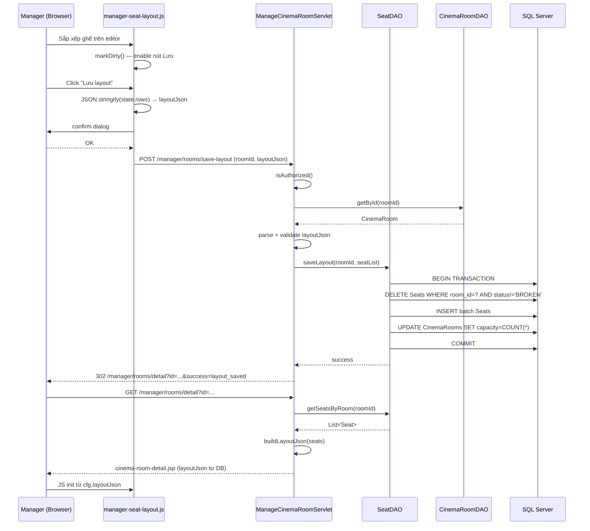

# Thiết kế Quản lý Layout Ghế (FR-26 + FR-27)

> **Dự án:** ÉPCINE — Movie Ticket Booking System (SWP391)  
> **Module:** Manager — Phòng chiếu & Layout ghế  
> **FR liên quan:** FR-26 (Cinema Room Management), FR-27 (Seat Type & Pricing Management)  
> **Tài liệu liên quan:** [`MANAGER_MODULE_DETAIL.md`](MANAGER_MODULE_DETAIL.md) · [`project_summary_final.md`](project_summary_final.md)  
> **Ngày:** 08/06/2026

---

## 1. Hiện trạng & Khoảng trống

### 1.1 Đã có (UI-only)

| Thành phần | Trạng thái | File |
|---|---|---|
| Danh sách phòng chiếu (đọc DB) | ✅ | `ManageCinemaRoomServlet`, `cinema-room-list.jsp` |
| Chi tiết phòng + editor layout (frontend) | ✅ UI | `cinema-room-detail.jsp`, `manager-seat-layout.js` |
| Sidebar loại ghế từ DB | ✅ | `SeatTypeDAO.getAll()` |
| Lưu layout tạm vào `localStorage` | ✅ | `manager-seat-layout.js` |
| `CinemaRoomDAO`: read (getAll, getById, countActiveSeats) | ✅ | `CinemaRoomDAO.java` |
| `SeatDAO`: đọc ghế theo suất (dùng bởi Staff counter) | ✅ | `SeatDAO.getSeatsForShowtime()` |

### 1.2 Chưa có (backend cần làm)

| Hạng mục | FR | Ghi chú |
|---|---|---|
| POST tạo phòng chiếu | FR-26 | `CinemaRooms` INSERT |
| POST sửa tên phòng | FR-26 | `CinemaRooms` UPDATE |
| POST toggle ACTIVE / MAINTENANCE / INACTIVE | FR-26 | `CinemaRooms.status` UPDATE |
| **POST lưu layout ghế vào DB** | FR-26 | INSERT/DELETE `Seats`, sync `capacity` |
| **GET tải layout ghế từ DB** | FR-26 | Thay demo / localStorage |
| POST tạo/sửa loại ghế + hệ số giá | FR-27 | `SeatTypes` CRUD |

---

## 2. Phạm vi thiết kế

Tài liệu này tập trung vào **2 nhóm tính năng**:

**Nhóm A — FR-26: CRUD phòng chiếu + Persist layout ghế**  
Hoàn thiện luồng Manager tạo phòng, sửa thông tin, đổi trạng thái và **lưu sơ đồ ghế thực sự vào bảng `Seats`**.

**Nhóm B — FR-27: CRUD loại ghế & hệ số giá**  
Trang riêng cho Manager quản lý `SeatTypes` (tên, hệ số nhân, mô tả).

---

## 3. Schema DB tham chiếu

```sql
-- Phòng chiếu (đã có, 3 phòng seed)
CREATE TABLE CinemaRooms (
    id         UNIQUEIDENTIFIER NOT NULL DEFAULT NEWID() PRIMARY KEY,
    room_name  NVARCHAR(100)    NOT NULL,                -- UK
    capacity   INT              NOT NULL DEFAULT 0,      -- denormalized, phải sync
    status     NVARCHAR(20)     NOT NULL DEFAULT 'ACTIVE',  -- ACTIVE | MAINTENANCE | INACTIVE
    created_at DATETIME2        NOT NULL DEFAULT GETDATE()
);

-- Loại ghế (seed: REGULAR ×1.0, VIP ×1.5, COUPLE ×2.0, SWEETBOX ×2.5)
CREATE TABLE SeatTypes (
    id               UNIQUEIDENTIFIER NOT NULL DEFAULT NEWID() PRIMARY KEY,
    type_name        NVARCHAR(50)     NOT NULL,          -- UK
    price_multiplier DECIMAL(4,2)     NOT NULL,
    description      NVARCHAR(255)    NULL
);

-- Ghế vật lý (chưa có dữ liệu, cần persist từ editor)
CREATE TABLE Seats (
    id           UNIQUEIDENTIFIER NOT NULL DEFAULT NEWID() PRIMARY KEY,
    room_id      UNIQUEIDENTIFIER NOT NULL,    -- FK → CinemaRooms
    seat_type_id UNIQUEIDENTIFIER NOT NULL,    -- FK → SeatTypes
    seat_row     NVARCHAR(10)     NOT NULL,    -- 'A', 'B', ...
    seat_column  INT              NOT NULL,    -- 1, 2, 3 ...
    seat_code    NVARCHAR(20)     NOT NULL,    -- 'A1', 'B5' ...
    status       NVARCHAR(10)     NOT NULL DEFAULT 'ACTIVE',  -- ACTIVE | BROKEN | BLOCKED
    CONSTRAINT UK_Seats_RoomCode UNIQUE (room_id, seat_code)
);
```

**Quy tắc sync `capacity`:**
Mỗi khi layout ghế được lưu, phải cập nhật:
```sql
UPDATE CinemaRooms SET capacity = (
    SELECT COUNT(*) FROM Seats WHERE room_id = ? AND status = 'ACTIVE'
) WHERE id = ?
```

---

## 4. Bảng URL mới (Nhóm A + B)

| URL | Method | Servlet | Chức năng |
|---|---|---|---|
| `/manager/rooms` | GET | `ManageCinemaRoomServlet` | ✅ đã có — danh sách |
| `/manager/rooms` | **POST** | `ManageCinemaRoomServlet` | **MỚI** — tạo phòng |
| `/manager/rooms/detail?id=` | GET | `ManageCinemaRoomServlet` | ✅ đã có — chi tiết + editor |
| `/manager/rooms/update` | **POST** | `ManageCinemaRoomServlet` | **MỚI** — sửa tên/trạng thái |
| `/manager/rooms/save-layout` | **POST** | `ManageCinemaRoomServlet` | **MỚI** — lưu layout ghế |
| `/manager/seat-types` | GET | `ManageSeatTypeServlet` | **MỚI (FR-27)** — danh sách |
| `/manager/seat-types` | POST | `ManageSeatTypeServlet` | **MỚI (FR-27)** — tạo/sửa |

> Tất cả thao tác ghi dùng **form POST** — nhất quán với pattern `ManageMovieServlet`, `ManageGenreServlet`.

---

## 5. Nhóm A — FR-26: CRUD phòng chiếu

### 5.1 POST tạo phòng — `POST /manager/rooms`

**Form fields:**

| Field | Param | Bắt buộc | Ghi chú |
|---|---|---|---|
| Tên phòng | `roomName` | ✅ | Unique, max 100 ký tự |

**Luồng:**

```
isAuthorized()
    → trim roomName
    → validate: blank? → error
    → CinemaRoomDAO.existsByName(roomName)? → error "Tên phòng đã tồn tại"
    → CinemaRoomDAO.create(roomName)
        INSERT CinemaRooms (id=NEWID(), room_name=?, capacity=0, status='ACTIVE')
    → redirect /manager/rooms?success=created
```

**Validation:**

| Rule | Thông báo |
|---|---|
| `roomName` trống | "Tên phòng không được để trống." |
| `roomName` > 100 ký tự | "Tên phòng không quá 100 ký tự." |
| Trùng `room_name` | "Tên phòng đã tồn tại trong hệ thống." |

### 5.2 POST sửa phòng + đổi trạng thái — `POST /manager/rooms/update`

**Form fields:**

| Field | Param | Bắt buộc | Ghi chú |
|---|---|---|---|
| ID phòng | `roomId` | ✅ | UUID |
| Tên mới | `roomName` | Khi action=rename | |
| Trạng thái | `status` | Khi action=toggle | ACTIVE / MAINTENANCE / INACTIVE |
| Hành động | `action` | ✅ | `rename` \| `toggle` |

**Luồng `action=rename`:**

```
isAuthorized()
    → CinemaRoomDAO.getById(roomId) → null → redirect list
    → validate roomName
    → CinemaRoomDAO.existsByNameExcluding(roomName, roomId)? → error
    → CinemaRoomDAO.updateName(roomId, roomName)
    → redirect /manager/rooms/detail?id=roomId&success=updated
```

**Luồng `action=toggle`:**

```
isAuthorized()
    → validate status ∈ {ACTIVE, MAINTENANCE, INACTIVE}
    → kiểm tra không có Showtimes ACTIVE trong tương lai cho phòng này khi chuyển sang MAINTENANCE/INACTIVE
    → CinemaRoomDAO.updateStatus(roomId, status)
    → redirect /manager/rooms/detail?id=roomId&success=status_updated
```

**Business rule:** Không được chuyển phòng sang `MAINTENANCE` hoặc `INACTIVE` nếu còn suất chiếu ACTIVE chưa diễn ra (join `Showtimes` theo `room_id` + `start_time > NOW()` + `status='ACTIVE'`). Thông báo: *"Phòng còn {n} suất chiếu sắp tới, không thể đổi trạng thái."*

---

## 6. Nhóm A — FR-26: Persist Layout Ghế

### 6.1 Thiết kế JSON payload (frontend → backend)

Khi Manager nhấn **"Lưu layout"**, JS gửi form POST với hidden field `layoutJson`:

```json
{
  "rows": [
    {
      "label": "A",
      "cells": [
        { "kind": "seat", "type": "regular", "code": "A1", "col": 1 },
        { "kind": "seat", "type": "regular", "code": "A2", "col": 2 },
        { "kind": "gap" },
        { "kind": "seat", "type": "vip",     "code": "A3", "col": 3 }
      ]
    },
    {
      "label": "B",
      "cells": [
        { "kind": "seat", "type": "couple",   "code": "B1", "col": 1 },
        { "kind": "seat", "type": "sweetbox", "code": "B2", "col": 2 }
      ]
    }
  ]
}
```

**Quy tắc đánh số `seat_column`:**
- Chỉ đếm các cell có `kind=seat` theo thứ tự xuất hiện trong hàng, bắt đầu từ 1.
- `gap` không được đánh số cột.
- `seat_code` = `{rowLabel}{seat_column}` — ví dụ: hàng B, ghế thứ 3 trong hàng → `B3`.

### 6.2 Endpoint — `POST /manager/rooms/save-layout`

**Form fields:**

| Param | Bắt buộc | Mô tả |
|---|---|---|
| `roomId` | ✅ | UUID phòng |
| `layoutJson` | ✅ | JSON string theo định dạng mục 6.1 |

**Luồng backend:**

```
isAuthorized()
    → getById(roomId) → null → redirect /manager/rooms
    → parse layoutJson → List<SeatDTO>
        lỗi parse → error "Dữ liệu layout không hợp lệ."
    → validate:
        - Không trùng seat_code trong cùng phòng (kiểm tra nội bộ payload)
        - Tổng ghế ≥ 0 (layout rỗng vẫn hợp lệ — phòng đang sửa chữa)
        - seat_row, seat_column hợp lệ (không rỗng, col ≥ 1)
    → SeatDAO.saveLayout(roomId, seatList) [transaction]
        ① DELETE FROM Seats WHERE room_id = ? AND status != 'BROKEN'
           (giữ lại ghế BROKEN — đã ghi nhận thực tế hỏng)
        ② INSERT batch tất cả ghế mới (status = 'ACTIVE')
        ③ UPDATE CinemaRooms SET capacity = COUNT ghế ACTIVE WHERE id = ?
    → redirect /manager/rooms/detail?id=roomId&success=layout_saved
```

**Xử lý ghế BROKEN:**  
Ghế `BROKEN` không bị xóa khi save layout vì đã được staff ghi nhận là hỏng thực tế. Nếu seat_code của ghế BROKEN không có trong payload mới → giữ nguyên trạng thái BROKEN. Nếu Manager đưa code đó vào lại → cập nhật thành ACTIVE (coi như đã sửa).

### 6.3 Tải layout từ DB (thay localStorage)

Trong `GET /manager/rooms/detail`, servlet đọc:

```java
List<Seat> dbSeats = seatDAO.getSeatsByRoom(roomId);
// Truyền sang JSP dưới dạng JSON string để JS khởi tạo editor
String layoutJson = buildLayoutJson(dbSeats);
req.setAttribute("layoutJson", layoutJson);
req.setAttribute("dbSeatCount", dbSeats.size());
```

**`buildLayoutJson()`** nhóm `Seat` theo `seat_row`, sắp xếp theo `seat_column`, sinh JSON:

```java
private String buildLayoutJson(List<Seat> seats) {
    // Nhóm theo seat_row → danh sách cell theo thứ tự seat_column
    // gap không lưu DB → chỉ reconstruct seats
    // JS nhận và hiển thị đúng loại ghế từ type_name
}
```

**Thứ tự ưu tiên tải layout trong JS (cập nhật `manager-seat-layout.js`):**

```
1. cfg.layoutJson  → layout từ DB (mảng rows đã parse)
2. localStorage    → bản nháp chưa lưu
3. demoLayout()    → fallback khi phòng hoàn toàn mới (cfg.dbSeatCount == 0 và không có draft)
```

> Khi đã có `cfg.layoutJson` (từ DB), bỏ qua localStorage để tránh xung đột giữa bản nháp cũ và dữ liệu thực.

### 6.4 `SeatDAO` — Các method mới

| Method | SQL / Logic |
|---|---|
| `getSeatsByRoom(roomId)` | `SELECT ... FROM Seats WHERE room_id = ? AND status != 'BROKEN' ORDER BY seat_row, seat_column` |
| `saveLayout(roomId, seats)` [transaction] | DELETE ghế non-BROKEN + INSERT batch + UPDATE capacity |
| `markBroken(seatId)` | `UPDATE Seats SET status = 'BROKEN' WHERE id = ?` *(dùng bởi Staff / Manager khi ghế hỏng)* |

**SQL `saveLayout` (trong 1 transaction):**

```sql
-- Bước 1: Xóa ghế không phải BROKEN của phòng
DELETE FROM Seats WHERE room_id = ? AND status <> 'BROKEN';

-- Bước 2: Insert batch
INSERT INTO Seats (id, room_id, seat_type_id, seat_row, seat_column, seat_code, status)
VALUES (NEWID(), ?, ?, ?, ?, ?, 'ACTIVE');
-- lặp cho từng ghế trong payload

-- Bước 3: Sync capacity
UPDATE CinemaRooms
SET capacity = (SELECT COUNT(*) FROM Seats WHERE room_id = ? AND status = 'ACTIVE')
WHERE id = ?;
```

### 6.5 `CinemaRoomDAO` — Các method mới

| Method | SQL |
|---|---|
| `create(roomName)` | `INSERT CinemaRooms (id, room_name, capacity, status) VALUES (NEWID(), ?, 0, 'ACTIVE')` |
| `updateName(id, name)` | `UPDATE CinemaRooms SET room_name = ? WHERE id = ?` |
| `updateStatus(id, status)` | `UPDATE CinemaRooms SET status = ? WHERE id = ?` |
| `existsByName(name)` | `SELECT 1 ... WHERE room_name = ?` |
| `existsByNameExcluding(name, id)` | `SELECT 1 ... WHERE room_name = ? AND id <> ?` |
| `hasActiveShowtimes(id)` | `SELECT COUNT(*) FROM Showtimes WHERE room_id = ? AND start_time > GETDATE() AND status = 'ACTIVE'` |

---

## 7. Cập nhật Frontend (`manager-seat-layout.js`)

### 7.1 Thay `saveDraft()` bằng `submitToBackend()`

```javascript
function submitToBackend() {
  var payload = JSON.stringify({ rows: state.rows });
  var form = document.getElementById('sltSaveForm');
  document.getElementById('sltLayoutJsonInput').value = payload;
  if (confirm('Lưu layout ghế vào database?')) {
    form.submit();
  }
}
```

Trong `cinema-room-detail.jsp`, thêm hidden form:

```html
<form id="sltSaveForm" method="POST" action="/manager/rooms/save-layout">
  <input type="hidden" name="roomId"     value="${room.id}" />
  <input type="hidden" id="sltLayoutJsonInput" name="layoutJson" value="" />
</form>
```

### 7.2 Khởi tạo từ DB (thêm vào `SLT_CONFIG`)

Trong `cinema-room-detail.jsp`, truyền dữ liệu DB sang JS:

```jsp
<script>
window.SLT_CONFIG = {
  roomId:     '${room.id}',
  dbSeatCount: ${dbSeatCount},
  layoutJson:  ${empty layoutJson ? 'null' : layoutJson}  <%-- JSON đã escape --%>
};
</script>
```

Trong `loadLayout()` của JS (logic mới):

```javascript
function loadLayout() {
  // 1. DB data
  if (cfg.layoutJson && cfg.layoutJson.rows) {
    return cfg.layoutJson.rows;
  }
  // 2. Local draft (chỉ khi DB chưa có ghế)
  if (cfg.dbSeatCount === 0) {
    try {
      var raw = localStorage.getItem(storageKey());
      if (raw) {
        var parsed = JSON.parse(raw);
        if (parsed && parsed.rows) return parsed.rows;
      }
    } catch (e) { /* ignore */ }
    return demoLayout();
  }
  return emptyLayout();
}
```

### 7.3 Ánh xạ `type_name` DB → CSS class

`SeatTypeDAO.getAll()` trả về `type_name` như `REGULAR`, `VIP`, `COUPLE`, `SWEETBOX`.  
JS cần normalize về lowercase để khớp `TYPE_META`:

```javascript
function normalizeType(name) {
  return (name || '').toLowerCase();
}
```

Khi parse `cfg.layoutJson`, áp dụng `normalizeType(cell.type)`.

---

## 8. Nhóm B — FR-27: CRUD Loại Ghế

### 8.1 Servlet mới — `ManageSeatTypeServlet`

**URL:** `/manager/seat-types`  
**View:** `manager/seat-type-list.jsp`  
**Pattern:** Giống `ManageGenreServlet` (list + form inline)

#### GET

```
isAuthorized()
    → SeatTypeDAO.getAll() → seatTypeList
    → ?action=edit&id=... → SeatTypeDAO.getById(id) → editSeatType
    → forward seat-type-list.jsp
```

#### POST — Tạo (`action` không phải `update`)

**Form fields:**

| Param | Bắt buộc | Ghi chú |
|---|---|---|
| `typeName` | ✅ | Unique, UPPER hoặc mixed, max 50 |
| `priceMultiplier` | ✅ | Decimal > 0, ví dụ `1.5` |
| `description` | | Max 255 |

```
validate()
    → SeatTypeDAO.isDuplicate(typeName)? → error
    → SeatTypeDAO.create(typeName, multiplier, description)
    → redirect /manager/seat-types?success=created
```

#### POST — Sửa (`action=update`)

```
getById(id) → validate → SeatTypeDAO.update(id, ...)
    → redirect ?success=updated
```

**Không cho xóa loại ghế nếu còn ghế đang dùng loại đó** (`SELECT COUNT(*) FROM Seats WHERE seat_type_id = ?`). Nếu = 0 thì cho xóa soft (set status = INACTIVE) hoặc hard delete tùy quyết định team.

### 8.2 `SeatTypeDAO` — Các method cần bổ sung

| Method | SQL |
|---|---|
| `getById(id)` | `SELECT ... WHERE id = ?` |
| `isDuplicate(typeName)` | `COUNT WHERE type_name = ?` |
| `isDuplicateExcluding(typeName, id)` | `COUNT WHERE type_name = ? AND id <> ?` |
| `create(typeName, multiplier, desc)` | `INSERT SeatTypes (id, type_name, price_multiplier, description)` |
| `update(id, typeName, multiplier, desc)` | `UPDATE SeatTypes SET ...` |
| `countUsedIn(seatTypeId)` | `COUNT FROM Seats WHERE seat_type_id = ?` |

---

## 9. Navigation & Menu

Thêm vào menu MANAGER trong `header.jsp`:

```html
<%-- Menu MANAGER --%>
<a href="/manager/rooms">Quản lý phòng chiếu</a>
<a href="/manager/seat-types">Quản lý loại ghế</a>  <%-- Thêm mới FR-27 --%>
```

Thêm vào `AccessControl.java`:

```java
// Đã có:
"/manager/" → Set.of("MANAGER")
// URL /manager/seat-types tự động được bảo vệ bởi prefix rule
```

---

## 10. Luồng tổng hợp (Sequence Diagram)

### 10.1 Manager lưu layout ghế



### 10.2 Manager tạo phòng chiếu mới

```mermaid
flowchart LR
    A[/manager/rooms] -->|Click Thêm phòng| B[Form Thêm phòng trên trang list]
    B -->|POST /manager/rooms| C{Validate}
    C -->|Lỗi| D[Re-render form với error]
    C -->|OK| E[CinemaRoomDAO.create]
    E --> F[Redirect list + success=created]
    F -->|Click Chi tiết| G[/manager/rooms/detail?id=]
    G -->|Editor rỗng| H[Sắp xếp ghế]
    H -->|POST save-layout| I[SeatDAO.saveLayout]
    I --> G
```

---

## 11. Model & DTO

### 11.1 DTO `SeatLayoutDto` (mới)

```java
// model/dto/SeatLayoutDto.java
public class SeatLayoutDto {
    private String roomId;
    private List<RowDto> rows;

    public static class RowDto {
        private String label;        // "A", "B", ...
        private List<CellDto> cells;
    }

    public static class CellDto {
        private String kind;         // "seat" | "gap"
        private String type;         // "regular" | "vip" | "couple" | "sweetbox" (chỉ khi kind=seat)
        private String code;         // "A1", "B3" (chỉ khi kind=seat)
        private int col;             // số thứ tự cột (1-based, chỉ kind=seat)
    }
}
```

Servlet parse JSON bằng thư viện có sẵn hoặc tự parse thủ công (không có Gson/Jackson trong dependencies hiện tại — xem mục 11.3).

### 11.2 Entity `Seat` (bổ sung field)

`model/entity/Seat.java` hiện đủ fields. Chỉ cần bổ sung constructor tiện lợi cho `saveLayout`:

```java
public Seat(String roomId, String seatTypeId, String seatRow, int seatColumn, String seatCode) {
    this.roomId = roomId;
    this.seatTypeId = seatTypeId;
    this.seatRow = seatRow;
    this.seatColumn = seatColumn;
    this.seatCode = seatCode;
    this.status = "ACTIVE";
}
```

### 11.3 Xử lý JSON parse (không có Gson/Jackson)

Dự án chỉ dùng JDBC + JSTL, không có JSON library. Hai lựa chọn:

**Lựa chọn A (đơn giản, không thêm dependency):**  
Tự parse JSON đơn giản bằng regex/split trong servlet (fragile nhưng không cần thêm JAR). Chỉ nên dùng nếu format JSON cố định và không lồng sâu.

**Lựa chọn B (khuyến nghị):**  
Thêm `org.json` (JSON.org) vào `pom.xml`:

```xml
<dependency>
    <groupId>org.json</groupId>
    <artifactId>json</artifactId>
    <version>20240303</version>
</dependency>
```

Dùng `JSONObject` / `JSONArray` để parse `layoutJson`. Thư viện nhỏ (~70 KB), không kéo thêm dependency phức tạp.

Parse trong servlet:

```java
JSONObject root = new JSONObject(layoutJson);
JSONArray rowsArr = root.getJSONArray("rows");
List<SeatLayoutDto.RowDto> rows = new ArrayList<>();
for (int i = 0; i < rowsArr.length(); i++) {
    JSONObject rowObj = rowsArr.getJSONObject(i);
    String label = rowObj.getString("label");
    JSONArray cells = rowObj.getJSONArray("cells");
    // ... build RowDto, CellDto
}
```

---

## 12. Validation & Business Rules tổng hợp

| # | Quy tắc | Nơi enforce |
|---|---|---|
| 1 | `room_name` unique | `CinemaRoomDAO.existsByName()` + DB UK |
| 2 | `seat_code` unique trong phòng | validate nội bộ payload + DB `UK_Seats_RoomCode` |
| 3 | Không toggle MAINTENANCE/INACTIVE khi còn suất chiếu active tương lai | `CinemaRoomDAO.hasActiveShowtimes()` |
| 4 | `capacity` luôn sync với `COUNT(Seats ACTIVE)` | `saveLayout` transaction step 3 |
| 5 | Ghế BROKEN không bị xóa khi save layout mới | DELETE WHERE status != 'BROKEN' |
| 6 | `seat_column` = thứ tự seat (không đếm gap) | Logic convert trong servlet / JS |
| 7 | Không xóa loại ghế đang có ghế thuộc loại đó | `SeatTypeDAO.countUsedIn()` |
| 8 | `price_multiplier` > 0 | Validate form + DB CHECK nếu cần |
| 9 | Layout rỗng (0 ghế) hợp lệ | Phòng đang cải tạo |
| 10 | Chỉ MANAGER vào `/manager/*` | `RoleFilter` + `AccessControl` |

---

## 13. Giao diện (UI)

### 13.1 Trang danh sách phòng (`cinema-room-list.jsp`) — bổ sung

- Thêm **form inline** hoặc **modal** "Thêm phòng chiếu" → POST `/manager/rooms`
- Nút toggle trạng thái trên card → POST `/manager/rooms/update` (action=toggle)
- Flash message thành công/lỗi (dùng session flash pattern giống `AdminAuthUtil`)
- Bỏ `disabled` trên nút "Thêm phòng chiếu" sau khi backend sẵn sàng

### 13.2 Trang editor ghế (`cinema-room-detail.jsp`) — bổ sung

- Thêm `<form id="sltSaveForm">` hidden (xem mục 7.1)
- Thêm form sửa tên phòng (inline, POST `/manager/rooms/update` action=rename)
- Nút toggle trạng thái phòng → POST `/manager/rooms/update` action=toggle
- Thay thông báo "Lưu tạm trên trình duyệt" bằng luồng POST thực

**Nút "Lưu layout" — UX flow:**

```
Click "Lưu layout"
  → JS serialize state.rows → layoutJson
  → confirm("Lưu layout vào database? Ghế hiện tại trong DB sẽ được thay thế.")
  → OK → form.submit()
  → Server xử lý → redirect về detail với success flash
```

### 13.3 Trang loại ghế (`seat-type-list.jsp`) — mới (FR-27)

- Layout 2 cột: form tạo/sửa trái + bảng danh sách phải (giống `genre-list.jsp`)
- Bảng: tên loại, hệ số giá, mô tả, số ghế đang dùng, nút Sửa
- Badge màu loại ghế tương ứng với màu CSS hiện có (regular/vip/couple/sweetbox)
- Không có nút xóa nếu còn ghế dùng loại đó

---

## 14. Thứ tự triển khai gợi ý

| Bước | Nội dung | Dependency |
|---|---|---|
| 1 | Thêm `org.json` vào `pom.xml` | — |
| 2 | `CinemaRoomDAO`: thêm `create`, `updateName`, `updateStatus`, `existsByName*`, `hasActiveShowtimes` | — |
| 3 | `SeatDAO`: thêm `getSeatsByRoom`, `saveLayout` (transaction) | — |
| 4 | `ManageCinemaRoomServlet`: thêm xử lý `doPost` cho tạo phòng, sửa phòng, lưu layout | Bước 2 & 3 |
| 5 | Cập nhật `cinema-room-list.jsp`: form tạo phòng, nút toggle | Bước 4 |
| 6 | Cập nhật `cinema-room-detail.jsp`: form sửa tên, form lưu layout (hidden) | Bước 4 |
| 7 | Cập nhật `manager-seat-layout.js`: load từ DB, submit form thực | Bước 6 |
| 8 | `SeatTypeDAO`: thêm `getById`, CRUD, `countUsedIn` | — |
| 9 | Tạo `ManageSeatTypeServlet` + `seat-type-list.jsp` (FR-27) | Bước 8 |
| 10 | Thêm link "Quản lý loại ghế" vào menu MANAGER | Bước 9 |
| 11 | Test thủ công theo checklist mục 15 | Tất cả |

---

## 15. Checklist test thủ công

### FR-26 — Phòng chiếu

- [ ] Tạo phòng mới → xuất hiện trong danh sách với capacity = 0
- [ ] Validate: tên trống → lỗi
- [ ] Validate: trùng tên → lỗi
- [ ] Sửa tên phòng → cập nhật đúng
- [ ] Toggle ACTIVE → MAINTENANCE
- [ ] Toggle MAINTENANCE → ACTIVE
- [ ] Toggle phòng có suất chiếu tương lai → thông báo chặn
- [ ] Truy cập detail phòng mới (chưa có ghế) → editor hiện demo layout
- [ ] Sắp xếp ghế: thêm hàng A (5 regular), hàng B (3 vip), hàng C (2 couple) → Lưu layout
- [ ] Sau save: redirect về detail → editor load đúng layout từ DB
- [ ] `capacity` trong danh sách phòng = số ghế vừa lưu
- [ ] Thêm lối đi (gap) giữa ghế → lưu → tải lại: lối đi vẫn ở đúng vị trí
- [ ] Lưu layout mới → layout cũ trong DB bị thay thế, capacity cập nhật
- [ ] Xóa toàn bộ ghế (Xóa hết) → Lưu → capacity = 0

### FR-27 — Loại ghế

- [ ] Truy cập `/manager/seat-types` → 4 loại seed
- [ ] Tạo loại mới (tên + hệ số + mô tả) → xuất hiện trong danh sách
- [ ] Validate: tên trống → lỗi
- [ ] Validate: hệ số ≤ 0 → lỗi
- [ ] Validate: trùng tên → lỗi
- [ ] Sửa hệ số giá → cập nhật đúng
- [ ] Loại mới xuất hiện trong sidebar editor layout ghế (sau reload trang detail)
- [ ] Không xóa được loại ghế đang có ghế sử dụng

### Tích hợp với booking

- [ ] Ghế từ DB (`getSeatsByRoom` + join suất chiếu) hiển thị đúng trong `counter-booking.jsp`
- [ ] Giá vé tính đúng: `base_price × price_multiplier` (ghế VIP đắt hơn Regular)

---

## 16. Ghi chú kỹ thuật

1. **`seat_column` vs vị trí hiển thị:**  
   `seat_column` trong DB là số thứ tự ghế trong hàng (1, 2, 3...), không phải vị trí pixel. Gap không có `seat_column`. Khi reconstruct editor từ DB, gap **không được khôi phục** (layout DB chỉ lưu ghế thực tế) — đây là trade-off chấp nhận được cho scope SWP391.

2. **Transaction `saveLayout`:**  
   Phải dùng explicit transaction (`conn.setAutoCommit(false)`) để đảm bảo DELETE + INSERT + UPDATE capacity là atomic. Nếu INSERT fail giữa chừng, rollback tránh mất ghế.

3. **`capacity` denormalized:**  
   Cập nhật `capacity` trong cùng transaction với `saveLayout`. Không dùng trigger DB để tránh phụ thuộc platform.

4. **Gap trong editor:**  
   Gap chỉ là UI element — không lưu DB. Khi load layout từ DB, editor không có gap. Manager cần thêm gap lại nếu muốn. Thông báo rõ ràng trên UI: *"Lối đi không được lưu vào database — chỉ lưu vị trí ghế thực tế."*

5. **Couple/Sweetbox seat (wide seat):**  
   Trong DB, 1 ghế đôi = 1 row trong `Seats` (1 `seat_code`). Width hiển thị là CSS `wide` class. Giá tính theo `price_multiplier` của loại ghế đó (COUPLE ×2.0).

6. **Phòng có suất chiếu đã đặt ghế:**  
   Không chặn save layout (Manager có thể cần sửa layout), nhưng cảnh báo nếu phòng có `BookingSeats` chưa diễn ra: *"Phòng có {n} ghế đã đặt trong các suất chiếu sắp tới. Lưu layout mới có thể ảnh hưởng đến sơ đồ ghế hiển thị cho khách."* — chỉ là cảnh báo, không chặn.

---

*Tài liệu thiết kế layout ghế — viết 08/06/2026. Cập nhật khi có quyết định thay đổi spec hoặc implementation.*
