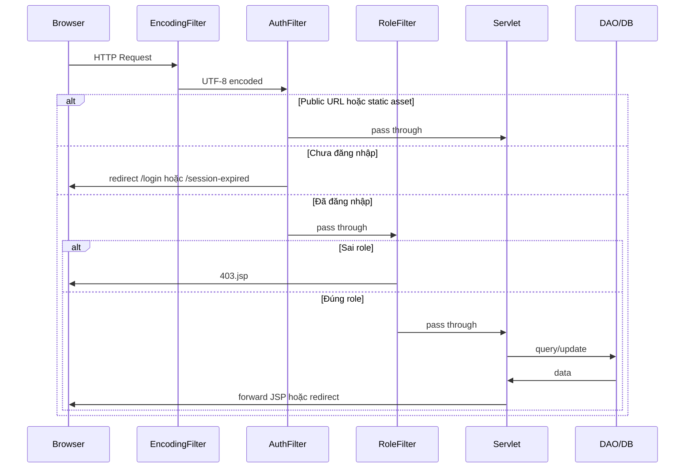

# ÉPCINE — Tổng hợp Source Code (đến 15/06/2026)

> **Dự án:** Movie Ticket Booking System (SWP391)  
> **Stack:** Java 17 · Jakarta Servlet 6 · JSP/JSTL · JDBC · SQL Server · Maven WAR · Tomcat 10  
> **Phạm vi tài liệu:** Toàn bộ source code **đã triển khai** trong repo (không bao gồm `target/`, `.git/`)

Tài liệu nghiệp vụ đầy đủ (27 bảng, 50 FR): [`project_summary_final.md`](project_summary_final.md)  
Hướng dẫn cài đặt & chạy: [`README.md`](README.md)  
Hướng dẫn Database & migration: [`Database/README.md`](Database/README.md)  
Chi tiết module Admin: [`ADMIN_MODULE_DETAIL.md`](ADMIN_MODULE_DETAIL.md)  
Chi tiết module Manager: [`MANAGER_MODULE_DETAIL.md`](MANAGER_MODULE_DETAIL.md)  
Chi tiết module Customer: [`CUSTOMER_MODULE_DETAIL.md`](CUSTOMER_MODULE_DETAIL.md)

---

## 1. Tổng quan kiến trúc

```
Browser
   │
   ▼
┌─────────────────────────────────────────────────────────┐
│  Filters (web.xml)                                      │
│  EncodingFilter → AuthFilter → RoleFilter               │
└─────────────────────────────────────────────────────────┘
   │
   ▼
┌─────────────────────────────────────────────────────────┐
│  Controller (Servlet @WebServlet)                       │
│  auth · admin · manager · staff · public · customer*    │
└─────────────────────────────────────────────────────────┘
   │
   ▼
┌─────────────────────────────────────────────────────────┐
│  DAL (DAO + DBContext)                                  │
└─────────────────────────────────────────────────────────┘
   │
   ▼
┌─────────────────────────────────────────────────────────┐
│  SQL Server — MovieTicketDB (26 bảng)                   │
└─────────────────────────────────────────────────────────┘
```

**Mô hình:** MVC thuần Servlet — Servlet = Controller, JSP = View, Entity/DTO = Model.

| Thống kê | Số lượng |
|----------|----------|
| File Java (`src/main/java`) | **~105** |
| Servlet đã triển khai | **~31** |
| DAO | **15** |
| Entity | **13** |
| DTO | **6** |
| Filter | **3** |
| Util | **19** |
| JSP view | **~34** (+ 4 `.gitkeep`) |
| CSS | **12** |
| JS | **8** |
| Script SQL | `create_database.sql` |
| Screen Design (mockup HTML) | **4 màn** (Cinema Auditoriums, Seat Layout, Showtime Management, Movie-detail) |

---

## 2. Cấu trúc thư mục

```
MovieTicketBookingSystem/
├── pom.xml                          # Maven WAR, Java 17
├── README.md
├── project_summary_final.md         # Spec nghiệp vụ
├── SOURCE_CODE_OVERVIEW.md          # ← File này
├── ADMIN_MODULE_DETAIL.md           # Chi tiết Admin
├── MANAGER_MODULE_DETAIL.md         # Chi tiết Manager
├── CUSTOMER_MODULE_DETAIL.md        # Chi tiết Customer
├── implementation_plan.md           # Kế hoạch triển khai FR (spec nội bộ)
├── implementation_plan_fr-11.md     # Kế hoạch FR-11 (lịch chiếu khách hàng)
├── SEAT_LAYOUT_DESIGN.md            # Thiết kế layout ghế
├── Database/
│   └── create_database.sql          # Schema + seed data
├── scripts/                         # Setup & Git hooks
│   ├── setup.bat / setup.ps1
│   ├── install-git-hooks.bat
│   ├── backup-database-properties.bat
│   ├── restore-database-properties.bat
│   └── githooks/post-merge
└── src/main/
    ├── java/
    │   ├── controller/              # Servlet (theo role)
    │   ├── dal/                     # Data Access Layer
    │   ├── filter/                  # Servlet filters
    │   ├── model/                   # entity · dto · enums
    │   └── utils/                   # Auth, email, OAuth, image upload, validators...
    ├── resources/                   # database/email/google properties
    └── webapp/
        ├── index.jsp
        ├── css/ · js/ · images/
        └── WEB-INF/
            ├── web.xml
            └── views/                 # JSP (auth, admin, manager, staff, customer, common, error)
```

---

## 3. Cấu hình dự án

### 3.1 `pom.xml`

| Mục | Giá trị |
|-----|---------| 
| GroupId | `edu.fpt.swp391` |
| ArtifactId | `MovieTicketBookingSystem` |
| Packaging | `war` |
| Java | 17 |

**Dependencies chính:**

| Thư viện | Phiên bản | Mục đích |
|----------|-----------|----------|
| `jakarta.servlet-api` | 6.0.0 | Servlet (provided) |
| `jakarta.servlet.jsp-api` | 3.1.1 | JSP (provided) |
| JSTL API + impl | 3.0.x | Taglib trong JSP |
| `mssql-jdbc` | 12.8.1 | Kết nối SQL Server |
| `jbcrypt` | 0.4 | Hash mật khẩu |
| `jakarta.mail` | 2.0.1 | Gửi email xác thực |
| JUnit Jupiter | 5.10.2 | Test (chưa có test case) |

### 3.2 `web.xml`

| Cấu hình | Giá trị |
|----------|---------|
| Session timeout | **1440 phút** (24 giờ idle) |
| Welcome file | `index.jsp` → redirect `/home` |
| Servlet khai báo | Không — dùng annotation `@WebServlet` |

**Thứ tự Filter:**

1. `EncodingFilter` — `/*` — UTF-8
2. `AuthFilter` — `/*` — FR-29: bắt buộc đăng nhập
3. `RoleFilter` — `/*` — FR-29: phân quyền theo URL prefix

### 3.3 Properties (`src/main/resources/`)

| File | Trạng thái Git | Mục đích |
|------|----------------|----------|
| `database.properties.example` | Committed | Template kết nối SQL Server |
| `database.properties` | Gitignored | Config thật (local) |
| `email.properties.example` | Committed | Template Gmail SMTP |
| `email.properties` | Gitignored | Config email thật |
| `google.properties.example` | Committed | Template Google OAuth |
| `google.properties` | Gitignored | Config OAuth thật |

`DBContext` đọc `database.properties` lúc khởi tạo static, ném `ExceptionInInitializerError` nếu thiếu file.

---

## 4. Bảng URL & Servlet (toàn hệ thống)

### 4.1 Public — không cần đăng nhập

| URL | Servlet | Method | View |
|-----|---------|--------|------|
| `/` → `/home` | `HomeServlet` | GET | `common/home.jsp` |
| `/movies` | `MovieListServlet` | GET | `common/movies.jsp` |
| `/showtimes` | `ShowtimesServlet` | GET | `customer/showtimes.jsp` |
| `/login` | `LoginServlet` | GET, POST | `auth/login.jsp` |
| `/register` | `RegisterServlet` | GET, POST | `auth/register.jsp` |
| `/register/pending` | `RegisterPendingServlet` | GET | `auth/register-pending.jsp` |
| `/verify-email` | `VerifyEmailServlet` | GET | redirect |
| `/register/google-complete` | `GoogleCompleteServlet` | GET, POST | `auth/google-complete.jsp` |
| `/auth/google` | `GoogleLoginServlet` | GET | redirect OAuth |
| `/auth/google/callback` | `GoogleCallbackServlet` | GET | redirect |
| `/logout` | `LogoutServlet` | GET, POST | redirect `/home` |
| `/session-expired` | `SessionExpiredServlet` | GET | `error/session-expired.jsp` |

### 4.2 Admin — role `ADMIN`

| URL | Servlet | Method | Chức năng |
|-----|---------|--------|-----------|
| `/admin/dashboard` | `AdminDashboardServlet` | GET | Bảng điều khiển |
| `/admin/users` | `UserListServlet` | GET | Danh sách + lọc + phân trang |
| `/admin/users/detail` | `UserDetailServlet` | GET | Chi tiết user |
| `/admin/users/create` | `UserCreateServlet` | GET, POST | Tạo Staff/Manager |
| `/admin/users/status` | `UserStatusServlet` | POST | Lock/unlock/deactivate |
| `/admin/users/reset-password` | `UserResetPasswordServlet` | POST | Đặt lại mật khẩu |
| `/admin/config` | `SystemConfigListServlet` | GET | Cấu hình loyalty (SystemConfig) |
| `/admin/config/update` | `SystemConfigUpdateServlet` | POST | Lưu cấu hình loyalty |
| `/admin/vat` | `VatRuleListServlet` | GET | Danh sách quy tắc VAT |
| `/admin/vat/create` | `VatRuleCreateServlet` | POST | Tạo quy tắc VAT mới |
| `/admin/vat/update` | `VatRuleUpdateServlet` | POST | Sửa quy tắc VAT (chỉ scheduled) |
| `/admin/vat/cancel` | `VatRuleCancelServlet` | POST | Hủy quy tắc VAT scheduled |

> Chi tiết module Admin → [`ADMIN_MODULE_DETAIL.md`](ADMIN_MODULE_DETAIL.md)

### 4.3 Manager — role `MANAGER`

| URL | Servlet | Method | Chức năng |
|-----|---------|--------|-----------|
| `/manager/movies` | `ManageMovieServlet` | GET, POST | CRUD phim + upload ảnh (bao gồm soft delete) |
| `/manager/genres` | `ManageGenreServlet` | GET, POST | CRUD thể loại (bao gồm delete + toggle status) |
| `/manager/rooms` | `ManageCinemaRoomServlet` | GET, POST | Danh sách phòng + tạo phòng mới |
| `/manager/rooms/detail` | `ManageCinemaRoomServlet` | GET | Chi tiết phòng + editor layout ghế |
| `/manager/rooms/update` | `ManageCinemaRoomServlet` | POST | Đổi tên / toggle trạng thái phòng |
| `/manager/rooms/save-layout` | `ManageCinemaRoomServlet` | POST | Lưu layout ghế vào DB |
| `/manager/showtimes` | `ManageShowtimeServlet` | GET, POST | CRUD suất chiếu + kiểm tra trùng lịch |
| `/manager/seat-types` | `ManageSeatTypeServlet` | GET, POST | CRUD loại ghế + hệ số giá |

> **Lưu ý:** Servlet cho phép cả ADMIN, nhưng `RoleFilter` chỉ cho MANAGER vào `/manager/*` → ADMIN bị 403 trừ khi AccessControl được mở rộng.  
> Chi tiết module Manager → [`MANAGER_MODULE_DETAIL.md`](MANAGER_MODULE_DETAIL.md)

### 4.4 Staff — role `STAFF`

| URL | Servlet | Method | Chức năng |
|-----|---------|--------|-----------|
| `/staff/counter` | `CounterBookingServlet` | GET | Trang POS 3 bước: chọn phim/suất/ghế |
| `/staff/counter?action=showtimes` | `CounterBookingServlet` | GET | JSON API: suất chiếu theo phim |
| `/staff/counter?action=seats` | `CounterBookingServlet` | GET | JSON API: sơ đồ ghế theo suất |
| `/staff/counter?step=payment` | `CounterBookingServlet` | GET | Trang thanh toán (`counter-payment.jsp`) |
| `/staff/counter?step=print` | `CounterBookingServlet` | GET | Trang in vé (`counter-print.jsp`) |
| `/staff/counter` | `CounterBookingServlet` | POST | Tạo booking OFFLINE → redirect payment |
| `/staff/counter?action=payment` | `CounterBookingServlet` | POST | Xác nhận thanh toán → redirect print |

### 4.5 Customer — role `CUSTOMER` (đang triển khai dần)

| URL | Servlet | Method | Trạng thái | Chức năng |
|-----|---------|--------|------------|-----------|
| `/showtimes?movieId=` | `ShowtimesServlet` | GET | ✅ Public | Lịch chiếu theo phim + giá động (FR-11, FR-50) |
| `/checkout` | — | — | ❌ Chưa có | Chọn ghế & thanh toán online |
| `/booking-history` | — | — | ❌ Chưa có | Lịch sử đặt vé |
| `/loyalty` | — | — | ❌ Chưa có | Điểm tích lũy |
| `/reviews/mine` | — | — | ❌ Chưa có | Đánh giá của tôi |

> **Lưu ý:** `ShowtimesServlet` nằm package `controller` (public), không trong `controller.customer`. Package `controller.customer` vẫn chỉ có `package-info.java` — các servlet customer-authenticated sẽ bổ sung sau.  
> Chi tiết module Customer → [`CUSTOMER_MODULE_DETAIL.md`](CUSTOMER_MODULE_DETAIL.md)

### 4.6 Mọi role đã đăng nhập

- `/profile`, `/profile/*` — chưa có servlet, chỉ khai báo trong `AccessControl`

---

## 5. Package `controller` — Chi tiết từng Servlet

### 5.1 Public

#### `HomeServlet` — `/home`
- Gọi `MovieDAO`: featured, now-showing, coming-soon, early showtimes, genres
- Nếu DB lỗi: trả danh sách rỗng + `dbError` (không crash trang)
- Forward `common/home.jsp`

#### `MovieListServlet` — `/movies`
- Query params: `?status=`, `?genre=`, `?q=`
- Forward `common/movies.jsp`

#### `ShowtimesServlet` — `/showtimes` (FR-11)
- Query param bắt buộc: `?movieId=`
- Load phim (`MovieDAO.getById` + `loadGenres`), suất sắp tới (`ShowtimeDAO.getUpcomingShowtimesByMovieId`)
- Áp `PricingCalculator` với `PricingRuleDAO.getActiveRules()` → `effectivePrice`
- Nhóm suất: `Map<yyyy-MM-dd, Map<roomName, List<Showtime>>>`
- 7 tab ngày (Hôm nay → +6 ngày); forward `customer/showtimes.jsp`
- Thiếu `movieId` → redirect `/movies`; phim không tồn tại / DELETED → `404.jsp`

### 5.2 `controller.auth` — Xác thực & đăng ký

| Servlet | Chức năng chính |
|---------|-----------------|
| `LoginServlet` | Đăng nhập email/username + BCrypt; remember-me 30 ngày; kiểm tra BANNED/INACTIVE; cập nhật `last_login_at`; redirect theo role |
| `LogoutServlet` | Hủy session + cookies → `/home?logout=success` |
| `RegisterServlet` | FR-01: đăng ký CUSTOMER; gửi email xác thực; tự sinh username |
| `RegisterPendingServlet` | Trang "kiểm tra email" sau đăng ký |
| `VerifyEmailServlet` | Kích hoạt user INACTIVE qua token; đánh dấu token đã dùng |
| `SessionExpiredServlet` | Trang hết phiên |
| `GoogleLoginServlet` | Bắt đầu OAuth; lưu CSRF state |
| `GoogleCallbackServlet` | Callback OAuth; login user có sẵn hoặc chuyển hoàn tất đăng ký |
| `GoogleCompleteServlet` | Thu thập DOB (+ phone tùy chọn) cho user Google mới |

### 5.3 `controller.admin`

| Servlet | Chức năng chính |
|---------|-----------------|
| `AdminDashboardServlet` | Bảng điều khiển admin |
| `UserListServlet` | Danh sách user + lọc + phân trang |
| `UserDetailServlet` | Chi tiết user |
| `UserCreateServlet` | Tạo Staff/Manager |
| `UserStatusServlet` | Lock/unlock/deactivate user |
| `UserResetPasswordServlet` | Đặt lại mật khẩu user |
| `SystemConfigListServlet` | Cấu hình loyalty (4 key SystemConfig) |
| `SystemConfigUpdateServlet` | Lưu cấu hình loyalty + audit log |
| `VatRuleListServlet` | Danh sách quy tắc VAT (hiện tại + scheduled + history) |
| `VatRuleCreateServlet` | Tạo quy tắc VAT mới (ngay hoặc scheduled) |
| `VatRuleUpdateServlet` | Sửa quy tắc VAT scheduled |
| `VatRuleCancelServlet` | Hủy quy tắc VAT scheduled |

### 5.4 `controller.manager`

#### `ManageMovieServlet` — `/manager/movies`
- CRUD phim (create/update/soft delete)
- Upload poster/backdrop qua `MovieImageUpload` (max 5MB, JPG/PNG/WEBP)
- Gán thể loại qua bảng `MovieGenres`
- Validate: title, slug, duration, status, age rating
- **Soft delete:** `MovieDAO.hasActiveShowtimes()` guard → status = 'DELETED'

#### `ManageGenreServlet` — `/manager/genres`
- CRUD thể loại (create/update/delete/toggle status)
- Kiểm tra trùng tên
- **Delete:** guard `hasLinkedMovies()` — không xóa nếu đang gán phim
- **Toggle status:** guard `hasActiveOrUpcomingMovies()` — không deactivate nếu có phim đang chiếu

#### `ManageCinemaRoomServlet` — `/manager/rooms`, `/manager/rooms/detail`, `/manager/rooms/update`, `/manager/rooms/save-layout`
- **GET list:** danh sách phòng + panel preview
- **GET detail:** editor layout ghế + load seats từ DB
- **POST create:** tạo phòng mới (validate tên, check trùng)
- **POST update:** rename (`action=rename`) hoặc toggle status (`action=toggle`) với guard `countUpcomingShowtimes()`
- **POST save-layout:** parse JSON layout qua `SeatLayoutJsonUtil.parseSeats()` → persist vào bảng `Seats`; lối đi (gap) giữ qua `seat_column` nhảy số

#### `ManageShowtimeServlet` — `/manager/showtimes`
- **GET:** danh sách suất + form tạo/sửa; dropdown phim (`getSchedulableMovies`) và phòng ACTIVE (`getActiveRooms`)
- **POST create:** `end_time = start + movie.duration`; kiểm tra overlap cùng phòng (bỏ qua suất CANCELLED)
- **POST update:** khóa phim/phòng/giờ khi suất đã có booking; luôn cho sửa `basePrice` và `status`
- **POST delete:** hard delete chỉ khi không có booking → else redirect `?error=has_bookings`
- Status hợp lệ: `SCHEDULED`, `OPEN`, `SOLD_OUT`, `CANCELLED`, `FINISHED`

#### `ManageSeatTypeServlet` — `/manager/seat-types`
- CRUD loại ghế (create/update/delete)
- Validate: typeName required (≤50 ký tự), priceMultiplier > 0, duplicate check
- **Delete:** guard `countUsedIn()` — không xóa nếu đang dùng trong layout phòng
- Hiển thị `usageMap` (số ghế đang dùng mỗi loại)

### 5.5 `controller.staff`

#### `CounterBookingServlet` — `/staff/counter`
- POS 3 bước: chọn phim/suất/ghế → thanh toán → in vé
- JSON API cho showtimes và seats (AJAX-driven)
- Tạo booking `OFFLINE` qua `BookingDAO.createOfflineBooking`
- Xác nhận thanh toán qua `BookingDAO.confirmPayment()`
- Dùng `BookingDetailDTO` cho view payment/print

---

## 6. Package `dal` — Data Access Layer

| DAO | Bảng chính | Phương thức nổi bật |
|-----|------------|---------------------|
| `DBContext` | — | `getConnection()` từ `database.properties` |
| `UserDAO` | `Users` | findByEmail/Id, findAll+filter, countAll, insert, updateStatus, updatePasswordHash, existsBy*, updateLastLoginAt, updateGoogleProfile |
| `RoleDAO` | `Roles` | findAll, findByName, findAssignableByAdmin |
| `MovieDAO` | `Movies`, `MovieGenres` | Public listing, featured, search, early showtimes; manager CRUD; `getSchedulableMovies()`; `hasActiveShowtimes()`; `getById()` + `loadGenres()` |
| `GenreDAO` | `Genres` | getAll, getAllActive, getById, create, update, delete, updateStatus; isDuplicate*; hasLinkedMovies, hasActiveOrUpcomingMovies; getMovieCountPerGenre, getGenreIdsInUse, getGenreIdsWithActiveMovies |
| `ShowtimeDAO` | `Showtimes` | Counter: suất theo phim; Customer: `getUpcomingShowtimesByMovieId`; Manager: `getAllForManager`, create, update, delete, `isOverlapping`, `countBookingsByShowtimeId` |
| `PricingRuleDAO` | `PricingRules` | `getActiveRules()` — đọc rule ACTIVE cho tính giá động (FR-50) |
| `SeatDAO` | `Seats`, `SeatTypes` | Ghế theo suất + availability + giá vé; `saveLayout()` |
| `SeatTypeDAO` | `SeatTypes` | getAll, getById, create, update, delete; isDuplicate*; getTypeKeyToIdMap; countUsedIn |
| `CinemaRoomDAO` | `CinemaRooms` | getAll, getById, getActiveRooms, create, updateName, updateStatus; existsByName*; countUpcomingShowtimes, countActiveSeats, countAccessibleSeats |
| `BookingDAO` | `Bookings`, `BookingSeats` | `createOfflineBooking` (transaction), `confirmPayment`, `getById`, `getCurrentVatRate` |
| `PasswordResetTokenDAO` | `PasswordResetTokens` | insert, find valid, mark used, invalidate |
| `SystemConfigDAO` | `SystemConfig` | findAll, findByKeys, findByKey, updateValue (JOINs Users cho `updated_by_name`) |
| `SystemConfigLogDAO` | `SystemConfigLog` | insert, findLoyaltyHistory (audit log cấu hình loyalty) |
| `VatRuleDAO` | `VatRules` | findEffectiveNow, findScheduledList, findCurrentActiveRate (fallback 8%), findById, createAndActivate, updateScheduled, cancelScheduled, findHistory |

**Bảng có schema nhưng chưa có DAO:** `Payments`, `Promotions`, `Tickets`, `LoyaltyPointsLog`, `ShowtimeIncidents`, `ChatbotConversations`, `ChatbotMessages`, `SeatHolds`, `MovieReviews`, `CinemaInfo`, `BookingPromotions`

---

## 7. Package `model`

### 7.1 Entity (`model.entity`)

| Class | Bảng DB | Ghi chú |
|-------|---------|---------|
| `User` | `Users` | Có `roleName` join từ Roles |
| `Role` | `Roles` | |
| `Movie` | `Movies` | Có list `genres` computed |
| `Genre` | `Genres` | |
| `Showtime` | `Showtimes` | Denormalized movie/room cho UI; `effectivePrice` transient (FR-50) |
| `Seat` | `Seats` | `ticketPrice`, `available` computed |
| `SeatType` | `SeatTypes` | typeName, priceMultiplier, description |
| `CinemaRoom` | `CinemaRooms` | id, roomName, capacity, status, createdAt |
| `Booking` | `Bookings` | |
| `PricingRule` | `PricingRules` | Quy tắc điều chỉnh giá động (conditionType, adjustmentType, …) |
| `SystemConfig` | `SystemConfig` | configKey, configValue, description, updatedBy, updatedByName, updatedAt |
| `SystemConfigLog` | `SystemConfigLog` | Audit log: earn/redeem rates + previous values + updatedBy |
| `VatRule` | `VatRules` | id, ruleName, vatRate, startDate, endDate, status (ACTIVE/INACTIVE), createdAt |

### 7.2 DTO (`model.dto`)

| Class | Dùng cho |
|-------|----------|
| `SessionUser` | Session: id, fullName, email, avatarUrl, loyaltyPoints |
| `RegisterForm` | Form đăng ký customer |
| `AdminUserForm` | Form tạo user (admin) |
| `GoogleSignupInfo` | Pending Google signup trong session |
| `BookingDetailDTO` | Chi tiết booking cho staff counter payment/print (gồm inner class `SeatItem`) |
| `VatRuleForm` | Form tạo/sửa quy tắc VAT (ruleId, ruleName, vatRate, startDate) |

### 7.3 Enum (`model.enums`)

| Class | Giá trị |
|-------|---------|
| `BookingSource` | `ONLINE`, `OFFLINE` |

---

## 8. Package `filter`

| Filter | Chức năng |
|--------|-----------|
| `EncodingFilter` | `request.setCharacterEncoding("UTF-8")` + response charset UTF-8 |
| `AuthFilter` | Bỏ qua static asset + public URL; thử remember-me cookie; redirect `/login` hoặc `/session-expired` |
| `RoleFilter` | Kiểm tra role theo prefix URL; sai role → HTTP 403 + `error/403.jsp` |

**Quy tắc tập trung tại `utils.AccessControl`:**

| Prefix / Path | Role yêu cầu |
|---------------|--------------|
| `/admin/*` | ADMIN |
| `/manager/*` | MANAGER |
| `/staff/*` | STAFF |
| `/booking-history`, `/loyalty`, `/reviews/mine`, `/checkout` | CUSTOMER |
| `/profile`, `/profile/*` | Bất kỳ role đã login |
| `/movies`, `/showtimes` | Public (prefix) |
| `/reviews*` | Public (trừ `/reviews/mine`) |

---

## 9. Package `utils`

| Class | Chức năng |
|-------|-----------|
| `AccessControl` | Quy tắc URL public / protected / role prefix |
| `SessionUtil` | `loggedUser`, `userRole` session; remember/had-login cookies |
| `AdminAuthUtil` | Gate ADMIN + flash messages (`flashSuccess`, `flashError`) |
| `AuthRedirectUtil` | Validate redirect URL sau login (chống open redirect) |
| `AuthPageUtil` | Set `googleOAuthEnabled` trên trang auth |
| `AuthConstants` | Hằng số session/cookie keys, role names, status names, expiry times |
| `PasswordUtil` | BCrypt hash/verify (`$2b$` → `$2a$`) |
| `RegisterValidator` | Validate form đăng ký + sinh username |
| `EmailUtil` | Gmail SMTP; gửi email xác thực; `buildVerifyUrl` |
| `RememberMeUtil` | Cookie remember-me HMAC-signed, 30 ngày |
| `GoogleOAuthUtil` | OAuth authorize URL, token exchange, userinfo |
| `GoogleOAuthSession` | OAuth state, redirect, pending signup attrs |
| `MovieImageUpload` | Lưu ảnh vào `webapp/images/movies/{folder}/` (JPG/PNG/WEBP, max 5MB) |
| `ConfigKeys` | Hằng số config key names (loyalty_earn_rate, ...) + label tiếng Việt |
| `ConfigUtil` | Đọc SystemConfig từ DB; getString/getInt với fallback |
| `SeatLayoutJsonUtil` | Serialize (`buildLayoutJson`) / deserialize (`parseSeats`) layout ghế JSON ↔ `Seat` entities; gap/lối đi qua `seat_column` nhảy số |
| `SystemConfigValidator` | Validate giá trị loyalty config (earn rate, redeem rate, min/max) |
| `VatRuleValidator` | Validate form VatRule (rate 0–100%, tên, ngày bắt đầu) |
| `PricingCalculator` | FR-50: tính `effectivePrice` từ `base_price` + `PricingRules` ACTIVE |

---

## 10. Giao diện (JSP, CSS, JS)

### 10.1 Layout chung

| File | Mô tả |
|------|-------|
| `common/header.jsp` | Logo, search, nav, dropdown theo role, dynamic genre list |
| `common/footer.jsp` | Footer |
| `common/home.jsp` | Hero slider, tab phim (featured/now/coming/early) |
| `common/movies.jsp` | Catalog phim có filter |

### 10.2 Auth (`views/auth/`)

| File | Mô tả |
|------|-------|
| `login.jsp` | Form login + remember-me + Google button |
| `register.jsp` | Form đăng ký customer |
| `register-pending.jsp` | Chờ xác thực email |
| `google-complete.jsp` | Hoàn tất đăng ký Google (DOB/phone) |
| `google-button.jsp` | Fragment nút Google OAuth |

### 10.3 Admin (`views/admin/`)

| File | Mô tả |
|------|-------|
| `dashboard.jsp` | Thống kê + module grid |
| `user-list.jsp` | Bảng user có filter + phân trang |
| `user-detail.jsp` | Chi tiết + form lock/reset password |
| `user-create.jsp` | Form tạo Staff/Manager |
| `config-list.jsp` | Cấu hình loyalty (4 keys SystemConfig) |
| `vat-list.jsp` | Quản lý quy tắc VAT: current rule, scheduled list, history, form tạo/sửa/hủy |

### 10.4 Manager (`views/manager/`)

| File | Mô tả |
|------|-------|
| `movie-list.jsp` | CRUD phim + upload ảnh + soft delete |
| `genre-list.jsp` | CRUD thể loại + delete + toggle status |
| `cinema-room-list.jsp` | Grid phòng chiếu + panel preview + tạo phòng |
| `cinema-room-detail.jsp` | Chi tiết phòng + editor layout ghế (lưu DB) |
| `showtime-list.jsp` | CRUD suất chiếu + filter + status badges |
| `seat-type-list.jsp` | CRUD loại ghế + color swatch + usage count |

### 10.5 Staff (`views/staff/`)

| File | Mô tả |
|------|-------|
| `counter-booking.jsp` | POS 3 bước: chọn phim/suất/ghế (AJAX-driven) |
| `counter-payment.jsp` | Thanh toán tại quầy: order summary, numpad, cash/card |
| `counter-print.jsp` | In vé: ticket preview, print settings |

### 10.6 Error (`views/error/`)

| File | Mô tả |
|------|-------|
| `403.jsp` | Forbidden (RoleFilter) |
| `404.jsp` | Not found |
| `500.jsp` | Server error |
| `session-expired.jsp` | Hết phiên |

### 10.7 Customer (`views/customer/`)

| File | Mô tả |
|------|-------|
| `showtimes.jsp` | Wrapper trang lịch chiếu — header/footer + `jsp:include` 2 component |
| `components/movie-info-placeholder.jsp` | **Phần trên** — thông tin phim (placeholder; đồng nghiệp mở rộng) |
| `components/showtimes-selector.jsp` | **Phần dưới** — tab 7 ngày + suất theo phòng + chip giá (FR-11) |

> Kiến trúc tách module: xem [`CUSTOMER_MODULE_DETAIL.md`](CUSTOMER_MODULE_DETAIL.md) §3 và [`implementation_plan_fr-11.md`](implementation_plan_fr-11.md).

### 10.8 CSS & JS

**CSS (12 file):**

| File | Dùng bởi |
|------|----------|
| `css/main.css` | Layout chung, homepage, movies, form select dark theme |
| `css/auth.css` | Login/register (`extraCss=auth`) |
| `css/admin.css` | Trang admin (`extraCss=admin`) |
| `css/staff.css` | Counter booking (`extraCss=staff`) |
| `css/counter-pos.css` | POS payment/print — dark terminal theme |
| `css/error-pages.css` | Trang lỗi |
| `css/manager-movies.css` | Quản lý phim — dark theme, modal, poster thumbnails |
| `css/manager-genres.css` | Quản lý thể loại — dark cinematic red theme |
| `css/manager-auditoriums.css` | Quản lý phòng chiếu — glass panel, Material Symbols |
| `css/manager-seat-layout.css` | Editor layout ghế — `.slt-*` classes |
| `css/manager-showtimes.css` | Quản lý suất chiếu — `.st-*`, filter bar, status badges |
| `css/customer-showtimes.css` | Lịch chiếu khách — glass panel, tab ngày, chip suất (`.mi-*`, `.st-*`) |

**JS (8 file):**

| File | Dùng bởi |
|------|----------|
| `js/main.js` | Hero slider, movie tabs, header scroll |
| `js/auth.js` | Toggle hiện/ẩn mật khẩu |
| `js/counter-booking.js` | Chọn ghế + logic form booking (render gap qua `seatColumn`) |
| `js/manager-auditoriums.js` | Lọc phòng, chọn card, panel preview |
| `js/manager-seat-layout.js` | Editor ghế client-side + gọi save-layout API |
| `js/manager-showtimes.js` | Lọc bảng suất + xác nhận xóa |
| `js/seat-type-colors.js` | Preset + dynamic HSL color cho loại ghế |
| `js/showtimes-selector.js` | Tab chọn ngày suất chiếu (zero reload, FR-11) |

### 10.9 Images

- `images/logorapchieuphim.png`, `logorapchieuphim_goc.png` — logo
- `images/movies/posters/`, `images/movies/backdrops/` — upload từ manager

---

## 11. Database

**Script:** `Database/create_database.sql` (~990 dòng) — chạy một lần trên SSMS/Azure Data Studio.

### 11.1 26 bảng

| Nhóm | Bảng |
|------|------|
| Auth | `Roles`, `Users`, `PasswordResetTokens` |
| Config | `SystemConfig`, `SystemConfigLog`, `VatRules` |
| Cinema | `CinemaInfo`, `CinemaRooms`, `SeatTypes`, `Seats` |
| Movie | `Movies`, `Genres`, `MovieGenres`, `MovieReviews` |
| Showtime | `Showtimes`, `PricingRules` |
| Booking | `SeatHolds`, `Bookings`, `BookingSeats` |
| Payment | `Payments` |
| Promotion | `Promotions`, `BookingPromotions` |
| Ticket | `Tickets` |
| Loyalty | `LoyaltyPointsLog` |
| Operations | `ShowtimeIncidents` |
| Chatbot | `ChatbotConversations`, `ChatbotMessages` |

### 11.2 Seed data

| Dữ liệu | Chi tiết |
|---------|----------|
| Roles | ADMIN, MANAGER, STAFF, CUSTOMER |
| Users | 6 tài khoản test — mật khẩu `Password@123` |
| Movies | 8 phim (4 NOW_SHOWING + 4 COMING_SOON) |
| Genres | 8 thể loại |
| Cinema | 3 phòng, 4 loại ghế (REGULAR/VIP/COUPLE/SWEETBOX) |
| Config | Loyalty settings, VAT 8% (fallback default) |

### 11.3 Tài khoản test

| Role | Email | Username | Password |
|------|-------|----------|----------|
| ADMIN | admin@movieticket.vn | admin | Password@123 |
| MANAGER | manager@movieticket.vn | manager | Password@123 |
| STAFF | staff@movieticket.vn | staff | Password@123 |

---

## 12. Scripts hỗ trợ (`scripts/`)

| Script | Mục đích |
|--------|----------|
| `setup.bat` / `setup.ps1` | Copy `.example` → file config thật |
| `install-git-hooks.bat` | Cài hook tự restore `database.properties` sau `git pull` |
| `backup-database-properties.bat` | Backup trước khi pull |
| `restore-database-properties.bat` | Khôi phục sau pull |
| `githooks/post-merge` | Hook post-merge |

---

## 13. Trạng thái triển khai theo module

| Module | Trạng thái | Ghi chú |
|--------|------------|---------|
| Đăng nhập / Đăng ký / Google OAuth | ✅ Hoàn thành | Email verify, remember-me |
| Trang chủ + Danh sách phim | ✅ Hoàn thành | Filter, search, early showtimes |
| Admin — Quản lý user | ✅ Hoàn thành | Xem [`ADMIN_MODULE_DETAIL.md`](ADMIN_MODULE_DETAIL.md) |
| Admin — Cấu hình loyalty | ✅ Hoàn thành | 4 key SystemConfig + audit log |
| Admin — Quản lý VAT | ✅ Hoàn thành | CRUD quy tắc VAT (effective/scheduled/history) |
| Manager — Phim | ✅ Hoàn thành | CRUD + upload ảnh + soft delete |
| Manager — Thể loại | ✅ Hoàn thành | CRUD + delete (FK guard) + toggle status |
| Manager — Phòng chiếu | 🟡 Gần hoàn thành | Tạo, rename, toggle status ✅; save layout + lối đi ✅; xóa phòng ❌ |
| Manager — Suất chiếu | ✅ Hoàn thành | CRUD + overlap check + booking lock |
| Manager — Loại ghế & hệ số giá | ✅ Hoàn thành | CRUD + delete (usage guard) |
| Staff — Đặt vé quầy | ✅ Hoàn thành | POS: booking → payment → print |
| Customer — Xem lịch chiếu (FR-11) | ✅ Hoàn thành | `/showtimes` public + dynamic pricing (FR-50) |
| Customer — Chi tiết phim (UI đầy đủ) | 🟡 Placeholder | `movie-info-placeholder.jsp` — đồng nghiệp làm |
| Customer — Đặt vé online (checkout) | ❌ Chưa làm | URL `/checkout` đã reserve; chip suất đã link sẵn |
| Thanh toán (VNPay/MoMo) | ❌ Chưa làm | Chỉ có schema DB |
| Loyalty / Điểm tích lũy | ❌ Chưa làm | Schema + seed config |
| Reviews | ❌ Chưa làm | Nav link có, chưa servlet |
| Profile | ❌ Chưa làm | Path reserve trong AccessControl |
| Báo cáo / Thống kê | ❌ Chưa làm | Placeholder trên admin dashboard |
| Unit tests | ❌ Chưa có | Chỉ `.gitkeep` trong `src/test` |

---

## 14. Luồng xác thực tổng quát



---

## 15. Ghi chú kỹ thuật & hạn chế hiện tại

1. **Session timeout 1440 phút (24h idle)** — cấu hình trong `web.xml` (`<session-timeout>1440</session-timeout>`).
2. **ADMIN không vào được `/manager/*`** — `RoleFilter` chặn; header vẫn hiện một số link manager cho ADMIN (phim, thể loại). Servlet `isAuthorized()` cho cả ADMIN nhưng bị filter chặn trước.
3. **Không có CSRF token** trên form POST (admin, manager, staff).
4. **Không có connection pool** — mỗi DAO gọi `DBContext.getConnection()` trực tiếp.
5. **~11/26 bảng** chưa có lớp DAO tương ứng — chỉ schema + seed. Đã có `PricingRuleDAO` (read-only `getActiveRules`); CRUD pricing rules cho Manager (FR-49) chưa có.
6. **Xóa phòng chiếu** chưa có — chỉ tạo, rename, toggle status.
7. **Suất chiếu có booking** — manager không xóa hard; dùng status `CANCELLED`.
8. **Không có test tự động** — JUnit dependency có nhưng chưa viết test.

---

*Tài liệu được tổng hợp từ source code thực tế trong repo, cập nhật 15/06/2026.*
