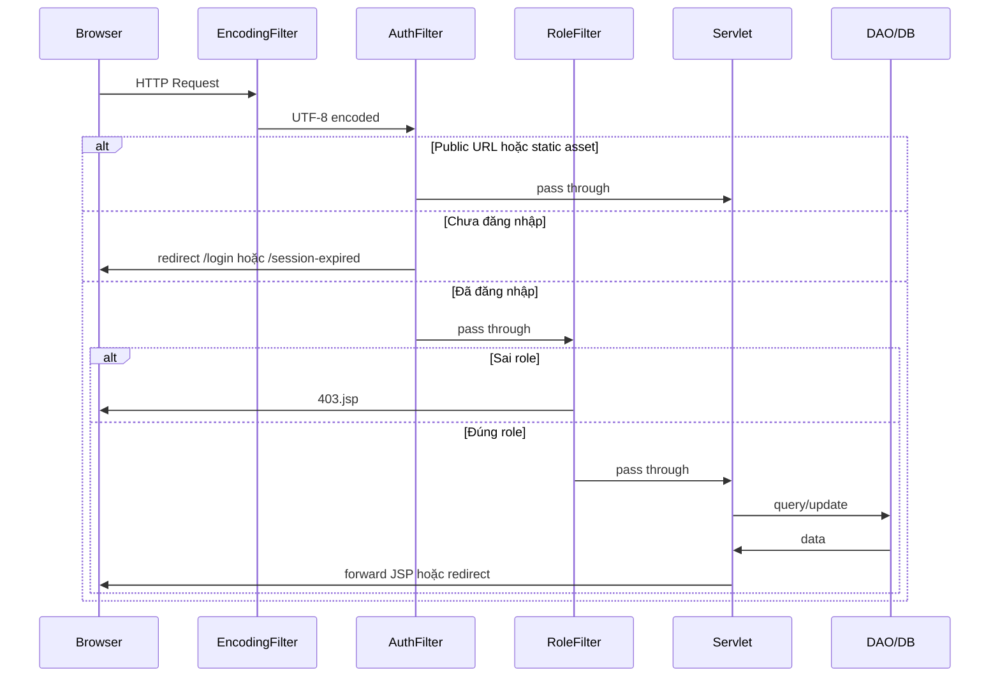

# ÉPCINE — Tổng hợp Source Code (đến 29/06/2026)

> **Dự án:** Movie Ticket Booking System (SWP391)  
> **Stack:** Java 17 · Jakarta Servlet 6 · JSP/JSTL · JDBC · SQL Server · Maven WAR · Tomcat 10  
> **Phạm vi tài liệu:** Toàn bộ source code **đã triển khai** trong repo (không bao gồm `target/`, `.git/`)

Tài liệu nghiệp vụ đầy đủ (28 bảng, 50 FR): [`project_summary_final.md`](project_summary_final.md)  
Hướng dẫn cài đặt & chạy: [`README.md`](README.md)  
Hướng dẫn Database & migration: [`Database/README.md`](Database/README.md)  
Chi tiết module Admin: [`ADMIN_MODULE_DETAIL.md`](ADMIN_MODULE_DETAIL.md)  
Chi tiết module Manager: [`MANAGER_MODULE_DETAIL.md`](MANAGER_MODULE_DETAIL.md)  
Chi tiết module Customer: [`CUSTOMER_MODULE_DETAIL.md`](CUSTOMER_MODULE_DETAIL.md)  
Chi tiết module Staff: [`STAFF_MODULE_DETAIL.md`](STAFF_MODULE_DETAIL.md)

---

## 1. Tổng quan kiến trúc

```
Browser
   │
   ▼
┌─────────────────────────────────────────────────────────┐
│  Filters (web.xml)                                      │
│  EncodingFilter → AuthFilter → RoleFilter               │
└─────────────────────────────────────────────────────────┘
   │
   ▼
┌─────────────────────────────────────────────────────────┐
│  Controller (Servlet @WebServlet)                       │
│  auth · admin · manager · staff · public · customer*    │
└─────────────────────────────────────────────────────────┘
   │
   ▼
┌─────────────────────────────────────────────────────────┐
│  DAL (DAO + DBContext)                                  │
└─────────────────────────────────────────────────────────┘
   │
   ▼
┌─────────────────────────────────────────────────────────┐
│  SQL Server — MovieTicketDB (28 bảng)                   │
└─────────────────────────────────────────────────────────┘
```

**Mô hình:** MVC thuần Servlet — Servlet = Controller, JSP = View, Entity/DTO = Model.

| Thống kê | Số lượng |
|----------|----------|
| File Java (`src/main/java`) | **~144** |
| Servlet đã triển khai | **47** |
| DAO | **21** |
| Entity | **14** |
| DTO | **~12** |
| Filter | **3** |
| Util | **~34** |
| JSP view | **~43** (+ 5 `.gitkeep`, 2 `.jspf`) |
| CSS | **14** |
| JS | **11** |
| Script SQL | `create_database.sql` |
| Screen Design (mockup HTML) | **7 màn** (Movie-detail, Seat selection, Ticket booking, Online payment, Cinema Auditoriums, Seat Layout, Showtime Management) |

---

## 2. Cấu trúc thư mục

```
MovieTicketBookingSystem/
├── pom.xml                          # Maven WAR, Java 17
├── README.md
├── project_summary_final.md         # Spec nghiệp vụ
├── SOURCE_CODE_OVERVIEW.md          # ← File này
├── ADMIN_MODULE_DETAIL.md           # Chi tiết Admin
├── MANAGER_MODULE_DETAIL.md         # Chi tiết Manager
├── CUSTOMER_MODULE_DETAIL.md        # Chi tiết Customer
├── STAFF_MODULE_DETAIL.md           # Chi tiết Staff (Counter POS Sprint 2)
├── implementation_plan.md           # Kế hoạch triển khai FR (spec nội bộ)
├── implementation_plan_fr-11.md     # Kế hoạch FR-11 (lịch chiếu khách hàng)
├── fr-12_seat_selection_2f514b7b.plan.md  # Kế hoạch FR-12 (chọn ghế online)
├── fr-14_online_booking_ab14e307.plan.md  # Kế hoạch FR-14 (đặt vé online)
├── implementation_plan_fr-22_fr-50.md     # Kế hoạch FR-22 + FR-50 (customer)
├── SEAT_LAYOUT_DESIGN.md            # Thiết kế layout ghế
├── Database/
│   ├── create_database.sql          # Schema + seed data
│   └── migrations/
│       ├── add_user_status_log.sql
│       ├── add_token_purpose.sql
│       ├── add_vietqr_payment_method.sql
│       ├── add_seat_type_span.sql          # seat_span (1 ô / 2 ô) trên SeatTypes
│       └── sprint2_counter_pos.sql
├── scripts/                         # Setup & Git hooks
│   ├── setup.bat / setup.ps1
│   ├── install-git-hooks.bat
│   ├── backup-database-properties.bat
│   ├── restore-database-properties.bat
│   └── githooks/post-merge
└── src/main/
    ├── java/
    │   ├── controller/              # Servlet (theo role)
    │   ├── dal/                     # Data Access Layer
    │   ├── filter/                  # Servlet filters
    │   ├── model/                   # entity · dto · enums
    │   └── utils/                   # Auth, email, OAuth, image upload, validators...
    ├── resources/                   # database/email/google/vietqr properties
    └── webapp/
        ├── index.jsp
        ├── css/ · js/ · images/
        └── WEB-INF/
            ├── web.xml
            └── views/                 # JSP (auth, admin, manager, staff, customer, common, error)
```

---

## 3. Cấu hình dự án

### 3.1 `pom.xml`

| Mục | Giá trị |
|-----|---------| 
| GroupId | `edu.fpt.swp391` |
| ArtifactId | `MovieTicketBookingSystem` |
| Packaging | `war` |
| Java | 17 |

**Dependencies chính:**

| Thư viện | Phiên bản | Mục đích |
|----------|-----------|----------|
| `jakarta.servlet-api` | 6.0.0 | Servlet (provided) |
| `jakarta.servlet.jsp-api` | 3.1.1 | JSP (provided) |
| JSTL API + impl | 3.0.x | Taglib trong JSP |
| `mssql-jdbc` | 12.8.1 | Kết nối SQL Server |
| `jbcrypt` | 0.4 | Hash mật khẩu |
| `jakarta.mail` | 2.0.1 | Gửi email xác thực |
| JUnit Jupiter | 5.10.2 | Test (chưa có test case) |

### 3.2 `web.xml`

| Cấu hình | Giá trị |
|----------|---------|
| Session timeout | **1440 phút** (24 giờ idle) |
| Welcome file | `index.jsp` → redirect `/home` |
| Servlet khai báo | Không — dùng annotation `@WebServlet` |

**Thứ tự Filter:**

1. `EncodingFilter` — `/*` — UTF-8
2. `AuthFilter` — `/*` — FR-29: bắt buộc đăng nhập
3. `RoleFilter` — `/*` — FR-29: phân quyền theo URL prefix

### 3.3 Properties (`src/main/resources/`)

| File | Trạng thái Git | Mục đích |
|------|----------------|----------|
| `database.properties.example` | Committed | Template kết nối SQL Server |
| `database.properties` | Gitignored | Config thật (local) |
| `email.properties.example` | Committed | Template Gmail SMTP |
| `email.properties` | Gitignored | Config email thật |
| `google.properties.example` | Committed | Template Google OAuth |
| `google.properties` | Gitignored | Config OAuth thật |
| `vietqr.properties.example` | Committed | Template STK ngân hàng VietQR (img.vietqr.io) |
| `vietqr.properties` | Gitignored | STK nhận tiền thật (local) |

`DBContext` đọc `database.properties` lúc khởi tạo static, ném `ExceptionInInitializerError` nếu thiếu file.

---

## 4. Bảng URL & Servlet (toàn hệ thống)

### 4.1 Public — không cần đăng nhập

| URL | Servlet | Method | View |
|-----|---------|--------|------|
| `/` → `/home` | `HomeServlet` | GET | `common/home.jsp` |
| `/movies` | `MovieListServlet` | GET | `common/movies.jsp` |
| `/showtimes` | `ShowtimesServlet` | GET | `customer/showtimes.jsp` |
| `/login` | `LoginServlet` | GET, POST | `auth/login.jsp` |
| `/register` | `RegisterServlet` | GET, POST | `auth/register.jsp` |
| `/register/pending` | `RegisterPendingServlet` | GET | `auth/register-pending.jsp` |
| `/verify-email` | `VerifyEmailServlet` | GET | redirect |
| `/register/google-complete` | `GoogleCompleteServlet` | GET, POST | `auth/google-complete.jsp` |
| `/auth/google` | `GoogleLoginServlet` | GET | redirect OAuth |
| `/auth/google/callback` | `GoogleCallbackServlet` | GET | redirect |
| `/logout` | `LogoutServlet` | GET, POST | redirect `/home` |
| `/session-expired` | `SessionExpiredServlet` | GET | `error/session-expired.jsp` |
| `/forgot-password` | `ForgotPasswordServlet` | GET, POST | `auth/forgot-password.jsp` |
| `/reset-password` | `ResetPasswordServlet` | GET, POST | `auth/reset-password.jsp` |

### 4.2 Admin — role `ADMIN`

| URL | Servlet | Method | Chức năng |
|-----|---------|--------|-----------|
| `/admin/dashboard` | `AdminDashboardServlet` | GET | Bảng điều khiển |
| `/admin/users` | `UserListServlet` | GET | Danh sách + lọc + phân trang |
| `/admin/users/detail` | `UserDetailServlet` | GET | Chi tiết user |
| `/admin/users/create` | `UserCreateServlet` | GET, POST | Tạo Staff/Manager |
| `/admin/users/status` | `UserStatusServlet` | POST | Lock/unlock/deactivate |
| `/admin/users/reset-password` | `UserResetPasswordServlet` | POST | Đặt lại mật khẩu |
| `/admin/config` | `SystemConfigListServlet` | GET | Cấu hình loyalty (SystemConfig) |
| `/admin/config/update` | `SystemConfigUpdateServlet` | POST | Lưu cấu hình loyalty |
| `/admin/vat` | `VatRuleListServlet` | GET | Danh sách quy tắc VAT |
| `/admin/vat/create` | `VatRuleCreateServlet` | POST | Tạo quy tắc VAT mới |
| `/admin/vat/update` | `VatRuleUpdateServlet` | POST | Sửa quy tắc VAT (chỉ scheduled) |
| `/admin/vat/cancel` | `VatRuleCancelServlet` | POST | Hủy quy tắc VAT scheduled |
| `/admin/promotions` | `PromotionListServlet` | GET | Danh sách khuyến mãi (ADMIN + MANAGER) |
| `/admin/promotions/save` | `PromotionSaveServlet` | POST | Tạo / sửa promotion |
| `/admin/promotions/delete` | `PromotionDeleteServlet` | POST | Xóa promotion |
| `/admin/promotions/toggle` | `PromotionToggleServlet` | POST | Bật/tắt trạng thái promotion |
| `/admin/reports` | `AdminReportServlet` | GET | Báo cáo: overview, doanh thu theo kỳ, vé theo phim/suất |
| `/admin/reports/export` | `AdminReportExportServlet` | GET | Xuất CSV doanh thu (`groupBy=day\|month\|year`) |
| `/admin/reports/export-tickets` | `AdminReportExportTicketsServlet` | GET | Xuất CSV vé bán (`viewBy=movie\|showtime`) |

> Chi tiết module Admin → [`ADMIN_MODULE_DETAIL.md`](ADMIN_MODULE_DETAIL.md)

### 4.3 Manager — role `MANAGER`

| URL | Servlet | Method | Chức năng |
|-----|---------|--------|-----------|
| `/manager/movies` | `ManageMovieServlet` | GET, POST | CRUD phim + upload ảnh (bao gồm soft delete) |
| `/manager/genres` | `ManageGenreServlet` | GET, POST | CRUD thể loại (bao gồm delete + toggle status) |
| `/manager/rooms` | `ManageCinemaRoomServlet` | GET, POST | Danh sách phòng + tạo phòng mới |
| `/manager/rooms/detail` | `ManageCinemaRoomServlet` | GET | Chi tiết phòng + editor layout ghế |
| `/manager/rooms/update` | `ManageCinemaRoomServlet` | POST | Đổi tên / toggle trạng thái phòng |
| `/manager/rooms/save-layout` | `ManageCinemaRoomServlet` | POST | Lưu layout ghế vào DB |
| `/manager/showtimes` | `ManageShowtimeServlet` | GET, POST | CRUD suất chiếu + kiểm tra trùng lịch |
| `/manager/seat-types` | `ManageSeatTypeServlet` | GET, POST | CRUD loại ghế + hệ số giá |

> **Lưu ý:** `AccessControl` cho phép cả **MANAGER** và **ADMIN** vào `/manager/*`. Servlet `isAuthorized()` cũng chấp nhận ADMIN.  
> Chi tiết module Manager → [`MANAGER_MODULE_DETAIL.md`](MANAGER_MODULE_DETAIL.md)

### 4.4 Staff — role `STAFF`

| URL | Servlet | Method | Chức năng |
|-----|---------|--------|-----------|
| `/staff/counter` | `CounterBookingServlet` | GET | Trang POS 3 bước: chọn phim/suất/ghế |
| `/staff/counter?action=showtimes` | `CounterBookingServlet` | GET | JSON API: suất chiếu theo phim |
| `/staff/counter?action=seats` | `CounterBookingServlet` | GET | JSON API: sơ đồ ghế theo suất |
| `/staff/counter?step=payment` | `CounterBookingServlet` | GET | Trang thanh toán (`counter-payment.jsp`) |
| `/staff/counter?step=print` | `CounterBookingServlet` | GET | Trang in vé (`counter-print.jsp`) |
| `/staff/counter` | `CounterBookingServlet` | POST | Tạo booking OFFLINE → redirect payment |
| `/staff/counter?action=payment` | `CounterBookingServlet` | POST | Xác nhận thanh toán → redirect print |

### 4.5 Customer — role `CUSTOMER`

| URL | Servlet | Method | Trạng thái | Chức năng |
|-----|---------|--------|------------|-----------|
| `/showtimes?movieId=` | `ShowtimesServlet` | GET | ✅ Public | Lịch chiếu theo phim + giá động (FR-11, FR-50) |
| `/checkout?showtimeId=` | `CheckoutServlet` | GET | ✅ CUSTOMER | Sơ đồ ghế + panel tóm tắt (FR-12) |
| `/checkout?action=seats&showtimeId=` | `CheckoutServlet` | GET | ✅ CUSTOMER | JSON refresh trạng thái ghế (poll client 2s) |
| `/checkout` | `CheckoutServlet` | POST `action=hold` | ✅ CUSTOMER | AJAX đồng bộ `SeatHolds` ngay khi chọn/bỏ ghế (FR-13) |
| `/checkout` | `CheckoutServlet` | POST (form) | ✅ CUSTOMER | Validate tuổi + ghế → `createOnlineBooking` (FR-14) → redirect `/payment` |
| `/payment?bookingId=` | `PaymentServlet` | GET | ✅ CUSTOMER | Tóm tắt đơn + voucher (FR-22) + countdown + VietQR (FR-16) |
| `/payment` | `PaymentServlet` | POST `action=applyPromo` | ✅ CUSTOMER | Áp mã voucher (FR-22) |
| `/payment` | `PaymentServlet` | POST `action=removePromo` | ✅ CUSTOMER | Gỡ mã voucher, hoàn `used_count` |
| `/payment` | `PaymentServlet` | POST `action=cancel` | ✅ CUSTOMER | Hủy đơn PENDING → `CANCELLED`, giải phóng ghế + hoàn voucher |
| `/payment` | `PaymentServlet` | POST `action=payVietQR` | ✅ CUSTOMER | Tạo QR VietQR + `Payments` PENDING (FR-16) |
| `/payment` | `PaymentServlet` | POST `action=confirmVietQR` | ✅ CUSTOMER | Xác nhận chuyển khoản → phát vé (FR-17) |
| `/payment/success?bookingId=` | `PaymentSuccessServlet` | GET | ✅ CUSTOMER | Trang xác nhận thanh toán thành công (FR-17) |
| `/payment/status?bookingId=` | `PaymentStatusServlet` | GET | ✅ CUSTOMER | JSON poll trạng thái đơn (dự phòng webhook) |
| `/booking-history` | — | — | ❌ Chưa có | Lịch sử đặt vé |
| `/loyalty` | — | — | ❌ Chưa có | Điểm tích lũy |
| `/reviews/mine` | — | — | ❌ Chưa có | Đánh giá của tôi |

> `ShowtimesServlet` nằm package `controller` (public). Package `controller.customer` có `CheckoutServlet` (FR-12/13/14), `PaymentServlet` (FR-14 / FR-22 / FR-16 VietQR), `PaymentSuccessServlet` (FR-17), `PaymentStatusServlet` (poll JSON).
> Chi tiết module Customer → [`CUSTOMER_MODULE_DETAIL.md`](CUSTOMER_MODULE_DETAIL.md)

### 4.6 Mọi role đã đăng nhập — Profile (FR-04 / FR-05)

| URL | Servlet | Method | Chức năng |
|-----|---------|--------|-----------|
| `/profile` | `ProfileServlet` | GET, POST | Xem/sửa thông tin (họ tên, username, SĐT, avatar); hiển thị số đơn đã đặt |
| `/profile/password` | `ChangePasswordServlet` | POST | Đổi mật khẩu (yêu cầu xác minh bảo mật trước) |
| `/profile/security-verify` | `ProfileSecurityVerifyServlet` | GET, POST | Xác minh danh tính: mật khẩu hiện tại hoặc gửi link email |
| `/profile/security-verify/confirm` | `ProfileSecurityConfirmServlet` | GET | Kích hoạt session xác minh qua token email (15 phút) |

---

## 5. Package `controller` — Chi tiết từng Servlet

### 5.1 Public

#### `HomeServlet` — `/home`
- Gọi `MovieDAO`: featured, now-showing, coming-soon, early showtimes, genres
- Nếu DB lỗi: trả danh sách rỗng + `dbError` (không crash trang)
- Forward `common/home.jsp`

#### `MovieListServlet` — `/movies`
- Query params: `?status=`, `?genre=`, `?q=`
- Forward `common/movies.jsp`

#### `ShowtimesServlet` — `/showtimes` (FR-11)
- Query param bắt buộc: `?movieId=`
- Load phim (`MovieDAO.getById` + `loadGenres`), suất sắp tới (`ShowtimeDAO.getUpcomingShowtimesByMovieId`)
- Áp `PricingCalculator` với `PricingRuleDAO.getActiveRules()` → `effectivePrice`
- Nhóm suất: `Map<yyyy-MM-dd, Map<roomName, List<Showtime>>>`
- 7 tab ngày (Hôm nay → +6 ngày); forward `customer/showtimes.jsp`
- Thiếu `movieId` → redirect `/movies`; phim không tồn tại / DELETED → `404.jsp`

### 5.2 `controller.auth` — Xác thực & đăng ký

| Servlet | Chức năng chính |
|---------|-----------------|
| `LoginServlet` | Đăng nhập email/username + BCrypt; remember-me 30 ngày; kiểm tra BANNED/INACTIVE; cập nhật `last_login_at`; redirect theo role |
| `LogoutServlet` | Hủy session + cookies → `/home?logout=success` |
| `RegisterServlet` | FR-01: đăng ký CUSTOMER; gửi email xác thực; tự sinh username |
| `RegisterPendingServlet` | Trang "kiểm tra email" sau đăng ký |
| `VerifyEmailServlet` | Kích hoạt user INACTIVE qua token; đánh dấu token đã dùng |
| `SessionExpiredServlet` | Trang hết phiên |
| `GoogleLoginServlet` | Bắt đầu OAuth; lưu CSRF state |
| `GoogleCallbackServlet` | Callback OAuth; login user có sẵn hoặc chuyển hoàn tất đăng ký |
| `GoogleCompleteServlet` | Thu thập DOB (+ phone tùy chọn) cho user Google mới |
| `ForgotPasswordServlet` | FR-04: quên mật khẩu (guest) — gửi link reset qua email (`PasswordResetTokenDAO`) |
| `ResetPasswordServlet` | FR-04: đặt lại mật khẩu qua token từ email |

### 5.3 `controller.admin`

| Servlet | Chức năng chính |
|---------|-----------------|
| `AdminDashboardServlet` | Bảng điều khiển admin |
| `UserListServlet` | Danh sách user + lọc + phân trang |
| `UserDetailServlet` | Chi tiết user |
| `UserCreateServlet` | Tạo Staff/Manager |
| `UserStatusServlet` | Lock/unlock/deactivate user (+ lý do, email, `UserStatusLog`) |
| `UserResetPasswordServlet` | Đặt lại mật khẩu user |
| `SystemConfigListServlet` | Cấu hình loyalty (4 key SystemConfig) |
| `SystemConfigUpdateServlet` | Lưu cấu hình loyalty + audit log |
| `VatRuleListServlet` | Danh sách quy tắc VAT (hiện tại + scheduled + history) |
| `VatRuleCreateServlet` | Tạo quy tắc VAT mới (ngay hoặc scheduled) |
| `VatRuleUpdateServlet` | Sửa quy tắc VAT scheduled |
| `VatRuleCancelServlet` | Hủy quy tắc VAT scheduled |
| `PromotionListServlet` | Danh sách promotion + lọc/phân trang (ADMIN + MANAGER qua `AccessControl.ADMIN_MANAGER_PATHS`) |
| `PromotionSaveServlet` | Tạo/sửa promotion (code, discount, date range, usage limit) |
| `PromotionDeleteServlet` | Xóa promotion |
| `PromotionToggleServlet` | Toggle status ACTIVE/INACTIVE |
| `AdminReportServlet` | Báo cáo: overview, nhóm doanh thu, top phim / vé theo suất, phân trang |
| `AdminReportExportServlet` | Xuất CSV doanh thu theo ngày/tháng/năm |
| `AdminReportExportTicketsServlet` | Xuất CSV vé bán theo phim hoặc suất chiếu |

### 5.4 `controller.manager`

#### `ManageMovieServlet` — `/manager/movies`
- CRUD phim (create/update/soft delete)
- Upload poster/backdrop qua `MovieImageUpload` (max 5MB, JPG/PNG/WEBP)
- Gán thể loại qua bảng `MovieGenres`
- Validate: title, slug, duration, status, age rating
- **Soft delete:** `MovieDAO.hasActiveShowtimes()` guard → status = 'DELETED'

#### `ManageGenreServlet` — `/manager/genres`
- CRUD thể loại (create/update/delete/toggle status)
- Kiểm tra trùng tên
- **Delete:** guard `hasLinkedMovies()` — không xóa nếu đang gán phim
- **Toggle status:** guard `hasActiveOrUpcomingMovies()` — không deactivate nếu có phim đang chiếu

#### `ManageCinemaRoomServlet` — `/manager/rooms`, `/manager/rooms/detail`, `/manager/rooms/update`, `/manager/rooms/save-layout`
- **GET list:** danh sách phòng + panel preview
- **GET detail:** editor layout ghế + load seats từ DB
- **POST create:** tạo phòng mới (validate tên ≤100 ký tự, check trùng) → redirect `/manager/rooms/detail?id={newId}&success=created`
- **POST update:** rename (`action=rename`) hoặc toggle status (`action=toggle`) — guard `countUpcomingShowtimes()` khi chuyển MAINTENANCE/INACTIVE
- **POST save-layout:** parse JSON layout qua `SeatLayoutJsonUtil.parseSeats()` → persist vào bảng `Seats`; lối đi (gap) giữ qua `seat_column` nhảy số
- **Editor layout:** tối đa **26 hàng** (nhãn A–Z); `manager-seat-layout.js` → `nextRowLabel()` chặn sau hàng Z
- **Loại ghế rộng (2 ô):** sidebar editor đọc `data-seat-span` từ DB (`SeatTypes.seat_span`), không hardcode tên COUPLE/SWEETBOX

#### `ManageShowtimeServlet` — `/manager/showtimes`
- **GET:** danh sách suất + form tạo/sửa; dropdown phim (`getSchedulableMovies`) và phòng ACTIVE (`getActiveRooms`)
- **POST create:** `end_time = start + movie.duration`; kiểm tra overlap cùng phòng (bỏ qua suất CANCELLED)
- **POST update:** khóa phim/phòng/giờ khi suất đã có booking; luôn cho sửa `basePrice` và `status`
- **POST delete:** hard delete chỉ khi không có booking → else redirect `?error=has_bookings`
- **Validate `basePrice`:** > 0, tối đa **9 chữ số** (≤ 999.999.999 VNĐ); form HTML `min="1000" max="999999999" step="1000"`
- Status hợp lệ: `SCHEDULED`, `OPEN`, `SOLD_OUT`, `CANCELLED`, `FINISHED`

#### `ManageSeatTypeServlet` — `/manager/seat-types`
- CRUD loại ghế (create/update/delete)
- Validate: `typeName` required (≤50 ký tự), `priceMultiplier` định dạng **X.XX** (0.01–9.99), `seatSpan` **1 hoặc 2** (1 ô / 2 ô liền nhau trên layout), duplicate check
- **Delete:** guard `countUsedIn()` — không xóa nếu đang dùng trong layout phòng
- Hiển thị `usageMap` (số ghế đang dùng mỗi loại); gợi ý tĩnh (`mgr-hint`) trên form

### 5.5 `controller.staff`

#### `CounterBookingServlet` — `/staff/counter`
- POS 3 bước: chọn phim/suất/ghế → thanh toán → in vé
- JSON API cho showtimes và seats (AJAX-driven)
- Tạo booking `OFFLINE` qua `BookingDAO.createOfflineBooking`
- Xác nhận thanh toán qua `BookingDAO.confirmPayment()`
- Dùng `BookingDetailDTO` cho view payment/print

### 5.6 `controller.customer`

#### `CheckoutServlet` — `/checkout` (FR-12 / FR-13 / FR-14)

- **GET** `?showtimeId=` — load suất, tính `effectivePrice`, render sơ đồ ghế (`SeatDAO.getSeatsForShowtime(showtimeId, userId)`); khôi phục ghế đang hold + countdown nếu có `SeatHolds` active
- Guard: thiếu param → `/movies`; null/CANCELLED/đã qua → `404.jsp`; `SOLD_OUT` → read-only; có đơn PENDING cùng suất → hiện link tiếp tục/hủy, khóa chọn ghế mới
- **GET** `?action=seats&showtimeId=` — JSON rows/seats (`available`, `heldByMe`, `seatColumn`) cho poll client
- **POST** `action=hold` — validate tuổi; `SeatHoldDAO.syncHolds()` (chọn ghế → INSERT hold 10 phút, bỏ hết → `releaseHolds`); trả JSON `{ ok, expiresAt? }`
- **POST** (form, không `action`) — validate tuổi; `BookingDAO.createOnlineBooking()` (PENDING/UNPAID, `expired_at` 10 phút, mã `BK-`); xóa `SeatHolds` sau commit; session `checkoutDraft`; redirect `/payment?bookingId=`
- View: `customer/checkout.jsp` + 3 component (`.ck-*`); CSS `customer-checkout.css`; JS `customer-checkout.js` (hold AJAX + poll 2s hai chiều)

#### `PaymentServlet` — `/payment` (FR-14 / FR-22 / FR-16 VietQR)

- **GET** `?bookingId=` — `BookingDAO.getDetailById()` (gồm `discountAmount`, `vatAmount`, mã voucher đã áp); guard ownership + ONLINE + PENDING + chưa hết `expired_at`; khôi phục session QR nếu có
- **POST** `action=applyPromo` — FR-22: `PromotionDAO.findByCode` + `validateForApply`; `PromotionCalculator` + `BookingDAO.applyPromotionToBooking`
- **POST** `action=removePromo` — FR-22: `BookingDAO.removePromotionFromBooking` + `PromotionDAO.decrementUsedCount`
- **POST** `action=cancel` — `BookingDAO.cancelOnlinePendingBooking()` (`CANCELLED` + xóa `SeatHolds` + hoàn voucher)
- **POST** `action=payVietQR` — `VietQRUtil.qrImageUrl()` (img.vietqr.io) + `PaymentDAO.insertPendingOnlineVietQR`
- **POST** `action=confirmVietQR` — `BookingDAO.completeOnlinePayment()` + `TicketDAO.issueTicketsForBooking`
- Cấu hình: `src/main/resources/vietqr.properties` (sao từ `vietqr.properties.example`) — BIN, STK, tên chủ TK; QR qua img.vietqr.io
- View: `customer/payment.jsp`, `payment-success.jsp` (`.pay-*`, `.pay-vqr-*`, `.pay-momo-*` legacy); JS `customer-payment.js` (countdown + copy STK/nội dung CK)

#### `PaymentSuccessServlet` — `/payment/success` (FR-17)

- **GET** `?bookingId=` — guard ownership + ONLINE + `payment_status = PAID`; forward `payment-success.jsp`
- Xóa session `checkoutDraft`, `vietqr*` sau thành công

#### `PaymentStatusServlet` — `/payment/status` (JSON)

- **GET** `?bookingId=` — trả `{ paid, pending, successUrl? }` cho poll client (hiện chưa dùng trên UI vì VietQR xác nhận thủ công)

### 5.7 Profile & bảo mật tài khoản (FR-04 / FR-05)

#### `ProfileServlet` — `/profile`
- **GET:** load user từ DB; `BookingDAO.countConfirmedByUserId()`; trạng thái `ProfileSecurityUtil.isVerified`
- **POST:** validate `ProfileValidator` (họ tên, SĐT, username); upload avatar qua `AvatarUpload` (JPG/PNG, max 1MB); `UserDAO.updateProfile()`; refresh `SessionUser`
- View: `common/profile.jsp` + fragment `profile-security.jspf`; CSS `profile.css`; JS `profile.js`

#### `ProfileSecurityVerifyServlet` — `/profile/security-verify`
- **POST** `method=password` — xác minh mật khẩu hiện tại → `ProfileSecurityUtil.markVerified` (15 phút)
- **POST** `method=email` — gửi link xác minh qua `EmailUtil.sendProfileSecurityEmail` + token `TOKEN_PURPOSE_PROFILE_SECURITY`
- View: `common/profile-security-verify.jsp`

#### `ProfileSecurityConfirmServlet` — `/profile/security-verify/confirm`
- **GET** `?token=` — validate token → `markVerified` → redirect `/profile?security=verified`

#### `ChangePasswordServlet` — `/profile/password`
- **POST:** guard `ProfileSecurityUtil.isVerified`; validate `PasswordValidator`; `UserDAO.updatePasswordHash`

---

## 6. Package `dal` — Data Access Layer

| DAO | Bảng chính | Phương thức nổi bật |
|-----|------------|---------------------|
| `DBContext` | — | `getConnection()` từ `database.properties` |
| `UserDAO` | `Users` | findByEmail/Id, findAll+filter, countAll, insert, **`updateProfile`**, updateStatus, updatePasswordHash, existsBy*, updateLastLoginAt, updateGoogleProfile |
| `RoleDAO` | `Roles` | findAll, findByName, findAssignableByAdmin |
| `MovieDAO` | `Movies`, `MovieGenres` | Public listing, featured, search, early showtimes; manager CRUD; `getSchedulableMovies()`; `hasActiveShowtimes()`; `getById()` + `loadGenres()` |
| `GenreDAO` | `Genres` | getAll, getAllActive, getById, create, update, delete, updateStatus; isDuplicate*; hasLinkedMovies, hasActiveOrUpcomingMovies; getMovieCountPerGenre, getGenreIdsInUse, getGenreIdsWithActiveMovies |
| `ShowtimeDAO` | `Showtimes` | Counter: suất theo phim; Customer: `getUpcomingShowtimesByMovieId`; Manager: `getAllForManager`, create, update, delete, `isOverlapping`, `countBookingsByShowtimeId` |
| `PricingRuleDAO` | `PricingRules` | `getActiveRules()` — đọc rule ACTIVE cho tính giá động (FR-50) |
| `SeatDAO` | `Seats`, `SeatTypes`, `SeatHolds`, `BookingSeats` | Ghế theo suất + availability (booked + hold); overload `getSeatsForShowtime(id, userId)` cho checkout; `saveLayout()` |
| `SeatHoldDAO` | `SeatHolds` | FR-13: `findBlockingSeatCodes`, `holdSeats`, **`syncHolds`**, **`releaseHolds`**, `getActiveHoldExpiry`, `getHeldSeatIds`, `deleteExpiredHolds` |
| `SeatTypeDAO` | `SeatTypes` | getAll, getById, create, update, delete; isDuplicate*; getTypeKeyToIdMap; countUsedIn; **seat_span** |
| `CinemaRoomDAO` | `CinemaRooms` | getAll, getById, getActiveRooms, create, updateName, updateStatus; existsByName*; countUpcomingShowtimes, countActiveSeats, countAccessibleSeats |
| `BookingDAO` | `Bookings`, `BookingSeats` | `createOfflineBooking`, **`createOnlineBooking`**, **`applyPromotionToBooking`**, **`removePromotionFromBooking`**, **`cancelOnlinePendingBooking`**, **`completeOnlinePayment`**, `findActiveOnlinePendingBookingId`, **`countConfirmedByUserId`**, `confirmPayment`, `getById`, `getDetailById`, `getCurrentVatRate` |
| `PaymentDAO` | `Payments` | FR-16: **`insertPendingOnlineVietQR`**, **`findLatestPendingVietQR`**, **`findByTransferCode`**, `markSuccess`, `markFailed` |
| `TicketDAO` | `Tickets`, `BookingSeats` | FR-17: **`issueTicketsForBooking`**, `findBookingSeats` |
| `BookingPromotionDAO` | `BookingPromotions` | FR-22: find/insert/delete junction đơn–voucher |
| `BookingStatsDAO` | `Bookings`, `BookingSeats`, `Showtimes`, `Movies` | Overview, top phim, doanh thu theo kỳ, vé theo suất |
| `UserStatusLogDAO` | `UserStatusLog` | insert, findLatestLockByUserId |
| `PromotionDAO` | `Promotions` | CRUD (admin `/admin/promotions`, MANAGER truy cập được); FR-22: **`findByCode`**, **`validateForApply`**, **`findByCodeForApply`**, **`incrementUsedCountIfAvailable`**, **`decrementUsedCount`** |
| `PasswordResetTokenDAO` | `PasswordResetTokens` | insert, find valid, mark used, invalidate |
| `SystemConfigDAO` | `SystemConfig` | findAll, findByKeys, findByKey, updateValue (JOINs Users cho `updated_by_name`) |
| `SystemConfigLogDAO` | `SystemConfigLog` | insert, findLoyaltyHistory (audit log cấu hình loyalty) |
| `VatRuleDAO` | `VatRules` | findEffectiveNow, findScheduledList, findCurrentActiveRate (fallback 8%), findById, createAndActivate, updateScheduled, cancelScheduled, findHistory |

**Bảng có schema nhưng chưa có DAO (hoặc chỉ đọc gián tiếp):** `LoyaltyPointsLog`, `ShowtimeIncidents`, `ChatbotConversations`, `ChatbotMessages`, `MovieReviews`, `CinemaInfo`

---

## 7. Package `model`

### 7.1 Entity (`model.entity`)

| Class | Bảng DB | Ghi chú |
|-------|---------|---------|
| `User` | `Users` | Có `roleName` join từ Roles |
| `Role` | `Roles` | |
| `Movie` | `Movies` | Có list `genres` computed |
| `Genre` | `Genres` | |
| `Showtime` | `Showtimes` | Denormalized movie/room cho UI; `effectivePrice` transient (FR-50) |
| `Seat` | `Seats` | `ticketPrice`, `available`, `heldByCurrentUser` computed |
| `SeatType` | `SeatTypes` | typeName, priceMultiplier, description, **seatSpan** (1 hoặc 2 ô trên layout) |
| `CinemaRoom` | `CinemaRooms` | id, roomName, capacity, status, createdAt |
| `Booking` | `Bookings` | |
| `PricingRule` | `PricingRules` | Quy tắc điều chỉnh giá động (conditionType, adjustmentType, …) |
| `SystemConfig` | `SystemConfig` | configKey, configValue, description, updatedBy, updatedByName, updatedAt |
| `SystemConfigLog` | `SystemConfigLog` | Audit log: earn/redeem rates + previous values + updatedBy |
| `VatRule` | `VatRules` | id, ruleName, vatRate, startDate, endDate, status (ACTIVE/INACTIVE), createdAt |
| `Promotion` | `Promotions` | code, discountType/Value, date range, usageLimit; `isExpired()`, **`isScheduled()`**, `isCurrentlyValid()` |
| `UserStatusLog` | `UserStatusLog` | action, previous/new status, reason, emailSent, performedBy |

### 7.2 DTO (`model.dto`)

| Class | Dùng cho |
|-------|----------|
| `SessionUser` | Session: id, fullName, email, avatarUrl, loyaltyPoints |
| `RegisterForm` | Form đăng ký customer |
| `AdminUserForm` | Form tạo user (admin) |
| `GoogleSignupInfo` | Pending Google signup trong session |
| `BookingDetailDTO` | Chi tiết booking staff counter + customer payment (`userId`, `showtimeId`, `expiredAt`, `bookingSource`, `discountAmount`, `vatAmount`, `appliedPromoCode`, `appliedPromoTitle`; inner `SeatItem`) |
| `BookingOverviewStatsDTO` | Tổng quan báo cáo admin: revenue, booking count, ticket count |
| `TopMovieStatsDTO` | Top phim theo số vé / doanh thu trong báo cáo admin |
| `RevenuePeriodStatsDTO` | Doanh thu theo kỳ (ngày/tháng/năm) |
| `TopShowtimeStatsDTO` | Vé bán theo suất chiếu (phim, phòng, giờ chiếu) |
| `VatRuleForm` | Form tạo/sửa quy tắc VAT (ruleId, ruleName, vatRate, startDate) |

### 7.3 Enum (`model.enums`)

| Class | Giá trị |
|-------|---------|
| `BookingSource` | `ONLINE`, `OFFLINE` |

---

## 8. Package `filter`

| Filter | Chức năng |
|--------|-----------|
| `EncodingFilter` | `request.setCharacterEncoding("UTF-8")` + response charset UTF-8 |
| `AuthFilter` | Bỏ qua static asset + public URL; thử remember-me cookie; redirect `/login` hoặc `/session-expired` |
| `RoleFilter` | Kiểm tra role theo prefix URL; sai role → HTTP 403 + `error/403.jsp` |

**Quy tắc tập trung tại `utils.AccessControl`:**

| Prefix / Path | Role yêu cầu |
|---------------|--------------|
| `/admin/*` | ADMIN |
| `/manager/*` | MANAGER, ADMIN |
| `/staff/*` | STAFF |
| `/booking-history`, `/loyalty`, `/reviews/mine`, `/checkout`, `/payment`, `/payment/status`, `/payment/success` | CUSTOMER |
| `/profile`, `/profile/*` | Bất kỳ role đã login |
| `/movies`, `/showtimes` | Public (prefix) |
| `/reviews*` | Public (trừ `/reviews/mine`) |

**Ngoại lệ:** `AccessControl.ADMIN_MANAGER_PATHS` — MANAGER được truy cập `/admin/promotions*` (CRUD khuyến mãi) dù prefix `/admin/*` mặc định là ADMIN-only.

## 9. Package `utils`

| Class | Chức năng |
|-------|-----------|
| `AccessControl` | Quy tắc URL public / protected / role prefix |
| `SessionUtil` | `loggedUser`, `userRole` session; remember/had-login cookies |
| `AdminAuthUtil` | Gate ADMIN + flash messages (`flashSuccess`, `flashError`) |
| `AuthRedirectUtil` | Validate redirect URL sau login (chống open redirect) |
| `AuthPageUtil` | Set `googleOAuthEnabled` trên trang auth |
| `AuthConstants` | Hằng số session/cookie keys, role names, status names, expiry times |
| `PasswordUtil` | BCrypt hash/verify (`$2b$` → `$2a$`) |
| `PasswordValidator` | FR-04/05: validate độ mạnh mật khẩu mới khi đổi/reset |
| `RegisterValidator` | Validate form đăng ký + sinh username |
| `EmailUtil` | Gmail SMTP; gửi email xác thực; `sendAccountLockedEmail`; **`sendPasswordResetEmail`**; **`sendProfileSecurityEmail`**; `buildVerifyUrl` |
| `RememberMeUtil` | Cookie remember-me HMAC-signed, 30 ngày |
| `GoogleOAuthUtil` | OAuth authorize URL, token exchange, userinfo |
| `GoogleOAuthSession` | OAuth state, redirect, pending signup attrs |
| `MovieImageUpload` | Lưu ảnh vào `webapp/images/movies/{folder}/` (JPG/PNG/WEBP, max 5MB) |
| `AvatarUpload` | FR-05: lưu avatar vào `webapp/images/avatars/` (JPG/PNG, max 1MB); `toPublicUrl()` |
| `ProfileValidator` | FR-05: validate họ tên, SĐT, username (trùng lặp) trên profile |
| `ProfileSecurityUtil` | FR-04/05: session xác minh danh tính trước đổi mật khẩu (15 phút) |
| `ConfigKeys` | Hằng số config key names (loyalty_earn_rate, ...) + label tiếng Việt |
| `ConfigUtil` | Đọc SystemConfig từ DB; getString/getInt với fallback |
| `SeatLayoutJsonUtil` | Serialize (`buildLayoutJson`) / deserialize (`parseSeats`) layout ghế JSON ↔ `Seat` entities; gap/lối đi qua `seat_column` nhảy số |
| `SystemConfigValidator` | Validate giá trị loyalty config (earn rate, redeem rate, min/max) |
| `VatRuleValidator` | Validate form VatRule (rate 0–100%, tên, ngày bắt đầu) |
| `PromotionCalculator` | FR-22: `calculateDiscount`, `recalculateFinalAmount`, `calculateVatAmount`, `validateMinOrder` |
| `PricingCalculator` | FR-50: tính `effectivePrice` từ `base_price` + `PricingRules` ACTIVE |
| `SeatAvailabilityValidator` | FR-13: validate tuổi T13/T16/T18 từ `Users.date_of_birth` |
| `SeatHoldException` | FR-13: ngoại lệ conflict khi giữ ghế (race / ghế đã bị chọn) |
| `AdminPaginationUtil` | Parse page number, `DEFAULT_PAGE_SIZE` cho admin list/report |
| `ReportDateUtil` | Resolve date range (preset `range` hoặc custom `from`/`to`) cho báo cáo |
| `ReportExportUtil` | Build CSV doanh thu + vé bán (UTF-8 BOM) |
| `TicketStatsViewUtil` | Chuẩn hóa `viewBy` movie/showtime |
| `UserLockValidator` | Validate lý do khóa (10–500 ký tự) |
| `AccountLockUtil` | Hiển thị lý do khóa trên login |
| `VietQRConfig` | FR-16: đọc `vietqr.properties` — BIN, STK, tên chủ TK, template QR |
| `VietQRUtil` | FR-16: `transferContent(bookingCode)`, `qrImageUrl(amount, content)` → URL img.vietqr.io |

---

## 10. Giao diện (JSP, CSS, JS)

### 10.1 Layout chung

| File | Mô tả |
|------|-------|
| `common/header.jsp` | Logo, search, nav, dropdown theo role, dynamic genre list |
| `common/footer.jsp` | Footer |
| `common/home.jsp` | Hero slider, tab phim (featured/now/coming/early) |
| `common/movies.jsp` | Catalog phim có filter |
| `common/profile.jsp` | FR-05: trang tài khoản — sửa profile, card đổi mật khẩu, upload avatar |
| `common/profile-security-verify.jsp` | FR-04/05: xác minh danh tính (mật khẩu hoặc email) trước đổi MK |
| `common/profile-security.jspf` | Fragment form đổi mật khẩu (include từ `profile.jsp`) |

### 10.2 Auth (`views/auth/`)

| File | Mô tả |
|------|-------|
| `login.jsp` | Form login + remember-me + Google button; hiển thị lý do khi BANNED |
| `register.jsp` | Form đăng ký customer |
| `register-pending.jsp` | Chờ xác thực email |
| `google-complete.jsp` | Hoàn tất đăng ký Google (DOB/phone) |
| `google-button.jsp` | Fragment nút Google OAuth |
| `forgot-password.jsp` | FR-04: form quên mật khẩu (guest) |
| `reset-password.jsp` | FR-04: form đặt lại mật khẩu qua token email |

### 10.3 Admin (`views/admin/`)

| File | Mô tả |
|------|-------|
| `dashboard.jsp` | Thống kê + module grid |
| `user-list.jsp` | Bảng user có filter + phân trang |
| `user-detail.jsp` | Chi tiết + form lock (lý do, email) / reset password |
| `user-create.jsp` | Form tạo Staff/Manager |
| `config-list.jsp` | Cấu hình loyalty (4 keys SystemConfig) |
| `vat-list.jsp` | Quản lý quy tắc VAT: current rule, scheduled list, history, form tạo/sửa/hủy |
| `promotion-list.jsp` | CRUD khuyến mãi: filter, phân trang, modal tạo/sửa; badge **SCHEDULED** khi chưa đến start_date (ADMIN + MANAGER) |
| `reports.jsp` | Báo cáo: overview, nhóm doanh thu, vé theo phim/suất, nút xuất CSV |
| `pagination.jspf` | Fragment phân trang admin (user list, báo cáo) |

### 10.4 Manager (`views/manager/`)

| File | Mô tả |
|------|-------|
| `movie-list.jsp` | CRUD phim + upload ảnh + soft delete |
| `genre-list.jsp` | CRUD thể loại + delete + toggle status |
| `cinema-room-list.jsp` | Grid phòng chiếu + panel preview + tạo phòng |
| `cinema-room-detail.jsp` | Chi tiết phòng + editor layout ghế (lưu DB) |
| `showtime-list.jsp` | CRUD suất chiếu + filter + status badges |
| `seat-type-list.jsp` | CRUD loại ghế + color swatch + usage count + **seat_span** (1/2 ô) + gợi ý tĩnh |

### 10.5 Staff (`views/staff/`)

| File | Mô tả |
|------|-------|
| `counter-booking.jsp` | POS 3 bước: chọn phim/suất/ghế (AJAX-driven) |
| `counter-payment.jsp` | Thanh toán tại quầy: order summary, numpad, cash/card |
| `counter-print.jsp` | In vé: ticket preview, print settings |

### 10.6 Error (`views/error/`)

| File | Mô tả |
|------|-------|
| `403.jsp` | Forbidden (RoleFilter) |
| `404.jsp` | Not found |
| `500.jsp` | Server error |
| `session-expired.jsp` | Hết phiên |

### 10.7 Customer (`views/customer/`)

| File | Mô tả |
|------|-------|
| `showtimes.jsp` | Wrapper trang lịch chiếu — header/footer + `jsp:include` 2 component |
| `checkout.jsp` | Wrapper chọn ghế (FR-12) — `extraCss=customer-checkout` |
| `payment.jsp` | Thanh toán online VietQR (FR-14 / FR-16 / FR-22) — QR, STK, voucher, countdown (CSS `.pay-momo-*` legacy + `.pay-vqr-*`) |
| `payment-success.jsp` | Xác nhận thanh toán thành công + tóm tắt vé (FR-17) |
| `components/movie-info-placeholder.jsp` | **Phần trên** showtimes — thông tin phim (placeholder; đồng nghiệp mở rộng) |
| `components/showtimes-selector.jsp` | **Phần dưới** — tab 7 ngày + suất theo phòng + chip link `/checkout` (FR-11) |
| `components/checkout-header.jsp` | Back link, tên phim, giờ, phòng, badge tuổi (FR-12) |
| `components/seat-map.jsp` | Màn hình + lưới ghế + legend (`.ck-*`) |
| `components/booking-summary.jsp` | Ghế đã chọn, countdown giữ ghế, badge giá động, nút hủy/tiếp tục đơn PENDING, POST "Tiếp tục thanh toán" |

> Kiến trúc modular: [`CUSTOMER_MODULE_DETAIL.md`](CUSTOMER_MODULE_DETAIL.md) §3, §14. Design: `Screen Design/Seat selection/`, `Screen Design/Online payment/`.

### 10.8 CSS & JS

**CSS (14 file):**

| File | Dùng bởi |
|------|----------|
| `css/main.css` | Layout chung, homepage, movies, form select dark theme |
| `css/auth.css` | Login/register/forgot/reset password (`extraCss=auth`) |
| `css/profile.css` | Trang tài khoản `/profile` |
| `css/admin.css` | Trang admin (`extraCss=admin`) |
| `css/staff.css` | Counter booking (`extraCss=staff`) |
| `css/counter-pos.css` | POS payment/print — dark terminal theme |
| `css/error-pages.css` | Trang lỗi |
| `css/manager-movies.css` | Quản lý phim — dark theme, modal, poster thumbnails |
| `css/manager-genres.css` | Quản lý thể loại — dark cinematic red theme |
| `css/manager-auditoriums.css` | Quản lý phòng chiếu — glass panel, Material Symbols |
| `css/manager-seat-layout.css` | Editor layout ghế — `.slt-*` classes |
| `css/manager-showtimes.css` | Quản lý suất chiếu — `.st-*`, filter bar, status badges |
| `css/customer-showtimes.css` | Lịch chiếu khách — glass panel, tab ngày, chip suất (`.mi-*`, `.st-*`) |
| `css/customer-checkout.css` | Chọn ghế + payment — `.ck-*`, `.pay-*`, `.pay-promo-*`, `.pay-vqr-*`, `.pay-momo-*` (glass, VIP gold, countdown) |

**JS (11 file):**

| File | Dùng bởi |
|------|----------|
| `js/main.js` | Hero slider, movie tabs, header scroll |
| `js/auth.js` | Toggle hiện/ẩn mật khẩu |
| `js/profile.js` | Preview avatar, toggle form đổi mật khẩu trên `/profile` |
| `js/counter-booking.js` | Chọn ghế + logic form booking (render gap qua `seatColumn`) |
| `js/manager-auditoriums.js` | Lọc phòng, chọn card, panel preview |
| `js/manager-seat-layout.js` | Editor ghế client-side + gọi save-layout API; giới hạn hàng A–Z (`nextRowLabel`); đọc `data-seat-span` cho ghế 2 ô |
| `js/manager-showtimes.js` | Lọc bảng suất (phim/phòng/**ngày**/trạng thái); gợi ý thời lượng phim |
| `js/seat-type-colors.js` | Preset + dynamic HSL color cho loại ghế |
| `js/showtimes-selector.js` | Tab chọn ngày suất chiếu (zero reload, FR-11) |
| `js/customer-checkout.js` | Chọn ghế + **AJAX hold ngay** (`action=hold`), countdown giữ ghế, poll JSON 2s **hai chiều** (available ↔ sold) |
| `js/customer-payment.js` | Countdown hết hạn đơn PENDING; uppercase mã voucher; nút copy STK/nội dung CK; redirect checkout khi hết giờ |

### 10.9 Images

- `images/logorapchieuphim.png`, `logorapchieuphim_goc.png` — logo
- `images/movies/posters/`, `images/movies/backdrops/` — upload từ manager
- `images/avatars/` — upload avatar từ `/profile`

---

## 11. Database

**Script:** `Database/create_database.sql` (~1168 dòng) — chạy một lần trên SSMS/Azure Data Studio.  
**Migration bổ sung:** `Database/migrations/` — `add_user_status_log.sql`, `add_token_purpose.sql`, `add_vietqr_payment_method.sql`, **`add_seat_type_span.sql`**, `sprint2_counter_pos.sql` (DB đã tạo trước khi schema gộp vào `create_database.sql`).

### 11.1 28 bảng

| Nhóm | Bảng |
|------|------|
| Auth | `Roles`, `Users`, `PasswordResetTokens`, `UserStatusLog` |
| Config | `SystemConfig`, `SystemConfigLog`, `VatRules` |
| Cinema | `CinemaInfo`, `CinemaRooms`, `SeatTypes`, `Seats` |
| Movie | `Movies`, `Genres`, `MovieGenres`, `MovieReviews` |
| Showtime | `Showtimes`, `PricingRules` |
| Booking | `SeatHolds`, `Bookings`, `BookingSeats` |
| Payment | `Payments` |
| Promotion | `Promotions`, `BookingPromotions` |
| Ticket | `Tickets` |
| Loyalty | `LoyaltyPointsLog` |
| Operations | `ShowtimeIncidents` |
| Chatbot | `ChatbotConversations`, `ChatbotMessages` |

### 11.2 Seed data

| Dữ liệu | Chi tiết |
|---------|----------|
| Roles | ADMIN, MANAGER, STAFF, CUSTOMER |
| Users | 6 tài khoản test — mật khẩu `Password@123` (gồm 3 CUSTOMER seed) |
| Movies | 8 phim (4 NOW_SHOWING + 4 COMING_SOON) |
| Genres | 8 thể loại |
| Cinema | 3 phòng, 4 loại ghế (REGULAR/VIP/COUPLE/SWEETBOX; COUPLE & SWEETBOX `seat_span=2`) |
| Config | Loyalty settings, VAT 8% (fallback default) |
| PricingRules | 2 rule demo FR-50 (cuối tuần +10k, khung tối +10%) |
| Promotions | 2 voucher demo FR-22: `WEEKEND10`, `FLAT20K` |

### 11.3 Tài khoản test

| Role | Email | Username | Password |
|------|-------|----------|----------|
| ADMIN | admin@movieticket.vn | admin | Password@123 |
| MANAGER | manager@movieticket.vn | manager | Password@123 |
| STAFF | staff@movieticket.vn | staff | Password@123 |
| CUSTOMER (người lớn) | customer.adult@email.com | customer_adult | Password@123 |
| CUSTOMER (14 tuổi) | customer.teen@email.com | customer_teen | Password@123 |

---

## 12. Scripts hỗ trợ (`scripts/`)

| Script | Mục đích |
|--------|----------|
| `setup.bat` / `setup.ps1` | Copy `.example` → file config thật |
| `install-git-hooks.bat` | Cài hook tự restore `database.properties` sau `git pull` |
| `backup-database-properties.bat` | Backup trước khi pull |
| `restore-database-properties.bat` | Khôi phục sau pull |
| `githooks/post-merge` | Hook post-merge |

---

## 13. Trạng thái triển khai theo module

| Module | Trạng thái | Ghi chú |
|--------|------------|---------|
| Đăng nhập / Đăng ký / Google OAuth | ✅ Hoàn thành | Email verify, remember-me |
| Quên / đặt lại mật khẩu (FR-04) | ✅ Hoàn thành | `/forgot-password`, `/reset-password`; `PasswordResetTokenDAO` |
| Profile tài khoản (FR-04 / FR-05) | ✅ Hoàn thành | `/profile` — sửa thông tin, avatar; xác minh bảo mật + đổi MK |
| Trang chủ + Danh sách phim | ✅ Hoàn thành | Filter, search, early showtimes |
| Admin — Quản lý user | ✅ Hoàn thành | Xem [`ADMIN_MODULE_DETAIL.md`](ADMIN_MODULE_DETAIL.md) |
| Admin — Khóa user + audit | ✅ Hoàn thành | Lý do khóa, email, `UserStatusLog`, hiển thị trên login |
| Admin — Cấu hình loyalty | ✅ Hoàn thành | 4 key SystemConfig + audit log |
| Admin — Quản lý VAT | ✅ Hoàn thành | CRUD quy tắc VAT (effective/scheduled/history) |
| Admin — Quản lý khuyến mãi | ✅ Hoàn thành | CRUD promotion; MANAGER truy cập qua `AccessControl.ADMIN_MANAGER_PATHS` |
| Admin — Báo cáo | ✅ Hoàn thành | `/admin/reports` — overview, doanh thu theo kỳ, vé phim/suất, xuất CSV |
| Manager — Phim | ✅ Hoàn thành | CRUD + upload ảnh + soft delete |
| Manager — Thể loại | ✅ Hoàn thành | CRUD + delete (FK guard) + toggle status |
| Manager — Phòng chiếu | 🟡 Gần hoàn thành | Tạo, rename, toggle status ✅; save layout + lối đi ✅; xóa phòng ❌ |
| Manager — Suất chiếu | ✅ Hoàn thành | CRUD + overlap check + booking lock |
| Manager — Loại ghế & hệ số giá | ✅ Hoàn thành | CRUD + delete guard + **seat_span** (1/2 ô) + validate hệ số X.XX |
| Staff — Đặt vé quầy | ✅ Hoàn thành | POS: booking → payment → print |
| Customer — Xem lịch chiếu (FR-11) | ✅ Hoàn thành | `/showtimes` public + dynamic pricing (FR-50) + chip gạch giá gốc |
| Customer — Chọn ghế online (FR-12) | ✅ Hoàn thành | `/checkout` — sơ đồ ghế, giá × multiplier, poll refresh |
| Customer — Giữ ghế & validate (FR-13) | ✅ Hoàn thành | **Giữ ngay khi click** (`SeatHolds` 10 phút qua POST `action=hold`); validate tuổi + availability |
| Customer — Áp mã giảm giá (FR-22) | ✅ Hoàn thành | `/payment` — `applyPromo` / `removePromo`; seed `WEEKEND10`, `FLAT20K` |
| Customer — Tạo đơn online (FR-14) | ✅ Hoàn thành | Form POST → `Bookings` PENDING/UNPAID + redirect `/payment`; hủy đơn PENDING (`action=cancel`) |
| Customer — Thanh toán VietQR (FR-16–17) | ✅ Hoàn thành | QR img.vietqr.io; xác nhận thủ công; `PaymentDAO`, `TicketDAO` |
| Customer — E-ticket / email vé (FR-18–19) | 🟡 Một phần | Vé lưu DB sau thanh toán; chưa gửi email |
| Customer — Chi tiết phim (UI đầy đủ) | 🟡 Placeholder | `movie-info-placeholder.jsp` — đồng nghiệp làm |
| Loyalty / Điểm tích lũy | ❌ Chưa làm | Schema + seed config |
| Reviews | ❌ Chưa làm | Nav link có, chưa servlet |
| Unit tests | ❌ Chưa có | Chỉ `.gitkeep` trong `src/test` |

---

## 14. Luồng xác thực tổng quát



---

## 15. Ghi chú kỹ thuật & hạn chế hiện tại

1. **Session timeout 1440 phút (24h idle)** — cấu hình trong `web.xml` (`<session-timeout>1440</session-timeout>`).
2. **ADMIN và MANAGER đều vào được `/manager/*`** — `AccessControl.ROLE_PREFIXES` cho phép cả hai role.
3. **Không có CSRF token** trên form POST (admin, manager, staff, profile, checkout/payment).
4. **Không có connection pool** — mỗi DAO gọi `DBContext.getConnection()` trực tiếp.
5. **~5/28 bảng** chưa có lớp DAO đầy đủ — chỉ schema + seed. Online booking có `BookingDAO`, `PaymentDAO`, `TicketDAO`; `Promotions` / `BookingPromotions` có DAO (FR-22).
6. **VietQR — chưa đối soát tự động:** img.vietqr.io chỉ tạo QR; khách bấm "Tôi đã chuyển khoản" để hoàn tất (chưa webhook Casso/Sepay). Cấu hình STK tại `vietqr.properties` (gitignored).
7. **Checkout — chặn ghế 2 giai đoạn:** (1) click ghế → `SeatHolds` 10 phút; (2) "Tiếp tục thanh toán" → `Bookings` PENDING (xóa holds). Poll JSON 2s, client cập nhật **hai chiều** (ghế giải phóng hiện lại available).
8. **FR-22 voucher:** CRUD tại `/admin/promotions` (FR-21, MANAGER được truy cập); customer áp mã trên `/payment`. Validate Java (`validateForApply`) — **start_date phải ≤ hôm nay** mới áp được; admin hiện **SCHEDULED** nếu chưa đến ngày bắt đầu. Sau áp/gỡ voucher cần tạo lại mã QR.
9. **SQL Server booking ID** — `createOnlineBooking` / `createOfflineBooking` dùng `OUTPUT INSERTED.id` (không dùng `getGeneratedKeys` với `UNIQUEIDENTIFIER`).
10. **Xóa phòng chiếu** chưa có — chỉ tạo, rename, toggle status.
11. **Suất chiếu có booking** — manager không xóa hard; dùng status `CANCELLED`.
12. **Không có test tự động** — JUnit dependency có nhưng chưa viết test.

---

*Tài liệu được tổng hợp từ source code thực tế trong repo, cập nhật 29/06/2026.*
