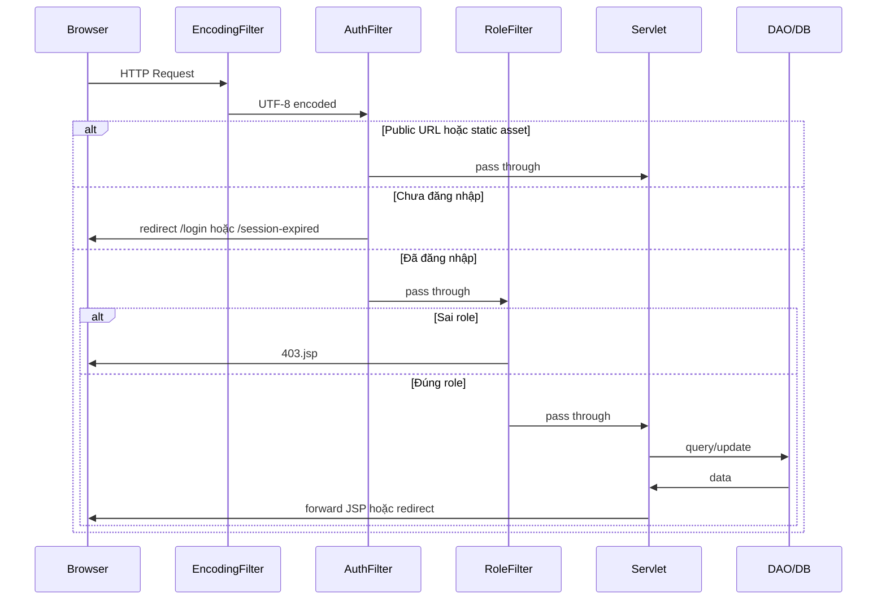

# ÉPCINE — Tổng hợp Source Code (đến 08/06/2026)

> **Dự án:** Movie Ticket Booking System (SWP391)  
> **Stack:** Java 17 · Jakarta Servlet 6 · JSP/JSTL · JDBC · SQL Server · Maven WAR · Tomcat 10  
> **Phạm vi tài liệu:** Toàn bộ source code **đã triển khai** trong repo (không bao gồm `target/`, `.git/`)

Tài liệu nghiệp vụ đầy đủ (27 bảng, 50 FR): [`project_summary_final.md`](project_summary_final.md)  
Hướng dẫn cài đặt & chạy: [`README.md`](README.md)  
Hướng dẫn Database & migration: [`Database/README.md`](Database/README.md)  
Chi tiết module Admin: [`ADMIN_MODULE_DETAIL.md`](ADMIN_MODULE_DETAIL.md)
Chi tiết module Admin: [`ADMIN_MODULE_DETAIL.md`](ADMIN_MODULE_DETAIL.md)  
Chi tiết module Manager: [`MANAGER_MODULE_DETAIL.md`](MANAGER_MODULE_DETAIL.md)

---

## 1. Tổng quan kiến trúc

```
Browser
   │
   ▼
┌─────────────────────────────────────────────────────────┐
│  Filters (web.xml)                                      │
│  EncodingFilter → AuthFilter → RoleFilter               │
└─────────────────────────────────────────────────────────┘
   │
   ▼
┌─────────────────────────────────────────────────────────┐
│  Controller (Servlet @WebServlet)                       │
│  auth · admin · manager · staff · public                │
└─────────────────────────────────────────────────────────┘
   │
   ▼
┌─────────────────────────────────────────────────────────┐
│  DAL (DAO + DBContext)                                  │
└─────────────────────────────────────────────────────────┘
   │
   ▼
┌─────────────────────────────────────────────────────────┐
│  SQL Server — MovieTicketDB (26 bảng)                   │
└─────────────────────────────────────────────────────────┘
```

**Mô hình:** MVC thuần Servlet — Servlet = Controller, JSP = View, Entity/DTO = Model.

| Thống kê | Số lượng |
|----------|----------|
| File Java (`src/main/java`) | **~85** |
| Servlet đã triển khai | **~27** |
| DAO | **12** |
| Entity | **12** |
| DTO | **6** |
| File Java (`src/main/java`) | **74** |
| Servlet đã triển khai | **23** |
| DAO | **11** |
| Entity | **9** |
| DTO | **4** |
| Filter | **3** |
| Util | **12** |
| JSP view | **22** (+ 5 `.gitkeep`) |
| CSS | **5** |
| JS | **3** |
| Script SQL | `create_database.sql` + `migrations/` |
| JSP view | **24** (+ 5 `.gitkeep`) |
| CSS | **7** |
| JS | **5** |
| Script SQL | **1** (`create_database.sql`) |
| Screen Design (mockup HTML) | **2 màn** (Cinema Auditoriums, Seat Layout) |

---

## 2. Cấu trúc thư mục

```
MovieTicketBookingSystem/
├── pom.xml                          # Maven WAR, Java 17
├── README.md
├── project_summary_final.md         # Spec nghiệp vụ
├── SOURCE_CODE_OVERVIEW.md          # ← File này
├── ADMIN_MODULE_DETAIL.md           # Chi tiết Admin
├── Database/
│   └── create_database.sql          # Schema + seed data
├── scripts/                         # Setup & Git hooks
│   ├── setup.bat / setup.ps1
│   ├── install-git-hooks.bat
│   ├── backup-database-properties.bat
│   ├── restore-database-properties.bat
│   └── githooks/post-merge
└── src/main/
    ├── java/
    │   ├── controller/              # Servlet (theo role)
    │   ├── dal/                     # Data Access Layer
    │   ├── filter/                  # Servlet filters
    │   ├── model/                   # entity · dto · enums
    │   ├── util/                    # MovieImageUpload
    │   └── utils/                   # Auth, email, OAuth...
    ├── resources/                   # database/email/google properties
    └── webapp/
        ├── index.jsp
        ├── css/ · js/ · images/
        └── WEB-INF/
            ├── web.xml
            └── views/                 # JSP (auth, admin, manager, staff, common, error)
```

---

## 3. Cấu hình dự án

### 3.1 `pom.xml`

| Mục | Giá trị |
|-----|---------|
| GroupId | `edu.fpt.swp391` |
| ArtifactId | `MovieTicketBookingSystem` |
| Packaging | `war` |
| Java | 17 |

**Dependencies chính:**

| Thư viện | Phiên bản | Mục đích |
|----------|-----------|----------|
| `jakarta.servlet-api` | 6.0.0 | Servlet (provided) |
| `jakarta.servlet.jsp-api` | 3.1.1 | JSP (provided) |
| JSTL API + impl | 3.0.x | Taglib trong JSP |
| `mssql-jdbc` | 12.8.1 | Kết nối SQL Server |
| `jbcrypt` | 0.4 | Hash mật khẩu |
| `jakarta.mail` | 2.0.1 | Gửi email xác thực |
| JUnit Jupiter | 5.10.2 | Test (chưa có test case) |

### 3.2 `web.xml`

| Cấu hình | Giá trị |
|----------|---------|
| Session timeout | **1 phút** |
| Welcome file | `index.jsp` → redirect `/home` |
| Servlet khai báo | Không — dùng annotation `@WebServlet` |

**Thứ tự Filter:**

1. `EncodingFilter` — `/*` — UTF-8
2. `AuthFilter` — `/*` — FR-29: bắt buộc đăng nhập
3. `RoleFilter` — `/*` — FR-29: phân quyền theo URL prefix

### 3.3 Properties (`src/main/resources/`)

| File | Trạng thái Git | Mục đích |
|------|----------------|----------|
| `database.properties.example` | Committed | Template kết nối SQL Server |
| `database.properties` | Gitignored | Config thật (local) |
| `email.properties.example` | Committed | Template Gmail SMTP |
| `email.properties` | Gitignored | Config email thật |
| `google.properties.example` | Committed | Template Google OAuth |
| `google.properties` | Gitignored | Config OAuth thật |

`DBContext` đọc `database.properties` lúc khởi tạo static, ném `ExceptionInInitializerError` nếu thiếu file.

---

## 4. Bảng URL & Servlet (toàn hệ thống)

### 4.1 Public — không cần đăng nhập

| URL | Servlet | Method | View |
|-----|---------|--------|------|
| `/` → `/home` | `HomeServlet` | GET | `common/home.jsp` |
| `/movies` | `MovieListServlet` | GET | `common/movies.jsp` |
| `/login` | `LoginServlet` | GET, POST | `auth/login.jsp` |
| `/register` | `RegisterServlet` | GET, POST | `auth/register.jsp` |
| `/register/pending` | `RegisterPendingServlet` | GET | `auth/register-pending.jsp` |
| `/verify-email` | `VerifyEmailServlet` | GET | redirect |
| `/register/google-complete` | `GoogleCompleteServlet` | GET, POST | `auth/google-complete.jsp` |
| `/auth/google` | `GoogleLoginServlet` | GET | redirect OAuth |
| `/auth/google/callback` | `GoogleCallbackServlet` | GET | redirect |
| `/logout` | `LogoutServlet` | GET, POST | redirect `/home` |
| `/session-expired` | `SessionExpiredServlet` | GET | `error/session-expired.jsp` |

### 4.2 Admin — role `ADMIN`

| URL | Servlet | Chi tiết → [`ADMIN_MODULE_DETAIL.md`](ADMIN_MODULE_DETAIL.md) |
|-----|---------|----------------------------------------------------------------|
| `/admin/dashboard` | `AdminDashboardServlet` | Bảng điều khiển |
| `/admin/users` | `UserListServlet` | Danh sách + lọc + phân trang |
| `/admin/users/detail` | `UserDetailServlet` | Chi tiết user |
| `/admin/users/create` | `UserCreateServlet` | Tạo Staff/Manager |
| `/admin/users/status` | `UserStatusServlet` | POST: lock/unlock/deactivate |
| `/admin/users/reset-password` | `UserResetPasswordServlet` | POST: đặt lại mật khẩu |
| `/admin/config` | `SystemConfigListServlet` | Cấu hình loyalty (SystemConfig) |
| `/admin/config/update` | `SystemConfigUpdateServlet` | POST: lưu cấu hình loyalty |

### 4.3 Manager — role `MANAGER`

| URL | Servlet | Method | Chức năng |
|-----|---------|--------|-----------|
| `/manager/movies` | `ManageMovieServlet` | GET, POST | CRUD phim + upload ảnh |
| `/manager/genres` | `ManageGenreServlet` | GET, POST | CRUD thể loại |

> **Lưu ý:** Servlet cho phép cả ADMIN, nhưng `RoleFilter` chỉ cho MANAGER vào `/manager/*` → ADMIN bị 403.

### 4.4 Staff — role `STAFF`

| URL | Servlet | Method | Chức năng |
|-----|---------|--------|-----------|
| `/staff/counter` | `CounterBookingServlet` | GET, POST | Đặt vé tại quầy (FR-35/38) |

### 4.5 Customer — chưa triển khai

Package `controller.customer` chỉ có `package-info.java`. Các URL đã **đặt trước** trong `AccessControl`:

- `/booking-history`
- `/loyalty`
- `/reviews/mine`
- `/checkout`

### 4.6 Mọi role đã đăng nhập

- `/profile`, `/profile/*` — chưa có servlet, chỉ khai báo trong `AccessControl`

---

## 5. Package `controller` — Chi tiết từng Servlet

### 5.1 Public

#### `HomeServlet` — `/home`
- Gọi `MovieDAO`: featured, now-showing, coming-soon, early showtimes, genres
- Nếu DB lỗi: trả danh sách rỗng + `dbError` (không crash trang)
- Forward `common/home.jsp`

#### `MovieListServlet` — `/movies`
- Query params: `?status=`, `?genre=`, `?q=`
- Forward `common/movies.jsp`

### 5.2 `controller.auth` — Xác thực & đăng ký

| Servlet | Chức năng chính |
|---------|-----------------|
| `LoginServlet` | Đăng nhập email/username + BCrypt; remember-me 30 ngày; kiểm tra BANNED/INACTIVE; cập nhật `last_login_at`; redirect theo role |
| `LogoutServlet` | Hủy session + cookies → `/home?logout=success` |
| `RegisterServlet` | FR-01: đăng ký CUSTOMER; gửi email xác thực; tự sinh username |
| `RegisterPendingServlet` | Trang "kiểm tra email" sau đăng ký |
| `VerifyEmailServlet` | Kích hoạt user INACTIVE qua token; đánh dấu token đã dùng |
| `SessionExpiredServlet` | Trang hết phiên |
| `GoogleLoginServlet` | Bắt đầu OAuth; lưu CSRF state |
| `GoogleCallbackServlet` | Callback OAuth; login user có sẵn hoặc chuyển hoàn tất đăng ký |
| `GoogleCompleteServlet` | Thu thập DOB (+ phone tùy chọn) cho user Google mới |

### 5.3 `controller.manager`

#### `ManageMovieServlet` — `/manager/movies`
- CRUD phim (create/update)
- Upload poster/backdrop qua `MovieImageUpload` (max 5MB, JPG/PNG/WEBP)
- Gán thể loại qua bảng `MovieGenres`
- Validate: title, slug, duration, status, age rating

#### `ManageGenreServlet` — `/manager/genres`
- CRUD thể loại
- Kiểm tra trùng tên

### 5.4 `controller.staff`

#### `CounterBookingServlet` — `/staff/counter`
- Wizard 4 bước: chọn phim → suất chiếu → ghế → xác nhận
- Tạo booking `OFFLINE` qua `BookingDAO.createOfflineBooking`
- Tính VAT từ `BookingDAO.getCurrentVatRate`

---

## 6. Package `dal` — Data Access Layer

| DAO | Bảng chính | Phương thức nổi bật |
|-----|------------|---------------------|
| `DBContext` | — | `getConnection()` từ `database.properties` |
| `UserDAO` | `Users` | findByEmail/Id, findAll+filter, countAll, insert, updateStatus, updatePasswordHash, existsBy*, updateLastLoginAt, updateGoogleProfile |
| `RoleDAO` | `Roles` | findAll, findByName, findAssignableByAdmin |
| `MovieDAO` | `Movies`, `MovieGenres` | Public listing, featured, search; manager CRUD |
| `GenreDAO` | `Genres` | list, get, create, update, duplicate check |
| `ShowtimeDAO` | `Showtimes` | Suất chiếu active cho counter; theo phim |
| `SeatDAO` | `Seats`, `SeatTypes` | Ghế theo suất + availability + giá vé |
| `BookingDAO` | `Bookings`, `BookingSeats` | `createOfflineBooking` (transaction), `getById`, `getCurrentVatRate` |
| `PasswordResetTokenDAO` | `PasswordResetTokens` | insert, find valid, mark used, invalidate |

**Bảng có schema nhưng chưa có DAO:** `Payments`, `Promotions`, `Tickets`, `LoyaltyPointsLog`, `ShowtimeIncidents`, `ChatbotConversations`, `ChatbotMessages`, `PricingRules`, `SeatHolds`, `MovieReviews`, `CinemaInfo`, `SystemConfig`, `VatRules` (VAT đọc trực tiếp trong `BookingDAO`)

---

## 7. Package `model`

### 7.1 Entity (`model.entity`)

| Class | Bảng DB | Ghi chú |
|-------|---------|---------|
| `User` | `Users` | Có `roleName` join từ Roles |
| `Role` | `Roles` | |
| `Movie` | `Movies` | Có list `genres` computed |
| `Genre` | `Genres` | |
| `Showtime` | `Showtimes` | Denormalized movie/room cho UI |
| `Seat` | `Seats` | `ticketPrice`, `available` computed |
| `SeatType` | `SeatTypes` | |
| `CinemaRoom` | `CinemaRooms` | Entity only — chưa có DAO |
| `Booking` | `Bookings` | |

### 7.2 DTO (`model.dto`)

| Class | Dùng cho |
|-------|----------|
| `SessionUser` | Session: id, fullName, email, avatarUrl, loyaltyPoints |
| `RegisterForm` | Form đăng ký customer |
| `AdminUserForm` | Form tạo user (admin) |
| `GoogleSignupInfo` | Pending Google signup trong session |

### 7.3 Enum (`model.enums`)

| Class | Giá trị |
|-------|---------|
| `BookingSource` | `ONLINE`, `OFFLINE` |

---

## 8. Package `filter`

| Filter | Chức năng |
|--------|-----------|
| `EncodingFilter` | `request.setCharacterEncoding("UTF-8")` + response charset UTF-8 |
| `AuthFilter` | Bỏ qua static asset + public URL; thử remember-me cookie; redirect `/login` hoặc `/session-expired` |
| `RoleFilter` | Kiểm tra role theo prefix URL; sai role → HTTP 403 + `error/403.jsp` |

**Quy tắc tập trung tại `utils.AccessControl`:**

| Prefix / Path | Role yêu cầu |
|---------------|--------------|
| `/admin/*` | ADMIN |
| `/manager/*` | MANAGER |
| `/staff/*` | STAFF |
| `/booking-history`, `/loyalty`, `/reviews/mine`, `/checkout` | CUSTOMER |
| `/profile`, `/profile/*` | Bất kỳ role đã login |

---

## 9. Package `utils` & `util`

| Class | Chức năng |
|-------|-----------|
| `AccessControl` | Quy tắc URL public / protected / role prefix |
| `SessionUtil` | `loggedUser`, `userRole` session; remember/had-login cookies |
| `AdminAuthUtil` | Gate ADMIN + flash messages (`flashSuccess`, `flashError`) |
| `AuthRedirectUtil` | Validate redirect URL sau login (chống open redirect) |
| `AuthPageUtil` | Set `googleOAuthEnabled` trên trang auth |
| `PasswordUtil` | BCrypt hash/verify (`$2b$` → `$2a$`) |
| `RegisterValidator` | Validate form đăng ký + sinh username |
| `EmailUtil` | Gmail SMTP; gửi email xác thực; `buildVerifyUrl` |
| `RememberMeUtil` | Cookie remember-me HMAC-signed, 30 ngày |
| `GoogleOAuthUtil` | OAuth authorize URL, token exchange, userinfo |
| `GoogleOAuthSession` | OAuth state, redirect, pending signup attrs |
| `util.MovieImageUpload` | Lưu ảnh vào `webapp/images/movies/{folder}/` |

---

## 10. Giao diện (JSP, CSS, JS)

### 10.1 Layout chung

| File | Mô tả |
|------|-------|
| `common/header.jsp` | Logo, search, nav, dropdown theo role |
| `common/footer.jsp` | Footer |
| `common/home.jsp` | Hero slider, tab phim (featured/now/coming/early) |
| `common/movies.jsp` | Catalog phim có filter |

### 10.2 Auth (`views/auth/`)

| File | Mô tả |
|------|-------|
| `login.jsp` | Form login + remember-me + Google button |
| `register.jsp` | Form đăng ký customer |
| `register-pending.jsp` | Chờ xác thực email |
| `google-complete.jsp` | Hoàn tất đăng ký Google (DOB/phone) |
| `google-button.jsp` | Fragment nút Google OAuth |

### 10.3 Admin (`views/admin/`)

| File | Mô tả |
|------|-------|
| `dashboard.jsp` | Thống kê + module grid |
| `user-list.jsp` | Bảng user có filter + phân trang |
| `user-detail.jsp` | Chi tiết + form lock/reset password |
| `user-create.jsp` | Form tạo Staff/Manager |

### 10.4 Manager (`views/manager/`)

| File | Mô tả |
|------|-------|
| `movie-list.jsp` | CRUD phim |
| `genre-list.jsp` | CRUD thể loại |

### 10.5 Staff (`views/staff/`)

| File | Mô tả |
|------|-------|
| `counter-booking.jsp` | Wizard đặt vé quầy 4 bước |

### 10.6 Error (`views/error/`)

| File | Mô tả |
|------|-------|
| `403.jsp` | Forbidden (RoleFilter) |
| `404.jsp` | Not found |
| `500.jsp` | Server error |
| `session-expired.jsp` | Hết phiên |

### 10.7 Customer (`views/customer/`)
- Chỉ có `.gitkeep` — **chưa có JSP**

### 10.8 CSS & JS

| File | Dùng bởi |
|------|----------|
| `css/main.css` | Layout chung, homepage, movies |
| `css/auth.css` | Login/register (`extraCss=auth`) |
| `css/admin.css` | Trang admin (`extraCss=admin`) |
| `css/staff.css` | Counter booking (`extraCss=staff`) |
| `css/error-pages.css` | Trang lỗi |
| `js/main.js` | Hero slider, movie tabs, header scroll |
| `js/auth.js` | Toggle hiện/ẩn mật khẩu |
| `js/counter-booking.js` | Chọn ghế + logic form booking |

### 10.9 Images

- `images/logorapchieuphim.png`, `logorapchieuphim_goc.png` — logo
- `images/movies/posters/`, `images/movies/backdrops/` — upload từ manager

---

## 11. Database

**Script:** `Database/create_database.sql` (~990 dòng) — chạy một lần trên SSMS/Azure Data Studio.

### 11.1 26 bảng

| Nhóm | Bảng |
|------|------|
| Auth | `Roles`, `Users`, `PasswordResetTokens` |
| Config | `SystemConfig`, `VatRules` |
| Cinema | `CinemaInfo`, `CinemaRooms`, `SeatTypes`, `Seats` |
| Movie | `Movies`, `Genres`, `MovieGenres`, `MovieReviews` |
| Showtime | `Showtimes`, `PricingRules` |
| Booking | `SeatHolds`, `Bookings`, `BookingSeats` |
| Payment | `Payments` |
| Promotion | `Promotions`, `BookingPromotions` |
| Ticket | `Tickets` |
| Loyalty | `LoyaltyPointsLog` |
| Operations | `ShowtimeIncidents` |
| Chatbot | `ChatbotConversations`, `ChatbotMessages` |

### 11.2 Seed data

| Dữ liệu | Chi tiết |
|---------|----------|
| Roles | ADMIN, MANAGER, STAFF, CUSTOMER |
| Users | 6 tài khoản test — mật khẩu `Password@123` |
| Movies | 8 phim (4 NOW_SHOWING + 4 COMING_SOON) |
| Genres | 8 thể loại |
| Cinema | 3 phòng, 4 loại ghế (REGULAR/VIP/COUPLE/SWEETBOX) |
| Config | Loyalty settings, VAT 10% |

### 11.3 Tài khoản test

| Role | Email | Username | Password |
|------|-------|----------|----------|
| ADMIN | admin@movieticket.vn | admin | Password@123 |
| MANAGER | manager@movieticket.vn | manager | Password@123 |
| STAFF | staff@movieticket.vn | staff | Password@123 |

---

## 12. Scripts hỗ trợ (`scripts/`)

| Script | Mục đích |
|--------|----------|
| `setup.bat` / `setup.ps1` | Copy `.example` → file config thật |
| `install-git-hooks.bat` | Cài hook tự restore `database.properties` sau `git pull` |
| `backup-database-properties.bat` | Backup trước khi pull |
| `restore-database-properties.bat` | Khôi phục sau pull |
| `githooks/post-merge` | Hook post-merge |

---

## 13. Trạng thái triển khai theo module

| Module | Trạng thái | Ghi chú |
|--------|------------|---------|
| Đăng nhập / Đăng ký / Google OAuth | ✅ Hoàn thành | Email verify, remember-me |
| Trang chủ + Danh sách phim | ✅ Hoàn thành | Filter, search |
| Admin — Quản lý user | ✅ Hoàn thành | Xem [`ADMIN_MODULE_DETAIL.md`](ADMIN_MODULE_DETAIL.md) |
| Admin — Cấu hình loyalty | ✅ Hoàn thành | 4 key SystemConfig; VAT chưa có UI |
| Manager — Phim & Thể loại | ✅ Hoàn thành | CRUD + upload ảnh |
| Staff — Đặt vé quầy | ✅ Hoàn thành | Booking OFFLINE |
| Customer — Đặt vé online | ❌ Chưa làm | URL đã reserve |
| Thanh toán (VNPay/MoMo) | ❌ Chưa làm | Chỉ có schema DB |
| Loyalty / Điểm tích lũy | ❌ Chưa làm | Schema + seed config |
| Reviews | ❌ Chưa làm | Nav link có, chưa servlet |
| Profile | ❌ Chưa làm | Path reserve trong AccessControl |
| System Config UI (loyalty) | ✅ Hoàn thành | `/admin/config` — VAT vẫn placeholder |
| Báo cáo / Thống kê | ❌ Chưa làm | Placeholder trên admin dashboard |
| Unit tests | ❌ Chưa có | Chỉ `.gitkeep` trong `src/test` |

---

## 14. Luồng xác thực tổng quát



---

## 15. Ghi chú kỹ thuật & hạn chế hiện tại

1. **Session timeout 1 phút** — cấu hình trong `web.xml`, dùng cho dev/test session expiry.
2. **ADMIN không vào được `/manager/*`** — `RoleFilter` chặn; header vẫn hiện link manager cho ADMIN (inconsistency).
3. **Không có CSRF token** trên form POST (admin, manager, staff).
4. **Không có connection pool** — mỗi DAO gọi `DBContext.getConnection()` trực tiếp.
5. **~14/27 bảng** chưa có lớp DAO tương ứng — chỉ schema + seed.
6. **Migration DB** — sau `git pull`, thành viên đã có DB cần chạy script trong `Database/migrations/`.
7. **Không có test tự động** — JUnit dependency có nhưng chưa viết test.
5. **~14/26 bảng** chưa có lớp DAO tương ứng — giảm so với trước nhờ `CinemaRoomDAO`, `SeatTypeDAO`; `Seats` vẫn chưa có DAO ghi layout cho manager.
6. **Layout ghế manager** — editor chỉ lưu `localStorage`; backend persist `Seats` + cập nhật `CinemaRooms.capacity` chưa làm.
7. **Không có test tự động** — JUnit dependency có nhưng chưa viết test.

---

*Tài liệu được tổng hợp từ source code thực tế trong repo, cập nhật 08/06/2026.*
