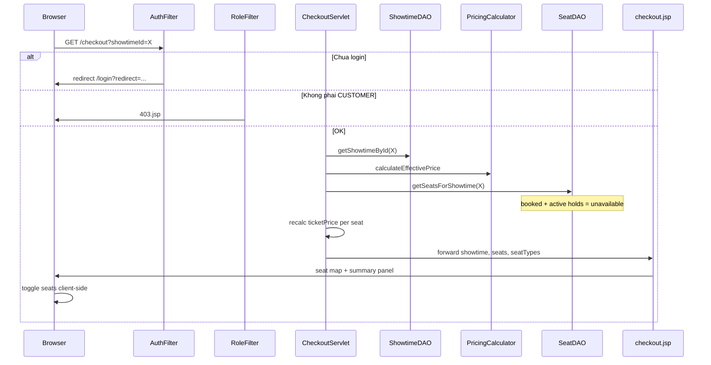

# Kế hoạch triển khai FR-12 — Chọn ghế (Seat Selection)

## Bối cảnh & điểm dừng hiện tại

Theo [`SOURCE_CODE_OVERVIEW.md`](SOURCE_CODE_OVERVIEW.md) và [`CUSTOMER_MODULE_DETAIL.md`](CUSTOMER_MODULE_DETAIL.md):

| Hạng mục | Trạng thái |
|----------|------------|
| FR-11 `/showtimes?movieId=` | Hoàn thành — chip suất link sẵn `/checkout?showtimeId=` |
| FR-50 dynamic pricing | Hoàn thành — `PricingCalculator` + `PricingRuleDAO` |
| `/checkout` | URL đã reserve trong [`AccessControl.java`](src/main/java/utils/AccessControl.java) (CUSTOMER + login), **chưa có servlet** |
| `controller.customer` | Chỉ có `package-info.java` |
| `SeatDAO.getSeatsForShowtime()` | Có — nhưng **chưa** tính `SeatHolds`; comment ghi FR-13 sẽ bổ sung |
| `SeatHolds` | Schema có, **chưa có DAO** |
| Staff counter | [`CounterBookingServlet`](src/main/java/controller/staff/CounterBookingServlet.java) + [`counter-booking.js`](src/main/webapp/js/counter-booking.js) — render ghế theo hàng, gap qua `seatColumn`, toggle chọn ghế |

**Spec FR-12** ([`project_summary_final.md`](project_summary_final.md)): *"Chọn ghế trên sơ đồ phòng chiếu. Ghế đang hold hoặc đã book hiển thị không chọn được"* — bảng `Seats`, `SeatHolds`, `BookingSeats`.

---

## Phạm vi FR-12 (rõ ràng in/out)

### Trong phạm vi

- Servlet + JSP màn chọn ghế tại `/checkout?showtimeId={uuid}`
- Sơ đồ ghế interactive: available / selected / sold (booked + held)
- Giá từng ghế = `effectivePrice × seat_multiplier` (pricing rules đã áp ở bước suất chiếu)
- Panel tóm tắt: ghế đã chọn, tổng tiền tạm tính (chưa VAT)
- Redirect login nếu chưa đăng nhập CUSTOMER (`/login?redirect=/checkout?showtimeId=...`)
- Guard suất chiếu: không tồn tại / `CANCELLED` / đã qua / `SOLD_OUT` → thông báo lỗi

### Ngoài phạm vi (FR tiếp theo)

| FR | Nội dung | Lý do tách |
|----|----------|------------|
| FR-13 | Validate availability server-side + check tuổi T13/T16/T18 | Chạy khi **giữ ghế** (POST confirm) |
| FR-14 | `INSERT SeatHolds` + `INSERT Bookings` ONLINE | Sau nút "Tiếp tục thanh toán" |
| FR-16–18 | VNPay/MoMo, callback, e-ticket | Màn payment riêng |
| Scheduled job | Dọn `SeatHolds` hết hạn | Infrastructure sau |

Nút **"Tiếp tục"** ở FR-12 chỉ enable khi đã chọn ≥1 ghế; POST có thể **stub** (flash message "Tính năng thanh toán đang phát triển") hoặc lưu selection vào session — không tạo booking thật.

---

## Luồng nghiệp vụ FR-12



**Điểm vào:** chip trong [`showtimes-selector.jsp`](src/main/webapp/WEB-INF/views/customer/components/showtimes-selector.jsp) — `href="${ctx}/checkout?showtimeId=${st.id}"`.

---

## Kiến trúc View (theo pattern FR-11)

Tách modular để tránh conflict với đồng nghiệp đang làm `movie-info-placeholder.jsp`:

```
checkout.jsp                          ← wrapper (header/footer, extraCss)
    ├── components/checkout-header.jsp    ← back link, tên phim, giờ, phòng
    ├── components/seat-map.jsp           ← màn hình + lưới ghế + legend
    └── components/booking-summary.jsp    ← danh sách ghế chọn, tổng, nút Tiếp tục
```

**Quy ước CSS class:** prefix `.ck-*` (checkout) — tách khỏi `.st-*` (showtimes) và `.pos-*` (staff counter).

**Design reference:** [`Screen Design/Seat selection/`](Screen%20Design/Seat%20selection/) — glass panel, screen glow, VIP gold border, selected = Cinematic Red `#e50914`.

---

## Proposed Changes

### 1. DAL — Cập nhật availability ghế

#### [MODIFY] [`SeatDAO.java`](src/main/java/dal/SeatDAO.java)

Mở rộng SQL trong `getSeatsForShowtime()` — `is_available = 0` khi:

1. `BookingSeats` thuộc booking `PENDING` hoặc `CONFIRMED` cùng suất (giữ nguyên logic hiện tại)
2. **Mới:** `SeatHolds` cùng `(showtime_id, seat_id)` với `expired_at > GETDATE()`

```sql
-- Thêm LEFT JOIN (hoặc EXISTS) tương đương:
LEFT JOIN SeatHolds sh_hold ON sh_hold.seat_id = s.id
    AND sh_hold.showtime_id = sh.id
    AND sh_hold.expired_at > GETDATE()
-- CASE WHEN bs.seat_id IS NULL AND sh_hold.seat_id IS NULL THEN 1 ELSE 0 END
```

Không cần `SeatHoldDAO` cho FR-12 (chỉ đọc qua JOIN). Ghi chú cập nhật comment FR-13 → phần đọc holds đã xử lý ở FR-12.

**Lưu ý giá:** `ticketPrice` trong DAO vẫn dùng `base_price × multiplier` (phục vụ staff counter). Servlet customer sẽ **ghi đè** sau khi có `effectivePrice`.

---

### 2. Controller

#### [NEW] [`CheckoutServlet.java`](src/main/java/controller/customer/CheckoutServlet.java)

`@WebServlet("/checkout")`

**GET** — query `showtimeId` (bắt buộc):

| Bước | Chi tiết |
|------|----------|
| Validate param | Thiếu → redirect `/movies` |
| Load suất | `ShowtimeDAO.getShowtimeById()` — null / `CANCELLED` / `start_time < now` → forward `404.jsp` hoặc error inline |
| Status guard | `SOLD_OUT` → hiển thị trang read-only "Suất đã hết vé" |
| Pricing | `PricingCalculator.calculateEffectivePrice(showtime, PricingRuleDAO.getActiveRules())` → set `effectivePrice` |
| Ghế | `SeatDAO.getSeatsForShowtime(showtimeId)` |
| Recalc giá ghế | Với mỗi seat: `ticketPrice = effectivePrice × priceMultiplier` (scale 0, HALF_UP) |
| Seat types legend | Dedupe từ danh sách ghế: `typeName`, `priceMultiplier`, màu từ [`seat-type-colors.js`](src/main/webapp/js/seat-type-colors.js) |
| Attributes | `showtime`, `seats` (grouped by row server-side hoặc flat list), `seatTypeLegend`, `effectivePrice` |
| View | forward `customer/checkout.jsp` |

**GET** `?action=seats&showtimeId=X` (JSON, optional nhưng khuyến nghị):

- Tái sử dụng pattern `serveSeatsJson()` từ [`CounterBookingServlet`](src/main/java/controller/staff/CounterBookingServlet.java) (lines 158–188)
- Cho phép refresh sơ đồ ghế định kỳ (30–60s) để cập nhật holds mới — không bắt buộc cho MVP FR-12

**POST** (stub cho FR-14):

- Nhận `showtimeId`, `seatIds[]`
- Validate: ≥1 ghế, showtime hợp lệ
- **Không** INSERT DB — set flash error/success hoặc redirect với query `?error=payment_soon`
- Hoặc lưu `List<String> selectedSeatIds` vào session attribute `checkoutDraft` để FR-14 đọc sau

**Auth:** Không cần check thủ công — `AuthFilter` + `RoleFilter` đã bảo vệ `/checkout`. Servlet chỉ cần đọc `SessionUtil.getLoggedUser(req)` khi cần userId (cho hold sau này).

---

### 3. View Layer

#### [NEW] [`checkout.jsp`](src/main/webapp/WEB-INF/views/customer/checkout.jsp)

```jsp
<c:set var="extraCss" value="customer-checkout"/>
<%@ include file="common/header.jsp" %>
<div class="ck-page">
    <jsp:include page="components/checkout-header.jsp"/>
    <div class="ck-layout">
        <jsp:include page="components/seat-map.jsp"/>
        <jsp:include page="components/booking-summary.jsp"/>
    </div>
</div>
<script src="${ctx}/js/customer-checkout.js"></script>
<%@ include file="common/footer.jsp" %>
```

#### [NEW] [`checkout-header.jsp`](src/main/webapp/WEB-INF/views/customer/components/checkout-header.jsp)

- Nút back → `/showtimes?movieId=${showtime.movieId}`
- Tiêu đề: `${showtime.movieTitle}` · `${formattedDateTime}` · `${showtime.roomName}`
- Badge age rating nếu T13/T16/T18 (chuẩn bị UI cho FR-13)

#### [NEW] [`seat-map.jsp`](src/main/webapp/WEB-INF/views/customer/components/seat-map.jsp)

- Screen indicator (`.ck-screen`)
- Loop theo hàng ghế — render gap khi `seatColumn` nhảy số (giống counter)
- Mỗi ghế: `data-seat-id`, `data-price`, `data-type`, class theo trạng thái:
  - `.ck-seat--available` / `.ck-seat--selected` / `.ck-seat--sold` / `.ck-seat--vip` (theo type)
- Legend loại ghế + màu trạng thái

#### [NEW] [`booking-summary.jsp`](src/main/webapp/WEB-INF/views/customer/components/booking-summary.jsp)

- `#ckSeatList` — cập nhật bằng JS
- `#ckTotal` — tổng VND
- Form POST hidden fields `showtimeId`, `seatIds`
- `#ckProceedBtn` disabled khi chưa chọn ghế

---

### 4. CSS & JS

#### [NEW] [`customer-checkout.css`](src/main/webapp/css/customer-checkout.css)

- Layout 2 cột desktop (map trái, summary sticky phải); mobile stack
- Glass panel summary (`.ck-summary`)
- Ghế: rounded-top như mockup, hover glow, selected red, sold opacity + icon
- Responsive overflow-x trên lưới ghế rộng

#### [NEW] [`customer-checkout.js`](src/main/webapp/js/customer-checkout.js)

Adapt từ [`counter-booking.js`](src/main/webapp/js/counter-booking.js) lines 173–245:

- `toggleSeat()` — multi-select, cập nhật summary
- `formatVnd()`, `escHtml()`
- Optional: `setInterval` gọi `/checkout?action=seats&showtimeId=` để re-render (giữ selection nếu ghế vẫn available)

**Không** sửa `counter-booking.js` — tránh regression staff POS.

---

### 5. Công thức giá ghế (quan trọng)

Theo luồng online trong spec:

```
ticketPrice_per_seat = effectivePrice × seat_multiplier
```

Trong đó `effectivePrice` = `PricingCalculator` trên `Showtime.basePrice` (đã dùng ở FR-11 cho chip suất).

**Khác staff counter:** quầy dùng `base_price × multiplier` trực tiếp — giữ nguyên, không đổi.

---

## Phụ thuộc & rủi ro

| Mục | Ghi chú |
|-----|---------|
| Login bắt buộc | Guest click chip suất → redirect login — test với tài khoản CUSTOMER (`customer@...` / `Password@123` nếu có seed) |
| Seed ghế | Cần manager đã save layout phòng — xem [`MANAGER_MODULE_DETAIL.md`](MANAGER_MODULE_DETAIL.md) |
| Race condition chọn ghế | FR-12 chỉ hiển thị; xử lý INSERT hold + UK constraint ở FR-13/14 |
| Không CSRF | Giữ convention hiện tại; ghi chú cho POST FR-14 |

---

## Verification Plan

### Manual tests

1. **Happy path**
   - Login CUSTOMER → `/showtimes?movieId=...` → click chip → `/checkout?showtimeId=...`
   - Sơ đồ ghế hiển thị đúng hàng, lối đi (gap), legend loại ghế
   - Click ghế → highlight đỏ, summary cập nhật giá từng ghế + tổng

2. **Ghế không chọn được**
   - Tạo booking staff cho 1 ghế → ghế đó `.ck-seat--sold` trên checkout
   - INSERT `SeatHolds` thủ công (`expired_at` +10 phút) → ghế held cũng sold

3. **Giá động**
   - Pricing rule cuối tuần +10.000đ → ghế REGULAR (×1) hiển thị `(base+rule)×1`, VIP (×1.5) nhân đúng multiplier

4. **Guard suất chiếu**
   - `showtimeId` sai → 404
   - Suất `SOLD_OUT` → không cho chọn
   - Thiếu `showtimeId` → redirect `/movies`

5. **Auth**
   - Chưa login → `/login?redirect=...`
   - Role STAFF → 403

6. **Responsive**
   - Mobile: scroll ngang lưới ghế, summary dưới map

---

## Thứ tự triển khai đề xuất

1. Sửa `SeatDAO.getSeatsForShowtime()` — thêm JOIN `SeatHolds`
2. `CheckoutServlet` GET + attributes + guards
3. JSP components + CSS theo mockup
4. `customer-checkout.js` — toggle + summary
5. POST stub + test end-to-end từ FR-11
6. (Optional) JSON refresh endpoint

Sau khi FR-12 merge ổn định → plan riêng **FR-13/14** (`SeatHoldDAO`, `BookingDAO.createOnlineBooking`, age validator).
