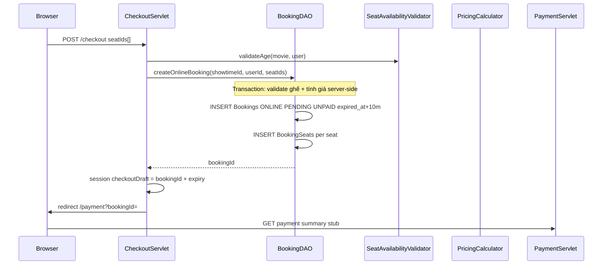

# Kế hoạch FR-14 — Tạo đơn đặt vé online

## Bối cảnh hiện tại

| Thành phần | Trạng thái |
|------------|------------|
| [`CheckoutServlet.java`](src/main/java/controller/customer/CheckoutServlet.java) | GET sơ đồ ghế + JSON poll; POST chỉ `SeatHoldDAO.holdSeats()` + session `checkoutDraft` |
| [`BookingDAO.java`](src/main/java/dal/BookingDAO.java) | Có `createOfflineBooking()` (staff); **chưa** `createOnlineBooking()` |
| [`SeatHoldDAO.java`](src/main/java/dal/SeatHoldDAO.java) | FR-13 — sẽ **không còn là bước chính** sau khi gộp luồng |
| [`SeatDAO.java`](src/main/java/dal/SeatDAO.java) | Ghế bị chặn khi `Bookings.booking_status IN ('PENDING','CONFIRMED')` — đủ cho FR-14 |
| Payment | Chưa có servlet/view; staff có mẫu [`counter-payment.jsp`](src/main/webapp/WEB-INF/views/staff/counter-payment.jsp) |

**Spec FR-14** ([`project_summary_final.md`](project_summary_final.md) Luồng 1, bước 4): sau xác nhận ghế → `INSERT Bookings(PENDING, UNPAID, vat_rate_snapshot, expired_at=NOW+10min)` + `BookingSeats(ticket_price snapshot)`. Validate lại tuổi server-side.

**Quyết định UX (đã chọn):** Gộp 1 bước — nút trên checkout vừa xác nhận ghế vừa tạo đơn, **không** redirect `?hold=ok` trung gian.

---

## Luồng mục tiêu



---

## Phạm vi FR-14

**Trong phạm vi:**
- `BookingDAO.createOnlineBooking()`
- Refactor POST [`CheckoutServlet`](src/main/java/controller/customer/CheckoutServlet.java)
- Trang stub [`PaymentServlet`](src/main/java/controller/customer/PaymentServlet.java) + JSP tóm tắt đơn (chưa VNPay/MoMo)
- Cập nhật UI checkout (nút, countdown theo `expired_at` của booking)
- Thêm `/payment` vào [`AccessControl`](src/main/java/utils/AccessControl.java)

**Ngoài phạm vi (FR tiếp theo):**
- FR-16–18: cổng VNPay/MoMo, callback, `Payments`, `Tickets`
- FR-22 / FR-43: mã giảm giá, điểm loyalty trên payment
- Scheduled job `EXPIRED` booking (ghi chú kỹ thuật; có thể test thủ công UPDATE)
- Xóa `SeatHolds` sau thanh toán (chỉ cần khi vẫn dùng hold — luồng gộp có thể bỏ qua hold)

---

## 1. DAL — `BookingDAO.createOnlineBooking()`

**File:** [`BookingDAO.java`](src/main/java/dal/BookingDAO.java)

Thêm method (mirror pattern `createOfflineBooking`, khác nguồn ONLINE):

```java
public String createOnlineBooking(String showtimeId, String userId, List<String> seatIds)
```

**Transaction (một `Connection`, `setAutoCommit(false)`):**

| Bước | Chi tiết |
|------|----------|
| 1. Validate input | `seatIds` không rỗng; dedupe qua `SeatHoldDAO.distinctSeatIds()` |
| 2. Validate ghế | Tái sử dụng logic [`SeatHoldDAO.findBlockingSeatCodes()`](src/main/java/dal/SeatHoldDAO.java) — ghế booked/hold bởi user khác → throw `SeatHoldException` |
| 3. Validate thuộc suất | `SeatHoldDAO.countValidSeatsForShowtime()` |
| 4. Tính giá server-side | **Không tin client.** Load showtime + `PricingRuleDAO.getActiveRules()` → `PricingCalculator.calculateEffectivePrice()`; với từng seat: `ticketPrice = effectivePrice × priceMultiplier` (scale 0, HALF_UP) — giống `CheckoutServlet.recalcSeatPrices()` |
| 5. VAT | `getCurrentVatRate()` (đã có); `totalAmount = Σ ticketPrice`; `finalAmount = totalAmount × (1 + vat/100)` — **cùng công thức** [`createOfflineBooking`](src/main/java/dal/BookingDAO.java) lines 38–42 |
| 6. INSERT Bookings | `booking_source='ONLINE'`, `user_id`, `created_by_staff_id=NULL`, `customer_name/phone=NULL`, `booking_status='PENDING'`, `payment_status='UNPAID'`, `discount_amount=0`, `expired_at = DATEADD(MINUTE, 10, GETDATE())` |
| 7. INSERT BookingSeats | `(booking_id, seat_id, ticket_price)` batch |
| 8. Commit | Return `bookingId` |

**Booking code:** tách helper — ONLINE dùng prefix `BK-` + date + random (spec); OFFLINE giữ `CTR...`.

**Idempotency (khuyến nghị):** trước INSERT, kiểm tra user đã có booking `PENDING` + `UNPAID` + `booking_source=ONLINE` cùng `showtime_id` và `expired_at > GETDATE()` → return `bookingId` cũ thay vì tạo trùng (tránh double-click).

**Exception:** wrap `SQLException` UK → message thân thiện giống hold race.

---

## 2. Controller — Refactor `CheckoutServlet` POST

**File:** [`CheckoutServlet.java`](src/main/java/controller/customer/CheckoutServlet.java)

Thay block `holdDAO.holdSeats(...)` (lines 131–142) bằng:

1. `SeatAvailabilityValidator.validateAge()` — **giữ nguyên** (FR-14 yêu cầu re-validate)
2. `new BookingDAO().createOnlineBooking(showtimeId, user.getId(), seatIds)`
3. Load booking qua `getById()` lấy `expiredAt`
4. Session `checkoutDraft`:

```java
Map.of(
  "bookingId", bookingId,
  "showtimeId", showtimeId,
  "seatIds", seatIds,
  "expiredAt", expiredAt.getTime()
)
```

5. Redirect: `/payment?bookingId={id}` (không còn `?hold=ok`)

**GET `forwardCheckoutPage`:** bỏ message stub FR-14; nếu user quay lại checkout với booking PENDING active → có thể hiển thị link "Tiếp tục thanh toán" (optional).

**Poll JSON `?action=seats`:** giữ nguyên — sau khi có booking PENDING, ghế tự unavailable qua `SeatDAO`.

---

## 3. Controller — `PaymentServlet` (stub FR-16)

**New:** [`PaymentServlet.java`](src/main/java/controller/customer/PaymentServlet.java) `@WebServlet("/payment")`

| Method | Hành vi |
|--------|---------|
| GET `?bookingId=` | Load `BookingDAO.getDetailById()`; guard: booking thuộc user hiện tại, `booking_source=ONLINE`, `booking_status=PENDING`, chưa hết `expired_at` |
| Fail guard | 404 hoặc redirect `/checkout?showtimeId=` + error |
| View | [`payment.jsp`](src/main/webapp/WEB-INF/views/customer/payment.jsp) — hiển thị mã đơn, phim, ghế, `total_amount`, VAT, `final_amount`, countdown 10 phút |
| POST | **Stub FR-16** — disabled buttons VNPay/MoMo hoặc flash "Sắp có" |

**AccessControl:** thêm `"/payment"` vào `CUSTOMER_PREFIXES` trong [`AccessControl.java`](src/main/java/utils/AccessControl.java).

---

## 4. View & JS

### 4.1 [`booking-summary.jsp`](src/main/webapp/WEB-INF/views/customer/components/booking-summary.jsp)

- Đổi nút: **"Tiếp tục thanh toán"** (thay "Giữ ghế & tiếp tục")
- Cập nhật note VAT: hiển thị "Chưa bao gồm VAT" trước POST; sau redirect payment hiển thị breakdown đầy đủ
- Countdown trên checkout: **bỏ** hoặc chỉ hiện sau khi quay lại từ payment (optional) — countdown chính chuyển sang payment page

### 4.2 [`customer-checkout.js`](src/main/webapp/js/customer-checkout.js)

- Giữ poll 2s
- Form submit vẫn gửi `seatIds[]` — server recalc giá, không cần `seatPrices[]` từ client
- Có thể thêm confirm dialog trước POST (optional UX)

### 4.3 Payment view (new)

```
views/customer/
├── payment.jsp
└── components/
    └── payment-summary.jsp   # optional — mirror staff counter-payment layout
```

CSS: tái dùng `.ck-*` hoặc prefix `.pay-*` mới trong `customer-checkout.css` (minimal diff).

**Design:** chưa có mockup payment customer — layout tham chiếu [`counter-payment.jsp`](src/main/webapp/WEB-INF/views/staff/counter-payment.jsp) + theme Cinematic Premium.

---

## 5. Quan hệ với FR-13 / SeatHolds

Luồng gộp **không cần** `INSERT SeatHolds` cho happy path — `Bookings PENDING` đã chặn ghế qua [`SeatDAO`](src/main/java/dal/SeatDAO.java).

| Hành động | Ghi chú |
|-----------|---------|
| Giữ `SeatHoldDAO` | Không xóa class — có thể dùng cho edge case hoặc cleanup job |
| Bỏ redirect `?hold=ok` | Thay bằng redirect payment |
| Cập nhật docs | `CUSTOMER_MODULE_DETAIL.md` §6 — luồng gộp 1 POST |

Nếu muốn tương thích ngược: có thể gọi `deleteExpiredHolds()` trong `createOnlineBooking` đầu transaction (dọn rác) — không bắt buộc.

---

## 6. Validation & bảo mật

| Rule | Nơi enforce |
|------|-------------|
| Tuổi T13/T16/T18 | `CheckoutServlet` POST + có thể assert lại trong DAO |
| Ghế trống | `findBlockingSeatCodes` trước INSERT |
| Giá | Chỉ tính server-side từ `PricingCalculator` + `SeatTypes.price_multiplier` |
| Ownership payment | `PaymentServlet` — `booking.userId == sessionUser.id` |
| Suất hợp lệ | Không `CANCELLED`/`SOLD_OUT`/đã bắt đầu — giữ guard hiện có |
| CSRF | Giữ convention hiện tại (ghi chú trong docs) |

---

## 7. Kiểm tra thủ công

1. Login `customer.adult@email.com` → chọn ghế → **Tiếp tục thanh toán** → redirect `/payment?bookingId=`
2. DB: 1 row `Bookings` (`ONLINE`, `PENDING`, `UNPAID`, `expired_at` ~+10m) + N rows `BookingSeats`
3. Tab ẩn danh: ghế vừa đặt unavailable trên checkout (poll JSON)
4. `customer.teen@email.com` + suất T18 → POST bị chặn
5. Staff đặt cùng ghế offline trước → customer POST fail với message ghế không trống
6. Double-click nút → idempotency trả về cùng `bookingId` (không 2 đơn)
7. Mở `/payment?bookingId=` booking user khác → 403/404
8. Sau `expired_at` (UPDATE thủ công hoặc chờ) → payment page từ chối / redirect checkout

---

## 8. Cập nhật tài liệu (sau implement)

- [`SOURCE_CODE_OVERVIEW.md`](SOURCE_CODE_OVERVIEW.md): route `/payment`, `createOnlineBooking`, trạng thái FR-14 ✅
- [`CUSTOMER_MODULE_DETAIL.md`](CUSTOMER_MODULE_DETAIL.md): luồng gộp, bỏ mô tả hold-first
- Tạo [`implementation_plan_fr-14.md`](implementation_plan_fr-14.md) (optional, theo pattern FR-11)

---

## Thứ tự implement đề xuất

1. `BookingDAO.createOnlineBooking()` + helper `generateOnlineBookingCode()` + optional idempotency query
2. Refactor `CheckoutServlet` POST → redirect payment
3. `PaymentServlet` + `payment.jsp` stub
4. `AccessControl` + UI (button label, messages)
5. Manual test + cập nhật docs

**Effort ước lượng:** ~1 servlet mới, ~1 DAO method (~80–120 LOC), refactor checkout POST (~30 LOC), 1–2 JSP, JS/CSS nhỏ.
