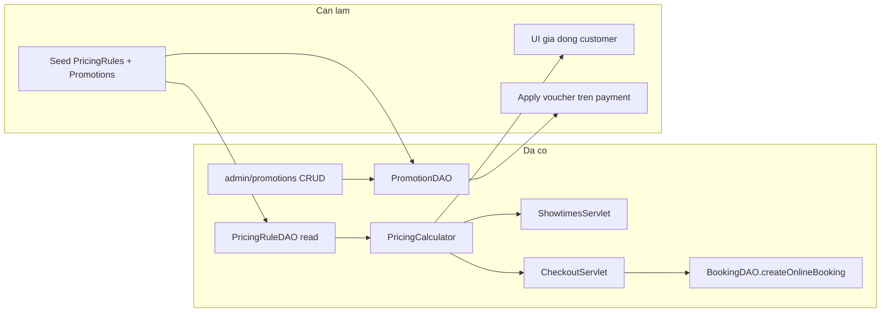
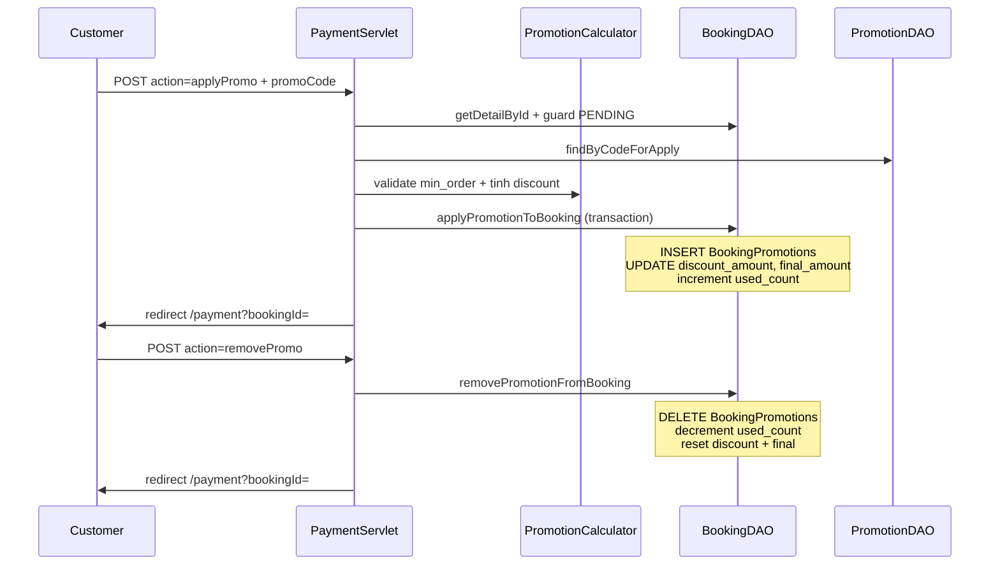

# Plan FR-50 + FR-22 (Customer — không đụng Manager)

## Bối cảnh hiện tại

| FR | Trạng thái | Ghi chú |
|----|------------|---------|
| **FR-50** | Core logic ✅ | [`PricingCalculator`](src/main/java/utils/PricingCalculator.java) dùng ở [`ShowtimesServlet`](src/main/java/controller/ShowtimesServlet.java), [`CheckoutServlet`](src/main/java/controller/customer/CheckoutServlet.java), [`BookingDAO.createOnlineBooking`](src/main/java/dal/BookingDAO.java) |
| **FR-21** (quản lý voucher) | ✅ (Admin) | [`/admin/promotions`](src/main/java/controller/admin/PromotionListServlet.java) — MANAGER truy cập qua [`AccessControl.MANAGER_ADMIN_PATHS`](src/main/java/utils/AccessControl.java); **không sửa** các servlet/JSP admin này |
| **FR-22** | ❌ | Chưa có UI/API áp mã; `BookingPromotions` chưa có DAO; `discount_amount` luôn = 0 khi tạo đơn |

**Ràng buộc:** Không chỉnh package `controller.manager`, `views/manager`, hay CRUD pricing rules (FR-49). Chỉ customer module + utils/DAL dùng chung + seed SQL.

---

## Phần A — FR-50: UI giá động + seed demo

### A1. UI customer — làm rõ giá hiệu quả

**Mục tiêu:** Khách thấy khi nào giá suất khác `base_price` (theo [`project_summary_final.md`](project_summary_final.md) §FR-50).

| Vị trí | File | Thay đổi |
|--------|------|----------|
| Chip suất chiếu | [`showtimes-selector.jsp`](src/main/webapp/WEB-INF/views/customer/components/showtimes-selector.jsp) | Nếu `effectivePrice != basePrice`: hiện giá hiệu quả + giá gốc gạch ngang (`.st-price--struck`) |
| Header checkout | [`checkout-header.jsp`](src/main/webapp/WEB-INF/views/customer/components/checkout-header.jsp) | Hiện giá vé cơ sở suất sau pricing rule (đã có `effectivePrice` từ servlet) |
| Summary checkout | [`booking-summary.jsp`](src/main/webapp/WEB-INF/views/customer/components/booking-summary.jsp) | Ghi chú ngắn khi có điều chỉnh giá (optional badge) |
| CSS | [`customer-showtimes.css`](src/main/webapp/css/customer-showtimes.css), [`customer-checkout.css`](src/main/webapp/css/customer-checkout.css) | Class `.st-price-original`, `.ck-price-badge` theo [`Screen Design/Movie-detail/`](Screen%20Design/Movie-detail/) |

**Servlet:** [`ShowtimesServlet`](src/main/java/controller/ShowtimesServlet.java) và [`CheckoutServlet`](src/main/java/controller/customer/CheckoutServlet.java) đã set `effectivePrice` — chỉ cần đảm bảo JSP đọc cả `basePrice` + `effectivePrice`, không đổi logic tính giá.

### A2. Seed dữ liệu test

**File:** [`Database/create_database.sql`](Database/create_database.sql) — thêm block seed (cuối file, sau seed hiện có):

**PricingRules** (2–3 rule ACTIVE, `created_by` = manager seed):
- Cuối tuần T7/CN: `DAY_OF_WEEK` `"6,7"`, `FIXED_AMOUNT` +10.000
- Khung tối: `TIME_RANGE` 21:00–23:00, `PERCENTAGE` +10

**Promotions** (2 mã test cho FR-22):
- `WEEKEND10`: PERCENTAGE 10%, `min_order_amount` 100.000, `max_discount_amount` 50.000, 30 ngày
- `FLAT20K`: FIXED_AMOUNT 20.000, `min_order_amount` 150.000, 30 ngày

Không cần migration riêng — script idempotent theo pattern seed hiện có.

---

## Phần B — FR-22: Áp mã giảm giá trên `/payment`

### B1. Luồng nghiệp vụ (theo spec)

**Thời điểm áp mã:** Sau khi có đơn PENDING (FR-14 step 5a trong spec) — tức trên [`payment.jsp`](src/main/webapp/WEB-INF/views/customer/payment.jsp), **trước** thanh toán VNPay/MoMo.

**Công thức tiền** (nhất quán với [`BookingDAO.createOnlineBooking`](src/main/java/dal/BookingDAO.java) hiện tại):

- `total_amount` = tổng giá vé **chưa VAT** (snapshot `BookingSeats.ticket_price`)
- `discount_amount` = giảm trên `total_amount` (validate `min_order_amount` so với subtotal này)
- `final_amount` = `(total_amount - discount_amount) × (1 + vat_rate_snapshot / 100)`, làm tròn HALF_UP 0 chữ số thập phân

**Tính discount từ [`Promotion`](src/main/java/model/entity/Promotion.java):**

| `discount_type` | Logic |
|-----------------|-------|
| `PERCENTAGE` | `subtotal × value/100`, cap `max_discount_amount` nếu có |
| `FIXED_AMOUNT` | `min(value, subtotal)` |

**Validate (mirror [`PromotionSaveServlet`](src/main/java/controller/admin/PromotionSaveServlet.java) + [`PromotionDAO.findByCodeForApply`](src/main/java/dal/PromotionDAO.java)):**
- Mã tồn tại, `ACTIVE`, trong `start_date`–`end_date`, còn lượt (`usage_limit IS NULL OR used_count < usage_limit`)
- `total_amount >= min_order_amount` (nếu set)
- Booking: ONLINE, PENDING, UNPAID, chưa hết `expired_at`, đúng owner
- **1 mã / đơn** — áp mã mới → thay mã cũ (hoàn `used_count` mã cũ)

### B2. Layer mới / mở rộng (chỉ customer + shared DAL)

**1. [`utils/PromotionCalculator.java`](src/main/java/utils/PromotionCalculator.java)** (mới)
- `calculateDiscount(Promotion, BigDecimal subtotal)` → `BigDecimal`
- `recalculateFinalAmount(subtotal, discount, vatRate)` → `BigDecimal`
- Message lỗi tiếng Việt cho servlet

**2. [`dal/BookingPromotionDAO.java`](src/main/java/dal/BookingPromotionDAO.java)** (mới, nhẹ)
- `findByBookingId(bookingId)` → optional `(promotionId, code, discountApplied)`
- `insert(conn, bookingId, promotionId, discountApplied)`
- `deleteByBookingId(conn, bookingId)`

**3. Mở rộng [`dal/PromotionDAO.java`](src/main/java/dal/PromotionDAO.java)** — **chỉ thêm method**, không sửa CRUD admin:
- `incrementUsedCountIfAvailable(id)` — `UPDATE ... WHERE used_count < usage_limit OR usage_limit IS NULL`
- `decrementUsedCount(id)` — dùng khi hủy/xóa mã khỏi đơn PENDING

**4. Mở rộng [`dal/BookingDAO.java`](src/main/java/dal/BookingDAO.java):**
- `applyPromotionToBooking(bookingId, userId, promotionId, discountAmount, finalAmount)` — transaction
- `removePromotionFromBooking(bookingId, userId)` — transaction + hoàn `used_count`
- Cập nhật `getDetailById` load `discount_amount` + promo đã áp (JOIN `BookingPromotions` + `Promotions`)
- Cập nhật `cancelOnlinePendingBooking` — khi hủy đơn có promo: xóa `BookingPromotions` + `decrementUsedCount` (tránh “ăn” lượt voucher)

**5. Mở rộng [`model/dto/BookingDetailDTO.java`](src/main/java/model/dto/BookingDetailDTO.java):**
- `discountAmount`, `appliedPromoCode`, `appliedPromoTitle` (hoặc nested `PromoSummary`)

**6. [`PaymentServlet`](src/main/java/controller/customer/PaymentServlet.java):**
- POST `action=applyPromo` + param `promoCode`
- POST `action=removePromo`
- Giữ nguyên `action=cancel` và stub VNPay

### B3. UI payment (theo design)

**Tham chiếu:** [`Screen Design/Ticket booking/code.html`](Screen%20Design/Ticket%20booking/code.html) — block “Voucher / Promo Code” + dòng Discount trong breakdown.

**[`payment.jsp`](src/main/webapp/WEB-INF/views/customer/payment.jsp):**
- Form áp mã: input + nút “Áp dụng” → POST `action=applyPromo`
- Khi đã áp: hiện dòng giảm giá (code + số tiền), nút “Gỡ mã”
- Breakdown cập nhật:
  - Tạm tính
  - Giảm giá (nếu có) — màu accent
  - VAT trên `(total - discount)`
  - Tổng thanh toán = `final_amount`
- Sửa `vatAmount` JSP: `(finalAmount / (1+vat/100)) * vat/100` hoặc truyền `vatAmount` từ servlet/DTO (tránh công thức cũ `final - total` khi có discount)

**[`customer-payment.js`](src/main/webapp/js/customer-payment.js):** Giữ countdown; optional trim/uppercase mã client-side.

**CSS:** `.pay-promo-*` trong [`customer-checkout.css`](src/main/webapp/css/customer-checkout.css) (đã có `.pay-*`).

---

## Phần C — Tài liệu & kiểm thử

### C1. Cập nhật docs (sau implement)

- [`CUSTOMER_MODULE_DETAIL.md`](CUSTOMER_MODULE_DETAIL.md): §1.1 FR-22 ✅, §6b payment promo, §12 manual test voucher
- [`SOURCE_CODE_OVERVIEW.md`](SOURCE_CODE_OVERVIEW.md): endpoint `/payment` POST `applyPromo`/`removePromo`, DAO mới
- Tạo [`implementation_plan_fr-22_fr-50.md`](implementation_plan_fr-22_fr-50.md) (spec nội bộ, mirror style [`fr-14_online_booking_ab14e307.plan.md`](fr-14_online_booking_ab14e307.plan.md))

### C2. Manual test checklist

**FR-50:**
1. Suất T7/CN vs T2–T6 cùng `base_price` → chip showtimes hiện giá khác + gạch giá gốc
2. Checkout header/summary phản ánh `effectivePrice`

**FR-22:**
1. Tạo đơn PENDING → `/payment` → nhập `WEEKEND10` hợp lệ → breakdown giảm, DB có `BookingPromotions`
2. Mã sai / hết hạn / hết lượt / đơn dưới `min_order_amount` → thông báo lỗi, không đổi tiền
3. Gỡ mã → `discount_amount=0`, `used_count` giảm
4. Hủy đơn PENDING có mã → `used_count` hoàn lại
5. Hai tab cùng áp mã cuối lượt → một tab fail (race `incrementUsedCountIfAvailable`)

---

## Phạm vi loại trừ (explicit)

- Package [`controller.manager`](src/main/java/controller/manager/) và [`MANAGER_MODULE_DETAIL.md`](MANAGER_MODULE_DETAIL.md) flows
- UI/servlet admin promotion ([`PromotionListServlet`](src/main/java/controller/admin/PromotionListServlet.java), [`promotion-list.jsp`](src/main/webapp/WEB-INF/views/admin/promotion-list.jsp))
- FR-49 CRUD `PricingRules` cho Manager
- FR-43 loyalty redeem trên payment
- FR-16–18 VNPay/MoMo callback
- Staff counter áp voucher (offline)

---

## Thứ tự triển khai đề xuất

1. Seed SQL + UI FR-50 (showtimes/checkout) — test giá động trước
2. `PromotionCalculator` + `BookingPromotionDAO` + mở rộng `BookingDAO`/`PromotionDAO`
3. `PaymentServlet` + `payment.jsp` + DTO
4. Hook cancel booking hoàn voucher
5. Docs + manual test
