# 🎬 Movie Ticket Booking System — Tổng hợp toàn bộ dự án

> **Phạm vi:** 1 rạp duy nhất · Không audit log · Không check-in · Không refund tiền mặt
> **Stack:** Java + JSP/Servlet (SWP391) · **26 bảng** · **50 Functional Requirements**

---

## I. CHI TIẾT TỪNG BẢNG

---

### NHÓM AUTH

---

#### 1. `roles` — Vai trò hệ thống
Lưu danh sách vai trò cố định. Guest không lưu DB, xử lý ở tầng session.

| Field | Dùng để làm gì |
|---|---|
| `id` | Khoá chính |
| `role_name` | Tên vai trò: `CUSTOMER` · `STAFF` · `MANAGER` · `ADMIN` |
| `description` | Mô tả quyền hạn của vai trò để hiển thị trên UI quản lý |
| `created_at` | Thời điểm tạo |

---

#### 2. `users` — Tài khoản người dùng
Lưu toàn bộ tài khoản trong hệ thống. Mỗi user có đúng 1 role qua FK trực tiếp.

| Field | Dùng để làm gì |
|---|---|
| `id` | Khoá chính |
| `role_id` | FK → roles. Xác định quyền hạn của user trong hệ thống |
| `email` | Đăng nhập + nhận email xác nhận vé (chỉ với online booking) |
| `username` | Tên đăng nhập thay thế cho email |
| `phone_number` | Dùng để Staff tra cứu tài khoản tại quầy khi khách muốn tích điểm |
| `password_hash` | Mật khẩu đã hash (BCrypt/Argon2id). Không bao giờ lưu plain-text |
| `full_name` | Hiển thị trên UI và in trên vé |
| `avatar_url` | Ảnh đại diện hiển thị trên profile |
| `status` | Trạng thái TK: `ACTIVE` · `INACTIVE` · `BANNED`. Manager khóa tài khoản qua đây |
| `loyalty_points` | Tổng điểm tích lũy hiện tại. Denormalized để query nhanh, cập nhật atomic mỗi giao dịch điểm |
| `last_login_at` | Lần đăng nhập gần nhất — dùng cho báo cáo activity |
| `created_at` | Thời điểm đăng ký tài khoản |

---

#### 3. `password_reset_tokens` — Token quên mật khẩu
Lưu token tạm thời khi user yêu cầu đặt lại mật khẩu. Mỗi token chỉ dùng 1 lần.

| Field | Dùng để làm gì |
|---|---|
| `id` | Khoá chính |
| `user_id` | FK → users. User yêu cầu reset mật khẩu |
| `token` | Chuỗi ngẫu nhiên 32–64 ký tự nhúng vào link gửi email. UK để không trùng |
| `expired_at` | Token hết hạn sau 15–30 phút. Sau thời điểm này link email vô hiệu |
| `used_at` | Thời điểm token được dùng. NULL nếu chưa dùng. Sau khi dùng không thể dùng lại |
| `created_at` | Thời điểm tạo token |

---

### NHÓM CONFIG

---

#### 4. `system_config` — Cấu hình vận hành hệ thống
Bảng key-value lưu tham số vận hành. Manager/Admin chỉnh qua UI, không cần sửa code.

| Field | Dùng để làm gì |
|---|---|
| `config_key` | Tên tham số — khoá chính. Code dùng để tra cứu giá trị |
| `config_value` | Giá trị dạng string, app tự parse sang đúng kiểu khi dùng |
| `description` | Mô tả để Manager hiểu ý nghĩa trước khi chỉnh sửa |
| `updated_by` | FK → users. Manager/Admin nào cập nhật lần cuối — để truy vết |
| `updated_at` | Thời điểm cập nhật lần cuối |

**4 config keys đang dùng:**

| Key | Giá trị mặc định | Tác dụng |
|---|---|---|
| `loyalty_earn_rate` | `1` | Số điểm nhận được trên mỗi 1.000đ chi tiêu |
| `loyalty_redeem_rate` | `100` | Số điểm cần để đổi 10.000đ giảm giá |
| `loyalty_min_redeem` | `100` | Điểm tối thiểu mới được phép đổi trong 1 đơn |
| `loyalty_max_redeem_per_order` | `5000` | Điểm tối đa được đổi trong 1 đơn |

---

#### 5. `vat_rules` — Quy tắc thuế VAT theo thời gian
Lưu lịch sử thuế suất VAT. Hỗ trợ thay đổi thuế suất mà không ảnh hưởng đơn cũ nhờ cơ chế snapshot.

| Field | Dùng để làm gì |
|---|---|
| `id` | Khoá chính |
| `rule_name` | Tên quy tắc để Manager nhận biết. VD: `"VAT mặc định 10%"`, `"Giảm thuế NQ xxx"` |
| `vat_rate` | Tỷ lệ thuế: `10.00` = 10%, `8.00` = 8% |
| `start_date` | Ngày bắt đầu áp dụng thuế suất này |
| `end_date` | Ngày hết hạn. NULL nếu chưa có ngày kết thúc (đang hiệu lực) |
| `status` | `ACTIVE` · `INACTIVE`. Tại 1 thời điểm chỉ có 1 rule ACTIVE hợp lệ |
| `created_at` | Thời điểm tạo rule |

---

### NHÓM CINEMA

---

#### 6. `cinema_info` — Thông tin rạp
Bảng chỉ có **1 dòng duy nhất**. Manager chỉnh sửa qua UI quản lý.

| Field | Dùng để làm gì |
|---|---|
| `id` | Khoá chính |
| `name` | Tên rạp hiển thị trên header và trang chủ |
| `address` | Địa chỉ đầy đủ hiển thị trên trang thông tin và vé |
| `hotline` | Số tổng đài hiển thị để khách liên hệ |
| `email` | Email liên hệ của rạp |
| `opening_hours` | Giờ hoạt động. VD: `"08:00 – 23:00 (tất cả các ngày)"` |
| `description` | Giới thiệu rạp: tiện ích, bãi đỗ xe, chính sách... |
| `created_at` | Thời điểm tạo |

---

#### 7. `cinema_rooms` — Phòng chiếu
Danh sách phòng chiếu trong rạp. Mỗi phòng có sơ đồ ghế riêng.

| Field | Dùng để làm gì |
|---|---|
| `id` | Khoá chính |
| `room_name` | Tên phòng duy nhất: `"Phòng 1"`, `"Phòng IMAX"`. Hiển thị trên lịch chiếu |
| `capacity` | Tổng số ghế. Denormalized để query nhanh, phải đồng bộ với COUNT(seats) |
| `status` | Trạng thái phòng: `ACTIVE` · `MAINTENANCE` · `INACTIVE` |
| `created_at` | Thời điểm tạo phòng |

---

#### 8. `seat_types` — Loại ghế & hệ số giá
Phân loại ghế. Hệ số nhân quyết định giá vé từng loại ghế.

| Field | Dùng để làm gì |
|---|---|
| `id` | Khoá chính |
| `type_name` | Tên loại ghế duy nhất: `REGULAR`, `VIP`, `COUPLE`, `SWEETBOX`... |
| `price_multiplier` | Hệ số nhân lên `base_price`. Regular=1.0, VIP=1.5, Couple=2.0. Quyết định giá vé cơ bản |
| `description` | Mô tả đặc điểm ghế: kích thước, tiện ích... hiển thị khi chọn ghế |

---

#### 9. `seats` — Ghế vật lý
Mỗi row là 1 ghế cố định trong phòng. Dữ liệu ổn định sau khi thiết lập phòng.

| Field | Dùng để làm gì |
|---|---|
| `id` | Khoá chính |
| `room_id` | FK → cinema_rooms. Phòng chứa ghế này |
| `seat_type_id` | FK → seat_types. Loại ghế để tính giá và hiển thị màu trên sơ đồ |
| `seat_row` | Hàng ghế: `A`, `B`, `C`... Dùng để vẽ sơ đồ và in vé |
| `seat_column` | Số thứ tự cột: `1`, `2`, `3`... Dùng để vẽ sơ đồ và in vé |
| `seat_code` | Mã ghế đầy đủ: `A1`, `B5`... Hiển thị trên sơ đồ và in trên vé |
| `status` | `ACTIVE` · `BROKEN` (hỏng, ẩn khỏi sơ đồ) · `BLOCKED` (khoá có chủ đích) |

**UK:** `(room_id, seat_code)` — mã ghế duy nhất trong mỗi phòng.

---

### NHÓM MOVIE

---

#### 10. `movies` — Thông tin phim
Thông tin đầy đủ của từng bộ phim. `average_rating` denormalized để hiển thị nhanh.

| Field | Dùng để làm gì |
|---|---|
| `id` | Khoá chính |
| `title` | Tên phim hiển thị trên UI |
| `slug` | Tên URL-friendly: `avengers-endgame`. Dùng trong đường dẫn trang chi tiết phim |
| `description` | Cốt truyện / mô tả nội dung phim |
| `duration_minutes` | Thời lượng phút. Dùng để tính `showtimes.end_time` và hiển thị |
| `release_date` | Ngày khởi chiếu. Dùng để lọc phim theo ngày |
| `trailer_url` | Link YouTube/Vimeo nhúng vào trang chi tiết phim |
| `poster_url` | Ảnh poster hiển thị trên danh sách và trang chi tiết |
| `director` | Tên đạo diễn |
| `cast_members` | Danh sách diễn viên (JSON array hoặc CSV) |
| `language` | Ngôn ngữ gốc của phim |
| `subtitle` | Phụ đề |
| `age_rating` | Giới hạn độ tuổi: `P`, `K`, `T13`, `T16`, `T18`, `C` theo phân loại Việt Nam |
| `status` | `COMING_SOON` · `NOW_SHOWING` · `ENDED`. Dùng để lọc phim trên trang chủ |
| `average_rating` | Cache điểm trung bình từ `movie_reviews`. Cập nhật khi có review mới |
| `created_at` | Thời điểm thêm phim vào hệ thống |

---

#### 11. `genres` — Thể loại phim
Danh mục thể loại để lọc và tìm kiếm phim.

| Field | Dùng để làm gì |
|---|---|
| `id` | Khoá chính |
| `genre_name` | Tên thể loại duy nhất: `Hành động`, `Tình cảm`, `Kinh dị`... |
| `created_at` | Thời điểm tạo |

---

#### 12. `movie_genres` — Junction phim–thể loại
Quan hệ M-N: 1 phim thuộc nhiều thể loại, 1 thể loại chứa nhiều phim.

| Field | Dùng để làm gì |
|---|---|
| `movie_id` | FK → movies. Phần của PK composite |
| `genre_id` | FK → genres. Phần của PK composite |

---

#### 13. `movie_reviews` — Đánh giá phim
Đánh giá sao và nhận xét của khách hàng sau khi xem phim.

| Field | Dùng để làm gì |
|---|---|
| `id` | Khoá chính |
| `movie_id` | FK → movies. Phim được đánh giá |
| `user_id` | FK → users. User viết đánh giá |
| `rating` | Số sao 1–5. Dùng để tính `movies.average_rating` |
| `review_content` | Nội dung nhận xét. Nullable nếu chỉ chấm sao không viết |
| `created_at` | Thời điểm đăng đánh giá |

**UK:** `(movie_id, user_id)` — mỗi user chỉ review 1 lần / 1 phim.

---

### NHÓM SHOWTIME

---

#### 14. `showtimes` — Lịch chiếu
Phim nào, phòng nào, giờ nào, giá gốc bao nhiêu.

| Field | Dùng để làm gì |
|---|---|
| `id` | Khoá chính |
| `movie_id` | FK → movies. Phim được chiếu trong suất này |
| `room_id` | FK → cinema_rooms. Phòng chiếu |
| `start_time` | Giờ bắt đầu chiếu. Hiển thị trên lịch và trang chọn suất |
| `end_time` | Giờ kết thúc = `start_time` + `duration_minutes` + buffer dọn phòng |
| `base_price` | Giá vé gốc trước khi nhân `seat_multiplier` và áp `pricing_rules`. Đã bao gồm VAT |
| `status` | `SCHEDULED` · `OPEN` · `SOLD_OUT` · `CANCELLED` · `FINISHED` |
| `created_by` | FK → users. Manager nào tạo suất chiếu này |
| `created_at` | Thời điểm tạo suất |

---

#### 15. `pricing_rules` — Quy tắc điều chỉnh giá linh hoạt
Quy tắc tăng/giảm giá vé theo thời điểm. Áp dụng toàn hệ thống, tính runtime khi hiển thị giá.

| Field | Dùng để làm gì |
|---|---|
| `id` | Khoá chính |
| `rule_name` | Tên rule để Manager nhận biết: `"Phụ thu cuối tuần"`, `"Giảm suất sáng"` |
| `condition_type` | Loại điều kiện: `DAY_OF_WEEK` · `TIME_RANGE` · `DATE_RANGE` · `SPECIFIC_DATE` |
| `day_of_week` | Các ngày áp dụng khi `DAY_OF_WEEK`. Dạng `"6,7"` (T7=6, CN=7). NULL nếu không dùng |
| `time_from` | Giờ bắt đầu khi `TIME_RANGE`. VD: `21:00`. NULL nếu không dùng |
| `time_to` | Giờ kết thúc khi `TIME_RANGE`. VD: `23:59`. NULL nếu không dùng |
| `date_from` | Ngày bắt đầu khi `DATE_RANGE` / `SPECIFIC_DATE`. NULL nếu không dùng |
| `date_to` | Ngày kết thúc khi `DATE_RANGE`. Bằng `date_from` nếu là `SPECIFIC_DATE` |
| `adjustment_type` | Kiểu điều chỉnh: `PERCENTAGE` (%) · `FIXED_AMOUNT` (số tiền cố định) |
| `adjustment_value` | Giá trị điều chỉnh. Dương = tăng giá, âm = giảm giá. VD: `20.00`=+20%, `-10.00`=-10% |
| `priority` | Thứ tự hiển thị cho Manager. Không ảnh hưởng tính toán — tất cả rule khớp đều cộng dồn |
| `status` | `ACTIVE` · `INACTIVE`. Chỉ rule ACTIVE mới được áp vào giá |
| `created_by` | FK → users. Manager tạo rule |
| `created_at` | Thời điểm tạo |

> **Công thức giá hiệu quả:**
> `ticket_price = (base_price × seat_multiplier) × (1 + Σ%_rules) + Σfixed_rules`

---

### NHÓM BOOKING

---

#### 16. `seat_holds` — Giữ ghế tạm 10 phút
Khoá ghế trong khi khách đang chọn ghế và thanh toán. Cơ chế chống book trùng tại tầng DB.

| Field | Dùng để làm gì |
|---|---|
| `id` | Khoá chính |
| `showtime_id` | FK → showtimes. Suất chiếu có ghế đang bị giữ |
| `seat_id` | FK → seats. Ghế đang bị giữ |
| `user_id` | FK → users. User đang giữ. NULL nếu Staff tạo tại quầy |
| `expired_at` | Mốc hết hạn = `created_at` + 10 phút. Sau đây ghế tự động trở lại trống |
| `created_at` | Thời điểm bắt đầu giữ ghế |

**UK:** `(showtime_id, seat_id)` — tại 1 thời điểm, 1 ghế trong 1 suất chỉ có 1 hold. INSERT thứ 2 bị DB từ chối ngay.

---

#### 17. `bookings` — Đơn đặt vé
Đơn đặt vé tổng — 1 đơn = 1 suất chiếu + nhiều ghế. Hỗ trợ cả online lẫn offline tại quầy.

| Field | Dùng để làm gì |
|---|---|
| `id` | Khoá chính |
| `booking_code` | Mã đơn thân thiện duy nhất: `BK-20261127-A1B2`. Khách dùng để tra cứu |
| `user_id` | FK → users. **Nullable** — NULL với walk-in không có TK. Gắn khi Staff tìm SĐT (FR-42) |
| `showtime_id` | FK → showtimes. Suất chiếu được đặt |
| `booking_source` | Nguồn đơn: `ONLINE` (khách tự đặt web) · `OFFLINE` (Staff tạo tại quầy) |
| `created_by_staff_id` | FK → users. NULL nếu ONLINE, bắt buộc nếu OFFLINE |
| `customer_name` | Tên khách. Bắt buộc với OFFLINE, optional ONLINE (lấy từ `users.full_name`) |
| `customer_phone` | SĐT khách. Bắt buộc với OFFLINE để liên hệ khi cần |
| `vat_rate_snapshot` | Thuế suất VAT tại thời điểm đặt. Snapshot từ `vat_rules` ACTIVE hiện tại |
| `total_amount` | Tổng tiền vé trước giảm giá (đã bao gồm VAT) |
| `discount_amount` | Tổng tiền được giảm từ voucher + điểm đổi |
| `final_amount` | Số tiền thực trả = `total − discount`. Đã bao gồm VAT |
| `booking_status` | `PENDING` · `CONFIRMED` · `CANCELLED` · `EXPIRED` · `REFUNDED` |
| `payment_status` | `UNPAID` · `PAID` · `FAILED` |
| `booked_at` | Thời điểm tạo đơn |
| `expired_at` | Deadline thanh toán online. NULL nếu OFFLINE |

---

#### 18. `booking_seats` — Chi tiết ghế trong đơn
Từng ghế thuộc đơn, kèm giá snapshot tại thời điểm đặt. Bất biến sau khi tạo.

| Field | Dùng để làm gì |
|---|---|
| `id` | Khoá chính |
| `booking_id` | FK → bookings. Đơn chứa ghế này |
| `seat_id` | FK → seats. Ghế được đặt |
| `ticket_price` | Giá vé snapshot tại thời điểm đặt: `base_price × seat_multiplier ± pricing_rules`. Bao gồm VAT. Bất biến dù giá thay đổi sau |

**UK:** `(booking_id, seat_id)` — không thể thêm cùng 1 ghế 2 lần trong đơn.

---

### NHÓM PAYMENT

---

#### 19. `payments` — Giao dịch thanh toán
Lưu các lần thanh toán. Quan hệ 1-N với `bookings` để cho phép retry khi thất bại.

| Field | Dùng để làm gì |
|---|---|
| `id` | Khoá chính |
| `booking_id` | FK → bookings. Đơn cần thanh toán |
| `payment_method` | Phương thức: `VNPAY` · `MOMO` · `QR_BANKING` · `CASH` · `BANK_TRANSFER` |
| `payment_source` | `ONLINE` (qua cổng) · `OFFLINE` (nhân viên xác nhận tại quầy) |
| `transaction_code` | Mã giao dịch từ VNPay/MoMo... NULL nếu CASH |
| `amount` | Số tiền = `bookings.final_amount` |
| `cash_received` | Tiền mặt khách đưa. Chỉ dùng khi `CASH` |
| `change_amount` | Tiền thối = `cash_received − amount`. Chỉ dùng khi `CASH` |
| `payment_status` | `PENDING` · `SUCCESS` · `FAILED` |
| `paid_at` | Thời điểm thanh toán thành công. NULL nếu PENDING/FAILED |
| `created_at` | Thời điểm tạo giao dịch |

---

### NHÓM PROMOTION

---

#### 20. `promotions` — Mã khuyến mãi
Quản lý voucher giảm giá. Cũng chứa voucher bồi thường sự cố do hệ thống tự tạo.

| Field | Dùng để làm gì |
|---|---|
| `id` | Khoá chính |
| `code` | Mã duy nhất. Nhập tay: `SUMMER2026`. Auto-generated sự cố: `INCIDENT-BK-xxx` |
| `title` | Tên chương trình hiển thị trên UI |
| `description` | Điều kiện và quy định của chương trình |
| `discount_type` | Kiểu giảm: `PERCENTAGE` · `FIXED_AMOUNT` |
| `discount_value` | Giá trị giảm. Nếu PERCENTAGE: 20 = giảm 20%. Nếu FIXED: 50000 = giảm 50.000đ |
| `max_discount_amount` | Trần giảm tối đa khi dùng PERCENTAGE. NULL nếu không giới hạn |
| `min_order_amount` | Giá trị đơn tối thiểu để áp mã. NULL nếu không yêu cầu |
| `start_date` | Thời điểm bắt đầu hiệu lực |
| `end_date` | Thời điểm hết hạn |
| `usage_limit` | Tổng lượt dùng cho phép. NULL nếu không giới hạn. Voucher sự cố = 1 |
| `used_count` | Số lượt đã dùng. Cập nhật atomic +1 mỗi lần áp thành công |
| `status` | `ACTIVE` · `INACTIVE` · `EXPIRED` |
| `created_at` | Thời điểm tạo |

---

#### 21. `booking_promotions` — Junction đơn–mã giảm giá
Mã nào được áp vào đơn nào. Lưu số tiền giảm thực tế để báo cáo chính xác.

| Field | Dùng để làm gì |
|---|---|
| `booking_id` | FK → bookings. Phần PK composite |
| `promotion_id` | FK → promotions. Phần PK composite |
| `discount_applied` | Số tiền thực tế đã giảm tại thời điểm áp mã. Bất biến dù rule mã thay đổi sau |

---

### NHÓM TICKET

---

#### 22. `tickets` — Vé điện tử / vé giấy
Mỗi `booking_seat` CONFIRMED sinh đúng 1 vé. Khách xuất trình khi vào rạp.

| Field | Dùng để làm gì |
|---|---|
| `id` | Khoá chính |
| `booking_seat_id` | FK UK → booking_seats. UNIQUE để enforce quan hệ 1-1 |
| `ticket_code` | Mã vé duy nhất in trên vé giấy và e-ticket: `TK-B1C2D3E4` |
| `qr_code` | Nội dung QR code (thường là `ticket_code` đã ký). Khách show khi vào rạp |
| `is_printed` | TRUE khi Staff in vé giấy tại quầy. Mặc định FALSE |
| `issued_at` | Thời điểm phát hành vé sau khi booking CONFIRMED |

---

### NHÓM LOYALTY

---

#### 23. `loyalty_points_log` — Lịch sử giao dịch điểm
Nguồn sự thật duy nhất cho mọi giao dịch điểm. Mỗi earn/redeem/refund/adjust = 1 row.

| Field | Dùng để làm gì |
|---|---|
| `id` | Khoá chính |
| `user_id` | FK → users. Customer được ghi điểm |
| `booking_id` | FK → bookings. Booking liên quan. NULL nếu là điều chỉnh thủ công (ADJUST) |
| `points_delta` | Số điểm thay đổi. Dương = cộng (EARN/REFUND_POINTS). Âm = trừ (REDEEM) |
| `transaction_type` | `EARN` · `REDEEM` · `REFUND_POINTS` · `ADJUST` |
| `note` | Ghi chú: `"Tích điểm đơn BK-xxx"` · `"Hoàn điểm sự cố suất 19:30"` · `"Điều chỉnh thủ công"` |
| `created_at` | Thời điểm giao dịch |

---

### NHÓM INCIDENT

---

#### 24. `showtime_incidents` — Sự cố suất chiếu
Ghi lại sự cố và cấu hình hoàn điểm / voucher bồi thường cho từng suất bị huỷ.

| Field | Dùng để làm gì |
|---|---|
| `id` | Khoá chính |
| `showtime_id` | FK UK → showtimes. 1 suất chỉ có 1 incident |
| `description` | Mô tả sự cố: `"Mất điện"`, `"Máy chiếu hỏng"` |
| `refund_points_rate` | Tỷ lệ hoàn điểm: `1.00` = 100%, `0.50` = 50% tiền vé quy ra điểm |
| `compensation_discount_type` | Kiểu voucher bồi thường: `PERCENTAGE` · `FIXED_AMOUNT` |
| `compensation_discount_value` | Giá trị voucher: 20 (20%) hoặc 50000 (50.000đ) |
| `compensation_valid_days` | Số ngày voucher có hiệu lực kể từ khi phát sinh. Mặc định 30 ngày |
| `processed_at` | Thời điểm hoàn tất xử lý tất cả booking. NULL nếu đang xử lý |
| `created_by` | FK → users. Manager khai báo sự cố |
| `created_at` | Thời điểm tạo |

---

### NHÓM CHATBOT

---

#### 25. `chatbot_conversations` — Phiên chat AI
Mỗi phiên trò chuyện với chatbot là 1 conversation. Guest track qua session_id.

| Field | Dùng để làm gì |
|---|---|
| `id` | Khoá chính |
| `user_id` | FK → users. Nullable — NULL nếu Guest chưa đăng nhập |
| `session_id` | Session ID trình duyệt. Track Guest qua nhiều câu hỏi trong cùng phiên |
| `created_at` | Thời điểm bắt đầu conversation |

---

#### 26. `chatbot_messages` — Tin nhắn chatbot
Từng tin nhắn (user lẫn bot) theo thứ tự thời gian trong conversation.

| Field | Dùng để làm gì |
|---|---|
| `id` | Khoá chính |
| `conversation_id` | FK → chatbot_conversations. Conversation chứa tin nhắn này |
| `sender_type` | Người gửi: `USER` · `BOT` |
| `message_content` | Nội dung tin nhắn |
| `created_at` | Thời điểm gửi. Dùng để sort thứ tự hiển thị |

---

## II. 50 FUNCTIONAL REQUIREMENTS

### Nhóm Customer

| FR | Tên | Mô tả | Bảng chính |
|---|---|---|---|
| FR-01 | User Registration | Khách đăng ký tài khoản bằng email hoặc SĐT. Xác thực email sau đăng ký | `users` |
| FR-02 | User Login | Đăng nhập bằng email/username + mật khẩu | `users` |
| FR-03 | Logout | Đăng xuất, huỷ session | session |
| FR-04 | Password Management | Đổi mật khẩu hoặc reset qua link email (token 15–30 phút) | `users`, `password_reset_tokens` |
| FR-05 | Profile Management | Xem và chỉnh sửa thông tin cá nhân: tên, SĐT, avatar | `users` |
| FR-06 | Browse Movies | Xem danh sách phim đang chiếu và sắp chiếu | `movies` |
| FR-07 | Search Movies | Tìm kiếm phim theo tên, đạo diễn, diễn viên | `movies`, `movie_genres` |
| FR-08 | Filter Movies | Lọc phim theo thể loại, ngôn ngữ, độ tuổi, trạng thái | `movies`, `movie_genres` |
| FR-09 | View Movie Details | Xem chi tiết phim: poster, trailer, mô tả, cast, đánh giá | `movies`, `genres`, `movie_reviews` |
| FR-10 | View Cinema Information | Xem thông tin rạp: địa chỉ, hotline, giờ hoạt động, sơ đồ phòng | `cinema_info`, `cinema_rooms` |
| FR-11 | View Showtimes | Xem lịch chiếu theo phim hoặc theo ngày, hiển thị giá hiệu quả sau pricing rules | `showtimes`, `pricing_rules` |
| FR-12 | Seat Selection | Chọn ghế trên sơ đồ phòng chiếu. Ghế đang hold hoặc đã book hiển thị không chọn được | `seats`, `seat_holds`, `booking_seats` |
| FR-13 | Seat Availability Validation | Kiểm tra ghế còn trống trước khi giữ: không có hold chưa expired, không có booking CONFIRMED | `seat_holds`, `booking_seats` |
| FR-14 | Ticket Booking | Tạo đơn đặt vé online sau khi chọn ghế và xác nhận | `bookings`, `booking_seats` |
| FR-15 | Booking History | Xem lịch sử đơn đặt vé của bản thân, lọc theo trạng thái | `bookings` |
| FR-16 | Online Payment | Thanh toán qua cổng VNPay, MoMo, QR Banking | `payments` |
| FR-17 | Payment Confirmation | Nhận kết quả thanh toán từ callback cổng, cập nhật trạng thái đơn và phát hành vé | `payments`, `bookings`, `tickets` |
| FR-18 | E-Ticket Generation | Sinh vé điện tử với QR code sau khi thanh toán thành công | `tickets` |
| FR-19 | Send Booking Email | Gửi email xác nhận đơn kèm e-ticket cho Customer online sau khi thanh toán thành công | `users.email` |
| FR-20 | Movie Rating & Review | Customer đánh giá 1–5 sao và viết nhận xét. Mỗi user chỉ review 1 lần / 1 phim | `movie_reviews` |
| FR-43 | Points Redemption | Dùng điểm tích lũy để giảm giá khi đặt vé online. Tỷ lệ từ `system_config`. Có giới hạn min/max | `loyalty_points_log`, `users.loyalty_points`, `system_config` |
| FR-44 | Points History | Xem lịch sử giao dịch điểm: tích từ đơn nào, đổi cho đơn nào, hoàn từ sự cố | `loyalty_points_log` |

---

### Nhóm Staff

| FR | Tên | Mô tả | Bảng chính |
|---|---|---|---|
| FR-35 | Counter Ticket Booking | Staff tạo đơn đặt vé tại quầy cho khách, chọn ghế và xác nhận | `bookings` (source=OFFLINE) |
| FR-36 | Offline Payment Processing | Xác nhận thanh toán tiền mặt hoặc chuyển khoản tại quầy | `payments` (source=OFFLINE) |
| FR-37 | Ticket Printing | In vé giấy cho khách tại quầy, cập nhật `is_printed=TRUE` | `tickets.is_printed` |
| FR-38 | Walk-in Customer Support | Tạo đơn cho khách vãng lai không có tài khoản (`user_id=NULL`) | `bookings` |
| FR-39 | Booking Source Management | Phân biệt và quản lý đơn ONLINE / OFFLINE trong hệ thống | `bookings.booking_source` |
| FR-40 | Offline Booking History | Xem lịch sử đơn tại quầy, lọc theo ngày / Staff / trạng thái | `bookings` |
| FR-42 | Member Lookup at Counter | Tra cứu tài khoản khách theo SĐT để gắn vào đơn offline và tích điểm | `users` |

---

### Nhóm Manager

| FR | Tên | Mô tả | Bảng chính |
|---|---|---|---|
| FR-21 | Promotion Management | Tạo, sửa, xoá mã voucher: đặt loại giảm, giá trị, điều kiện, thời hạn, số lượt | `promotions` |
| FR-23 | Movie Management | Thêm, sửa, đổi trạng thái phim. Upload poster, trailer link | `movies` |
| FR-24 | Genre Management | Thêm, sửa, xoá thể loại phim | `genres`, `movie_genres` |
| FR-25 | Showtime Management | Tạo, sửa, huỷ suất chiếu. Kiểm tra không trùng giờ cùng phòng | `showtimes` |
| FR-26 | Cinema Room Management | Thêm, sửa, đổi trạng thái phòng chiếu | `cinema_rooms` |
| FR-27 | Seat Type & Pricing Management | Thêm, sửa loại ghế và hệ số giá multiplier | `seat_types` |
| FR-30 | Dashboard Statistics | Xem thống kê tổng quan: doanh thu, số đơn, công suất phòng theo khoảng thời gian | aggregate `bookings`, `payments` |
| FR-31 | Revenue Report | Báo cáo doanh thu chi tiết, tách VAT từ `vat_rate_snapshot` | aggregate `payments`, `bookings` |
| FR-32 | Ticket Sales Report | Báo cáo số vé bán theo phim, suất, loại ghế | aggregate `bookings`, `booking_seats` |
| FR-45 | Loyalty Points Management | Xem tổng quan điểm, điều chỉnh điểm thủ công (sửa lỗi), cấu hình tỷ lệ earn/redeem | `users.loyalty_points`, `loyalty_points_log`, `system_config` |
| FR-46 | Showtime Incident Management | Khai báo sự cố suất chiếu, cấu hình tỷ lệ hoàn điểm và voucher bồi thường | `showtime_incidents`, `showtimes` |
| FR-49 | Pricing Rule Management | Tạo, sửa, xoá quy tắc điều chỉnh giá vé theo thời điểm: ngày trong tuần, khung giờ, ngày lễ | `pricing_rules` |

---

### Nhóm Admin

| FR | Tên | Mô tả | Bảng chính |
|---|---|---|---|
| FR-28 | User Management | Quản lý tài khoản: tạo Staff/Manager, khoá TK, reset mật khẩu | `users`, `roles` |
| FR-29 | Role-Based Authorization | Phân quyền theo role: Customer/Staff/Manager/Admin thấy và làm được gì | `roles`, `users` |

---

### Nhóm System (tự động)

| FR | Tên | Mô tả | Bảng chính |
|---|---|---|---|
| FR-22 | Apply Discount Code | Validate và áp mã voucher vào đơn, kiểm tra điều kiện và số lượt còn lại | `booking_promotions`, `promotions` |
| FR-34 | Responsive UI | Giao diện hoạt động tốt trên desktop và mobile | — |
| FR-41 | Loyalty Points Earning | Tự động cộng điểm sau mỗi booking CONFIRMED. Tỷ lệ từ `system_config` | `loyalty_points_log`, `users.loyalty_points` |
| FR-47 | Automatic Points Refund | Sau sự cố, tự động hoàn điểm tương đương tiền vé cho Customer có TK | `loyalty_points_log`, `users.loyalty_points` |
| FR-48 | Compensation Voucher | Sau sự cố, tự động tạo voucher bồi thường riêng cho mỗi booking và gửi email | `promotions`, `showtime_incidents` |
| FR-50 | Dynamic Price Display | Tính và hiển thị giá hiệu quả sau khi áp pricing rules cho từng suất | `pricing_rules`, `showtimes.base_price` |

---

### Nhóm chung

| FR | Tên | Mô tả | Bảng chính |
|---|---|---|---|
| FR-33 | AI Chatbot Support | Chatbot hỗ trợ khách hỏi về phim, lịch chiếu, đặt vé. Hoạt động với cả Guest | `chatbot_conversations`, `chatbot_messages` |

---

## III. LUỒNG NGHIỆP VỤ CHÍNH

---

### Luồng 1 — Đặt vé Online (Customer)

```
1. Chọn phim → showtime
      │
      Hệ thống tính effective_price theo pricing_rules ACTIVE:
      effective = (base_price × seat_multiplier) × (1 + Σ%) + Σfixed
      │
2. Chọn ghế trên sơ đồ phòng
      │
      App check:
        - Ghế không có seat_hold chưa expired?
        - Ghế không có booking_seats với booking CONFIRMED?
      │ Fail → "Ghế không còn trống"
      │ OK ↓
3. INSERT seat_holds(showtime_id, seat_id, user_id, expired_at=NOW+10min)
      │ UNIQUE(showtime_id, seat_id) — DB chặn race condition
      │ Fail → "Ghế vừa bị người khác chọn"  ·  OK ↓
4. Lấy vat_rule ACTIVE → vat_rate_snapshot
   INSERT bookings(PENDING, UNPAID, vat_rate_snapshot, expired_at=NOW+10min)
   INSERT booking_seats(ticket_price = effective_price đã tính)
      │
5a. (Tuỳ chọn) Áp mã giảm giá (FR-22):
    Validate: mã ACTIVE, chưa hết hạn, còn lượt, đơn >= min_order_amount
    INSERT booking_promotions(discount_applied)
    UPDATE promotions SET used_count += 1
    UPDATE bookings SET discount_amount, final_amount
      │
5b. (Tuỳ chọn) Dùng điểm tích lũy (FR-43):
    Kiểm tra: users.loyalty_points >= loyalty_min_redeem
    Tính discount theo loyalty_redeem_rate, giới hạn loyalty_max_redeem_per_order
    UPDATE bookings SET discount_amount, final_amount
      │
6. Chọn VNPAY/MoMo → Redirect sang cổng thanh toán
   INSERT payments(PENDING)
      │
      ┌──────────────── Callback từ cổng ────────────────┐
      │                                                   │
   SUCCESS                                             FAILED
      │                                                   │
   UPDATE payments SET SUCCESS, paid_at                UPDATE payments SET FAILED
   UPDATE bookings SET CONFIRMED, PAID                 (Cho phép retry, tạo payment mới)
   INSERT tickets (1 per booking_seat)
   DELETE seat_holds
   Gửi email → users.email
      │
   [Nếu dùng điểm ở 5b]:
   INSERT loyalty_points_log(REDEEM, delta=-X)
   UPDATE users.loyalty_points -= X
      │
   [Tích điểm mới - FR-41]:
   points = FLOOR(final_amount / 1000 × earn_rate)
   INSERT loyalty_points_log(EARN, delta=+points)
   UPDATE users.loyalty_points += points

7. Scheduled job — hết 10 phút chưa thanh toán:
   DELETE seat_holds WHERE expired_at < NOW
   UPDATE bookings SET EXPIRED WHERE PENDING AND expired_at < NOW
```

---

### Luồng 2 — Đặt vé Offline (Staff tại quầy)

```
1. Staff hỏi: "Bạn có tài khoản thành viên không?" (FR-42)
      │
   CÓ TK → Staff nhập SĐT:
              SELECT users WHERE phone_number = ?
              ├── Tìm thấy → Hiển thị tên + điểm hiện tại xác nhận
              │             → Dùng user_id này cho booking (để tích điểm)
              └── Không thấy → Thông báo · Tiếp tục như walk-in
      │
   CHƯA CÓ → Hướng dẫn đăng ký (FR-01) hoặc tiếp tục walk-in

2. Staff chọn phim → showtime → ghế
   Hệ thống tính effective_price theo pricing_rules

3. Lấy vat_rule ACTIVE → vat_rate_snapshot
   INSERT bookings(
     user_id = found_user.id HOẶC NULL (walk-in),
     booking_source = OFFLINE,
     created_by_staff_id = staff.id,
     customer_name + customer_phone (bắt buộc),
     vat_rate_snapshot
   )
   INSERT booking_seats(ticket_price = effective_price)

4. Khách thanh toán:
   INSERT payments(
     method = CASH hoặc BANK_TRANSFER,
     source = OFFLINE,
     cash_received + change_amount (nếu tiền mặt)
   )
   UPDATE bookings SET CONFIRMED, PAID
   INSERT tickets

5. In vé giấy (FR-37):
   UPDATE tickets SET is_printed = TRUE

6. Tích điểm (chỉ khi user_id != NULL - FR-41):
   points = FLOOR(final_amount / 1000 × earn_rate)
   INSERT loyalty_points_log(EARN, delta=+points)
   UPDATE users.loyalty_points += points
```

---

### Luồng 3 — Sự cố Suất chiếu (Manager + System)

```
Manager phát hiện sự cố tại suất X

1. Manager khai báo sự cố (FR-46):
   INSERT showtime_incidents(
     showtime_id = X,
     description = "Mô tả sự cố",
     refund_points_rate = 1.00,        ← hoàn 100%
     compensation_discount_type/value,  ← cấu hình voucher bồi thường
     compensation_valid_days = 30
   )
   UPDATE showtimes SET status = CANCELLED

2. System xử lý tự động (FR-47, FR-48):
   FOR EACH booking WHERE showtime_id=X AND booking_status='CONFIRMED':
      │
      ├── user_id != NULL (Customer có TK):
      │     points = CEIL(final_amount / 1000 × refund_points_rate)
      │     INSERT loyalty_points_log(REFUND_POINTS, delta=+points)
      │     UPDATE users.loyalty_points += points
      │
      │     INSERT promotions(
      │       code = 'INCIDENT-{booking_code}',  ← unique mỗi booking
      │       discount_type/value từ incident template,
      │       usage_limit = 1,
      │       end_date = NOW + compensation_valid_days,
      │       status = ACTIVE
      │     )
      │     Gửi email: "Suất bị huỷ → +X điểm + voucher Y"
      │     UPDATE bookings SET booking_status = REFUNDED
      │
      └── user_id = NULL (walk-in):
            Ghi nhận, Manager xử lý ngoài hệ thống

3. UPDATE showtime_incidents SET processed_at = NOW
```

---

## IV. TỔNG HỢP ENUM

| Bảng | Field | Giá trị |
|---|---|---|
| `roles` | `role_name` | `CUSTOMER` · `STAFF` · `MANAGER` · `ADMIN` |
| `users` | `status` | `ACTIVE` · `INACTIVE` · `BANNED` |
| `vat_rules` | `status` | `ACTIVE` · `INACTIVE` |
| `cinema_rooms` | `status` | `ACTIVE` · `MAINTENANCE` · `INACTIVE` |
| `seats` | `status` | `ACTIVE` · `BROKEN` · `BLOCKED` |
| `movies` | `status` | `COMING_SOON` · `NOW_SHOWING` · `ENDED` |
| `showtimes` | `status` | `SCHEDULED` · `OPEN` · `SOLD_OUT` · `CANCELLED` · `FINISHED` |
| `pricing_rules` | `condition_type` | `DAY_OF_WEEK` · `TIME_RANGE` · `DATE_RANGE` · `SPECIFIC_DATE` |
| `pricing_rules` | `adjustment_type` | `PERCENTAGE` · `FIXED_AMOUNT` |
| `pricing_rules` | `status` | `ACTIVE` · `INACTIVE` |
| `bookings` | `booking_source` | `ONLINE` · `OFFLINE` |
| `bookings` | `booking_status` | `PENDING` · `CONFIRMED` · `CANCELLED` · `EXPIRED` · `REFUNDED` |
| `bookings` | `payment_status` | `UNPAID` · `PAID` · `FAILED` |
| `payments` | `payment_method` | `VNPAY` · `MOMO` · `QR_BANKING` · `CASH` · `BANK_TRANSFER` |
| `payments` | `payment_source` | `ONLINE` · `OFFLINE` |
| `payments` | `payment_status` | `PENDING` · `SUCCESS` · `FAILED` |
| `promotions` | `discount_type` | `PERCENTAGE` · `FIXED_AMOUNT` |
| `promotions` | `status` | `ACTIVE` · `INACTIVE` · `EXPIRED` |
| `loyalty_points_log` | `transaction_type` | `EARN` · `REDEEM` · `REFUND_POINTS` · `ADJUST` |
| `showtime_incidents` | `compensation_discount_type` | `PERCENTAGE` · `FIXED_AMOUNT` |
| `chatbot_messages` | `sender_type` | `USER` · `BOT` |

---

## V. SCHEDULED JOBS

| Job | Tần suất | Việc làm |
|---|---|---|
| Dọn seat_holds hết hạn | Mỗi 1–2 phút | `DELETE FROM seat_holds WHERE expired_at < NOW()` |
| Expire booking PENDING | Mỗi 5 phút | `UPDATE bookings SET booking_status='EXPIRED' WHERE booking_status='PENDING' AND expired_at < NOW()` |
| Cập nhật movie status | Mỗi ngày | Chuyển phim hết suất chiếu → `ENDED` |
| Cập nhật promotion status | Mỗi giờ | Chuyển mã hết `end_date` → `EXPIRED` |
| Cập nhật vat_rules status | Mỗi ngày | Chuyển rule hết `end_date` → `INACTIVE` |

---

## VI. PLANTUML

```plantuml
@startuml Movie_Ticket_Booking_System_Final_v3
hide circle
skinparam linetype ortho
skinparam entity {
    BackgroundColor White
    BorderColor Black
}

' =====================================================
' AUTH
' =====================================================

entity roles {
    *id : UUID <<PK>>
    --
    role_name : varchar(50) <<UK>>
    description : varchar(255)
    created_at : timestamp
}

entity users {
    *id : UUID <<PK>>
    --
    role_id : UUID <<FK>>
    email : varchar(255) <<UK>>
    username : varchar(100) <<UK>>
    phone_number : varchar(20) <<UK>>
    password_hash : varchar(255)
    full_name : varchar(255)
    avatar_url : text
    status : enum
    loyalty_points : int
    last_login_at : timestamp
    created_at : timestamp
}

entity password_reset_tokens {
    *id : UUID <<PK>>
    --
    user_id : UUID <<FK>>
    token : varchar(255) <<UK>>
    expired_at : timestamp
    used_at : timestamp
    created_at : timestamp
}

' =====================================================
' CONFIG
' =====================================================

entity system_config {
    *config_key : varchar(100) <<PK>>
    --
    config_value : varchar(500)
    description : varchar(255)
    updated_by : UUID <<FK>>
    updated_at : timestamp
}

entity vat_rules {
    *id : UUID <<PK>>
    --
    rule_name : varchar(100)
    vat_rate : decimal(5,2)
    start_date : timestamp
    end_date : timestamp
    status : enum
    created_at : timestamp
}

' =====================================================
' CINEMA
' =====================================================

entity cinema_info {
    *id : UUID <<PK>>
    --
    name : varchar(255)
    address : varchar(500)
    hotline : varchar(20)
    email : varchar(255)
    opening_hours : varchar(100)
    description : text
    created_at : timestamp
}

entity cinema_rooms {
    *id : UUID <<PK>>
    --
    room_name : varchar(100) <<UK>>
    capacity : int
    status : enum
    created_at : timestamp
}

entity seat_types {
    *id : UUID <<PK>>
    --
    type_name : varchar(50) <<UK>>
    price_multiplier : decimal(5,2)
    description : text
}

entity seats {
    *id : UUID <<PK>>
    --
    room_id : UUID <<FK>>
    seat_type_id : UUID <<FK>>
    seat_row : varchar(10)
    seat_column : int
    seat_code : varchar(20)
    status : enum
    --
    UK: (room_id, seat_code)
}

' =====================================================
' MOVIE
' =====================================================

entity movies {
    *id : UUID <<PK>>
    --
    title : varchar(255)
    slug : varchar(255) <<UK>>
    description : text
    duration_minutes : int
    release_date : date
    trailer_url : text
    poster_url : text
    director : varchar(255)
    cast_members : text
    language : varchar(50)
    subtitle : varchar(50)
    age_rating : varchar(20)
    status : enum
    average_rating : decimal(3,2)
    created_at : timestamp
}

entity genres {
    *id : UUID <<PK>>
    --
    genre_name : varchar(100) <<UK>>
    created_at : timestamp
}

entity movie_genres {
    *movie_id : UUID <<FK>>
    *genre_id : UUID <<FK>>
}

entity movie_reviews {
    *id : UUID <<PK>>
    --
    movie_id : UUID <<FK>>
    user_id : UUID <<FK>>
    rating : int
    review_content : text
    created_at : timestamp
    --
    UK: (movie_id, user_id)
}

' =====================================================
' SHOWTIME
' =====================================================

entity showtimes {
    *id : UUID <<PK>>
    --
    movie_id : UUID <<FK>>
    room_id : UUID <<FK>>
    start_time : timestamp
    end_time : timestamp
    base_price : decimal(12,2)
    status : enum
    created_by : UUID <<FK>>
    created_at : timestamp
}

entity pricing_rules {
    *id : UUID <<PK>>
    --
    rule_name : varchar(100)
    condition_type : enum
    day_of_week : varchar(20)
    time_from : time
    time_to : time
    date_from : date
    date_to : date
    adjustment_type : enum
    adjustment_value : decimal(10,2)
    priority : int
    status : enum
    created_by : UUID <<FK>>
    created_at : timestamp
}

' =====================================================
' BOOKING
' =====================================================

entity seat_holds {
    *id : UUID <<PK>>
    --
    showtime_id : UUID <<FK>>
    seat_id : UUID <<FK>>
    user_id : UUID <<FK>>
    expired_at : timestamp
    created_at : timestamp
    --
    UK: (showtime_id, seat_id)
}

entity bookings {
    *id : UUID <<PK>>
    --
    booking_code : varchar(50) <<UK>>
    user_id : UUID <<FK>>
    showtime_id : UUID <<FK>>
    booking_source : enum
    created_by_staff_id : UUID <<FK>>
    customer_name : varchar(255)
    customer_phone : varchar(20)
    vat_rate_snapshot : decimal(5,2)
    total_amount : decimal(12,2)
    discount_amount : decimal(12,2)
    final_amount : decimal(12,2)
    booking_status : enum
    payment_status : enum
    booked_at : timestamp
    expired_at : timestamp
}

entity booking_seats {
    *id : UUID <<PK>>
    --
    booking_id : UUID <<FK>>
    seat_id : UUID <<FK>>
    ticket_price : decimal(12,2)
    --
    UK: (booking_id, seat_id)
}

' =====================================================
' PAYMENT
' =====================================================

entity payments {
    *id : UUID <<PK>>
    --
    booking_id : UUID <<FK>>
    payment_method : enum
    payment_source : enum
    transaction_code : varchar(255)
    amount : decimal(12,2)
    cash_received : decimal(12,2)
    change_amount : decimal(12,2)
    payment_status : enum
    paid_at : timestamp
    created_at : timestamp
}

' =====================================================
' PROMOTION
' =====================================================

entity promotions {
    *id : UUID <<PK>>
    --
    code : varchar(50) <<UK>>
    title : varchar(255)
    description : text
    discount_type : enum
    discount_value : decimal(12,2)
    max_discount_amount : decimal(12,2)
    min_order_amount : decimal(12,2)
    start_date : timestamp
    end_date : timestamp
    usage_limit : int
    used_count : int
    status : enum
    created_at : timestamp
}

entity booking_promotions {
    *booking_id : UUID <<FK>>
    *promotion_id : UUID <<FK>>
    discount_applied : decimal(12,2)
}

' =====================================================
' TICKET
' =====================================================

entity tickets {
    *id : UUID <<PK>>
    --
    booking_seat_id : UUID <<FK>> <<UK>>
    ticket_code : varchar(100) <<UK>>
    qr_code : text
    is_printed : boolean
    issued_at : timestamp
}

' =====================================================
' LOYALTY
' =====================================================

entity loyalty_points_log {
    *id : UUID <<PK>>
    --
    user_id : UUID <<FK>>
    booking_id : UUID <<FK>>
    points_delta : int
    transaction_type : enum
    note : varchar(255)
    created_at : timestamp
}

' =====================================================
' INCIDENT
' =====================================================

entity showtime_incidents {
    *id : UUID <<PK>>
    --
    showtime_id : UUID <<FK>> <<UK>>
    description : text
    refund_points_rate : decimal(3,2)
    compensation_discount_type : enum
    compensation_discount_value : decimal(12,2)
    compensation_valid_days : int
    processed_at : timestamp
    created_by : UUID <<FK>>
    created_at : timestamp
}

' =====================================================
' CHATBOT
' =====================================================

entity chatbot_conversations {
    *id : UUID <<PK>>
    --
    user_id : UUID <<FK>>
    session_id : varchar(255)
    created_at : timestamp
}

entity chatbot_messages {
    *id : UUID <<PK>>
    --
    conversation_id : UUID <<FK>>
    sender_type : enum
    message_content : text
    created_at : timestamp
}

' =====================================================
' RELATIONSHIPS
' =====================================================

' --- Auth ---
roles ||--o{ users
users ||--o{ password_reset_tokens

' --- Config ---
users ||--o{ system_config

' --- Cinema ---
cinema_rooms ||--o{ seats
seat_types   ||--o{ seats

' --- Movie ---
movies ||--o{ movie_genres
genres ||--o{ movie_genres
movies ||--o{ movie_reviews
users  ||--o{ movie_reviews

' --- Showtime ---
movies       ||--o{ showtimes
cinema_rooms ||--o{ showtimes
users        ||--o{ showtimes
users        ||--o{ pricing_rules

' --- Seat hold ---
showtimes ||--o{ seat_holds
seats     ||--o{ seat_holds
users     ||--o{ seat_holds

' --- Booking ---
users     ||--o{ bookings
showtimes ||--o{ bookings
bookings  ||--o{ booking_seats
seats     ||--o{ booking_seats

' --- Payment ---
bookings ||--o{ payments

' --- Promotion ---
bookings   ||--o{ booking_promotions
promotions ||--o{ booking_promotions

' --- Ticket ---
booking_seats ||--|| tickets

' --- Loyalty ---
users    ||--o{ loyalty_points_log
bookings ||--o{ loyalty_points_log

' --- Incident ---
showtimes ||--o| showtime_incidents
users     ||--o{ showtime_incidents

' --- Chatbot ---
users                 ||--o{ chatbot_conversations
chatbot_conversations ||--o{ chatbot_messages

@enduml
```


