# 🎬 Movie Ticket Booking System — Tổng hợp toàn bộ dự án

> **Phạm vi:** 1 rạp duy nhất · Không refund tiền mặt
> **Stack:** Java + JSP/Servlet (SWP391) · **28 bảng (PascalCase)** · **50 Functional Requirements**  
> **Database & migration:** [`Database/README.md`](Database/README.md) · **Hướng dẫn chạy:** [`README.md`](README.md)

---

## I. CHI TIẾT TỪNG BẢNG

---

### NHÓM AUTH

---

#### 1. `Roles` — Vai trò hệ thống
Lưu danh sách vai trò cố định. Guest không lưu DB, xử lý ở tầng session.

| Field | Dùng để làm gì |
|---|---|
| `id` | Khoá chính |
| `role_name` | Tên vai trò: `CUSTOMER` · `STAFF` · `MANAGER` · `ADMIN` |
| `description` | Mô tả quyền hạn của vai trò để hiển thị trên UI quản lý |
| `created_at` | Thời điểm tạo |

---

#### 2. `Users` — Tài khoản người dùng
Lưu toàn bộ tài khoản trong hệ thống. Mỗi user có đúng 1 role qua FK trực tiếp.

| Field | Dùng để làm gì |
|---|---|
| `id` | Khoá chính |
| `role_id` | FK → Roles. Xác định quyền hạn của user trong hệ thống |
| `email` | Đăng nhập + nhận email xác nhận vé (chỉ với online booking) |
| `username` | Tên đăng nhập thay thế cho email |
| `phone_number` | Dùng để Staff tra cứu tài khoản tại quầy khi khách muốn tích điểm |
| `password_hash` | Mật khẩu đã hash (BCrypt/Argon2id). Không bao giờ lưu plain-text |
| `full_name` | Hiển thị trên UI và in trên vé |
| `date_of_birth` | Ngày sinh bắt buộc khi đăng ký. Dùng để kiểm tra độ tuổi khi đặt vé phim có giới hạn `T13` / `T16` / `T18` |
| `avatar_url` | Ảnh đại diện hiển thị trên profile |
| `status` | Trạng thái TK: `ACTIVE` · `INACTIVE` · `BANNED`. Manager khóa tài khoản qua đây |
| `loyalty_points` | Tổng điểm tích lũy hiện tại. Denormalized để query nhanh, cập nhật atomic mỗi giao dịch điểm |
| `last_login_at` | Lần đăng nhập gần nhất — dùng cho báo cáo activity |
| `created_at` | Thời điểm đăng ký tài khoản |

---

#### 3. `PasswordResetTokens` — Token quên mật khẩu
Lưu token tạm thời khi user yêu cầu đặt lại mật khẩu. Mỗi token chỉ dùng 1 lần.

| Field | Dùng để làm gì |
|---|---|
| `id` | Khoá chính |
| `user_id` | FK → Users. User yêu cầu reset mật khẩu |
| `token` | Chuỗi ngẫu nhiên 32–64 ký tự nhúng vào link gửi email. UK để không trùng |
| `expired_at` | Token hết hạn sau 15–30 phút. Sau thời điểm này link email vô hiệu |
| `used_at` | Thời điểm token được dùng. NULL nếu chưa dùng. Sau khi dùng không thể dùng lại |
| `created_at` | Thời điểm tạo token |

---

### NHÓM CONFIG

---

#### 4. `SystemConfig` — Cấu hình vận hành hệ thống
Bảng key-value lưu tham số vận hành. Manager/Admin chỉnh qua UI, không cần sửa code.

| Field | Dùng để làm gì |
|---|---|
| `config_key` | Tên tham số — khoá chính. Code dùng để tra cứu giá trị |
| `config_value` | Giá trị dạng string, app tự parse sang đúng kiểu khi dùng |
| `description` | Mô tả để Manager hiểu ý nghĩa trước khi chỉnh sửa |
| `updated_by` | FK → Users. Manager/Admin nào cập nhật lần cuối — để truy vết |
| `updated_at` | Thời điểm cập nhật lần cuối |

**4 config keys đang dùng:**

| Key | Giá trị mặc định | Tác dụng |
|---|---|---|
| `loyalty_earn_rate` | `1` | Số điểm nhận được trên mỗi 1.000đ chi tiêu |
| `loyalty_redeem_rate` | `100` | Số điểm cần để đổi 10.000đ giảm giá |
| `loyalty_min_redeem` | `100` | Điểm tối thiểu mới được phép đổi trong 1 đơn |
| `loyalty_max_redeem_per_order` | `5000` | Điểm tối đa được đổi trong 1 đơn |

**UI Admin:** `/admin/config` — form sửa 4 key; lịch sử lưu vào `SystemConfigLog`.

---

#### 4b. `SystemConfigLog` — Lịch sử chỉnh sửa cấu hình loyalty
Ghi snapshot mỗi lần admin lưu thay đổi tích điểm (không ghi nếu giá trị không đổi).

| Field | Dùng để làm gì |
|---|---|
| `id` | Khoá chính |
| `earn_rate`, `redeem_rate`, `min_redeem`, `max_redeem_per_order` | Giá trị **mới** sau khi lưu |
| `previous_*` | Giá trị **cũ** tương ứng (nullable) — hiển thị diff trên UI |
| `updated_by` | FK → Users. Admin thực hiện thay đổi |
| `updated_at` | Thời điểm lưu |

> Migration cho DB cũ: chạy lại `create_database.sql` hoặc tạo bảng theo định nghĩa trong file.

---

#### 3b. `UserStatusLog` — Lịch sử khóa / mở khóa tài khoản
Ghi audit mỗi lần admin thay đổi trạng thái user (lock / unlock / deactivate).

| Field | Dùng để làm gì |
|---|---|
| `id` | Khoá chính |
| `user_id` | FK → Users. Tài khoản bị tác động |
| `performed_by` | FK → Users. Admin thực hiện |
| `action` | `LOCK` · `UNLOCK` · `DEACTIVATE` |
| `previous_status` | Trạng thái trước: `ACTIVE` · `INACTIVE` · `BANNED` |
| `new_status` | Trạng thái sau |
| `reason` | Lý do khóa (bắt buộc khi `LOCK`, 10–500 ký tự) |
| `email_sent` | `1` nếu đã gửi email thông báo khóa |
| `performed_at` | Thời điểm thực hiện |

**UI Admin:** `/admin/users/detail` — form khóa kèm lý do + checkbox email; hiển thị lý do gần nhất khi user `BANNED`. Login/Google callback hiển thị lý do cho user bị khóa.

> Migration cho DB cũ: `Database/migrations/add_user_status_log.sql`

---

#### 5. `VatRules` — Quy tắc thuế VAT theo thời gian
Lưu lịch sử thuế suất VAT. Hỗ trợ thay đổi thuế suất mà không ảnh hưởng đơn cũ nhờ cơ chế snapshot.

| Field | Dùng để làm gì |
|---|---|
| `id` | Khoá chính |
| `rule_name` | Tên quy tắc để Manager nhận biết. VD: `"VAT mặc định 10%"`, `"Giảm thuế NQ xxx"` |
| `vat_rate` | Tỷ lệ thuế: `10.00` = 10%, `8.00` = 8% |
| `start_date` | Ngày bắt đầu áp dụng thuế suất này |
| `end_date` | Ngày hết hạn. NULL nếu chưa có ngày kết thúc (đang hiệu lực) |
| `status` | `ACTIVE` · `INACTIVE`. Tại 1 thời điểm chỉ có 1 rule ACTIVE hợp lệ |
| `created_at` | Thời điểm tạo rule |

**UI Admin:** `/admin/vat` — tạo rule mới, sửa/hủy rule đã lên lịch (chưa đến ngày áp dụng). Booking snapshot qua `Bookings.vat_rate_snapshot`.

---

### NHÓM CINEMA

---

#### 6. `CinemaInfo` — Thông tin rạp
Bảng chỉ có **1 dòng duy nhất**. Manager chỉnh sửa qua UI quản lý.

| Field | Dùng để làm gì |
|---|---|
| `id` | Khoá chính |
| `name` | Tên rạp hiển thị trên header và trang chủ |
| `address` | Địa chỉ đầy đủ hiển thị trên trang thông tin và vé |
| `hotline` | Số tổng đài hiển thị để khách liên hệ |
| `email` | Email liên hệ của rạp |
| `opening_hours` | Giờ hoạt động. VD: `"08:00 – 23:00 (tất cả các ngày)"` |
| `description` | Giới thiệu rạp: tiện ích, bãi đỗ xe, chính sách... |
| `created_at` | Thời điểm tạo |

---

#### 7. `CinemaRooms` — Phòng chiếu
Danh sách phòng chiếu trong rạp. Mỗi phòng có sơ đồ ghế riêng.

| Field | Dùng để làm gì |
|---|---|
| `id` | Khoá chính |
| `room_name` | Tên phòng duy nhất: `"Phòng 1"`, `"Phòng IMAX"`. Hiển thị trên lịch chiếu |
| `capacity` | Tổng số ghế. Denormalized để query nhanh, phải đồng bộ với COUNT(Seats) |
| `status` | Trạng thái phòng: `ACTIVE` · `MAINTENANCE` · `INACTIVE` |
| `created_at` | Thời điểm tạo phòng |

---

#### 8. `SeatTypes` — Loại ghế & hệ số giá
Phân loại ghế. Hệ số nhân quyết định giá vé từng loại ghế.

| Field | Dùng để làm gì |
|---|---|
| `id` | Khoá chính |
| `type_name` | Tên loại ghế duy nhất: `REGULAR`, `VIP`, `COUPLE`, `SWEETBOX`... |
| `price_multiplier` | Hệ số nhân lên `base_price`. Regular=1.0, VIP=1.5, Couple=2.0. Quyết định giá vé cơ bản |
| `description` | Mô tả đặc điểm ghế: kích thước, tiện ích... hiển thị khi chọn ghế |

---

#### 9. `Seats` — Ghế vật lý
Mỗi row là 1 ghế cố định trong phòng. Dữ liệu ổn định sau khi thiết lập phòng.

| Field | Dùng để làm gì |
|---|---|
| `id` | Khoá chính |
| `room_id` | FK → CinemaRooms. Phòng chứa ghế này |
| `seat_type_id` | FK → SeatTypes. Loại ghế để tính giá và hiển thị màu trên sơ đồ |
| `seat_row` | Hàng ghế: `A`, `B`, `C`... Dùng để vẽ sơ đồ và in vé |
| `seat_column` | Số thứ tự cột: `1`, `2`, `3`... Dùng để vẽ sơ đồ và in vé |
| `seat_code` | Mã ghế đầy đủ: `A1`, `B5`... Hiển thị trên sơ đồ và in trên vé |
| `status` | `ACTIVE` · `BROKEN` (hỏng, ẩn khỏi sơ đồ) · `BLOCKED` (khoá có chủ đích) |

**UK:** `(room_id, seat_code)` — mã ghế duy nhất trong mỗi phòng.

---

### NHÓM MOVIE

---

#### 10. `Movies` — Thông tin phim
Thông tin đầy đủ của từng bộ phim. `average_rating` denormalized để hiển thị nhanh.

| Field | Dùng để làm gì |
|---|---|
| `id` | Khoá chính |
| `title` | Tên phim hiển thị trên UI |
| `slug` | Tên URL-friendly: `avengers-endgame`. Dùng trong đường dẫn trang chi tiết phim |
| `description` | Cốt truyện / mô tả nội dung phim |
| `duration_minutes` | Thời lượng phút. Dùng để tính `Showtimes.end_time` và hiển thị |
| `release_date` | Ngày khởi chiếu. Dùng để lọc phim theo ngày |
| `trailer_url` | Link YouTube/Vimeo nhúng vào trang chi tiết phim |
| `poster_url` | Ảnh poster hiển thị trên danh sách và trang chi tiết |
| `director` | Tên đạo diễn |
| `cast_members` | Danh sách diễn viên (JSON array hoặc CSV) |
| `language` | Ngôn ngữ gốc của phim |
| `subtitle` | Phụ đề |
| `age_rating` | Giới hạn độ tuổi: `P`, `K`, `T13`, `T16`, `T18`, `C` theo phân loại Việt Nam |
| `status` | `COMING_SOON` · `NOW_SHOWING` · `ENDED`. Dùng để lọc phim trên trang chủ |
| `average_rating` | Cache điểm trung bình từ `MovieReviews`. Cập nhật khi có review mới |
| `created_at` | Thời điểm thêm phim vào hệ thống |

---

#### 11. `Genres` — Thể loại phim
Danh mục thể loại để lọc và tìm kiếm phim.

| Field | Dùng để làm gì |
|---|---|
| `id` | Khoá chính |
| `genre_name` | Tên thể loại duy nhất: `Hành động`, `Tình cảm`, `Kinh dị`... |
| `created_at` | Thời điểm tạo |

---

#### 12. `MovieGenres` — Junction phim–thể loại
Quan hệ M-N: 1 phim thuộc nhiều thể loại, 1 thể loại chứa nhiều phim.

| Field | Dùng để làm gì |
|---|---|
| `movie_id` | FK → Movies. Phần của PK composite |
| `genre_id` | FK → Genres. Phần của PK composite |

---

#### 13. `MovieReviews` — Đánh giá phim
Đánh giá sao và nhận xét của khách hàng sau khi xem phim.

| Field | Dùng để làm gì |
|---|---|
| `id` | Khoá chính |
| `movie_id` | FK → Movies. Phim được đánh giá |
| `user_id` | FK → Users. User viết đánh giá |
| `rating` | Số sao 1–5. Dùng để tính `Movies.average_rating` |
| `review_content` | Nội dung nhận xét. Nullable nếu chỉ chấm sao không viết |
| `created_at` | Thời điểm đăng đánh giá |

**UK:** `(movie_id, user_id)` — mỗi user chỉ review 1 lần / 1 phim.

---

### NHÓM SHOWTIME

---

#### 14. `Showtimes` — Lịch chiếu
Phim nào, phòng nào, giờ nào, giá gốc bao nhiêu.

| Field | Dùng để làm gì |
|---|---|
| `id` | Khoá chính |
| `movie_id` | FK → Movies. Phim được chiếu trong suất này |
| `room_id` | FK → CinemaRooms. Phòng chiếu |
| `start_time` | Giờ bắt đầu chiếu. Hiển thị trên lịch và trang chọn suất |
| `end_time` | Giờ kết thúc = `start_time` + `duration_minutes` + buffer dọn phòng |
| `base_price` | Giá vé gốc trước khi nhân `seat_multiplier` và áp `PricingRules`. Đã bao gồm VAT |
| `status` | `SCHEDULED` · `OPEN` · `SOLD_OUT` · `CANCELLED` · `FINISHED` |
| `created_by` | FK → Users. Manager nào tạo suất chiếu này |
| `created_at` | Thời điểm tạo suất |

---

#### 15. `PricingRules` — Quy tắc điều chỉnh giá linh hoạt
Quy tắc tăng/giảm giá vé theo thời điểm. Áp dụng toàn hệ thống, tính runtime khi hiển thị giá.

| Field | Dùng để làm gì |
|---|---|
| `id` | Khoá chính |
| `rule_name` | Tên rule để Manager nhận biết: `"Phụ thu cuối tuần"`, `"Giảm suất sáng"` |
| `condition_type` | Loại điều kiện: `DAY_OF_WEEK` · `TIME_RANGE` · `DATE_RANGE` · `SPECIFIC_DATE` |
| `day_of_week` | Các ngày áp dụng khi `DAY_OF_WEEK`. Dạng `"6,7"` (T7=6, CN=7). NULL nếu không dùng |
| `time_from` | Giờ bắt đầu khi `TIME_RANGE`. VD: `21:00`. NULL nếu không dùng |
| `time_to` | Giờ kết thúc khi `TIME_RANGE`. VD: `23:59`. NULL nếu không dùng |
| `date_from` | Ngày bắt đầu khi `DATE_RANGE` / `SPECIFIC_DATE`. NULL nếu không dùng |
| `date_to` | Ngày kết thúc khi `DATE_RANGE`. Bằng `date_from` nếu là `SPECIFIC_DATE` |
| `adjustment_type` | Kiểu điều chỉnh: `PERCENTAGE` (%) · `FIXED_AMOUNT` (số tiền cố định) |
| `adjustment_value` | Giá trị điều chỉnh. Dương = tăng giá, âm = giảm giá. VD: `20.00`=+20%, `-10.00`=-10% |
| `priority` | Thứ tự hiển thị cho Manager. Không ảnh hưởng tính toán — tất cả rule khớp đều cộng dồn |
| `status` | `ACTIVE` · `INACTIVE`. Chỉ rule ACTIVE mới được áp vào giá |
| `created_by` | FK → Users. Manager tạo rule |
| `created_at` | Thời điểm tạo |

> **Công thức giá hiệu quả:**
> `ticket_price = (base_price × seat_multiplier) × (1 + Σ%_rules) + Σfixed_rules`

---

### NHÓM BOOKING

---

#### 16. `SeatHolds` — Giữ ghế tạm 10 phút
Khoá ghế trong khi khách đang chọn ghế và thanh toán. Cơ chế chống book trùng tại tầng DB.

| Field | Dùng để làm gì |
|---|---|
| `id` | Khoá chính |
| `showtime_id` | FK → Showtimes. Suất chiếu có ghế đang bị giữ |
| `seat_id` | FK → Seats. Ghế đang bị giữ |
| `user_id` | FK → Users. User đang giữ. NULL nếu Staff tạo tại quầy |
| `expired_at` | Mốc hết hạn = `created_at` + 10 phút. Sau đây ghế tự động trở lại trống |
| `created_at` | Thời điểm bắt đầu giữ ghế |

**UK:** `(showtime_id, seat_id)` — tại 1 thời điểm, 1 ghế trong 1 suất chỉ có 1 hold. INSERT thứ 2 bị DB từ chối ngay.

---

#### 17. `Bookings` — Đơn đặt vé
Đơn đặt vé tổng — 1 đơn = 1 suất chiếu + nhiều ghế. Hỗ trợ cả online lẫn offline tại quầy.

| Field | Dùng để làm gì |
|---|---|
| `id` | Khoá chính |
| `booking_code` | Mã đơn thân thiện duy nhất: `BK-20261127-A1B2`. Khách dùng để tra cứu |
| `user_id` | FK → Users. **Nullable** — NULL với walk-in không có TK. Gắn khi Staff tìm SĐT (FR-42) |
| `showtime_id` | FK → Showtimes. Suất chiếu được đặt |
| `booking_source` | Nguồn đơn: `ONLINE` (khách tự đặt web) · `OFFLINE` (Staff tạo tại quầy) |
| `created_by_staff_id` | FK → Users. NULL nếu ONLINE, bắt buộc nếu OFFLINE |
| `customer_name` | Tên khách. Bắt buộc với OFFLINE, optional ONLINE (lấy từ `Users.full_name`) |
| `customer_phone` | SĐT khách. Bắt buộc với OFFLINE để liên hệ khi cần |
| `vat_rate_snapshot` | Thuế suất VAT tại thời điểm đặt. Snapshot từ `VatRules` ACTIVE hiện tại |
| `total_amount` | Tổng tiền vé trước giảm giá (đã bao gồm VAT) |
| `discount_amount` | Tổng tiền được giảm từ voucher + điểm đổi |
| `final_amount` | Số tiền thực trả = `total − discount`. Đã bao gồm VAT |
| `booking_status` | `PENDING` · `CONFIRMED` · `CANCELLED` · `EXPIRED` · `REFUNDED` |
| `payment_status` | `UNPAID` · `PAID` · `FAILED` |
| `booked_at` | Thời điểm tạo đơn |
| `expired_at` | Deadline thanh toán online. NULL nếu OFFLINE |

---

#### 18. `BookingSeats` — Chi tiết ghế trong đơn
Từng ghế thuộc đơn, kèm giá snapshot tại thời điểm đặt. Bất biến sau khi tạo.

| Field | Dùng để làm gì |
|---|---|
| `id` | Khoá chính |
| `booking_id` | FK → Bookings. Đơn chứa ghế này |
| `seat_id` | FK → Seats. Ghế được đặt |
| `ticket_price` | Giá vé snapshot tại thời điểm đặt: `base_price × seat_multiplier ± PricingRules`. Bao gồm VAT. Bất biến dù giá thay đổi sau |

**UK:** `(booking_id, seat_id)` — không thể thêm cùng 1 ghế 2 lần trong đơn.

---

### NHÓM PAYMENT

---

#### 19. `Payments` — Giao dịch thanh toán
Lưu các lần thanh toán. Quan hệ 1-N với `Bookings` để cho phép retry khi thất bại.

| Field | Dùng để làm gì |
|---|---|
| `id` | Khoá chính |
| `booking_id` | FK → Bookings. Đơn cần thanh toán |
| `payment_method` | Phương thức: `VNPAY` · `MOMO` · `CASH` |
| `payment_source` | `ONLINE` (qua cổng) · `OFFLINE` (nhân viên xác nhận tại quầy) |
| `transaction_code` | Mã giao dịch từ VNPay/MoMo... NULL nếu CASH |
| `amount` | Số tiền = `Bookings.final_amount` |
| `cash_received` | Tiền mặt khách đưa. Chỉ dùng khi `CASH` |
| `change_amount` | Tiền thối = `cash_received − amount`. Chỉ dùng khi `CASH` |
| `payment_status` | `PENDING` · `SUCCESS` · `FAILED` |
| `paid_at` | Thời điểm thanh toán thành công. NULL nếu PENDING/FAILED |
| `created_at` | Thời điểm tạo giao dịch |

---

### NHÓM PROMOTION

---

#### 20. `Promotions` — Mã khuyến mãi
Quản lý voucher giảm giá. Cũng chứa voucher bồi thường sự cố do hệ thống tự tạo.

| Field | Dùng để làm gì |
|---|---|
| `id` | Khoá chính |
| `code` | Mã duy nhất. Nhập tay: `SUMMER2026`. Auto-generated sự cố: `INCIDENT-BK-xxx` |
| `title` | Tên chương trình hiển thị trên UI |
| `description` | Điều kiện và quy định của chương trình |
| `discount_type` | Kiểu giảm: `PERCENTAGE` · `FIXED_AMOUNT` |
| `discount_value` | Giá trị giảm. Nếu PERCENTAGE: 20 = giảm 20%. Nếu FIXED: 50000 = giảm 50.000đ |
| `max_discount_amount` | Trần giảm tối đa khi dùng PERCENTAGE. NULL nếu không giới hạn |
| `min_order_amount` | Giá trị đơn tối thiểu để áp mã. NULL nếu không yêu cầu |
| `start_date` | Thời điểm bắt đầu hiệu lực |
| `end_date` | Thời điểm hết hạn |
| `usage_limit` | Tổng lượt dùng cho phép. NULL nếu không giới hạn. Voucher sự cố = 1 |
| `used_count` | Số lượt đã dùng. Cập nhật atomic +1 mỗi lần áp thành công |
| `status` | `ACTIVE` · `INACTIVE` · `EXPIRED` |
| `created_at` | Thời điểm tạo |

---

#### 21. `BookingPromotions` — Junction đơn–mã giảm giá
Mã nào được áp vào đơn nào. Lưu số tiền giảm thực tế để báo cáo chính xác.

| Field | Dùng để làm gì |
|---|---|
| `booking_id` | FK → Bookings. Phần PK composite |
| `promotion_id` | FK → Promotions. Phần PK composite |
| `discount_applied` | Số tiền thực tế đã giảm tại thời điểm áp mã. Bất biến dù rule mã thay đổi sau |

---

### NHÓM TICKET

---

#### 22. `Tickets` — Vé điện tử / vé giấy
Mỗi `booking_seat` CONFIRMED sinh đúng 1 vé. Khách xuất trình khi vào rạp.

| Field | Dùng để làm gì |
|---|---|
| `id` | Khoá chính |
| `booking_seat_id` | FK UK → BookingSeats. UNIQUE để enforce quan hệ 1-1 |
| `ticket_code` | Mã vé duy nhất in trên vé giấy và e-ticket: `TK-B1C2D3E4` |
| `qr_code` | Nội dung QR code (thường là `ticket_code` đã ký). Khách show khi vào rạp |
| `is_printed` | TRUE khi Staff in vé giấy tại quầy. Mặc định FALSE |
| `issued_at` | Thời điểm phát hành vé sau khi booking CONFIRMED |

---

### NHÓM LOYALTY

---

#### 23. `LoyaltyPointsLog` — Lịch sử giao dịch điểm
Nguồn sự thật duy nhất cho mọi giao dịch điểm. Mỗi earn/redeem/refund/adjust = 1 row.

| Field | Dùng để làm gì |
|---|---|
| `id` | Khoá chính |
| `user_id` | FK → Users. Customer được ghi điểm |
| `booking_id` | FK → Bookings. Booking liên quan. NULL nếu là điều chỉnh thủ công (ADJUST) |
| `points_delta` | Số điểm thay đổi. Dương = cộng (EARN/REFUND_POINTS). Âm = trừ (REDEEM) |
| `transaction_type` | `EARN` · `REDEEM` · `REFUND_POINTS` · `ADJUST` |
| `note` | Ghi chú: `"Tích điểm đơn BK-xxx"` · `"Hoàn điểm sự cố suất 19:30"` · `"Điều chỉnh thủ công"` |
| `created_at` | Thời điểm giao dịch |

---

### NHÓM INCIDENT

---

#### 24. `ShowtimeIncidents` — Sự cố suất chiếu
Ghi lại sự cố và cấu hình hoàn điểm / voucher bồi thường cho từng suất bị huỷ.

| Field | Dùng để làm gì |
|---|---|
| `id` | Khoá chính |
| `showtime_id` | FK UK → Showtimes. 1 suất chỉ có 1 incident |
| `description` | Mô tả sự cố: `"Mất điện"`, `"Máy chiếu hỏng"` |
| `refund_points_rate` | Tỷ lệ hoàn điểm: `1.00` = 100%, `0.50` = 50% tiền vé quy ra điểm |
| `compensation_discount_type` | Kiểu voucher bồi thường: `PERCENTAGE` · `FIXED_AMOUNT` |
| `compensation_discount_value` | Giá trị voucher: 20 (20%) hoặc 50000 (50.000đ) |
| `compensation_valid_days` | Số ngày voucher có hiệu lực kể từ khi phát sinh. Mặc định 30 ngày |
| `processed_at` | Thời điểm hoàn tất xử lý tất cả booking. NULL nếu đang xử lý |
| `created_by` | FK → Users. Manager khai báo sự cố |
| `created_at` | Thời điểm tạo |

---

### NHÓM CHATBOT

---

#### 25. `ChatbotConversations` — Phiên chat AI
Mỗi phiên trò chuyện với chatbot là 1 conversation. Chỉ dành cho user đã đăng nhập.

| Field | Dùng để làm gì |
|---|---|
| `id` | Khoá chính |
| `user_id` | FK → Users. NOT NULL — bắt buộc phải đăng nhập mới dùng được chatbot |
| `session_id` | Session ID trình duyệt. Track user qua nhiều tab/thiết bị trong cùng phiên |
| `created_at` | Thời điểm bắt đầu conversation |

---

#### 26. `ChatbotMessages` — Tin nhắn chatbot
Từng tin nhắn (user lẫn bot) theo thứ tự thời gian trong conversation.

| Field | Dùng để làm gì |
|---|---|
| `id` | Khoá chính |
| `conversation_id` | FK → ChatbotConversations. Conversation chứa tin nhắn này |
| `sender_type` | Người gửi: `USER` · `BOT` |
| `message_content` | Nội dung tin nhắn |
| `created_at` | Thời điểm gửi. Dùng để sort thứ tự hiển thị |

---

## II. 50 FUNCTIONAL REQUIREMENTS

### Nhóm Customer

| FR | Tên | Mô tả | Bảng chính |
|---|---|---|---|
| FR-01 | User Registration | Khách đăng ký tài khoản bằng email hoặc SĐT. Bắt buộc nhập `date_of_birth`. Validate: không được để trống, không được là ngày trong tương lai. Xác thực email sau đăng ký | `Users` |
| FR-02 | User Login | Đăng nhập bằng email/username + mật khẩu | `Users` |
| FR-03 | Logout | Đăng xuất, huỷ session | session |
| FR-04 | Password Management | Đổi mật khẩu hoặc reset qua link email (token 15–30 phút) | `Users`, `PasswordResetTokens` |
| FR-05 | Profile Management | Xem và chỉnh sửa thông tin cá nhân: tên, SĐT, avatar, `date_of_birth`. Validate `date_of_birth`: không được để trống, không được là ngày trong tương lai | `Users` |
| FR-06 | Browse Movies | Xem danh sách phim đang chiếu và sắp chiếu | `Movies` |
| FR-07 | Search Movies | Tìm kiếm phim theo tên, đạo diễn, diễn viên | `Movies`, `MovieGenres` |
| FR-08 | Filter Movies | Lọc phim theo thể loại, ngôn ngữ, độ tuổi, trạng thái | `Movies`, `MovieGenres` |
| FR-09 | View Movie Details | Xem chi tiết phim: poster, trailer, mô tả, cast, đánh giá | `Movies`, `Genres`, `MovieReviews` |
| FR-10 | View Cinema Information | Xem thông tin rạp: địa chỉ, hotline, giờ hoạt động, sơ đồ phòng | `CinemaInfo`, `CinemaRooms` |
| FR-11 | View Showtimes | Xem lịch chiếu theo phim hoặc theo ngày, hiển thị giá hiệu quả sau pricing rules | `Showtimes`, `PricingRules` |
| FR-12 | Seat Selection | Chọn ghế trên sơ đồ phòng chiếu. Ghế đang hold hoặc đã book hiển thị không chọn được | `Seats`, `SeatHolds`, `BookingSeats` |
| FR-13 | Seat Availability Validation | Kiểm tra ghế còn trống trước khi giữ: không có hold chưa expired, không có BookingSeats với booking CONFIRMED. Bổ sung check tuổi: nếu phim có `age_rating` là `T13` / `T16` / `T18`, tính tuổi từ `Users.date_of_birth` và từ chối nếu chưa đủ tuổi. Rating `P` và `K` không cần check. Walk-in tại quầy không validate tuổi — Staff tự kiểm tra CMND | `SeatHolds`, `BookingSeats`, `Users` |
| FR-14 | Ticket Booking | Tạo đơn đặt vé online sau khi chọn ghế và xác nhận. Trước khi `INSERT Bookings`, validate lại tuổi ở tầng server để tránh bypass | `Bookings`, `BookingSeats`, `Users` |
| FR-15 | Booking History | Xem lịch sử đơn đặt vé của bản thân, lọc theo trạng thái | `Bookings` |
| FR-16 | Online Payment | Thanh toán online qua **VNPay hoặc MoMo** | `Payments` |
| FR-17 | Payment Confirmation | Nhận kết quả thanh toán từ callback cổng, cập nhật trạng thái đơn và phát hành vé | `Payments`, `Bookings`, `Tickets` |
| FR-18 | E-Ticket Generation | Sinh vé điện tử với QR code sau khi thanh toán thành công | `Tickets` |
| FR-19 | Send Booking Email | Gửi email xác nhận đơn kèm e-ticket cho Customer online sau khi thanh toán thành công | `Users.email` |
| FR-20 | Movie Rating & Review | Customer đánh giá 1–5 sao và viết nhận xét. Mỗi user chỉ review 1 lần / 1 phim | `MovieReviews` |
| FR-43 | Points Redemption | Dùng điểm tích lũy để giảm giá khi đặt vé online. Tỷ lệ từ `SystemConfig`. Có giới hạn min/max | `LoyaltyPointsLog`, `Users.loyalty_points`, `SystemConfig` |
| FR-44 | Points History | Xem lịch sử giao dịch điểm: tích từ đơn nào, đổi cho đơn nào, hoàn từ sự cố | `LoyaltyPointsLog` |

---

### Nhóm Staff

| FR | Tên | Mô tả | Bảng chính |
|---|---|---|---|
| FR-35 | Counter Ticket Booking | Staff tạo đơn đặt vé tại quầy cho khách, chọn ghế và xác nhận | `Bookings` (source=OFFLINE) |
| FR-36 | Offline Payment Processing | Thanh toán tại quầy bằng **tiền mặt, VNPay hoặc MoMo** | `Payments` (source=OFFLINE) |
| FR-37 | Ticket Printing | In vé giấy cho khách tại quầy, cập nhật `is_printed=TRUE` | `Tickets.is_printed` |
| FR-38 | Walk-in Customer Support | Tạo đơn cho khách vãng lai không có tài khoản (`user_id=NULL`) | `Bookings` |
| FR-39 | Booking Source Management | Phân biệt và quản lý đơn ONLINE / OFFLINE trong hệ thống | `Bookings.booking_source` |
| FR-40 | Offline Booking History | Xem lịch sử đơn tại quầy, lọc theo ngày / Staff / trạng thái | `Bookings` |
| FR-42 | Member Lookup at Counter | Tra cứu tài khoản khách theo SĐT để gắn vào đơn offline và tích điểm | `Users` |

---

### Nhóm Manager

| FR | Tên | Mô tả | Bảng chính |
|---|---|---|---|
| FR-21 | Promotion Management | Tạo, sửa, xoá mã voucher: đặt loại giảm, giá trị, điều kiện, thời hạn, số lượt | `Promotions` |
| FR-23 | Movie Management | Thêm, sửa, đổi trạng thái phim. Upload poster, trailer link | `Movies` |
| FR-24 | Genre Management | Thêm, sửa, xoá thể loại phim | `Genres`, `MovieGenres` |
| FR-25 | Showtime Management | Tạo, sửa, huỷ suất chiếu. Kiểm tra không trùng giờ cùng phòng | `Showtimes` |
| FR-26 | Cinema Room Management | Thêm, sửa, đổi trạng thái phòng chiếu | `CinemaRooms` |
| FR-27 | Seat Type & Pricing Management | Thêm, sửa loại ghế và hệ số giá multiplier | `SeatTypes` |
| FR-30 | Dashboard Statistics | Xem thống kê tổng quan: doanh thu, số đơn, công suất phòng theo khoảng thời gian | aggregate `Bookings`, `Payments` |
| FR-31 | Revenue Report | Báo cáo doanh thu chi tiết, tách VAT từ `vat_rate_snapshot` | aggregate `Payments`, `Bookings` |
| FR-32 | Ticket Sales Report | Báo cáo số vé bán theo phim, suất, loại ghế | aggregate `Bookings`, `BookingSeats` |
| FR-45 | Loyalty Points Management | Xem tổng quan điểm, điều chỉnh điểm thủ công (sửa lỗi), cấu hình tỷ lệ earn/redeem | `Users.loyalty_points`, `LoyaltyPointsLog`, `SystemConfig` |
| FR-46 | Showtime Incident Management | Khai báo sự cố suất chiếu, cấu hình tỷ lệ hoàn điểm và voucher bồi thường | `ShowtimeIncidents`, `Showtimes` |
| FR-49 | Pricing Rule Management | Tạo, sửa, xoá quy tắc điều chỉnh giá vé theo thời điểm: ngày trong tuần, khung giờ, ngày lễ | `PricingRules` |

> **Triển khai báo cáo (Phase 1 — Admin, không phải Manager UI):** FR-30 🟡 dashboard admin có thống kê tháng; FR-31 🟡 `/admin/reports` + xuất CSV doanh thu theo ngày/tháng/năm (chưa tách VAT riêng); FR-32 🟡 cùng trang — thống kê vé theo phim/suất + CSV (chưa theo loại ghế).

---

### Nhóm Admin

| FR | Tên | Mô tả | Bảng chính |
|---|---|---|---|
| FR-28 | User Management | Quản lý tài khoản: tạo Staff/Manager, khoá TK (+ lý do, email), reset mật khẩu | `Users`, `Roles`, `UserStatusLog` |
| FR-29 | Role-Based Authorization | Phân quyền theo role: Customer/Staff/Manager/Admin thấy và làm được gì | `Roles`, `Users` |

---

### Nhóm System (tự động)

| FR | Tên | Mô tả | Bảng chính |
|---|---|---|---|
| FR-22 | Apply Discount Code | Validate và áp mã voucher vào đơn, kiểm tra điều kiện và số lượt còn lại | `BookingPromotions`, `Promotions` |
| FR-34 | Responsive UI | Giao diện hoạt động tốt trên desktop và mobile | — |
| FR-41 | Loyalty Points Earning | Tự động cộng điểm sau mỗi booking CONFIRMED. Tỷ lệ từ `SystemConfig` | `LoyaltyPointsLog`, `Users.loyalty_points` |
| FR-47 | Automatic Points Refund | Sau sự cố, tự động hoàn điểm tương đương tiền vé cho Customer có TK | `LoyaltyPointsLog`, `Users.loyalty_points` |
| FR-48 | Compensation Voucher | Sau sự cố, tự động tạo voucher bồi thường riêng cho mỗi booking và gửi email | `Promotions`, `ShowtimeIncidents` |
| FR-50 | Dynamic Price Display | Tính và hiển thị giá hiệu quả sau khi áp pricing rules cho từng suất | `PricingRules`, `Showtimes.base_price` |

---

### Nhóm chung

| FR | Tên | Mô tả | Bảng chính |
|---|---|---|---|
| FR-33 | AI Chatbot Support | Chatbot hỗ trợ hỏi về phim, lịch chiếu, đặt vé. Chỉ dành cho user đã đăng nhập (Customer, Staff, Manager, Admin). Guest cần đăng ký hoặc đăng nhập trước khi sử dụng | `ChatbotConversations`, `ChatbotMessages` |

---

## III. LUỒNG NGHIỆP VỤ CHÍNH

---

### Luồng 1 — Đặt vé Online (Customer)

```
1. Chọn phim → showtime
      │
      Hệ thống tính effective_price theo PricingRules ACTIVE:
      effective = (base_price × seat_multiplier) × (1 + Σ%) + Σfixed
      │
2. Chọn ghế trên sơ đồ phòng
      │
      App check:
        - Ghế không có seat_hold chưa expired?
        - Ghế không có BookingSeats với booking CONFIRMED?
      │ Fail → "Ghế không còn trống"
      │ OK ↓
3. INSERT SeatHolds(showtime_id, seat_id, user_id, expired_at=NOW+10min)
      │ UNIQUE(showtime_id, seat_id) — DB chặn race condition
      │ Fail → "Ghế vừa bị người khác chọn"  ·  OK ↓
4. Lấy vat_rule ACTIVE → vat_rate_snapshot
   INSERT Bookings(PENDING, UNPAID, vat_rate_snapshot, expired_at=NOW+10min)
   INSERT BookingSeats(ticket_price = effective_price đã tính)
      │
5a. (Tuỳ chọn) Áp mã giảm giá (FR-22):
    Validate: mã ACTIVE, chưa hết hạn, còn lượt, đơn >= min_order_amount
    INSERT BookingPromotions(discount_applied)
    UPDATE Promotions SET used_count += 1
    UPDATE Bookings SET discount_amount, final_amount
      │
5b. (Tuỳ chọn) Dùng điểm tích lũy (FR-43):
    Kiểm tra: Users.loyalty_points >= loyalty_min_redeem
    Tính discount theo loyalty_redeem_rate, giới hạn loyalty_max_redeem_per_order
    UPDATE Bookings SET discount_amount, final_amount
      │
6. Chọn VNPAY/MoMo → Redirect sang cổng thanh toán
   INSERT Payments(PENDING)
      │
      ┌──────────────── Callback từ cổng ────────────────┐
      │                                                   │
   SUCCESS                                             FAILED
      │                                                   │
   UPDATE Payments SET SUCCESS, paid_at                UPDATE Payments SET FAILED
   UPDATE Bookings SET CONFIRMED, PAID                 (Cho phép retry, tạo payment mới)
   INSERT Tickets (1 per booking_seat)
   DELETE SeatHolds
   Gửi email → Users.email
      │
   [Nếu dùng điểm ở 5b]:
   INSERT LoyaltyPointsLog(REDEEM, delta=-X)
   UPDATE Users.loyalty_points -= X
      │
   [Tích điểm mới - FR-41]:
   points = FLOOR(final_amount / 1000 × earn_rate)
   INSERT LoyaltyPointsLog(EARN, delta=+points)
   UPDATE Users.loyalty_points += points

7. Scheduled job — hết 10 phút chưa thanh toán:
   DELETE SeatHolds WHERE expired_at < NOW
   UPDATE Bookings SET EXPIRED WHERE PENDING AND expired_at < NOW
```

---

### Luồng 2 — Đặt vé Offline (Staff tại quầy)

```
1. Staff hỏi: "Bạn có tài khoản thành viên không?" (FR-42)
      │
   CÓ TK → Staff nhập SĐT:
              SELECT Users WHERE phone_number = ?
              ├── Tìm thấy → Hiển thị tên + điểm hiện tại xác nhận
              │             → Dùng user_id này cho booking (để tích điểm)
              └── Không thấy → Thông báo · Tiếp tục như walk-in
      │
   CHƯA CÓ → Hướng dẫn đăng ký (FR-01) hoặc tiếp tục walk-in

2. Staff chọn phim → showtime → ghế
   Hệ thống tính effective_price theo PricingRules

3. Lấy vat_rule ACTIVE → vat_rate_snapshot
   INSERT Bookings(
     user_id = found_user.id HOẶC NULL (walk-in),
     booking_source = OFFLINE,
     created_by_staff_id = staff.id,
     customer_name + customer_phone (bắt buộc),
     vat_rate_snapshot
   )
   INSERT BookingSeats(ticket_price = effective_price)

4. Khách thanh toán:
   INSERT Payments(
     method = CASH hoặc VNPAY hoặc MOMO,
     source = OFFLINE,
     cash_received + change_amount (nếu tiền mặt)
   )
   UPDATE Bookings SET CONFIRMED, PAID
   INSERT Tickets

5. In vé giấy (FR-37):
   UPDATE Tickets SET is_printed = TRUE

6. Tích điểm (chỉ khi user_id != NULL - FR-41):
   points = FLOOR(final_amount / 1000 × earn_rate)
   INSERT LoyaltyPointsLog(EARN, delta=+points)
   UPDATE Users.loyalty_points += points
```

---

### Luồng 3 — Sự cố Suất chiếu (Manager + System)

```
Manager phát hiện sự cố tại suất X

1. Manager khai báo sự cố (FR-46):
   INSERT ShowtimeIncidents(
     showtime_id = X,
     description = "Mô tả sự cố",
     refund_points_rate = 1.00,        ← hoàn 100%
     compensation_discount_type/value,  ← cấu hình voucher bồi thường
     compensation_valid_days = 30
   )
   UPDATE Showtimes SET status = CANCELLED

2. System xử lý tự động (FR-47, FR-48):
   FOR EACH booking WHERE showtime_id=X AND booking_status='CONFIRMED':
      │
      ├── user_id != NULL (Customer có TK):
      │     points = CEIL(final_amount / 1000 × refund_points_rate)
      │     INSERT LoyaltyPointsLog(REFUND_POINTS, delta=+points)
      │     UPDATE Users.loyalty_points += points
      │
      │     INSERT Promotions(
      │       code = 'INCIDENT-{booking_code}',  ← unique mỗi booking
      │       discount_type/value từ incident template,
      │       usage_limit = 1,
      │       end_date = NOW + compensation_valid_days,
      │       status = ACTIVE
      │     )
      │     Gửi email: "Suất bị huỷ → +X điểm + voucher Y"
      │     UPDATE Bookings SET booking_status = REFUNDED
      │
      └── user_id = NULL (walk-in):
            Ghi nhận, Manager xử lý ngoài hệ thống

3. UPDATE ShowtimeIncidents SET processed_at = NOW
```

---

## IV. TỔNG HỢP ENUM

| Bảng | Field | Giá trị |
|---|---|---|
| `Roles` | `role_name` | `CUSTOMER` · `STAFF` · `MANAGER` · `ADMIN` |
| `Users` | `status` | `ACTIVE` · `INACTIVE` · `BANNED` |
| `VatRules` | `status` | `ACTIVE` · `INACTIVE` |
| `CinemaRooms` | `status` | `ACTIVE` · `MAINTENANCE` · `INACTIVE` |
| `Seats` | `status` | `ACTIVE` · `BROKEN` · `BLOCKED` |
| `Movies` | `status` | `COMING_SOON` · `NOW_SHOWING` · `ENDED` |
| `Showtimes` | `status` | `SCHEDULED` · `OPEN` · `SOLD_OUT` · `CANCELLED` · `FINISHED` |
| `PricingRules` | `condition_type` | `DAY_OF_WEEK` · `TIME_RANGE` · `DATE_RANGE` · `SPECIFIC_DATE` |
| `PricingRules` | `adjustment_type` | `PERCENTAGE` · `FIXED_AMOUNT` |
| `PricingRules` | `status` | `ACTIVE` · `INACTIVE` |
| `Bookings` | `booking_source` | `ONLINE` · `OFFLINE` |
| `Bookings` | `booking_status` | `PENDING` · `CONFIRMED` · `CANCELLED` · `EXPIRED` · `REFUNDED` |
| `Bookings` | `payment_status` | `UNPAID` · `PAID` · `FAILED` |
| `Payments` | `payment_method` | `VNPAY` · `MOMO` · `CASH` |
| `Payments` | `payment_source` | `ONLINE` · `OFFLINE` |
| `Payments` | `payment_status` | `PENDING` · `SUCCESS` · `FAILED` |
| `Promotions` | `discount_type` | `PERCENTAGE` · `FIXED_AMOUNT` |
| `Promotions` | `status` | `ACTIVE` · `INACTIVE` · `EXPIRED` |
| `LoyaltyPointsLog` | `transaction_type` | `EARN` · `REDEEM` · `REFUND_POINTS` · `ADJUST` |
| `ShowtimeIncidents` | `compensation_discount_type` | `PERCENTAGE` · `FIXED_AMOUNT` |
| `ChatbotMessages` | `sender_type` | `USER` · `BOT` |

---

## V. SCHEDULED JOBS

| Job | Tần suất | Việc làm |
|---|---|---|
| Dọn SeatHolds hết hạn | Mỗi 1–2 phút | `DELETE FROM SeatHolds WHERE expired_at < NOW()` |
| Expire booking PENDING | Mỗi 5 phút | `UPDATE Bookings SET booking_status='EXPIRED' WHERE booking_status='PENDING' AND expired_at < NOW()` |
| Cập nhật movie status | Mỗi ngày | Chuyển phim hết suất chiếu → `ENDED` |
| Cập nhật promotion status | Mỗi giờ | Chuyển mã hết `end_date` → `EXPIRED` |
| Cập nhật VatRules status | Mỗi ngày | Chuyển rule hết `end_date` → `INACTIVE` |

---

## VI. PLANTUML

```plantuml
@startuml Movie_Ticket_Booking_System_Final_v3
hide circle
skinparam linetype ortho
skinparam entity {
    BackgroundColor White
    BorderColor Black
}

' =====================================================
' AUTH
' =====================================================

entity Roles {
    *id : UUID <<PK>>
    --
    role_name : varchar(50) <<UK>>
    description : varchar(255)
    created_at : timestamp
}

entity Users {
    *id : UUID <<PK>>
    --
    role_id : UUID <<FK>>
    email : varchar(255) <<UK>>
    username : varchar(100) <<UK>>
    phone_number : varchar(20) <<UK>>
    password_hash : varchar(255)
    full_name : varchar(255)
    date_of_birth : date
    avatar_url : text
    status : enum
    loyalty_points : int
    last_login_at : timestamp
    created_at : timestamp
}

entity PasswordResetTokens {
    *id : UUID <<PK>>
    --
    user_id : UUID <<FK>>
    token : varchar(255) <<UK>>
    expired_at : timestamp
    used_at : timestamp
    created_at : timestamp
}

' =====================================================
' CONFIG
' =====================================================

entity SystemConfig {
    *config_key : varchar(100) <<PK>>
    --
    config_value : varchar(500)
    description : varchar(255)
    updated_by : UUID <<FK>>
    updated_at : timestamp
}

entity SystemConfigLog {
    *id : UUID <<PK>>
    --
    earn_rate : varchar(20)
    redeem_rate : varchar(20)
    min_redeem : varchar(20)
    max_redeem_per_order : varchar(20)
    previous_earn_rate : varchar(20)
    previous_redeem_rate : varchar(20)
    previous_min_redeem : varchar(20)
    previous_max_redeem_per_order : varchar(20)
    updated_by : UUID <<FK>>
    updated_at : timestamp
}

entity VatRules {
    *id : UUID <<PK>>
    --
    rule_name : varchar(100)
    vat_rate : decimal(5,2)
    start_date : timestamp
    end_date : timestamp
    status : enum
    created_at : timestamp
}

' =====================================================
' CINEMA
' =====================================================

entity CinemaInfo {
    *id : UUID <<PK>>
    --
    name : varchar(255)
    address : varchar(500)
    hotline : varchar(20)
    email : varchar(255)
    opening_hours : varchar(100)
    description : text
    created_at : timestamp
}

entity CinemaRooms {
    *id : UUID <<PK>>
    --
    room_name : varchar(100) <<UK>>
    capacity : int
    status : enum
    created_at : timestamp
}

entity SeatTypes {
    *id : UUID <<PK>>
    --
    type_name : varchar(50) <<UK>>
    price_multiplier : decimal(5,2)
    description : text
}

entity Seats {
    *id : UUID <<PK>>
    --
    room_id : UUID <<FK>>
    seat_type_id : UUID <<FK>>
    seat_row : varchar(10)
    seat_column : int
    seat_code : varchar(20)
    status : enum
    --
    UK: (room_id, seat_code)
}

' =====================================================
' MOVIE
' =====================================================

entity Movies {
    *id : UUID <<PK>>
    --
    title : varchar(255)
    slug : varchar(255) <<UK>>
    description : text
    duration_minutes : int
    release_date : date
    trailer_url : text
    poster_url : text
    director : varchar(255)
    cast_members : text
    language : varchar(50)
    subtitle : varchar(50)
    age_rating : varchar(20)
    status : enum
    average_rating : decimal(3,2)
    created_at : timestamp
}

entity Genres {
    *id : UUID <<PK>>
    --
    genre_name : varchar(100) <<UK>>
    created_at : timestamp
}

entity MovieGenres {
    *movie_id : UUID <<FK>>
    *genre_id : UUID <<FK>>
}

entity MovieReviews {
    *id : UUID <<PK>>
    --
    movie_id : UUID <<FK>>
    user_id : UUID <<FK>>
    rating : int
    review_content : text
    created_at : timestamp
    --
    UK: (movie_id, user_id)
}

' =====================================================
' SHOWTIME
' =====================================================

entity Showtimes {
    *id : UUID <<PK>>
    --
    movie_id : UUID <<FK>>
    room_id : UUID <<FK>>
    start_time : timestamp
    end_time : timestamp
    base_price : decimal(12,2)
    status : enum
    created_by : UUID <<FK>>
    created_at : timestamp
}

entity PricingRules {
    *id : UUID <<PK>>
    --
    rule_name : varchar(100)
    condition_type : enum
    day_of_week : varchar(20)
    time_from : time
    time_to : time
    date_from : date
    date_to : date
    adjustment_type : enum
    adjustment_value : decimal(10,2)
    priority : int
    status : enum
    created_by : UUID <<FK>>
    created_at : timestamp
}

' =====================================================
' BOOKING
' =====================================================

entity SeatHolds {
    *id : UUID <<PK>>
    --
    showtime_id : UUID <<FK>>
    seat_id : UUID <<FK>>
    user_id : UUID <<FK>>
    expired_at : timestamp
    created_at : timestamp
    --
    UK: (showtime_id, seat_id)
}

entity Bookings {
    *id : UUID <<PK>>
    --
    booking_code : varchar(50) <<UK>>
    user_id : UUID <<FK>>
    showtime_id : UUID <<FK>>
    booking_source : enum
    created_by_staff_id : UUID <<FK>>
    customer_name : varchar(255)
    customer_phone : varchar(20)
    vat_rate_snapshot : decimal(5,2)
    total_amount : decimal(12,2)
    discount_amount : decimal(12,2)
    final_amount : decimal(12,2)
    booking_status : enum
    payment_status : enum
    booked_at : timestamp
    expired_at : timestamp
}

entity BookingSeats {
    *id : UUID <<PK>>
    --
    booking_id : UUID <<FK>>
    seat_id : UUID <<FK>>
    ticket_price : decimal(12,2)
    --
    UK: (booking_id, seat_id)
}

' =====================================================
' PAYMENT
' =====================================================

entity Payments {
    *id : UUID <<PK>>
    --
    booking_id : UUID <<FK>>
    payment_method : enum
    payment_source : enum
    transaction_code : varchar(255)
    amount : decimal(12,2)
    cash_received : decimal(12,2)
    change_amount : decimal(12,2)
    payment_status : enum
    paid_at : timestamp
    created_at : timestamp
}

' =====================================================
' PROMOTION
' =====================================================

entity Promotions {
    *id : UUID <<PK>>
    --
    code : varchar(50) <<UK>>
    title : varchar(255)
    description : text
    discount_type : enum
    discount_value : decimal(12,2)
    max_discount_amount : decimal(12,2)
    min_order_amount : decimal(12,2)
    start_date : timestamp
    end_date : timestamp
    usage_limit : int
    used_count : int
    status : enum
    created_at : timestamp
}

entity BookingPromotions {
    *booking_id : UUID <<FK>>
    *promotion_id : UUID <<FK>>
    discount_applied : decimal(12,2)
}

' =====================================================
' TICKET
' =====================================================

entity Tickets {
    *id : UUID <<PK>>
    --
    booking_seat_id : UUID <<FK>> <<UK>>
    ticket_code : varchar(100) <<UK>>
    qr_code : text
    is_printed : boolean
    issued_at : timestamp
}

' =====================================================
' LOYALTY
' =====================================================

entity LoyaltyPointsLog {
    *id : UUID <<PK>>
    --
    user_id : UUID <<FK>>
    booking_id : UUID <<FK>>
    points_delta : int
    transaction_type : enum
    note : varchar(255)
    created_at : timestamp
}

' =====================================================
' INCIDENT
' =====================================================

entity ShowtimeIncidents {
    *id : UUID <<PK>>
    --
    showtime_id : UUID <<FK>> <<UK>>
    description : text
    refund_points_rate : decimal(3,2)
    compensation_discount_type : enum
    compensation_discount_value : decimal(12,2)
    compensation_valid_days : int
    processed_at : timestamp
    created_by : UUID <<FK>>
    created_at : timestamp
}

' =====================================================
' CHATBOT
' =====================================================

entity ChatbotConversations {
    *id : UUID <<PK>>
    --
    user_id : UUID <<FK>> <<NOT NULL>>
    session_id : varchar(255)
    created_at : timestamp
}

entity ChatbotMessages {
    *id : UUID <<PK>>
    --
    conversation_id : UUID <<FK>>
    sender_type : enum
    message_content : text
    created_at : timestamp
}

' =====================================================
' RELATIONSHIPS
' =====================================================

' --- Auth ---
Roles ||--o{ Users
Users ||--o{ PasswordResetTokens

' --- Config ---
Users ||--o{ SystemConfig
Users ||--o{ SystemConfigLog

' --- Cinema ---
CinemaRooms ||--o{ Seats
SeatTypes   ||--o{ Seats

' --- Movie ---
Movies ||--o{ MovieGenres
Genres ||--o{ MovieGenres
Movies ||--o{ MovieReviews
Users  ||--o{ MovieReviews

' --- Showtime ---
Movies       ||--o{ Showtimes
CinemaRooms ||--o{ Showtimes
Users        ||--o{ Showtimes
Users        ||--o{ PricingRules

' --- Seat hold ---
Showtimes ||--o{ SeatHolds
Seats     ||--o{ SeatHolds
Users     ||--o{ SeatHolds

' --- Booking ---
Users     ||--o{ Bookings
Showtimes ||--o{ Bookings
Bookings  ||--o{ BookingSeats
Seats     ||--o{ BookingSeats

' --- Payment ---
Bookings ||--o{ Payments

' --- Promotion ---
Bookings   ||--o{ BookingPromotions
Promotions ||--o{ BookingPromotions

' --- Ticket ---
BookingSeats ||--|| Tickets

' --- Loyalty ---
Users    ||--o{ LoyaltyPointsLog
Bookings ||--o{ LoyaltyPointsLog

' --- Incident ---
Showtimes ||--o| ShowtimeIncidents
Users     ||--o{ ShowtimeIncidents

' --- Chatbot ---
Users                 ||--o{ ChatbotConversations
ChatbotConversations ||--o{ ChatbotMessages

@enduml
```


